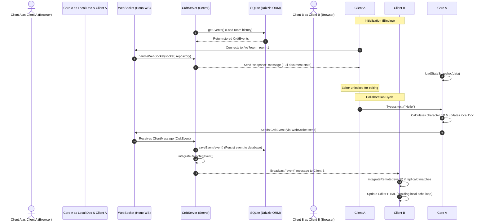

# Interactive Editor Integration Guide

This document describes how the real-time collaborative text editor demo integrates the `@ddgll/ts-crdt` core engine, `@ddgll/ts-crdt-client`, and `@ddgll/ts-crdt-server` packages to synchronize state.

---

## Architecture Diagram

The diagram below outlines the synchronization, broadcast, and persistence architecture of the monorepo:



---

## 1. Server-Side Integration (`packages/demo/server/server.ts`)

The server is built with **Hono** running on Node.js. It manages the HTTP server lifecycle, upgrades connections to WebSockets, and delegates persistence and replication to `@ddgll/ts-crdt-server`.

### Room Repositories
The server isolates collaborative sessions using the `Repository` pattern defined by the server package. Each room corresponds to a specific `Repository` instance that handles SQL storage operations:

```typescript
const repositories = new Map<string, Repository>();

function getRoomRepository(roomId: string): Repository {
  let repo = repositories.get(roomId);
  if (!repo) {
    repo = {
      getEvents: async () => {
        return await db
          .select()
          .from(schema.events)
          .where(eq(schema.events.roomId, roomId));
      },
      saveEvent: async (event) => {
        await db.insert(schema.events).values({
          id: event.id,
          roomId,
          replicaId: event.replicaId,
          parents: event.parents,
          op: event.op,
        });
      },
      clearEvents: async () => {
        await db.delete(schema.events).where(eq(schema.events.roomId, roomId));
      },
    };
    repositories.set(roomId, repo);
  }
  return repo;
}
```

### Upgrading WebSocket Connections
When a client connects to `/ws?room=<id>`, Hono upgrades the connection. The server retrieves the corresponding room repository and delegates connection management to the library's `handleWebSocket` helper:

```typescript
app.get(
  "/ws",
  upgradeWebSocket((c) => {
    const roomId = c.req.query("room") || "default";
    const roomRepository = getRoomRepository(roomId);
    return {
      onOpen: (_evt, webSocket) => {
        if (!webSocket.raw) return;
        // Delegate WebSocket synchronization and broadcasting to server library
        handleWebSocket(webSocket.raw, roomRepository).catch(console.error);
      },
    };
  })
);
```

---

## 2. Client-Side Integration (`packages/demo/interactive-test/rich.ts`)

The client application sets up a [Tiptap](https://tiptap.dev/) editor and wraps a local `Doc` with the `CrdtClient` class from `@ddgll/ts-crdt-client`.

### Initialization & Binding
The client connects via a native browser WebSocket and binds it to the `CrdtClient` instance:

```typescript
const doc = new Doc(replicaId);
const client = new CrdtClient(doc);

const ws = new WebSocket(`ws://${location.host}/ws?room=${roomId}`);
client.bind(ws);
```

### Local Change Synchronization (The Update Loop)
When the user edits text inside the editor, Tiptap fires an `update` event. To synchronize this efficiently, we must detect what text has changed, compute character-level inserts or deletes, and apply them. We also must ensure that incoming remote updates do not cause a feedback loop (triggering local change handlers when modifying the editor programmatically).

#### Loop Prevention
We use the `isApplyingRemoteChanges()` flag to check if the incoming change was caused by a remote user:

```typescript
let isApplyingRemoteChanges = false;

// 1. Listen for remote events/snapshots to update editor content
client.onMessage((type, data) => {
  isApplyingRemoteChanges = true;
  
  if (type === "snapshot" || type === "event") {
    const rootMap = doc.getMap();
    // Reconstruct editor content from the CRDT document
    const content = rootMap.getArray("content").toJSON().join("");
    
    // Programmatically set Tiptap's content
    editor.commands.setContent(content, false);
  }

  // Allow browser DOM to complete layout before releasing loop block
  setTimeout(() => {
    isApplyingRemoteChanges = false;
  }, 0);
});

// 2. Listen for local editor changes and push to server
editor.on("update", () => {
  if (isApplyingRemoteChanges) return; // Skip if update was remote

  const newHtml = editor.getHTML();
  
  // Use client helper to compute and apply character-level diffs
  client.syncText(["content"], newHtml, "array");
});
```

---

## 3. Sync Message Protocol

Clients and servers communicate by sending JSON-serialized string messages matching the following schema definitions:

### `ServerMessage` (Server -> Client)
- **`snapshot`**: Sent upon initial connection. Contains the complete Event Graph, last sequence number, and document state.
  ```json
  {
    "type": "snapshot",
    "data": {
      "doc": { ... },
      "graph": { "events": [ ... ] },
      "replicaId": "server-replica",
      "sequenceNumber": 42
    }
  }
  ```
- **`event`**: Sent when broadcasting a single collaborative change.
  ```json
  {
    "type": "event",
    "data": {
      "id": "replica-A:5",
      "replicaId": "replica-A",
      "parents": ["replica-B:2"],
      "op": {
        "type": "array-insert",
        "path": ["content"],
        "index": 12,
        "values": ["H", "e", "l", "l", "o"]
      }
    }
  }
  ```

### `ClientMessage` (Client -> Server)
A single JSON-serialized `CrdtEvent` object representing a mutating change:
```json
{
  "id": "replica-A:6",
  "replicaId": "replica-A",
  "parents": ["replica-A:5"],
  "op": {
    "type": "array-delete",
    "path": ["content"],
    "index": 12,
    "length": 5
  }
}
```
The server validates, saves, integrates, and forwards this event to other rooms.