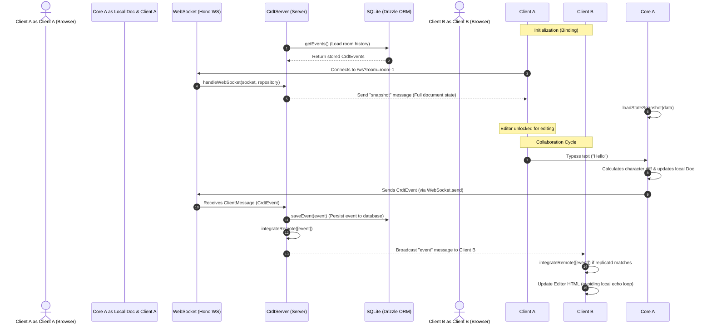

This file is a merged representation of the entire codebase, combined into a single document by Repomix.

# File Summary

## Purpose
This file contains a packed representation of the entire repository's contents.
It is designed to be easily consumable by AI systems for analysis, code review,
or other automated processes.

## File Format
The content is organized as follows:
1. This summary section
2. Repository information
3. Directory structure
4. Repository files (if enabled)
5. Multiple file entries, each consisting of:
  a. A header with the file path (## File: path/to/file)
  b. The full contents of the file in a code block

## Usage Guidelines
- This file should be treated as read-only. Any changes should be made to the
  original repository files, not this packed version.
- When processing this file, use the file path to distinguish
  between different files in the repository.
- Be aware that this file may contain sensitive information. Handle it with
  the same level of security as you would the original repository.

## Notes
- Some files may have been excluded based on .gitignore rules and Repomix's configuration
- Binary files are not included in this packed representation. Please refer to the Repository Structure section for a complete list of file paths, including binary files
- Files matching patterns in .gitignore are excluded
- Files matching default ignore patterns are excluded
- Files are sorted by Git change count (files with more changes are at the bottom)

# Directory Structure
```
.github/
  workflows/
    ci.yml
    publish.yml
benchmarks/
  run.ts
packages/
  core/
    src/
      benchmarks/
        highConcurrency.bench.ts
        largeDocumentLoad.bench.ts
        memoryLeak.bench.ts
      crdtTypes/
        tests/
          containerEventId.test.ts
          doc.test.ts
          docExtended.test.ts
          fromJsonLossy.test.ts
          insertUndoSplice.test.ts
          localOps.test.ts
          lwwCausal.test.ts
          nestedStructures.test.ts
          replicateBug.test.ts
          rgaTiebreak.test.ts
          snapshotSequence.test.ts
          state.test.ts
          stressConvergence.test.ts
          yArray.test.ts
          yArrayConcurrent.test.ts
          yArrayConcurrentFastPath.test.ts
          yArrayExtended.test.ts
          yMapDelete.test.ts
          yMapExtended.test.ts
          yText.test.ts
          yTextConcurrent.test.ts
          yTextConcurrentFastPath.test.ts
        doc.ts
        rga.ts
        yArray.ts
        yMap.ts
        yText.ts
      egWalker/
        tests/
          addEvent.test.ts
          awareness.test.ts
          cachedSortedEvents.test.ts
          diffing.test.ts
          extended.test.ts
          getStateSnapshot.test.ts
          history.test.ts
          integrateRemote.test.ts
          listenerTiming.test.ts
          loadStateSnapshot.test.ts
          pathTraversal.test.ts
          performanceRegression.test.ts
          prototypePollution.test.ts
          rebuildBenchmark.test.ts
          replicaId.test.ts
          sustainedConcurrency.test.ts
          undo.test.ts
          undoCausal.test.ts
          undoEdgeCases.test.ts
          undoRemote.test.ts
          undoStackBound.test.ts
        egWalker.ts
        UndoManager.ts
      eventGraph/
        tests/
          addEvent.test.ts
          eventGraph.test.ts
          extended.test.ts
          getChangesSince.test.ts
          getEvent.test.ts
          getEvents.test.ts
          getVersion.test.ts
          happenedBefore.test.ts
          isCriticalVersion.test.ts
          lastCriticalVersionLinear.test.ts
          sortedEventsAliasing.test.ts
          topologicalSort.test.ts
          versioning.test.ts
        eventGraph.ts
      server/
        tests/
          awareness.test.ts
          bufferedRepository.test.ts
          bufferedRepositoryFlushRace.test.ts
          clusteredCompaction.test.ts
          compaction.test.ts
          compactionConcurrentDelete.test.ts
          compactionContinuation.test.ts
          compactionGcAnchorLoss.test.ts
          connectionEdgeCases.test.ts
          crdtServer.test.ts
          loggerInjection.test.ts
          pubSubAdapter.test.ts
          serverDurability.test.ts
          serverInstancesCleanup.test.ts
          snapshotMetadata.test.ts
        bufferedRepository.ts
        crdtServer.ts
        pubSubAdapter.ts
        redisPubSubAdapter.ts
      tests/
        crdtClient.test.ts
      client.ts
      core.ts
      crdtClient.ts
      index.ts
      logger.ts
      server.ts
      sync.ts
    CHANGELOG.md
    package.json
    README.md
    tsconfig.json
    vitest.config.ts
  demo/
    drizzle/
      meta/
        _journal.json
        0000_snapshot.json
        0001_snapshot.json
      0000_lowly_stepford_cuckoos.sql
      0001_short_aqueduct.sql
    e2e/
      e2e.spec.ts
      global-setup.ts
      global-teardown.ts
      multi-user.spec.ts
      network-flakiness.spec.ts
      offline-sync.spec.ts
      playwright.config.ts
      reconnect-compacted.spec.ts
      rich-text.spec.ts
      server-recovery.spec.ts
      text-db.spec.ts
    interactive-test/
      index.html
      main.ts
      rich.html
      rich.ts
      text-db.html
      text-db.ts
    server/
      db/
        schema.ts
      tests/
        roomRepository.test.ts
      db.ts
      inMemoryTextRepository.ts
      roomRepository.ts
      server.ts
    INTEGRATION.md
    package.json
    README.md
    tsconfig.json
.gitignore
agents.md
drizzle.config.ts
eslint.config.js
LICENSE
package.json
playwright.config.ts
pnpm-workspace.yaml
README.md
tsconfig.json
```

# Files

## File: benchmarks/run.ts
````typescript
import { Doc } from "../packages/core/src/crdtTypes/doc.js";
import { performance } from "perf_hooks";

async function runBenchmarks() {
  console.log("Starting benchmarks...");
  
  // 1. Event graph with 10K events: rebuild time
  console.log("\n--- Benchmark 1: 10K events rebuild time ---");
  const doc = new Doc("replica-1");
  const start10k = performance.now();
  for (let i = 0; i < 10000; i++) {
    doc.getMap().set(`key-${i}`, i);
  }
  const end10kAdd = performance.now();
  console.log(`Added 10,000 events: ${(end10kAdd - start10k).toFixed(2)}ms`);
  
  const startRebuild = performance.now();
  doc.egWalker.rebuildStateAtVersion(doc.egWalker.graph.getVersion());
  const endRebuild = performance.now();
  console.log(`Rebuild state for 10,000 events: ${(endRebuild - startRebuild).toFixed(2)}ms`);

  // 2. 100 concurrent operations: convergence verification
  console.log("\n--- Benchmark 2: 100 concurrent operations convergence ---");
  const replicas = Array.from({ length: 100 }, (_, i) => new Doc(`replica-${i}`));
  const events = [];
  
  const startConcurrent = performance.now();
  for (let i = 0; i < 100; i++) {
    replicas[i].getMap().set(`concurrent-key`, `value-from-${i}`);
    events.push(...replicas[i].egWalker.graph.getChangesSince([]));
  }
  
  // Integrate all events into all replicas
  for (const replica of replicas) {
    replica.egWalker.integrateRemote(events);
  }
  
  // Verify convergence
  const expectedState = JSON.stringify(replicas[0].getMap().toJSON());
  let allConverged = true;
  for (let i = 1; i < 100; i++) {
    if (JSON.stringify(replicas[i].getMap().toJSON()) !== expectedState) {
      allConverged = false;
      break;
    }
  }
  const endConcurrent = performance.now();
  console.log(`100 Replicas processed 100 concurrent events and converged: ${allConverged}`);
  console.log(`Time taken: ${(endConcurrent - startConcurrent).toFixed(2)}ms`);

  // 3. Snapshot serialization/deserialization size and time
  console.log("\n--- Benchmark 3: Snapshot serialization/deserialization ---");
  const startSerialize = performance.now();
  const snapshotState = doc.egWalker.getStateSnapshot();
  const serialized = JSON.stringify(snapshotState);
  const endSerialize = performance.now();
  
  console.log(`Serialized snapshot size: ${(serialized.length / 1024).toFixed(2)} KB`);
  console.log(`Serialization time: ${(endSerialize - startSerialize).toFixed(2)}ms`);
  
  const docToLoad = new Doc("replica-load");
  const startDeserialize = performance.now();
  const parsed = JSON.parse(serialized);
  docToLoad.egWalker.loadStateSnapshot(parsed);
  const endDeserialize = performance.now();
  console.log(`Deserialization & load time: ${(endDeserialize - startDeserialize).toFixed(2)}ms`);
}

runBenchmarks().catch(console.error);
````

## File: packages/core/src/crdtTypes/tests/containerEventId.test.ts
````typescript
import { describe, it, expect } from "vitest";
import { Doc } from "../doc.js";
import { CrdtEvent } from "../../eventGraph/eventGraph.js";

/**
 * Tests for PLAN_06: container creation without an event id.
 *
 * A nested container created via getMap/getArray/getText carries no event id
 * until an operation writes into it. These tests assert that once a container
 * is written to, concurrent conflicts against it resolve deterministically and
 * identically on every replica — regardless of whether the container was created
 * locally (undefined id) or lazily materialized by a remote op.
 */
describe("Container creation event id (PLAN_06)", () => {
	/** Fully cross-integrates two docs until they converge. */
	function sync(a: Doc, b: Doc) {
		const eventsA = a.egWalker.graph.getAllEvents();
		const eventsB = b.egWalker.graph.getAllEvents();
		a.egWalker.integrateRemote(eventsB);
		b.egWalker.integrateRemote(eventsA);
	}

	it("gives a written container the same LWW id on origin and remote replicas", () => {
		const doc1 = new Doc("replica1");
		const doc2 = new Doc("replica2");

		// doc1 creates a container locally (no event) then writes a child.
		doc1.getMap().getMap("box").set("child", 1);

		const events = doc1.egWalker.graph.getAllEvents();
		doc2.egWalker.integrateRemote(events);

		const id1 = doc1.getMap()._getWrapper("box")?.eventId;
		const id2 = doc2.getMap()._getWrapper("box")?.eventId;

		// The origin no longer leaves the container with an undefined id...
		expect(id1).toBeDefined();
		// ...and it matches the id the remote assigned when materializing it lazily.
		expect(id1).toBe(id2);
	});

	it("resolves concurrent container-vs-primitive deterministically on both replicas", () => {
		const doc1 = new Doc("replica1");
		const doc2 = new Doc("replica2");

		// Concurrent: doc1 populates a nested map at "x"; doc2 sets "x" to a primitive.
		doc1.getMap().getMap("x").set("a", "fromContainer");
		doc2.getMap().set("x", "fromPrimitive");

		sync(doc1, doc2);

		// Both replicas must agree on the winner (no divergence).
		expect(doc1.getMap().toJSON()).toEqual(doc2.getMap().toJSON());
		expect(doc1.getMap()._getWrapper("x")?.eventId).toBe(
			doc2.getMap()._getWrapper("x")?.eventId,
		);
	});

	it("does not silently lose a populated container to a concurrent primitive on either replica", () => {
		const doc1 = new Doc("replica1");
		const doc2 = new Doc("replica2");

		doc1.getMap().getMap("x").set("a", 1);
		doc2.getMap().set("x", 42);

		sync(doc1, doc2);

		// Whichever side wins, both replicas reach the *same* outcome.
		const j1 = doc1.getMap().toJSON();
		const j2 = doc2.getMap().toJSON();
		expect(j1).toEqual(j2);
	});

	it("merges concurrent writes into containers created independently on each replica", () => {
		const doc1 = new Doc("replica1");
		const doc2 = new Doc("replica2");

		// Each replica independently creates the same-keyed container and writes a
		// distinct child key.
		doc1.getMap().getMap("shared").set("fromA", "a");
		doc2.getMap().getMap("shared").set("fromB", "b");

		sync(doc1, doc2);

		// Children merge and both replicas converge to the same value and id.
		expect(doc1.getMap().toJSON()).toEqual(doc2.getMap().toJSON());
		const shared1 = doc1.getMap().getMap("shared");
		expect(shared1.get("fromA")).toBe("a");
		expect(shared1.get("fromB")).toBe("b");
		expect(doc1.getMap()._getWrapper("shared")?.eventId).toBe(
			doc2.getMap()._getWrapper("shared")?.eventId,
		);
	});

	it("converges the container id regardless of the order remote events are integrated", () => {
		const doc1 = new Doc("replica1");
		const doc2 = new Doc("replica2");

		doc1.getMap().getMap("g").set("fromA", "a");
		doc2.getMap().getMap("g").set("fromB", "b");

		const eventsA = doc1.egWalker.graph.getAllEvents();
		const eventsB = doc2.egWalker.graph.getAllEvents();

		// Integrate in opposite relative orders on a fresh pair of replicas.
		const doc3 = new Doc("replica3");
		const doc4 = new Doc("replica4");
		doc3.egWalker.integrateRemote(eventsA as CrdtEvent[]);
		doc3.egWalker.integrateRemote(eventsB as CrdtEvent[]);
		doc4.egWalker.integrateRemote(eventsB as CrdtEvent[]);
		doc4.egWalker.integrateRemote(eventsA as CrdtEvent[]);

		expect(doc3.getMap().toJSON()).toEqual(doc4.getMap().toJSON());
		expect(doc3.getMap()._getWrapper("g")?.eventId).toBe(
			doc4.getMap()._getWrapper("g")?.eventId,
		);
	});
});
````

## File: packages/core/src/crdtTypes/tests/fromJsonLossy.test.ts
````typescript
import { describe, it, expect } from "vitest";
import { Doc } from "../doc.js";
import { YArray } from "../yArray.js";
import { YText } from "../yText.js";

/**
 * PLAN_07.2 — `Doc.fromJSON` (and the underlying YArray.fromJSON /
 * YText.fromString) are intentionally lossy and NON-collaborative: they assign
 * synthetic path-derived ids and drop tombstones. These tests document that loss
 * so the behaviour is intentional and regressions are caught, and steer callers
 * toward snapshot-based loading for real sync flows.
 */
describe("PLAN_07.2 — Doc.fromJSON is lossy / non-collaborative", () => {
	it("assigns synthetic path-derived RGA ids (not real event ids)", () => {
		const doc = Doc.fromJSON({ list: { __crdt_type: "YArray", data: ["x", "y", "z"] } });
		const list = doc.getMap().get("list");
		expect(list).toBeInstanceOf(YArray);

		// Reach into the internal representation to prove the ids are synthetic.
		const internal = list as unknown as { _data: { id: string }[] };
		expect(internal._data.map((i) => i.id)).toEqual([
			"snapshot:list:0",
			"snapshot:list:1",
			"snapshot:list:2",
		]);
	});

	it("YText loaded from a string shares a single synthetic anchor id", () => {
		const doc = Doc.fromJSON({ note: { __crdt_type: "YText", data: "hello" } });
		const note = doc.getMap().get("note");
		expect(note).toBeInstanceOf(YText);
		const internal = note as unknown as { _data: { id: string }[] };
		// Every character derives its id from the same synthetic anchor.
		for (const item of internal._data) {
			expect(item.id.startsWith("snapshot:note")).toBe(true);
		}
	});

	it("synthetic ids collide across independently-loaded replicas (why it is unsafe to sync)", () => {
		const a = Doc.fromJSON({ list: { __crdt_type: "YArray", data: ["x"] } });
		const b = Doc.fromJSON({ list: { __crdt_type: "YArray", data: ["x"] } });
		const idA = (a.getMap().get("list") as unknown as { _data: { id: string }[] })._data[0].id;
		const idB = (b.getMap().get("list") as unknown as { _data: { id: string }[] })._data[0].id;
		// Two independent replicas produce the SAME id — a collision that would
		// break convergence, hence the lossy/non-collaborative contract.
		expect(idA).toBe(idB);
	});

	it("round-trips values (JSON view) even though CRDT identity is lost", () => {
		const original = { list: ["a", "b"], count: 3 };
		const doc = Doc.fromJSON(original);
		expect(doc.toJSON()).toEqual(original);
	});
});
````

## File: packages/core/src/crdtTypes/tests/insertUndoSplice.test.ts
````typescript
import { describe, it, expect } from "vitest";
import { Doc } from "../doc.js";

/**
 * PLAN_05.3 — the array/text insert undo was rewritten from an
 * `Array.includes` filter + full `_idIndex` rebuild to an exact
 * `splice(insertIdx, count)` that only re-indexes the shifted suffix. The
 * undo path runs on every fast-path re-integration, so these tests exercise
 * reordering (which triggers undo/redo) and then perform index-dependent
 * operations that would break if `_idIndex` were left inconsistent.
 */
describe("PLAN_05.3 — insert undo via span splice", () => {
	it("YArray converges and keeps a consistent index after reordered integration", () => {
		const a = new Doc("replica-a");
		const b = new Doc("replica-b");
		a.getMap().getArray("list").insert(0, []);
		// Sync the seed so both share the container.
		b.egWalker.integrateRemote(a.egWalker.graph.getAllEvents());

		// Concurrent inserts at the head from both replicas.
		a.getMap().getArray("list").insert(0, ["a1", "a2"]);
		b.getMap().getArray("list").insert(0, ["b1", "b2"]);

		const aEvents = a.egWalker.graph.getAllEvents();
		const bEvents = b.egWalker.graph.getAllEvents();

		// Cross-integrate (each side sees the other's concurrent insert, forcing
		// undo/redo of the local tail during integration).
		a.egWalker.integrateRemote(bEvents);
		b.egWalker.integrateRemote(aEvents);

		const arrA = a.getMap().getArray("list");
		const arrB = b.getMap().getArray("list");
		expect(arrA.toJSON()).toEqual(arrB.toJSON());
		expect(arrA.length).toBe(4);

		// A further index-dependent op after the reorder: it must apply and still
		// converge, which relies on _idIndex being accurate post-undo/redo. (Exact
		// placement is governed by the RGA tie-break, so we assert convergence and
		// membership rather than a specific index.)
		const mid = Math.floor(arrA.length / 2);
		arrA.insert(mid, ["mid"]);
		b.egWalker.integrateRemote(a.egWalker.graph.getAllEvents());
		expect(arrB.toJSON()).toEqual(arrA.toJSON());
		expect(arrA.length).toBe(5);
		expect(arrA.toJSON()).toContain("mid");
	});

	it("YText converges and keeps a consistent index after reordered integration", () => {
		const a = new Doc("replica-a");
		const b = new Doc("replica-b");
		a.getMap().getText("doc").insert(0, "");
		b.egWalker.integrateRemote(a.egWalker.graph.getAllEvents());

		a.getMap().getText("doc").insert(0, "AAA");
		b.getMap().getText("doc").insert(0, "BBB");

		const aEvents = a.egWalker.graph.getAllEvents();
		const bEvents = b.egWalker.graph.getAllEvents();
		a.egWalker.integrateRemote(bEvents);
		b.egWalker.integrateRemote(aEvents);

		const txtA = a.getMap().getText("doc");
		const txtB = b.getMap().getText("doc");
		expect(txtA.toString()).toBe(txtB.toString());
		expect(txtA.toString().length).toBe(6);

		// A further edit at a computed index must apply and still converge.
		txtA.insert(3, "X");
		b.egWalker.integrateRemote(a.egWalker.graph.getAllEvents());
		expect(txtB.toString()).toBe(txtA.toString());
		expect(txtA.toString().length).toBe(7);
		expect(txtA.toString()).toContain("X");
	});

	it("undo/redo through many reorderings preserves length and content", () => {
		const docs = [new Doc("r-a"), new Doc("r-b"), new Doc("r-c")];
		docs[0].getMap().getArray("l").insert(0, []);
		const seed = docs[0].egWalker.graph.getAllEvents();
		docs[1].egWalker.integrateRemote(seed);
		docs[2].egWalker.integrateRemote(seed);

		// Each replica performs several local inserts before any sync.
		for (let i = 0; i < 5; i++) {
			docs[0].getMap().getArray("l").insert(0, [`a${i}`]);
			docs[1].getMap().getArray("l").insert(0, [`b${i}`]);
			docs[2].getMap().getArray("l").insert(0, [`c${i}`]);
		}

		// Integrate everything everywhere, in mixed order.
		const all = docs.flatMap((d) => d.egWalker.graph.getAllEvents());
		for (const d of docs) {
			d.egWalker.integrateRemote(all);
		}

		const json0 = docs[0].getMap().getArray("l").toJSON();
		expect(docs[1].getMap().getArray("l").toJSON()).toEqual(json0);
		expect(docs[2].getMap().getArray("l").toJSON()).toEqual(json0);
		expect(docs[0].getMap().getArray("l").length).toBe(15);
	});
});
````

## File: packages/core/src/crdtTypes/tests/lwwCausal.test.ts
````typescript
import { describe, it, expect } from "vitest";
import { Doc } from "../doc.js";

/**
 * Regression tests for PLAN_01: last-writer-wins must respect happened-before.
 *
 * The numeric part of an event id is a Lamport timestamp that advances on
 * observation of every event, so a causally-later write always outranks an
 * earlier one it descends from — regardless of how many events each replica
 * had produced independently.
 */
describe("Causal last-writer-wins (Lamport ordering)", () => {
	it("a causally-later write wins even though the writer produced fewer local ops", () => {
		const docA = new Doc("A");
		const docB = new Doc("B");

		// A performs 50 map writes to key "k" (and others), ending on "A-final".
		for (let i = 0; i < 49; i++) {
			docA.getMap().set(`filler${i}`, i);
		}
		docA.getMap().set("k", "A-wins-locally");

		// B starts fresh, observes all of A's history, then overwrites "k".
		// This is only B's *first* write, but it causally follows everything A did.
		docB.egWalker.integrateRemote(docA.egWalker.graph.getAllEvents());
		const bWrite = docB.getMap().set("k", "B-is-causally-later");

		// Under a plain per-replica counter, B's write would carry seq 0 and lose
		// to A's much larger seq. Under the Lamport clock, B's timestamp exceeds
		// A's, so B wins — and both replicas must agree.
		docA.egWalker.integrateRemote([bWrite]);

		expect(docB.getMap().get("k")).toBe("B-is-causally-later");
		expect(docA.getMap().get("k")).toBe("B-is-causally-later");
	});

	it("concurrent writes converge to the same deterministic winner on both replicas", () => {
		const docA = new Doc("A");
		const docB = new Doc("B");

		// Genuinely concurrent first writes to the same key — neither observed the
		// other. Both carry the same Lamport timestamp; the replicaId tiebreak
		// picks the winner deterministically ("B" > "A").
		const aWrite = docA.getMap().set("k", "from-A");
		const bWrite = docB.getMap().set("k", "from-B");

		docA.egWalker.integrateRemote([bWrite]);
		docB.egWalker.integrateRemote([aWrite]);

		expect(docA.getMap().get("k")).toBe(docB.getMap().get("k"));
		expect(docA.getMap().get("k")).toBe("from-B");
	});

	it("concurrent set vs delete on the same key converges on both replicas", () => {
		const docA = new Doc("A");
		const docB = new Doc("B");

		// Seed a shared value.
		const seed = docA.getMap().set("k", "seed");
		docB.egWalker.integrateRemote([seed]);

		// A overwrites, B deletes — concurrently (each only observed the seed).
		const aSet = docA.getMap().set("k", "A-updated");
		const bDel = docB.getMap().delete("k");

		docA.egWalker.integrateRemote([bDel]);
		docB.egWalker.integrateRemote([aSet]);

		// Both replicas must land on the same resolution.
		expect(docA.getMap().get("k")).toEqual(docB.getMap().get("k"));
	});

	it("a causal delete removes a value regardless of the setter's local op count", () => {
		const docA = new Doc("A");
		const docB = new Doc("B");

		for (let i = 0; i < 20; i++) {
			docA.getMap().set(`filler${i}`, i);
		}
		docA.getMap().set("k", "present");

		// B observes A's history, then deletes "k" — a causally-later op.
		docB.egWalker.integrateRemote(docA.egWalker.graph.getAllEvents());
		const bDel = docB.getMap().delete("k");
		docA.egWalker.integrateRemote([bDel]);

		expect(docB.getMap().get("k")).toBeUndefined();
		expect(docA.getMap().get("k")).toBeUndefined();
	});
});
````

## File: packages/core/src/crdtTypes/tests/rgaTiebreak.test.ts
````typescript
import { describe, it, expect } from "vitest";
import { Doc } from "../doc.js";
import { rgaInsertIndex, baseEventId } from "../rga.js";

/**
 * These tests pin the RGA tie-break convention that YArray and YText share via
 * {@link rgaInsertIndex} (see PLAN_02). The convention is:
 *
 *   Among elements following the same anchor, a new insert is placed AFTER every
 *   element whose base event id is strictly smaller, and BEFORE the first element
 *   whose base event id is >= the inserting event id.
 *
 * Because `compareEventIds` orders by Lamport timestamp first then replicaId,
 * concurrent inserts sharing an anchor (equal timestamps) settle into ascending
 * replicaId order.
 */
describe("RGA tie-break convention", () => {
	describe("rgaInsertIndex helper", () => {
		it("returns 0 when there is no anchor (head insert)", () => {
			const data = [{ id: "a:1:0" }, { id: "a:2:0" }];
			const idIndex = new Map(data.map((it, i) => [it.id, i]));
			expect(rgaInsertIndex(data, idIndex, null, "b:5")).toBe(0);
		});

		it("appends when the anchor is not present", () => {
			const data = [{ id: "a:1:0" }];
			const idIndex = new Map(data.map((it, i) => [it.id, i]));
			expect(rgaInsertIndex(data, idIndex, "missing:9:0", "b:5")).toBe(1);
		});

		it("places a lower-id insert before a higher-id sibling of the same anchor", () => {
			// Anchor is A (a:1:0). Sibling B (b:2:0) already follows it. Inserting
			// C (c:2 — equal timestamp, replicaId 'c' > 'b') should go AFTER B.
			const data = [{ id: "a:1:0" }, { id: "b:2:0" }];
			const idIndex = new Map(data.map((it, i) => [it.id, i]));
			expect(rgaInsertIndex(data, idIndex, "a:1:0", "c:2")).toBe(2);
		});

		it("places a lower replicaId insert before an already-present higher one", () => {
			// Sibling is C (c:2:0). Inserting B (b:2 — same timestamp, 'b' < 'c')
			// must land BEFORE C, i.e. right after the anchor.
			const data = [{ id: "a:1:0" }, { id: "c:2:0" }];
			const idIndex = new Map(data.map((it, i) => [it.id, i]));
			expect(rgaInsertIndex(data, idIndex, "a:1:0", "b:2")).toBe(1);
		});

		it("orders by Lamport timestamp ahead of replicaId", () => {
			// Sibling z:1:0 has a smaller timestamp than the inserting a:2, so the
			// new insert goes after it even though 'a' < 'z'.
			const data = [{ id: "anchor:0:0" }, { id: "z:1:0" }];
			const idIndex = new Map(data.map((it, i) => [it.id, i]));
			expect(rgaInsertIndex(data, idIndex, "anchor:0:0", "a:2")).toBe(2);
		});
	});

	it("baseEventId strips the run offset", () => {
		expect(baseEventId("replica:7:3")).toBe("replica:7");
	});

	it("pins the interleaving of two concurrent YArray inserts after the same anchor", () => {
		const a = new Doc("replicaA");
		const b = new Doc("replicaB");

		a.getMap().getArray("arr").insert(0, ["Anchor"]);
		b.egWalker.integrateRemote(a.egWalker.graph.getAllEvents());

		// Genuinely concurrent: each replica only saw "Anchor" (Lamport 0) before
		// inserting, so both inserts carry Lamport timestamp 1 and are tie-broken
		// by replicaId ascending -> replicaA first.
		a.getMap().getArray("arr").insert(1, ["FromA"]);
		b.getMap().getArray("arr").insert(1, ["FromB"]);

		const aInsert = a.egWalker.graph
			.getAllEvents()
			.find((e) => e.op.type === "array-insert" && (e.op as { values: unknown[] }).values[0] === "FromA")!;
		const bInsert = b.egWalker.graph
			.getAllEvents()
			.find((e) => e.op.type === "array-insert" && (e.op as { values: unknown[] }).values[0] === "FromB")!;

		a.egWalker.integrateRemote([bInsert]);
		b.egWalker.integrateRemote([aInsert]);

		expect(a.getMap().getArray("arr").toJSON()).toEqual(["Anchor", "FromA", "FromB"]);
		expect(b.getMap().getArray("arr").toJSON()).toEqual(["Anchor", "FromA", "FromB"]);
	});

	it("pins the interleaving of two concurrent YText inserts after the same anchor", () => {
		const a = new Doc("replicaA");
		const b = new Doc("replicaB");

		a.getMap().getText("txt").insert(0, "X");
		b.egWalker.integrateRemote(a.egWalker.graph.getAllEvents());

		a.getMap().getText("txt").insert(1, "A");
		b.getMap().getText("txt").insert(1, "B");

		const aInsert = a.egWalker.graph
			.getAllEvents()
			.find((e) => e.op.type === "text-insert" && (e.op as { text: string }).text === "A")!;
		const bInsert = b.egWalker.graph
			.getAllEvents()
			.find((e) => e.op.type === "text-insert" && (e.op as { text: string }).text === "B")!;

		a.egWalker.integrateRemote([bInsert]);
		b.egWalker.integrateRemote([aInsert]);

		// replicaA ('A') tie-breaks ahead of replicaB ('B').
		expect(a.getMap().getText("txt").toString()).toBe("XAB");
		expect(b.getMap().getText("txt").toString()).toBe("XAB");
	});

	it("pins the interleaving of three concurrent inserts after the same anchor", () => {
		const a = new Doc("rA");
		const b = new Doc("rB");
		const c = new Doc("rC");

		a.getMap().getArray("arr").insert(0, ["Anchor"]);
		const base = a.egWalker.graph.getAllEvents();
		b.egWalker.integrateRemote(base);
		c.egWalker.integrateRemote(base);

		// Three genuinely concurrent inserts after the same anchor.
		a.getMap().getArray("arr").insert(1, ["fromA"]);
		b.getMap().getArray("arr").insert(1, ["fromB"]);
		c.getMap().getArray("arr").insert(1, ["fromC"]);

		const pick = (doc: Doc, value: string) =>
			doc.egWalker.graph
				.getAllEvents()
				.find((e) => e.op.type === "array-insert" && (e.op as { values: unknown[] }).values[0] === value)!;

		const evA = pick(a, "fromA");
		const evB = pick(b, "fromB");
		const evC = pick(c, "fromC");

		// Deliver in different orders to each replica to prove order-independence.
		a.egWalker.integrateRemote([evC, evB]);
		b.egWalker.integrateRemote([evA, evC]);
		c.egWalker.integrateRemote([evB, evA]);

		// Equal Lamport timestamps -> ascending replicaId: rA, rB, rC.
		const expected = ["Anchor", "fromA", "fromB", "fromC"];
		expect(a.getMap().getArray("arr").toJSON()).toEqual(expected);
		expect(b.getMap().getArray("arr").toJSON()).toEqual(expected);
		expect(c.getMap().getArray("arr").toJSON()).toEqual(expected);
	});
});
````

## File: packages/core/src/crdtTypes/tests/state.test.ts
````typescript
import { describe, it, expect } from 'vitest';
import { Doc } from '../doc.js';

describe('CRDT State Management', () => {
  it('should initialize a new document with a clean state', () => {
    const doc = new Doc();
    // A new doc should have a root map, but it should be empty.
    expect(doc.getMap().toJSON()).toEqual({});
    // The event graph should be initialized but have no events,
    // and the sequence number should be 0.
    const snapshot = doc.egWalker.getStateSnapshot();
    expect(snapshot.graph.events.length).toBe(0);
    expect(snapshot.sequenceNumber).toBe(0);
  });

  it('should have an empty version for a new document', () => {
    const doc = new Doc();
    const map = doc.getMap();
    const event = map.set('key', 'value');
    expect(event.parents).toEqual([]);
  });

  it('should clear the document state', () => {
    const doc = new Doc();
    const map = doc.getMap();
    map.set('key', 'value');

    doc.clear();

    const snapshot = doc.egWalker.getStateSnapshot();
    expect(snapshot.graph.events.length).toBe(0);
    expect(snapshot.sequenceNumber).toBe(0);
    expect(doc.getMap().toJSON()).toEqual({});
  });
});
````

## File: packages/core/src/crdtTypes/tests/yArrayConcurrentFastPath.test.ts
````typescript
import { describe, it, expect } from 'vitest';
import { Doc } from "../doc.js";

describe("YArray concurrent insert fast path", () => {
    it("should produce identical results via fast path and full rebuild", () => {
        // Setup: two replicas with shared initial state [A]
        const doc1 = new Doc("replica1");
        const doc2 = new Doc("replica2");
        doc1.getMap().getArray("arr").insert(0, ["A"]);
        doc2.egWalker.integrateRemote(doc1.egWalker.graph.getAllEvents());

        // Concurrent inserts after "A"
        doc1.getMap().getArray("arr").insert(1, ["B"]);
        doc2.getMap().getArray("arr").insert(1, ["C"]);

        // Sync — this should hit the fast path on one replica
        const doc1Events = doc1.egWalker.graph.getAllEvents();
        const doc2Events = doc2.egWalker.graph.getAllEvents();
        doc1.egWalker.integrateRemote(doc2Events);
        doc2.egWalker.integrateRemote(doc1Events);

        // Both must converge
        expect(doc1.getMap().getArray("arr").toJSON())
            .toEqual(doc2.getMap().getArray("arr").toJSON());

        // Verify against a fresh rebuild
        const doc3 = new Doc("replica3");
        doc3.egWalker.integrateRemote([...doc1Events, ...doc2Events]);
        expect(doc1.getMap().getArray("arr").toJSON())
            .toEqual(doc3.getMap().getArray("arr").toJSON());
    });
});
````

## File: packages/core/src/crdtTypes/tests/yTextConcurrentFastPath.test.ts
````typescript
import { describe, it, expect } from 'vitest';
import { Doc } from "../doc.js";

describe("YText concurrent insert fast path", () => {
    it("should produce identical results via fast path and full rebuild", () => {
        // Setup: two replicas with shared initial state "A"
        const doc1 = new Doc("replica1");
        const doc2 = new Doc("replica2");
        doc1.getMap().getText("text").insert(0, "A");
        doc2.egWalker.integrateRemote(doc1.egWalker.graph.getAllEvents());

        // Concurrent inserts after "A"
        doc1.getMap().getText("text").insert(1, "B");
        doc2.getMap().getText("text").insert(1, "C");

        // Sync — this should hit the fast path on one replica
        const doc1Events = doc1.egWalker.graph.getAllEvents();
        const doc2Events = doc2.egWalker.graph.getAllEvents();
        doc1.egWalker.integrateRemote(doc2Events);
        doc2.egWalker.integrateRemote(doc1Events);

        // Both must converge
        expect(doc1.getMap().getText("text").toString())
            .toEqual(doc2.getMap().getText("text").toString());

        // Verify against a fresh rebuild
        const doc3 = new Doc("replica3");
        doc3.egWalker.integrateRemote([...doc1Events, ...doc2Events]);
        expect(doc1.getMap().getText("text").toString())
            .toEqual(doc3.getMap().getText("text").toString());
    });
});
````

## File: packages/core/src/crdtTypes/rga.ts
````typescript
import { compareEventIds } from "../eventGraph/eventGraph.js";

/**
 * The minimal shape an RGA element needs for insert-position resolution: a
 * stable, globally-unique id of the form `${eventId}:${offset}` (i.e.
 * `replicaId:lamport:offset`).
 */
export interface RgaItem {
	id: string;
}

/**
 * Extracts the base event id (`replicaId:lamport`) from an RGA item id.
 * Item ids are minted as `${eventId}:${offset}` by `_applyInsert`, so the base
 * id is the first two colon-separated segments.
 */
export function baseEventId(itemId: string): string {
	return itemId.split(":").slice(0, 2).join(":");
}

/**
 * Computes the array index at which a new RGA element should be inserted.
 *
 * Shared by {@link YArray} and {@link YText} so the tie-break logic lives in one
 * place and cannot drift between the two types.
 *
 * **Tie-break convention.** Among elements that follow the same anchor
 * (`afterId`), the new run is placed *after* every existing element whose base
 * event id is strictly smaller than `eventId`, and *before* the first element
 * whose base event id is greater than or equal to `eventId`. Because
 * `compareEventIds` orders by Lamport timestamp first (see PLAN_01) then by
 * `replicaId`, concurrent inserts sharing an anchor settle into ascending
 * event-id order — deterministically and identically on every replica.
 *
 * **Why this converges.** Convergence does not rely on this being a textbook
 * RGA integration. The egWalker replays every event in a single deterministic
 * topological order (keyed on event id), so all replicas run this function over
 * identical state in an identical sequence and therefore reach byte-identical
 * results. The convention above only pins *which* interleaving the replicas
 * agree on; see the pinned unit tests in `rgaTiebreak.test.ts`.
 *
 * @param data The current ordered array of items (including tombstones).
 * @param idIndex Map from item id to its index in `data`.
 * @param afterId The anchor item id to insert after, or `null` to insert at the head.
 * @param eventId The base event id (`replicaId:lamport`) of the inserting event.
 * @returns The index in `data` at which the new run should be spliced.
 */
export function rgaInsertIndex(
	data: RgaItem[],
	idIndex: Map<string, number>,
	afterId: string | null,
	eventId: string,
): number {
	if (afterId === null) {
		return 0;
	}

	const idx = idIndex.get(afterId);
	if (idx === undefined) {
		// Anchor not found. With a valid topological sort the anchor is always
		// already present, so this only happens for malformed input; append
		// rather than silently drop the insert.
		return data.length;
	}

	let insertIdx = idx + 1;
	while (insertIdx < data.length) {
		const siblingBaseId = baseEventId(data[insertIdx].id);
		if (compareEventIds(siblingBaseId, eventId) < 0) {
			insertIdx++;
		} else {
			break;
		}
	}
	return insertIdx;
}
````

## File: packages/core/src/egWalker/tests/listenerTiming.test.ts
````typescript
import { describe, it, expect, vi } from "vitest";
import { Doc } from "../../crdtTypes/doc.js";
import { EgWalkerError } from "../egWalker.js";

describe("EgWalker listener timing", () => {
	it("should fire integrateRemote listeners with consistent document state", () => {
		const doc1 = new Doc("replica1");
		const doc2 = new Doc("replica2");

		// Set up initial shared state
		doc1.getMap().set("key1", "val1");
		doc2.egWalker.integrateRemote(doc1.egWalker.graph.getAllEvents());

		// Register listener on doc2 that checks document state
		const statesSeen: unknown[] = [];
		doc2.egWalker.onEvent((_event, _isLocal) => {
			// When this fires, the document should already reflect the remote event
			statesSeen.push(doc2.getMap().get("key2"));
		});

		// Create a remote event on doc1
		doc1.getMap().set("key2", "val2");
		const newEvent = doc1.egWalker.graph.getAllEvents().pop()!;

		// Integrate the remote event into doc2
		doc2.egWalker.integrateRemote([newEvent]);

		// The listener should have seen "val2" (consistent state), not undefined (stale state)
		expect(statesSeen).toEqual(["val2"]);
	});

	it("should not break when a listener throws an error", () => {
		const doc = new Doc("replica1");

		const results: string[] = [];

		// First listener: throws
		doc.egWalker.onEvent(() => {
			throw new Error("Faulty listener");
		});

		// Second listener: should still fire
		doc.egWalker.onEvent((_event, _isLocal) => {
			results.push("second-listener-fired");
		});

		// Suppress console.error output during test
		const consoleSpy = vi.spyOn(console, "error").mockImplementation(() => {});

		// This should not throw
		expect(() => doc.getMap().set("key", "val")).not.toThrow();

		// The second listener should have been called despite the first one throwing
		expect(results).toEqual(["second-listener-fired"]);
		expect(consoleSpy).toHaveBeenCalledWith(
			"[EgWalker] Event listener error:",
			expect.any(Error),
		);

		consoleSpy.mockRestore();
	});
});

describe("EgWalker replicaId validation", () => {
	it("should reject replicaId containing a colon", () => {
		const doc = new Doc();
		expect(() => new (doc.egWalker.constructor as typeof import("../egWalker.js").EgWalker)(doc, "my:replica")).toThrow(
			new EgWalkerError("replicaId must not contain ':'"),
		);
	});

	it("should accept valid replicaId without colons", () => {
		const doc = new Doc("valid-replica-id");
		expect(doc.egWalker.getReplicaId()).toBe("valid-replica-id");
	});
});
````

## File: packages/core/src/egWalker/tests/prototypePollution.test.ts
````typescript
import { describe, it, expect } from "vitest";
import { Doc } from "../../crdtTypes/doc.js";
import {
	CrdtEvent,
	isCrdtEvent,
	MAP_SET_OP,
} from "../../eventGraph/eventGraph.js";

describe("prototype pollution hardening (PLAN_14)", () => {
	it("isCrdtEvent rejects dangerous path segments and map keys", () => {
		const base = {
			id: "r1:1",
			replicaId: "r1",
			parents: [] as string[],
		};
		// Dangerous path segment.
		expect(
			isCrdtEvent({
				...base,
				op: { type: MAP_SET_OP, path: ["__proto__"], key: "k", value: "v" },
			}),
		).toBe(false);
		// Dangerous map-set key (including "prototype", newly covered).
		expect(
			isCrdtEvent({
				...base,
				op: { type: MAP_SET_OP, path: [], key: "constructor", value: "v" },
			}),
		).toBe(false);
		expect(
			isCrdtEvent({
				...base,
				op: { type: MAP_SET_OP, path: [], key: "prototype", value: "v" },
			}),
		).toBe(false);
		// A benign event is still accepted.
		expect(
			isCrdtEvent({
				...base,
				op: { type: MAP_SET_OP, path: ["a"], key: "b", value: "v" },
			}),
		).toBe(true);
	});

	it("a crafted __proto__ path segment does not pollute or throw on toJSON", () => {
		const doc = new Doc();
		const walker = doc.egWalker;

		// A crafted event whose path traverses a "__proto__" segment. This
		// bypasses the normal typed API (and the isCrdtEvent guard) and forces a
		// YMap to hold the "__proto__" key.
		const event: CrdtEvent = {
			id: "r1:1",
			replicaId: "r1",
			parents: [],
			op: { type: MAP_SET_OP, path: ["__proto__"], key: "polluted", value: "x" },
		};

		// Integrating and serializing must not throw...
		expect(() => {
			walker.integrateRemote([event]);
			doc.toJSON();
		}).not.toThrow();

		// ...and must not pollute Object.prototype.
		expect(({} as Record<string, unknown>).polluted).toBeUndefined();
		expect(
			(Object.prototype as Record<string, unknown>).polluted,
		).toBeUndefined();

		// The serialized output is a null-prototype object holding the segment as
		// an own property rather than mutating the prototype chain.
		const json = doc.toJSON() as Record<string, unknown>;
		expect(Object.getPrototypeOf(json)).toBeNull();
		expect(Object.prototype.hasOwnProperty.call(json, "__proto__")).toBe(true);
	});
});
````

## File: packages/core/src/egWalker/tests/replicaId.test.ts
````typescript
import { describe, it, expect } from "vitest";
import { Doc } from "../../crdtTypes/doc.js";
import { generateReplicaId } from "../egWalker.js";

describe("PLAN_07.1 — strong default replica ids", () => {
	it("generateReplicaId produces unique ids without ':'", () => {
		const ids = new Set<string>();
		for (let i = 0; i < 1000; i++) {
			const id = generateReplicaId();
			expect(id).not.toContain(":");
			expect(id.length).toBeGreaterThanOrEqual(11);
			ids.add(id);
		}
		// No collisions across 1000 draws.
		expect(ids.size).toBe(1000);
	});

	it("a Doc created without an explicit replicaId gets a strong, unique id", () => {
		const a = new Doc();
		const b = new Doc();
		expect(a.egWalker.getReplicaId()).not.toBe(b.egWalker.getReplicaId());
		expect(a.egWalker.getReplicaId()).not.toContain(":");
	});

	it("generated ids are valid as the replicaId half of an event id", () => {
		const doc = new Doc();
		doc.getMap().set("k", "v");
		const [event] = doc.egWalker.graph.getSortedEvents();
		// Event ids are `${replicaId}:${seq}` and must match the isCrdtEvent regex.
		expect(event.id).toMatch(/^[^:]+:\d+$/);
		expect(event.replicaId).toBe(doc.egWalker.getReplicaId());
	});
});
````

## File: packages/core/src/egWalker/tests/sustainedConcurrency.test.ts
````typescript
import { describe, it, expect } from "vitest";
import { Doc } from "../../crdtTypes/doc.js";
import { CrdtEvent } from "../../eventGraph/eventGraph.js";

/**
 * PLAN_05.1 — sustained concurrent remote integration should stay well under
 * quadratic cost: the EgWalker fast undo/redo path bounds work to the reordered
 * suffix rather than replaying the whole document per out-of-order event. This
 * test interleaves edits from two replicas, exchanging only the newly-created
 * events each round, and asserts it both converges and completes quickly.
 */
describe("PLAN_05.1 — sustained concurrent integration is sub-quadratic", () => {
	it("interleaved two-replica exchange stays fast and converges", () => {
		const a = new Doc("rep-a");
		const b = new Doc("rep-b");
		a.getMap().getArray("v").insert(0, []);
		b.egWalker.integrateRemote(a.egWalker.graph.getAllEvents());

		const rounds = 400;
		let aVersion = a.egWalker.getVersion();
		let bVersion = b.egWalker.getVersion();

		const start = performance.now();
		for (let i = 0; i < rounds; i++) {
			a.getMap().set(`a${i}`, i);
			b.getMap().set(`b${i}`, i);

			const aNew: CrdtEvent[] = a.egWalker.graph.getChangesSince(aVersion);
			const bNew: CrdtEvent[] = b.egWalker.graph.getChangesSince(bVersion);

			b.egWalker.integrateRemote(aNew);
			a.egWalker.integrateRemote(bNew);

			aVersion = a.egWalker.getVersion();
			bVersion = b.egWalker.getVersion();
		}
		const duration = performance.now() - start;

		// Both replicas converge on identical state.
		expect(a.getMap().toJSON()).toEqual(b.getMap().toJSON());
		// 400 rounds = 800 interleaved integrations. A full-rebuild-per-event
		// (quadratic) implementation would be dramatically slower; this ceiling is
		// generous but still catches a quadratic regression.
		expect(duration).toBeLessThan(2000);
	});
});
````

## File: packages/core/src/egWalker/tests/undoCausal.test.ts
````typescript
import { describe, it, expect } from "vitest";
import { Doc } from "../../crdtTypes/doc.js";
import { UndoManager } from "../UndoManager.js";

/**
 * Tests for PLAN_04: UndoManager causal correctness.
 *
 * With the inverse-operation model, undoing a local change must remove exactly
 * that change even when remote events causally descend from it — the failure
 * mode of the old version-rewind implementation, which dragged undone local
 * events back in as ancestors of remote events.
 */
describe("UndoManager causal correctness (PLAN_04)", () => {
	it("removes an undone local insert even when a remote event descends from it", () => {
		const doc1 = new Doc("replica1");
		const doc2 = new Doc("replica2");
		const undoManager = new UndoManager(doc1.egWalker);

		// Local insert X.
		undoManager.track();
		doc1.getMap().getArray("arr").insert(0, ["X"]);
		undoManager.track();

		// Remote insert Y that causally follows X (Y's parent is X).
		doc2.egWalker.integrateRemote(doc1.egWalker.graph.getAllEvents());
		doc2.getMap().getArray("arr").insert(1, ["Y"]);
		const remoteEvents = doc2.egWalker.graph.getChangesSince(
			doc1.egWalker.getVersion(),
		);
		doc1.egWalker.integrateRemote(remoteEvents);

		expect(doc1.getMap().getArray("arr").toJSON()).toEqual(["X", "Y"]);

		// Undo the local insert of X. X must be gone; Y (which descends from X)
		// must survive.
		undoManager.undo();

		expect(doc1.getMap().getArray("arr").toJSON()).toEqual(["Y"]);
	});

	it("removes an undone local map-set even when a remote set descends from it", () => {
		const doc1 = new Doc("replica1");
		const doc2 = new Doc("replica2");
		const undoManager = new UndoManager(doc1.egWalker);

		undoManager.track();
		doc1.getMap().set("x", "local");
		undoManager.track();

		// Remote event whose parent is the local set.
		doc2.egWalker.integrateRemote(doc1.egWalker.graph.getAllEvents());
		doc2.getMap().set("y", "remote");
		const remoteEvents = doc2.egWalker.graph.getChangesSince(
			doc1.egWalker.getVersion(),
		);
		doc1.egWalker.integrateRemote(remoteEvents);

		undoManager.undo();

		expect(doc1.getMap().get("x")).toBeUndefined();
		expect(doc1.getMap().get("y")).toBe("remote");
	});

	it("propagates undo to other replicas as a new event", () => {
		const doc1 = new Doc("replica1");
		const doc2 = new Doc("replica2");
		const undoManager = new UndoManager(doc1.egWalker);

		undoManager.track();
		doc1.getMap().set("k", "v");
		undoManager.track();

		doc2.egWalker.integrateRemote(doc1.egWalker.graph.getAllEvents());
		expect(doc2.getMap().get("k")).toBe("v");

		// Undo emits an inverse event; replicating it must clear the value on doc2.
		undoManager.undo();
		const undoEvents = doc1.egWalker.graph.getChangesSince(
			doc2.egWalker.getVersion(),
		);
		doc2.egWalker.integrateRemote(undoEvents);

		expect(doc1.getMap().get("k")).toBeUndefined();
		expect(doc2.getMap().get("k")).toBeUndefined();
	});

	it("supports redo after remote edits interleave", () => {
		const doc1 = new Doc("replica1");
		const doc2 = new Doc("replica2");
		const undoManager = new UndoManager(doc1.egWalker);

		undoManager.track();
		doc1.getMap().set("k", "v1");
		undoManager.track();

		doc2.egWalker.integrateRemote(doc1.egWalker.graph.getAllEvents());
		doc2.getMap().set("remote", "r");
		doc1.egWalker.integrateRemote(
			doc2.egWalker.graph.getChangesSince(doc1.egWalker.getVersion()),
		);

		undoManager.undo();
		expect(doc1.getMap().get("k")).toBeUndefined();
		expect(doc1.getMap().get("remote")).toBe("r");

		undoManager.redo();
		expect(doc1.getMap().get("k")).toBe("v1");
		expect(doc1.getMap().get("remote")).toBe("r");
	});

	it("undoes and redoes a nested-container operation", () => {
		const doc = new Doc("replica1");
		const undoManager = new UndoManager(doc.egWalker);

		const inner = doc.getMap().getMap("inner");
		undoManager.track();
		inner.set("field", "value");
		undoManager.track();

		expect(doc.getMap().getMap("inner").get("field")).toBe("value");

		undoManager.undo();
		expect(doc.getMap().getMap("inner").get("field")).toBeUndefined();

		undoManager.redo();
		expect(doc.getMap().getMap("inner").get("field")).toBe("value");
	});

	it("undoes a text delete by reviving the content", () => {
		const doc = new Doc("replica1");
		const undoManager = new UndoManager(doc.egWalker);

		const text = doc.getMap().getText("t");
		text.insert(0, "hello world");
		undoManager.track();

		text.delete(5, 6); // remove " world"
		expect(text.toString()).toBe("hello");
		undoManager.track();

		undoManager.undo();
		expect(doc.getMap().getText("t").toString()).toBe("hello world");
	});

	it("keeps repeated undo/redo consistent under concurrent remote edits", () => {
		const doc1 = new Doc("replica1");
		const doc2 = new Doc("replica2");
		const undoManager = new UndoManager(doc1.egWalker);

		undoManager.track();
		doc1.getMap().set("a", 1);
		undoManager.track();
		doc1.getMap().set("b", 2);
		undoManager.track();

		// Concurrent remote edit.
		doc2.getMap().set("c", 3);
		doc1.egWalker.integrateRemote(
			doc2.egWalker.graph.getChangesSince(doc1.egWalker.getVersion()),
		);

		undoManager.undo(); // b
		undoManager.undo(); // a
		expect(doc1.getMap().get("a")).toBeUndefined();
		expect(doc1.getMap().get("b")).toBeUndefined();
		expect(doc1.getMap().get("c")).toBe(3);

		undoManager.redo(); // a
		undoManager.redo(); // b
		expect(doc1.getMap().get("a")).toBe(1);
		expect(doc1.getMap().get("b")).toBe(2);
		expect(doc1.getMap().get("c")).toBe(3);
	});
});
````

## File: packages/core/src/egWalker/tests/undoStackBound.test.ts
````typescript
import { describe, it, expect } from "vitest";
import { Doc } from "../../crdtTypes/doc.js";
import { CrdtEvent } from "../../eventGraph/eventGraph.js";

/**
 * PLAN_13.2 — the engine's undo stack is a bounded cache used only to accelerate
 * the incremental suffix-rebuild. Capping it must (a) keep retained closures
 * within the limit for a long-lived client and (b) never change the converged
 * document state, because a missing undo transparently falls back to a full
 * rebuild from the sorted event list.
 */
describe("PLAN_13.2 — bounded undo stack with rebuild fallback", () => {
	it("keeps the undo stack within its cap over a long session", () => {
		const doc = new Doc("rep-cap");
		doc.egWalker.setUndoStackLimit(16);

		for (let i = 0; i < 500; i++) {
			doc.getMap().set(`k${i}`, i);
			expect(doc.egWalker.getUndoStackSize()).toBeLessThanOrEqual(16);
		}

		// All 500 keys are present even though only the last <=16 undo closures
		// are retained — undo closures are not needed to read current state.
		expect(doc.getMap().get("k0")).toBe(0);
		expect(doc.getMap().get("k499")).toBe(499);
		expect(doc.egWalker.getUndoStackSize()).toBeLessThanOrEqual(16);
	});

	it("converges under concurrency despite a tiny cap forcing rebuild fallbacks", () => {
		// A tiny cap guarantees the incremental undo path frequently cannot find
		// a needed undo, exercising the full-rebuild fallback in _ingestEvents.
		const a = new Doc("rep-a");
		const b = new Doc("rep-b");
		a.egWalker.setUndoStackLimit(4);
		b.egWalker.setUndoStackLimit(4);

		// A reference replica with the default (large) cap always uses the fast
		// incremental path; its final state is the correctness oracle.
		const ref = new Doc("rep-ref");

		let aVersion = a.egWalker.getVersion();
		let bVersion = b.egWalker.getVersion();

		const rounds = 200;
		for (let i = 0; i < rounds; i++) {
			a.getMap().set(`a${i}`, i);
			b.getMap().set(`b${i}`, i);

			const aNew: CrdtEvent[] = a.egWalker.graph.getChangesSince(aVersion);
			const bNew: CrdtEvent[] = b.egWalker.graph.getChangesSince(bVersion);

			b.egWalker.integrateRemote(aNew);
			a.egWalker.integrateRemote(bNew);
			ref.egWalker.integrateRemote([...aNew, ...bNew]);

			aVersion = a.egWalker.getVersion();
			bVersion = b.egWalker.getVersion();

			expect(a.egWalker.getUndoStackSize()).toBeLessThanOrEqual(4);
			expect(b.egWalker.getUndoStackSize()).toBeLessThanOrEqual(4);
		}

		// The capped replicas converge with each other and with the reference,
		// proving the rebuild fallback reconstructs identical state.
		expect(a.getMap().toJSON()).toEqual(b.getMap().toJSON());
		expect(a.getMap().toJSON()).toEqual(ref.getMap().toJSON());
	});

	it("setUndoStackLimit trims immediately and rejects invalid limits", () => {
		const doc = new Doc("rep-trim");
		for (let i = 0; i < 50; i++) {
			doc.getMap().set(`k${i}`, i);
		}
		expect(doc.egWalker.getUndoStackSize()).toBe(50);

		doc.egWalker.setUndoStackLimit(10);
		expect(doc.egWalker.getUndoStackSize()).toBe(10);

		expect(() => doc.egWalker.setUndoStackLimit(0)).toThrow();
		expect(() => doc.egWalker.setUndoStackLimit(-1)).toThrow();
		expect(() => doc.egWalker.setUndoStackLimit(1.5)).toThrow();
	});
});
````

## File: packages/core/src/eventGraph/tests/lastCriticalVersionLinear.test.ts
````typescript
import { describe, it, expect } from "vitest";
import { EventGraph, CrdtEvent, MAP_SET_OP } from "../eventGraph.js";

/**
 * PLAN_05.2 — `getLastCriticalVersion` rewritten from per-candidate BFS (O(n^2))
 * to two linear frontier passes. These tests pin correctness on non-trivial DAG
 * shapes and guard against a quadratic-time regression on a large graph.
 */

function ev(id: string, parents: string[]): CrdtEvent {
	return { id, parents, replicaId: id.split(":")[0], op: { type: MAP_SET_OP, path: [], key: id, value: 1 } };
}

describe("PLAN_05.2 — linear getLastCriticalVersion", () => {
	it("returns the latest articulation point across repeated fork/merge", () => {
		const g = new EventGraph();
		// r -> (a, b) -> m(merge) -> c -> (d, e) two open heads
		g.addEvent(ev("r:1", []));
		g.addEvent(ev("a:2", ["r:1"]));
		g.addEvent(ev("b:3", ["r:1"]));
		g.addEvent(ev("m:4", ["a:2", "b:3"]));
		g.addEvent(ev("c:5", ["m:4"]));
		g.addEvent(ev("d:6", ["c:5"]));
		g.addEvent(ev("e:7", ["c:5"]));

		// c:5 is the last single-head point: everything before is its ancestor,
		// everything after (d, e) is its descendant.
		expect(g.getLastCriticalVersion()).toEqual(["c:5"]);
	});

	it("returns [] when the graph has disjoint roots (never necks to one head)", () => {
		const g = new EventGraph();
		g.addEvent(ev("a:1", []));
		g.addEvent(ev("b:1", []));
		expect(g.getLastCriticalVersion()).toEqual([]);
	});

	it("returns the single head for a linear chain", () => {
		const g = new EventGraph();
		g.addEvent(ev("a:1", []));
		g.addEvent(ev("b:2", ["a:1"]));
		g.addEvent(ev("c:3", ["b:2"]));
		expect(g.getLastCriticalVersion()).toEqual(["c:3"]);
	});

	it("does not treat a transiently-single head as critical when a later event branches earlier", () => {
		const g = new EventGraph();
		// root -> A ; root -> C (C branches from root, concurrent with A)
		g.addEvent(ev("root:1", []));
		g.addEvent(ev("A:2", ["root:1"]));
		g.addEvent(ev("C:3", ["root:1"]));
		// The only global articulation vertex is root:1, NOT A:2.
		expect(g.getLastCriticalVersion()).toEqual(["root:1"]);
	});

	it("computes the critical version on a large graph in sub-quadratic time", () => {
		const g = new EventGraph();
		const N = 4000;
		g.addEvent(ev("r:0", []));
		let prev = "r:0";
		for (let i = 1; i < N; i++) {
			const id = `r:${i}`;
			g.addEvent(ev(id, [prev]));
			prev = id;
		}
		// Fork two concurrent heads off the tail so the graph has >1 head (this
		// forces a full recompute rather than the single-head cache/early-return).
		g.addEvent(ev("x:" + (N + 1), [prev]));
		g.addEvent(ev("y:" + (N + 2), [prev]));

		const start = performance.now();
		const result = g.getLastCriticalVersion();
		const duration = performance.now() - start;

		// The node just before the fork is the last critical version.
		expect(result).toEqual([prev]);
		// A quadratic implementation on 4000 events would be far slower; this is a
		// generous ceiling that still fails an O(n^2) regression.
		expect(duration).toBeLessThan(200);
	});
});
````

## File: packages/core/src/eventGraph/tests/sortedEventsAliasing.test.ts
````typescript
import { describe, it, expect } from "vitest";
import { EventGraph, CrdtEvent, MAP_SET_OP } from "../eventGraph.js";

function ev(id: string, parents: string[]): CrdtEvent {
	return { id, parents, replicaId: id.split(":")[0], op: { type: MAP_SET_OP, path: [], key: id, value: 1 } };
}

/**
 * PLAN_05.4 — `getSortedEvents()` returns the graph's internal array by
 * reference (a documented, performance-motivated borrowed view). These tests pin
 * that contract and verify the safe alternative does not alias.
 */
describe("PLAN_05.4 — sorted events aliasing contract", () => {
	it("getSortedEvents returns a live borrowed view that reflects later addEvent", () => {
		const g = new EventGraph();
		g.addEvent(ev("a:1", []));
		const borrowed = g.getSortedEvents();
		expect(borrowed.length).toBe(1);

		// A subsequent append mutates the same array the caller is holding.
		g.addEvent(ev("b:2", ["a:1"]));
		expect(borrowed.length).toBe(2);
		expect(borrowed).toBe(g.getSortedEvents());
	});

	it("getSortedEventsCopy returns an owned snapshot that does NOT alias", () => {
		const g = new EventGraph();
		g.addEvent(ev("a:1", []));
		const copy = g.getSortedEventsCopy();
		expect(copy.length).toBe(1);

		g.addEvent(ev("b:2", ["a:1"]));
		// The copy is frozen at the moment it was taken.
		expect(copy.length).toBe(1);
		expect(copy).not.toBe(g.getSortedEvents());
	});
});
````

## File: packages/core/src/server/tests/bufferedRepositoryFlushRace.test.ts
````typescript
import { describe, it, expect } from "vitest";
import { BufferedRepository } from "../bufferedRepository.js";
import { Repository } from "../crdtServer.js";
import { CrdtEvent } from "../../index.js";

function makeEvent(id: string): CrdtEvent {
	return { id, replicaId: id.split(":")[0], parents: [], op: { type: "map-set", path: [], key: id, value: 1 } };
}

/**
 * PLAN_07.3 — during flush(), the batch is removed from `buffer` before the
 * async `saveEvents` resolves. Previously a concurrent getEvents() could observe
 * events in neither `buffer` nor the persisted store (a momentary gap). The
 * `inFlight` list closes that window.
 */
describe("PLAN_07.3 — BufferedRepository has no gap during flush", () => {
	it("getEvents() sees in-flight events while saveEvents is pending", async () => {
		let resolveSave: (() => void) | null = null;
		const target: Repository & { events: CrdtEvent[] } = {
			events: [],
			async getEvents() {
				return this.events;
			},
			async saveEvents(evs) {
				await new Promise<void>((r) => {
					resolveSave = r;
				});
				this.events.push(...evs);
			},
			async clearEvents() {
				this.events = [];
			},
		};

		const buffered = new BufferedRepository(target, { batchSize: 1, flushIntervalMs: 10_000 });

		// Triggers an immediate flush; target.saveEvents stays pending.
		const savePromise = buffered.saveEvents([makeEvent("1")]);

		// Let the flush reach the pending saveEvents.
		await Promise.resolve();
		await Promise.resolve();

		// The event is neither in `buffer` nor yet persisted — but must still be
		// visible via `inFlight`.
		const during = await buffered.getEvents();
		expect(during.map((e) => e.id)).toContain("1");

		// Complete the save and confirm no duplication after it lands.
		resolveSave?.();
		await savePromise;

		const after = await buffered.getEvents();
		expect(after.map((e) => e.id)).toEqual(["1"]);
	});

	it("keeps events visible after a failed flush", async () => {
		let shouldFail = true;
		const target: Repository & { events: CrdtEvent[] } = {
			events: [],
			async getEvents() {
				return this.events;
			},
			async saveEvents(evs) {
				if (shouldFail) throw new Error("simulated write failure");
				this.events.push(...evs);
			},
			async clearEvents() {
				this.events = [];
			},
		};

		const buffered = new BufferedRepository(target, { batchSize: 1, flushIntervalMs: 10_000 });

		await expect(buffered.saveEvents([makeEvent("1")])).rejects.toThrow();

		// Even after the failure, the event must remain visible (back in buffer).
		const visible = await buffered.getEvents();
		expect(visible.map((e) => e.id)).toEqual(["1"]);

		// Recover and flush; still exactly one copy.
		shouldFail = false;
		await buffered.flush();
		const final = await buffered.getEvents();
		expect(final.map((e) => e.id)).toEqual(["1"]);
	});
});
````

## File: packages/core/src/server/tests/clusteredCompaction.test.ts
````typescript
import { describe, it, expect } from "vitest";
import { Doc } from "../../crdtTypes/doc.js";
import { CrdtServer, Repository, MinimalWebSocket } from "../crdtServer.js";
import { InMemoryPubSubAdapter } from "../pubSubAdapter.js";
import { CrdtEvent, SNAPSHOT_OP } from "../../index.js";

/**
 * Regression test for PLAN_08 — compaction & server-minted event ids must be
 * cluster-safe. Two CrdtServer instances share one repository and one
 * InMemoryPubSubAdapter. When one compacts it (a) mints a process-unique
 * snapshot id (no cross-process collision → no silent divergence) and (b)
 * publishes the snapshot so the peer rebuilds from it, leaving the shared repo
 * replayable.
 */
describe("Clustered compaction over pub/sub", () => {
  /**
   * A mock socket that mirrors the server's snapshot/event broadcasts into a
   * bound client Doc, so the client stays in sync and can build new events on
   * top of the server's (possibly compacted) state.
   */
  function makeClient(clientDoc: Doc) {
    let messageCallback: (data: string) => void = () => {};
    const socket = {
      readyState: 1,
      send: (msgString: string) => {
        const msg = JSON.parse(msgString);
        if (msg.type === "snapshot") {
          clientDoc.egWalker.loadStateSnapshot(msg.data);
        } else if (msg.type === "event") {
          if (!clientDoc.egWalker.graph.getEvent(msg.data.id)) {
            clientDoc.egWalker.integrateRemote([msg.data]);
          }
        }
      },
      on: (event: string, cb: (data: string) => void) => {
        if (event === "message") messageCallback = cb;
      },
    } as unknown as MinimalWebSocket;

    return {
      socket,
      doc: clientDoc,
      send: (message: unknown) => messageCallback(JSON.stringify(message)),
    };
  }

  const tick = (ms = 15) => new Promise((resolve) => setTimeout(resolve, ms));

  it("keeps two servers converged and the repository replayable when one compacts", async () => {
    // One repository shared by the whole cluster.
    let stored: CrdtEvent[] = [];
    const repo: Repository = {
      getEvents: async () => [...stored],
      saveEvents: async (events) => {
        stored.push(...events);
      },
      clearEvents: async () => {
        stored = [];
      },
    };

    const pubSub = new InMemoryPubSubAdapter();

    // Only serverA compacts (it has the threshold). serverB serves the same
    // room and must converge purely from what it receives over pub/sub.
    const serverA = new CrdtServer("cluster-room", repo, { pubSub, compactionThreshold: 3 });
    await serverA.initialize();
    const serverB = new CrdtServer("cluster-room", repo, { pubSub });
    await serverB.initialize();

    const clientA = makeClient(new Doc("client-A"));
    await serverA.handleConnection(clientA.socket);
    const clientB = makeClient(new Doc("client-B"));
    await serverB.handleConnection(clientB.socket);

    // clientA drives edits into serverA. Each set becomes one event that
    // serverA persists + publishes; serverB integrates it from pub/sub. The
    // 3rd event trips compaction on serverA.
    for (let i = 1; i <= 5; i++) {
      const before = clientA.doc.egWalker.getVersion();
      clientA.doc.getMap().set(`key${i}`, `val${i}`);
      const delta = clientA.doc.egWalker.graph.getChangesSince(before);
      for (const event of delta) {
        clientA.send({ type: "event", data: event });
      }
      await tick();
    }

    // Let background compaction I/O and pub/sub delivery settle.
    await tick(50);
    const compactionPromise = (serverA as unknown as { compactionPromise: Promise<void> | null })
      .compactionPromise;
    if (compactionPromise) await compactionPromise;
    await tick(30);

    // 1. serverA actually compacted: exactly one snapshot root remains.
    const snapshotEvents = serverA
      .getDoc()
      .egWalker.graph.getAllEvents()
      .filter((e) => e.op.type === SNAPSHOT_OP);
    expect(snapshotEvents.length).toBe(1);
    const snapshotId = snapshotEvents[0].id;

    // The snapshot id is process-unique (carries a per-instance suffix), not the
    // colliding `server-cluster-room:0` the old code minted on every process.
    expect(snapshotId.startsWith("server-cluster-room-")).toBe(true);
    expect(snapshotId).not.toBe("server-cluster-room:0");

    // 2. serverB rebuilt from the SAME snapshot event id (proves no silent
    //    divergence via colliding ids) and both docs converge.
    expect(serverB.getDoc().egWalker.graph.getEvent(snapshotId)).toBeDefined();
    for (let i = 1; i <= 5; i++) {
      expect(serverA.getDoc().getMap().get(`key${i}`)).toBe(`val${i}`);
      expect(serverB.getDoc().getMap().get(`key${i}`)).toBe(`val${i}`);
    }
    expect(JSON.stringify(serverB.getDoc().getSnapshot())).toBe(
      JSON.stringify(serverA.getDoc().getSnapshot())
    );

    // 3. The shared repository stays replayable: a fresh process rebuilds the
    //    exact same document from what is persisted (snapshot + post-snapshot
    //    events, all parents present).
    const serverC = new CrdtServer("cluster-room", repo);
    await serverC.initialize();
    for (let i = 1; i <= 5; i++) {
      expect(serverC.getDoc().getMap().get(`key${i}`)).toBe(`val${i}`);
    }
    expect(JSON.stringify(serverC.getDoc().getSnapshot())).toBe(
      JSON.stringify(serverA.getDoc().getSnapshot())
    );
  });

  it("mints process-unique snapshot replica ids across instances of the same room", async () => {
    // Two independent single-process rooms (no shared repo) compacting the same
    // logical content must still mint different snapshot ids — the property that
    // makes clustered compaction safe.
    const makeRepo = (): Repository => {
      let stored: CrdtEvent[] = [];
      return {
        getEvents: async () => [...stored],
        saveEvents: async (events) => {
          stored.push(...events);
        },
        clearEvents: async () => {
          stored = [];
        },
      };
    };

    const snapshotIdFor = async (server: CrdtServer) => {
      server.getDoc().getMap().set("k", "v");
      await server.compact();
      await new Promise((resolve) => setTimeout(resolve, 30));
      const snap = server
        .getDoc()
        .egWalker.graph.getAllEvents()
        .find((e) => e.op.type === SNAPSHOT_OP);
      return snap?.id;
    };

    const serverA = new CrdtServer("same-room", makeRepo());
    await serverA.initialize();
    const serverB = new CrdtServer("same-room", makeRepo());
    await serverB.initialize();

    const idA = await snapshotIdFor(serverA);
    const idB = await snapshotIdFor(serverB);

    expect(idA).toBeDefined();
    expect(idB).toBeDefined();
    expect(idA).not.toBe(idB);
  });
});
````

## File: packages/core/src/server/tests/compactionConcurrentDelete.test.ts
````typescript
import { describe, it, expect } from "vitest";
import { Doc } from "../../crdtTypes/doc.js";
import { CrdtServer, Repository } from "../crdtServer.js";
import { CrdtEvent } from "../../eventGraph/eventGraph.js";

function makeRepo() {
	let saved: CrdtEvent[] = [];
	const repo: Repository = {
		getEvents: async () => saved,
		saveEvents: async (events) => { saved.push(...events); },
		clearEvents: async () => { saved = []; },
	};
	return repo;
}

/**
 * PLAN_07.4 — lock down compaction interactions with concurrent deletes and
 * confirm post-compaction id monotonicity, both of which are argued safe today.
 */
describe("PLAN_07.4 — compaction + concurrent delete", () => {
	it("converges when a delete and an insert-after are concurrent across the critical version", async () => {
		const server = new CrdtServer("cd-room", makeRepo());
		await server.initialize();

		// Client 1 seeds content a, b, c.
		const c1 = new Doc("c1");
		c1.egWalker.integrateRemote(server.getDoc().egWalker.graph.getAllEvents());
		c1.getMap().getArray("content").insert(0, ["a", "b", "c"]);
		server.getDoc().egWalker.integrateRemote(c1.egWalker.graph.getAllEvents());

		// Snapshot the single-head base (H0) both concurrent clients branch from.
		const baseEvents = server.getDoc().egWalker.graph.getAllEvents();

		const c2 = new Doc("c2");
		c2.egWalker.integrateRemote(baseEvents);
		const c2Base = c2.egWalker.getVersion();
		c2.getMap().getArray("content").delete(1, 1); // delete "b"
		const c2New = c2.egWalker.graph.getChangesSince(c2Base);

		const c3 = new Doc("c3");
		c3.egWalker.integrateRemote(baseEvents);
		const c3Base = c3.egWalker.getVersion();
		c3.getMap().getArray("content").insert(2, ["X"]); // insert after "b"
		const c3New = c3.egWalker.graph.getChangesSince(c3Base);

		// Reference doc: integrate everything with NO compaction.
		const reference = new Doc("ref");
		reference.egWalker.integrateRemote([...baseEvents, ...c2New, ...c3New]);
		const expected = reference.getMap().getArray("content").toJSON();

		// Server integrates both concurrent branches → multiple heads.
		server.getDoc().egWalker.integrateRemote(c2New);
		server.getDoc().egWalker.integrateRemote(c3New);

		// Compact (critical version is H0, where "b" still exists and is preserved).
		await server.compact();

		// Server converges to the same content as the non-compacted reference.
		expect(server.getDoc().getMap().getArray("content").toJSON()).toEqual(expected);

		// A fresh client loading the post-compaction snapshot also converges.
		const late = new Doc("late");
		late.egWalker.loadStateSnapshot(server.getDoc().egWalker.getStateSnapshot());
		expect(late.getMap().getArray("content").toJSON()).toEqual(expected);
	});

	it("does not let a client reissue an id folded into the snapshot after compaction", async () => {
		const server = new CrdtServer("cd-room-2", makeRepo());
		await server.initialize();

		const client = new Doc("client-mono");
		client.egWalker.integrateRemote(server.getDoc().egWalker.graph.getAllEvents());

		// Client makes several edits; capture their ids.
		for (let i = 0; i < 4; i++) {
			client.getMap().set(`k${i}`, i);
		}
		const clientEventIds = client.egWalker.graph
			.getAllEvents()
			.filter((e) => e.replicaId === "client-mono")
			.map((e) => e.id);
		const maxSeqBefore = Math.max(...clientEventIds.map((id) => parseInt(id.split(":")[1], 10)));

		// Server integrates and compacts, folding the client edits into a snapshot.
		server.getDoc().egWalker.integrateRemote(client.egWalker.graph.getAllEvents());
		await server.compact();

		// Client loads the post-compaction snapshot and issues a NEW edit.
		client.egWalker.loadStateSnapshot(server.getDoc().egWalker.getStateSnapshot());
		client.getMap().set("after-compaction", true);

		const newEvent = client.egWalker.graph
			.getAllEvents()
			.filter((e) => e.replicaId === "client-mono")
			.sort((a, b) => parseInt(b.id.split(":")[1], 10) - parseInt(a.id.split(":")[1], 10))[0];
		const newSeq = parseInt(newEvent.id.split(":")[1], 10);

		// The new id must be strictly beyond every previously-issued id (monotonic
		// sequence never resets down), so it cannot collide with a folded id.
		expect(newSeq).toBeGreaterThan(maxSeqBefore);
		expect(clientEventIds).not.toContain(newEvent.id);
	});
});
````

## File: packages/core/src/server/tests/compactionContinuation.test.ts
````typescript
import { describe, it, expect } from 'vitest';
import { Doc } from "../../crdtTypes/doc.js";
import { CrdtServer, Repository } from "../crdtServer.js";
import { CrdtEvent } from "../../eventGraph/eventGraph.js";

describe("Post-compaction operations", () => {
    it("should accept new events after compaction", async () => {
        let savedEvents: CrdtEvent[] = [];
        const mockRepo: Repository = {
            getEvents: async () => savedEvents,
            saveEvents: async (events) => { savedEvents.push(...events); },
            clearEvents: async () => { savedEvents = []; }
        };

        const server = new CrdtServer("test-room", mockRepo, { compactionThreshold: 5 });
        await server.initialize();
        
        const doc1 = new Doc("client-1");
        doc1.egWalker.integrateRemote(server.getDoc().egWalker.graph.getAllEvents());
        
        // Add 6 events to trigger compaction
        for (let i = 0; i < 6; i++) {
            doc1.getMap().set(`key-${i}`, `val-${i}`);
        }
        server.getDoc().egWalker.integrateRemote(doc1.egWalker.graph.getAllEvents());
        await server.compact();

        doc1.egWalker.loadStateSnapshot(server.getDoc().egWalker.getStateSnapshot());

        // Add 5 more events
        for (let i = 6; i < 11; i++) {
            doc1.getMap().set(`key-${i}`, `val-${i}`);
        }
        const newEvents2 = doc1.egWalker.graph.getSortedEvents().slice(-5);
        server.getDoc().egWalker.integrateRemote(newEvents2);

        const serverDoc = server.getDoc();
        for (let i = 0; i < 11; i++) {
            expect(serverDoc.getMap().get(`key-${i}`)).toBe(`val-${i}`);
        }
    });

    it("should allow a new client to join after compaction", async () => {
        let savedEvents: CrdtEvent[] = [];
        const mockRepo: Repository = {
            getEvents: async () => savedEvents,
            saveEvents: async (events) => { savedEvents.push(...events); },
            clearEvents: async () => { savedEvents = []; }
        };

        const server = new CrdtServer("test-room", mockRepo, { compactionThreshold: 5 });
        await server.initialize();

        const doc1 = new Doc("client-1");
        doc1.egWalker.integrateRemote(server.getDoc().egWalker.graph.getAllEvents());
        for (let i = 0; i < 6; i++) {
            doc1.getMap().set(`key-${i}`, `val-${i}`);
        }
        server.getDoc().egWalker.integrateRemote(doc1.egWalker.graph.getAllEvents());
        await server.compact();

        const doc2 = new Doc("client-2");
        doc2.egWalker.loadStateSnapshot(server.getDoc().egWalker.getStateSnapshot());
        for (let i = 0; i < 6; i++) {
            expect(doc2.getMap().get(`key-${i}`)).toBe(`val-${i}`);
        }
        doc2.getMap().set("key-client-2", "hello");
        const evs = doc2.egWalker.graph.getEvents([doc2.egWalker.getVersion()[0]]);
        server.getDoc().egWalker.integrateRemote(evs);
        
        expect(server.getDoc().getMap().get("key-client-2")).toBe("hello");
    });

    it("should handle multiple sequential compactions", async () => {
        let savedEvents: CrdtEvent[] = [];
        const mockRepo: Repository = {
            getEvents: async () => savedEvents,
            saveEvents: async (events) => { savedEvents.push(...events); },
            clearEvents: async () => { savedEvents = []; }
        };

        const server = new CrdtServer("test-room", mockRepo, { compactionThreshold: 5 });
        await server.initialize();

        const doc1 = new Doc("client-1");
        doc1.egWalker.integrateRemote(server.getDoc().egWalker.graph.getAllEvents());

        for (let i = 0; i < 6; i++) {
            doc1.getMap().set(`key-${i}`, `val-${i}`);
        }
        server.getDoc().egWalker.integrateRemote(doc1.egWalker.graph.getAllEvents());
        await server.compact();

        doc1.egWalker.loadStateSnapshot(server.getDoc().egWalker.getStateSnapshot());

        for (let i = 6; i < 12; i++) {
            doc1.getMap().set(`key-${i}`, `val-${i}`);
        }
        const newEvents1 = doc1.egWalker.graph.getSortedEvents().slice(-6);
        server.getDoc().egWalker.integrateRemote(newEvents1);
        await server.compact();

        const serverDoc = server.getDoc();
        for (let i = 0; i < 12; i++) {
            expect(serverDoc.getMap().get(`key-${i}`)).toBe(`val-${i}`);
        }
    });
});
````

## File: packages/core/src/server/tests/compactionGcAnchorLoss.test.ts
````typescript
import { describe, it, expect } from "vitest";
import { Doc } from "../../crdtTypes/doc.js";
import { CrdtServer, Repository } from "../crdtServer.js";
import { CrdtEvent } from "../../eventGraph/eventGraph.js";

function makeRepo() {
	let saved: CrdtEvent[] = [];
	const repo: Repository = {
		getEvents: async () => saved,
		saveEvents: async (events) => { saved.push(...events); },
		clearEvents: async () => { saved = []; },
	};
	return repo;
}

/**
 * Recursively walks a state snapshot collecting every RGA item id it contains,
 * so tests can assert whether an insert anchor still resolves after gc.
 */
function collectItemIds(node: unknown): Set<string> {
	const ids = new Set<string>();
	const visit = (value: unknown) => {
		if (Array.isArray(value)) {
			for (const el of value) visit(el);
			return;
		}
		if (value && typeof value === "object") {
			const rec = value as Record<string, unknown>;
			if (typeof rec.id === "string") ids.add(rec.id);
			for (const key of Object.keys(rec)) visit(rec[key]);
		}
	};
	visit(node);
	return ids;
}

/**
 * Builds the PLAN_10 stress scenario and returns the pieces needed to drive both
 * a compacted server and a non-compacted reference.
 *
 * Shape (content starts as [A, X, B]):
 *   - branch `del`: deletes X (authored while X is visible)
 *   - branch `ins`: inserts P *after X* (authored while X is visible, so its op
 *     anchors afterId = X's item id)
 *   - `merge`: integrates both branches then inserts M — a single articulation
 *     point whose ancestor set includes delete-X, so X is a tombstone at the
 *     critical version and gets gc'd out of the snapshot
 *   - `rA`, `rB`: two concurrent inserts AFTER the merge, so the critical version
 *     settles on the merge event and genuine remaining events exist
 */
async function buildScenario(roomId: string) {
	const server = new CrdtServer(roomId, makeRepo());
	await server.initialize();

	const c1 = new Doc("c1");
	c1.egWalker.integrateRemote(server.getDoc().egWalker.graph.getAllEvents());
	c1.getMap().getArray("content").insert(0, ["A", "X", "B"]);
	server.getDoc().egWalker.integrateRemote(c1.egWalker.graph.getAllEvents());
	const baseEvents = server.getDoc().egWalker.graph.getAllEvents();

	const del = new Doc("del");
	del.egWalker.integrateRemote(baseEvents);
	const delBase = del.egWalker.getVersion();
	del.getMap().getArray("content").delete(1, 1);
	const delNew = del.egWalker.graph.getChangesSince(delBase);

	const ins = new Doc("ins");
	ins.egWalker.integrateRemote(baseEvents);
	const insBase = ins.egWalker.getVersion();
	ins.getMap().getArray("content").insert(2, ["P"]); // index 2 → afterId = X
	const insNew = ins.egWalker.graph.getChangesSince(insBase);

	// The id X is anchored to (its item id), so tests can check gc removed it.
	const insertAfterId =
		insNew[0]?.op.type === "array-insert" ? insNew[0].op.afterId : null;

	const merge = new Doc("merge");
	merge.egWalker.integrateRemote([...baseEvents, ...delNew, ...insNew]);
	const mergeBase = merge.egWalker.getVersion();
	merge.getMap().getArray("content").insert(0, ["M"]);
	const mergeNew = merge.egWalker.graph.getChangesSince(mergeBase);

	const afterMerge = [...baseEvents, ...delNew, ...insNew, ...mergeNew];

	const rA = new Doc("rA");
	rA.egWalker.integrateRemote(afterMerge);
	const rABase = rA.egWalker.getVersion();
	rA.getMap().getArray("content").insert(0, ["Y"]);
	const rANew = rA.egWalker.graph.getChangesSince(rABase);

	const rB = new Doc("rB");
	rB.egWalker.integrateRemote(afterMerge);
	const rBBase = rB.egWalker.getVersion();
	rB.getMap().getArray("content").insert(0, ["Z"]);
	const rBNew = rB.egWalker.graph.getChangesSince(rBBase);

	const allNew = [...delNew, ...insNew, ...mergeNew, ...rANew, ...rBNew];

	// Reference: integrate everything with NO compaction.
	const reference = new Doc("ref");
	reference.egWalker.integrateRemote([...baseEvents, ...allNew]);

	return { server, baseEvents, allNew, reference, insertAfterId };
}

/**
 * PLAN_10 — GC during compaction can drop tombstones still needed as RGA anchors.
 *
 * The concern: compaction rebuilds state at the critical version and calls
 * `gc(true)`, permanently removing tombstones from the snapshot. Tombstones are
 * RGA insertion anchors; if a *remaining* event (kept because it is concurrent
 * with / after the critical version) anchors `afterId` at a character deleted
 * at-or-before the critical version and gc'd out of the snapshot, the anchor is
 * gone and `rgaInsertIndex` falls back to append-at-end — silently reordering.
 *
 * These tests establish that the condition cannot arise through the public API.
 * The index-based insert only ever anchors to a *visible* predecessor, so an
 * insert with `afterId = X` must have been authored on a replica that had not
 * yet seen X's deletion (the insert is concurrent with the delete). For X to be
 * a tombstone in the snapshot, delete-X must be an ancestor of the critical
 * version `c`; but a remaining event is a strict descendant of `c`, hence a
 * descendant of delete-X — so it would have seen the delete and could not have
 * anchored to X. The two requirements are mutually exclusive. These stay as
 * regression/documentation tests.
 */
describe("PLAN_10 — compaction gc does not orphan RGA anchors", () => {
	it("compaction that gc's a folded tombstone still converges to the non-compacted result", async () => {
		const { server, allNew, reference, insertAfterId } =
			await buildScenario("gc-anchor-room");
		const expected = reference.getMap().getArray("content").toJSON();

		server.getDoc().egWalker.integrateRemote(allNew);
		await server.compact();

		// The compaction must have folded history (a snapshot event exists) and
		// left genuine remaining events, or the test would prove nothing.
		const events = server.getDoc().egWalker.graph.getAllEvents();
		expect(events.some((e) => e.op.type === "snapshot")).toBe(true);
		expect(events.some((e) => e.op.type !== "snapshot")).toBe(true);

		// gc actually removed the deleted anchor X from the snapshot state — this
		// is the exact tombstone PLAN_10 feared losing.
		const snapshotIds = collectItemIds(server.getDoc().egWalker.getStateSnapshot());
		expect(insertAfterId).not.toBeNull();
		expect(snapshotIds.has(insertAfterId!)).toBe(false);

		// Despite X being gone, the compacted server converges to the exact same
		// content as the non-compacted reference: no silent reordering.
		expect(server.getDoc().getMap().getArray("content").toJSON()).toEqual(expected);

		// A fresh client loading only the post-compaction snapshot also converges.
		const late = new Doc("late");
		late.egWalker.loadStateSnapshot(server.getDoc().egWalker.getStateSnapshot());
		expect(late.getMap().getArray("content").toJSON()).toEqual(expected);
	});

	it("no remaining event anchors afterId at an item absent from the post-gc snapshot", async () => {
		const { server, allNew } = await buildScenario("gc-anchor-room-2");

		server.getDoc().egWalker.integrateRemote(allNew);
		await server.compact();

		// Every id present in the post-compaction snapshot (snapshots preserve
		// surviving items via toSnapshot; gc during compaction removes tombstones).
		const presentIds = collectItemIds(server.getDoc().egWalker.getStateSnapshot());

		const remaining = server
			.getDoc()
			.egWalker.graph.getAllEvents()
			.filter((e) => e.op.type !== "snapshot");
		expect(remaining.length).toBeGreaterThan(0);

		// The core invariant: no remaining insert op anchors to an id missing from
		// the snapshot. If this ever fails, gc dropped a still-referenced anchor.
		for (const ev of remaining) {
			if (ev.op.type === "array-insert" && ev.op.afterId !== null) {
				expect(presentIds.has(ev.op.afterId)).toBe(true);
			}
		}
	});
});
````

## File: packages/core/src/server/tests/loggerInjection.test.ts
````typescript
import { describe, it, expect, afterEach } from "vitest";
import { CrdtServer, MinimalWebSocket, Repository } from "../crdtServer.js";
import { CrdtEvent, Doc } from "../../index.js";
import { Logger, setLogger, consoleLogger } from "../../logger.js";

class CapturingLogger implements Logger {
	entries: { level: string; args: unknown[] }[] = [];
	debug(...args: unknown[]) { this.entries.push({ level: "debug", args }); }
	info(...args: unknown[]) { this.entries.push({ level: "info", args }); }
	warn(...args: unknown[]) { this.entries.push({ level: "warn", args }); }
	error(...args: unknown[]) { this.entries.push({ level: "error", args }); }
}

class MockRepository implements Repository {
	events: CrdtEvent[] = [];
	failSaves = false;
	async getEvents() { return this.events; }
	async saveEvents(events: CrdtEvent[]) {
		if (this.failSaves) throw new Error("simulated save failure");
		this.events.push(...events);
	}
	async clearEvents() { this.events = []; }
}

class MockWebSocket implements MinimalWebSocket {
	sentData: string[] = [];
	readyState = 1;
	private messageListeners: ((data: unknown) => void)[] = [];
	private closeListeners: (() => void)[] = [];
	private errorListeners: ((err: unknown) => void)[] = [];
	send(data: string) { this.sentData.push(data); }
	close() { this.readyState = 3; }
	on(event: "message" | "close" | "error", cb: unknown) {
		if (event === "message") this.messageListeners.push(cb as (d: unknown) => void);
		else if (event === "close") this.closeListeners.push(cb as () => void);
		else this.errorListeners.push(cb as (e: unknown) => void);
	}
	emit(event: "message", data: unknown): void;
	emit(event: "close"): void;
	emit(event: "message" | "close", arg?: unknown) {
		if (event === "message") this.messageListeners.forEach((cb) => cb(arg));
		else this.closeListeners.forEach((cb) => cb());
	}
}

afterEach(() => {
	// Restore the process-wide logger after tests that override it.
	setLogger(consoleLogger);
});

describe("PLAN_07.5 — injectable logger", () => {
	it("routes EgWalker diagnostics through the process-wide logger", () => {
		const logger = new CapturingLogger();
		setLogger(logger);

		const doc = new Doc("replica-x");
		// A throwing listener is caught and reported via the logger.
		doc.egWalker.onEvent(() => {
			throw new Error("listener boom");
		});
		doc.getMap().set("k", "v");

		const errors = logger.entries.filter((e) => e.level === "error");
		expect(errors.length).toBeGreaterThan(0);
		expect(String(errors[0].args[0])).toContain("[EgWalker]");
	});

	it("uses a per-server logger passed in options for warnings", async () => {
		const logger = new CapturingLogger();
		const repo = new MockRepository();
		const server = new CrdtServer("logger-room", repo, { logger });
		await server.initialize();

		const ws = new MockWebSocket();
		await server.handleConnection(ws);

		// Malformed event id → server rejects via this.logger.warn.
		ws.emit("message", JSON.stringify({
			id: "not-valid",
			replicaId: "c1",
			parents: [],
			op: { type: "map-set", path: [], key: "k", value: "v" },
		}));
		await new Promise((r) => setTimeout(r, 10));

		const warns = logger.entries.filter((e) => e.level === "warn");
		expect(warns.some((w) => String(w.args[0]).includes("Rejected invalid event"))).toBe(true);
	});
});

describe("PLAN_07.5 — onError hook surfaces dropped work", () => {
	it("invokes onError when a queued task fails (e.g. persistence error)", async () => {
		const errors: { context: string; error: unknown }[] = [];
		const repo = new MockRepository();
		const server = new CrdtServer("onerror-room", repo, {
			onError: (context, error) => errors.push({ context, error }),
		});
		await server.initialize();

		const ws = new MockWebSocket();
		await server.handleConnection(ws);

		// Build a valid client event referencing the server's current state.
		const clientDoc = new Doc("client-1");
		clientDoc.egWalker.integrateRemote(server.getDoc().egWalker.graph.getAllEvents());
		clientDoc.getMap().getArray("content").insert(0, ["z"]);
		const evs = clientDoc.egWalker.getStateSnapshot().graph.events;
		const clientEvent = evs[evs.length - 1][1];

		// Make persistence fail so the message task throws.
		repo.failSaves = true;
		ws.emit("message", JSON.stringify(clientEvent));
		await new Promise((r) => setTimeout(r, 10));

		expect(errors.length).toBeGreaterThan(0);
		expect(errors[0].context).toBe("Error processing message");
	});
});
````

## File: packages/core/src/server/tests/serverDurability.test.ts
````typescript
import { describe, it, expect } from "vitest";
import { CrdtServer, Repository, MinimalWebSocket } from "../crdtServer.js";
import { InMemoryPubSubAdapter } from "../pubSubAdapter.js";
import { CrdtEvent, Doc, MAP_SET_OP } from "../../index.js";

/**
 * Regression tests for PLAN_03: the server must never persist an event it could
 * not integrate, must tolerate out-of-order / missing-parent delivery without
 * throwing, and must recover a persisted orphan on reload instead of bricking.
 */

class MockRepository implements Repository {
	events: CrdtEvent[] = [];
	saveEventsCalls = 0;

	async getEvents(): Promise<CrdtEvent[]> {
		return this.events;
	}

	async saveEvents(events: CrdtEvent[]): Promise<void> {
		this.saveEventsCalls++;
		this.events.push(...events);
	}

	async clearEvents(): Promise<void> {
		this.events = [];
	}
}

class MockWebSocket implements MinimalWebSocket {
	sentData: string[] = [];
	readyState = 1; // OPEN

	private messageListeners: ((data: unknown) => void)[] = [];
	private closeListeners: (() => void)[] = [];
	private errorListeners: ((err: unknown) => void)[] = [];

	send(data: string): void {
		this.sentData.push(data);
	}

	close(): void {
		this.readyState = 3;
		this.emit("close");
	}

	on(event: "message", cb: (data: unknown) => void): void;
	on(event: "close", cb: () => void): void;
	on(event: "error", cb: (err: unknown) => void): void;
	on(event: "message" | "close" | "error", cb: unknown): void {
		if (event === "message") this.messageListeners.push(cb as (data: unknown) => void);
		else if (event === "close") this.closeListeners.push(cb as () => void);
		else if (event === "error") this.errorListeners.push(cb as (err: unknown) => void);
	}

	emit(event: "message", data: unknown): void;
	emit(event: "close"): void;
	emit(event: "message" | "close", data?: unknown): void {
		if (event === "message") this.messageListeners.forEach((cb) => cb(data));
		else if (event === "close") this.closeListeners.forEach((cb) => cb());
	}
}

const tick = (ms = 20) => new Promise((resolve) => setTimeout(resolve, ms));

describe("Server durability (PLAN_03)", () => {
	it("integrates a child event received before its parent, once the parent arrives", async () => {
		const repo = new MockRepository();
		const server = new CrdtServer("child-first-room", repo);
		await server.initialize();

		const ws = new MockWebSocket();
		await server.handleConnection(ws);

		// Build a parent → child chain on a client synced to the server state.
		const client = new Doc("client-1");
		client.egWalker.integrateRemote(server.getDoc().egWalker.graph.getAllEvents());
		const parentEvent = client.getMap().set("x", 1);
		const childEvent = client.getMap().set("y", 2); // parents: [parentEvent.id]

		// Deliver the child FIRST (out of order).
		ws.emit("message", JSON.stringify(childEvent));
		await tick();

		// The child must be buffered — not applied and not persisted.
		expect(server.getDoc().getMap().get("y")).toBeUndefined();
		expect(server.getDoc().egWalker.getPendingEventCount()).toBe(1);
		const repoLenBeforeParent = repo.events.length;
		expect(repo.events.some((e) => e.id === childEvent.id)).toBe(false);

		// Now deliver the parent → both integrate and both get persisted.
		ws.emit("message", JSON.stringify(parentEvent));
		await tick();

		expect(server.getDoc().getMap().get("x")).toBe(1);
		expect(server.getDoc().getMap().get("y")).toBe(2);
		expect(server.getDoc().egWalker.getPendingEventCount()).toBe(0);
		expect(repo.events.length).toBe(repoLenBeforeParent + 2);
		expect(repo.events.some((e) => e.id === parentEvent.id)).toBe(true);
		expect(repo.events.some((e) => e.id === childEvent.id)).toBe(true);

		// Reload: disconnect everyone, reconnect → state recovers from the repo.
		ws.emit("close");
		await tick();
		const ws2 = new MockWebSocket();
		await server.handleConnection(ws2);
		await tick();

		expect(server.getDoc().getMap().get("x")).toBe(1);
		expect(server.getDoc().getMap().get("y")).toBe(2);
	});

	it("initialize() does not throw and recovers when the repository contains an orphan event", async () => {
		// Seed a valid history from a throwaway doc.
		const seedDoc = new Doc("seed");
		seedDoc.getMap().getArray("content").insert(0, ["hello"]);
		const seedEvents = seedDoc.egWalker
			.getStateSnapshot()
			.graph.events.map(([, e]) => e);

		// A persisted orphan whose parent will never be found.
		const orphan: CrdtEvent = {
			id: "ghostwriter:5",
			replicaId: "ghostwriter",
			parents: ["missing:1"],
			op: { type: MAP_SET_OP, path: [], key: "orphanKey", value: "orphanVal" },
		};

		const repo = new MockRepository();
		repo.events = [...seedEvents, orphan];

		const server = new CrdtServer("orphan-repo-room", repo);
		// Must not throw / brick the room.
		await server.initialize();

		// Valid state is recovered; the orphan is buffered, not applied.
		expect(server.getDoc().getMap().getArray("content").toJSON()).toEqual(["hello"]);
		expect(server.getDoc().getMap().get("orphanKey")).toBeUndefined();
		expect(server.getDoc().egWalker.getPendingEventCount()).toBe(1);

		// A live connection still works after recovery.
		const ws = new MockWebSocket();
		await server.handleConnection(ws);
		expect(ws.sentData.length).toBeGreaterThan(0); // received a snapshot
	});

	it("recovers even when the orphan precedes its dependency in repository order", async () => {
		// Build a chain, then persist it out of causal order (child before parent).
		const seedDoc = new Doc("seed");
		const parent = seedDoc.getMap().set("a", 1);
		const child = seedDoc.getMap().set("b", 2);

		const repo = new MockRepository();
		repo.events = [child, parent]; // deliberately reversed

		const server = new CrdtServer("reordered-repo-room", repo);
		await server.initialize();

		expect(server.getDoc().getMap().get("a")).toBe(1);
		expect(server.getDoc().getMap().get("b")).toBe(2);
		expect(server.getDoc().egWalker.getPendingEventCount()).toBe(0);
	});

	it("converges across two pubSub instances despite child-first (reordered) delivery", async () => {
		const pubSub = new InMemoryPubSubAdapter();
		// A clustered room shares persistence, so both instances load the same
		// seed root (rather than each seeding a divergent one).
		const repo = new MockRepository();
		const server1 = new CrdtServer("cluster-room", repo, { pubSub });
		const server2 = new CrdtServer("cluster-room", repo, { pubSub });
		await server1.initialize();
		await server2.initialize();

		const ws1 = new MockWebSocket();
		await server1.handleConnection(ws1);

		// Client builds a parent → child chain synced to server1's state.
		const client = new Doc("client-1");
		client.egWalker.integrateRemote(server1.getDoc().egWalker.graph.getAllEvents());
		const parentEvent = client.getMap().set("x", 10);
		const childEvent = client.getMap().set("y", 20);

		// Deliver child first, then parent — exercising orphan buffering on both
		// the receiving instance and the peer instance (via pubSub).
		ws1.emit("message", JSON.stringify(childEvent));
		await tick();
		ws1.emit("message", JSON.stringify(parentEvent));
		await tick(50);

		// Both instances converge to the same state.
		expect(server1.getDoc().getMap().get("x")).toBe(10);
		expect(server1.getDoc().getMap().get("y")).toBe(20);
		expect(server2.getDoc().getMap().get("x")).toBe(10);
		expect(server2.getDoc().getMap().get("y")).toBe(20);
		expect(server1.getDoc().egWalker.getPendingEventCount()).toBe(0);
		expect(server2.getDoc().egWalker.getPendingEventCount()).toBe(0);
	});
});
````

## File: packages/core/src/client.ts
````typescript
export * from "./crdtClient.js";
````

## File: packages/core/src/core.ts
````typescript
export * from "./index.js";
````

## File: packages/core/src/logger.ts
````typescript
/**
 * A minimal logging interface the library emits through instead of calling
 * `console.*` directly. Consumers can supply their own implementation to route
 * output to a structured logger, downgrade noise, or silence the library
 * entirely (see {@link setLogger} and {@link NoopLogger}).
 */
export interface Logger {
	debug(...args: unknown[]): void;
	info(...args: unknown[]): void;
	warn(...args: unknown[]): void;
	error(...args: unknown[]): void;
}

/**
 * The default logger, which forwards everything to the global `console`.
 * Matches the historical behaviour of the library.
 */
export const consoleLogger: Logger = {
	debug: (...args) => console.debug(...args),
	info: (...args) => console.info(...args),
	warn: (...args) => console.warn(...args),
	error: (...args) => console.error(...args),
};

/**
 * A logger that discards all output. Useful in tests or embedded contexts where
 * the library should stay silent.
 */
export const noopLogger: Logger = {
	debug: () => {},
	info: () => {},
	warn: () => {},
	error: () => {},
};

let currentLogger: Logger = consoleLogger;

/**
 * Overrides the process-wide logger used by library code that does not receive
 * an explicit logger (e.g. {@link Doc}/{@link EgWalker}). Pass {@link noopLogger}
 * to silence the library.
 * @param logger The logger implementation to install.
 */
export function setLogger(logger: Logger): void {
	currentLogger = logger;
}

/**
 * Returns the process-wide logger. Components that accept an explicit logger
 * should prefer that over this fallback.
 */
export function getLogger(): Logger {
	return currentLogger;
}
````

## File: packages/core/tsconfig.json
````json
{
  "extends": "../../tsconfig.json",
  "compilerOptions": {
    "outDir": "./dist",
    "rootDir": "./src"
  },
  "include": [
    "./src/**/*.ts"
  ],
  "exclude": [
    "**/*.test.ts"
  ]
}
````

## File: packages/demo/drizzle/meta/0000_snapshot.json
````json
{
  "version": "6",
  "dialect": "sqlite",
  "id": "c7f21401-da23-4cc1-957e-7cea0e0d0744",
  "prevId": "00000000-0000-0000-0000-000000000000",
  "tables": {
    "events": {
      "name": "events",
      "columns": {
        "id": {
          "name": "id",
          "type": "text",
          "primaryKey": true,
          "notNull": true,
          "autoincrement": false
        },
        "replicaId": {
          "name": "replicaId",
          "type": "text",
          "primaryKey": false,
          "notNull": true,
          "autoincrement": false
        },
        "parents": {
          "name": "parents",
          "type": "text",
          "primaryKey": false,
          "notNull": true,
          "autoincrement": false
        },
        "op": {
          "name": "op",
          "type": "text",
          "primaryKey": false,
          "notNull": true,
          "autoincrement": false
        }
      },
      "indexes": {},
      "foreignKeys": {},
      "compositePrimaryKeys": {},
      "uniqueConstraints": {},
      "checkConstraints": {}
    }
  },
  "views": {},
  "enums": {},
  "_meta": {
    "schemas": {},
    "tables": {},
    "columns": {}
  },
  "internal": {
    "indexes": {}
  }
}
````

## File: packages/demo/drizzle/meta/0001_snapshot.json
````json
{
  "version": "6",
  "dialect": "sqlite",
  "id": "af752c90-cc4d-4f3c-97ae-ab91ca817b33",
  "prevId": "c7f21401-da23-4cc1-957e-7cea0e0d0744",
  "tables": {
    "documents": {
      "name": "documents",
      "columns": {
        "roomId": {
          "name": "roomId",
          "type": "text",
          "primaryKey": true,
          "notNull": true,
          "autoincrement": false
        },
        "content": {
          "name": "content",
          "type": "text",
          "primaryKey": false,
          "notNull": true,
          "autoincrement": false
        }
      },
      "indexes": {},
      "foreignKeys": {},
      "compositePrimaryKeys": {},
      "uniqueConstraints": {},
      "checkConstraints": {}
    },
    "events": {
      "name": "events",
      "columns": {
        "id": {
          "name": "id",
          "type": "text",
          "primaryKey": true,
          "notNull": true,
          "autoincrement": false
        },
        "roomId": {
          "name": "roomId",
          "type": "text",
          "primaryKey": false,
          "notNull": true,
          "autoincrement": false
        },
        "replicaId": {
          "name": "replicaId",
          "type": "text",
          "primaryKey": false,
          "notNull": true,
          "autoincrement": false
        },
        "parents": {
          "name": "parents",
          "type": "text",
          "primaryKey": false,
          "notNull": true,
          "autoincrement": false
        },
        "op": {
          "name": "op",
          "type": "text",
          "primaryKey": false,
          "notNull": true,
          "autoincrement": false
        }
      },
      "indexes": {},
      "foreignKeys": {},
      "compositePrimaryKeys": {},
      "uniqueConstraints": {},
      "checkConstraints": {}
    }
  },
  "views": {},
  "enums": {},
  "_meta": {
    "schemas": {},
    "tables": {},
    "columns": {}
  },
  "internal": {
    "indexes": {}
  }
}
````

## File: packages/demo/drizzle/0001_short_aqueduct.sql
````sql
CREATE TABLE `documents` (
	`roomId` text PRIMARY KEY NOT NULL,
	`content` text NOT NULL
);
````

## File: packages/demo/e2e/network-flakiness.spec.ts
````typescript
import { test, expect } from "@playwright/test";
import { promisify } from "util";
import crypto from "crypto";

const sleep = promisify(setTimeout);

test.describe("Network Flakiness", () => {
  test("should handle rapid offline/online toggling and eventual consistency", async ({
    browser,
    request,
  }) => {
    const roomId = `room-${crypto.randomUUID()}`;
    await request.get(`http://localhost:3000/reset?room=${roomId}`);

    const context1 = await browser.newContext();
    const page1 = await context1.newPage();
    const context2 = await browser.newContext();
    const page2 = await context2.newPage();

    await page1.goto(`http://localhost:3000?room=${roomId}`);
    await page2.goto(`http://localhost:3000?room=${roomId}`);

    const textarea1 = page1.locator("#user1");
    const textarea2 = page2.locator("#user1");

    await expect(textarea1).toBeEnabled();
    await expect(textarea2).toBeEnabled();

    // 1. Initial shared state
    const initialText = "Start. ";
    await textarea1.fill(initialText);
    await expect(textarea2).toHaveValue(initialText, { timeout: 2000 });

    // 2. Simulate flakiness on User 1
    // Toggle offline/online rapidly while editing
    await context1.setOffline(true);
    await textarea1.fill("Start. 1");
    await context1.setOffline(false);
    
    await textarea2.fill("Start. 1 2"); // User 2 concurrently editing
    
    await context1.setOffline(true);
    await textarea1.fill("Start. 1 3");
    
    await context1.setOffline(false);
    
    // Simulate delay
    await sleep(500);

    await context1.setOffline(true);
    await textarea1.fill("Start. 1 3 4");

    // 3. User 1 comes back online permanently
    await context1.setOffline(false);

    // Wait for reconnection and synchronization
    await sleep(2000);

    // 5. Verify convergence
    const finalValue1 = await textarea1.inputValue();
    const finalValue2 = await textarea2.inputValue();

    // Both should be exactly the same
    expect(finalValue1).toBe(finalValue2);
    
    await context1.close();
    await context2.close();
  });
});
````

## File: packages/demo/e2e/offline-sync.spec.ts
````typescript
import { test, expect } from "@playwright/test";
import { promisify } from "util";

const sleep = promisify(setTimeout);

test.describe("Simultaneous Offline/Online Editing", () => {
  test("should sync correctly when one user edits offline and another edits online simultaneously", async ({
    browser,
    request,
  }) => {
    const roomId = `room-${crypto.randomUUID()}`;
    await request.get(`http://localhost:3000/reset?room=${roomId}`);

    const context1 = await browser.newContext();
    const page1 = await context1.newPage();
    const context2 = await browser.newContext();
    const page2 = await context2.newPage();

    await page1.goto(`http://localhost:3000?room=${roomId}`);
    await page2.goto(`http://localhost:3000?room=${roomId}`);

    await page1.waitForSelector("#user1");
    await page2.waitForSelector("#user1");

    const textarea1 = page1.locator("#user1");
    const textarea2 = page2.locator("#user1");

    await expect(textarea1).toBeEnabled();
    await expect(textarea2).toBeEnabled();

    // 1. Initial shared state
    const initialText = "Base text. ";
    await textarea1.fill(initialText);
    await expect(textarea2).toHaveValue(initialText, { timeout: 2000 });

    // 2. User 1 goes offline
    await context1.setOffline(true);

    // 3. Both users edit simultaneously
    // User 1 (offline) appends text
    const offlineText = "Base text. User 1 offline edit. ";
    await textarea1.fill(offlineText);
    await expect(textarea1).toHaveValue(offlineText);

    // User 2 (online) appends text
    const onlineText = "Base text. User 2 online edit. ";
    await textarea2.fill(onlineText);
    await expect(textarea2).toHaveValue(onlineText);

    // 4. User 1 comes back online
    await context1.setOffline(false);

    // Wait for reconnection and synchronization
    await sleep(2000);

    // 5. Verify convergence
    const finalValue1 = await textarea1.inputValue();
    const finalValue2 = await textarea2.inputValue();

    // Both should be exactly the same
    expect(finalValue1).toBe(finalValue2);
    
    // The merged text should contain elements from both edits
    expect(finalValue1).toContain("User 1 offline edit.");
    expect(finalValue1).toContain("User 2 online edit.");

    await context1.close();
    await context2.close();
  });
});
````

## File: packages/demo/e2e/reconnect-compacted.spec.ts
````typescript
import { test, expect } from "@playwright/test";
import { promisify } from "util";

const sleep = promisify(setTimeout);

test.describe("Reconnection after compaction", () => {
  test("should handle reconnection after server compaction", async ({
    browser,
    request,
  }) => {
    const roomId = `room-${crypto.randomUUID()}`;
    await request.get(`http://localhost:3000/reset?room=${roomId}`);

    const context1 = await browser.newContext();
    const page1 = await context1.newPage();
    const context2 = await browser.newContext();
    const page2 = await context2.newPage();

    // 1. Connect two clients
    await page1.goto(`http://localhost:3000?room=${roomId}`);
    await page2.goto(`http://localhost:3000?room=${roomId}`);

    await page1.waitForSelector("#user1");
    await page2.waitForSelector("#user1");

    const textarea1 = page1.locator("#user1");
    const textarea2 = page2.locator("#user1");

    await expect(textarea1).toBeEnabled();
    await expect(textarea2).toBeEnabled();

    // Make initial edits
    const initialText = "Initial state. ";
    await textarea1.fill(initialText);
    await expect(textarea2).toHaveValue(initialText, { timeout: 2000 });

    // 2. Disconnect client 2
    await context2.setOffline(true);

    // 3. Make more edits on client 1 (enough to trigger compaction if it were automatic)
    const newText = initialText + "Client 1 kept editing. ";
    await textarea1.fill(newText);
    await expect(textarea1).toHaveValue(newText);
    await sleep(500); // Give it time to sync to server

    // 4. Trigger compaction via API
    const compactRes = await request.get(`http://localhost:3000/api/compact?room=${roomId}`);
    expect(compactRes.ok()).toBeTruthy();

    // 5. Reconnect client 2
    await context2.setOffline(false);
    
    // Make sure we have reconnected and synchronized
    await sleep(2000);

    // 6. Verify both clients converge
    const finalValue1 = await textarea1.inputValue();
    const finalValue2 = await textarea2.inputValue();

    // Both should be exactly the same
    expect(finalValue1).toBe(finalValue2);
    expect(finalValue2).toBe(newText);

    // Also verify that client 2 can still make edits
    const client2Edit = newText + "Client 2 is back.";
    await textarea2.fill(client2Edit);
    await expect(textarea1).toHaveValue(client2Edit, { timeout: 2000 });

    await context1.close();
    await context2.close();
  });
});
````

## File: packages/demo/e2e/rich-text.spec.ts
````typescript
import { test, expect } from "@playwright/test";
import crypto from "crypto";

test.describe("Rich Text Collaborative Editing", () => {
  test("should sync rich text formatting between two clients", async ({ browser, request }) => {
    const roomId = `room-${crypto.randomUUID()}`;
    await request.get(`http://localhost:3000/reset?room=${roomId}`);

    const context1 = await browser.newContext();
    const page1 = await context1.newPage();
    const context2 = await browser.newContext();
    const page2 = await context2.newPage();

    await page1.goto(`http://localhost:3000/rich.html?room=${roomId}`);
    await page2.goto(`http://localhost:3000/rich.html?room=${roomId}`);

    await page1.waitForSelector(".ProseMirror");
    await page2.waitForSelector(".ProseMirror");

    const editor1 = page1.locator(".ProseMirror");
    const editor2 = page2.locator(".ProseMirror");

    // Type text in editor 1
    await editor1.click();
    await page1.keyboard.type("Hello world");
    
    // Wait for sync to editor 2
    await expect(editor2).toHaveText("Hello world", { timeout: 2000 });

    // Triple click to select all text
    await editor1.click({ clickCount: 3 });
    
    // Click bold button
    await page1.click("#bold");

    // Check if it's bold in editor 2
    // ProseMirror uses <strong> for bold
    await expect(editor2.locator("strong")).toContainText("Hello world", { timeout: 2000 });

    await context1.close();
    await context2.close();
  });
});
````

## File: packages/demo/e2e/server-recovery.spec.ts
````typescript
import { test, expect } from "@playwright/test";
import { promisify } from "util";
import crypto from "crypto";

const sleep = promisify(setTimeout);

test.describe("Server Recovery", () => {
  test("should persist and recover data if server restarts", async ({
    browser,
    request,
  }) => {
    const roomId = `room-${crypto.randomUUID()}`;
    // Full reset clears DB too
    await request.get(`http://localhost:3000/reset-text?room=${roomId}`);

    const context1 = await browser.newContext();
    const page1 = await context1.newPage();

    // 1. Client A connects to Text-DB mode
    await page1.goto(`http://localhost:3000/text-db.html?room=${roomId}`);
    await page1.waitForSelector("#user1");
    const textarea1 = page1.locator("#user1");
    await expect(textarea1).toBeEnabled();

    // Make edits
    const initialText = "Pre-crash state. ";
    await textarea1.fill(initialText);
    await expect(textarea1).toHaveValue(initialText);
    
    // Wait a little for DB sync (which is fast, but just in case)
    await sleep(500);

    // 2. Client A goes offline, simulating network disconnect
    await context1.setOffline(true);

    // 3. Client A types more text offline
    const offlineText = initialText + "Client A offline edits. ";
    await textarea1.fill(offlineText);
    await expect(textarea1).toHaveValue(offlineText);

    // 4. Simulate a Server Crash by evicting the server instance from memory,
    // which forces the next connection to re-load from the SQLite database.
    const evictRes = await request.get(`http://localhost:3000/api/evict?room=${roomId}`);
    expect(evictRes.ok()).toBeTruthy();

    // 5. Client A comes back online, connects to the "restarted" server
    await context1.setOffline(false);
    await sleep(1000);

    // 6. Client B connects
    const context2 = await browser.newContext();
    const page2 = await context2.newPage();
    await page2.goto(`http://localhost:3000/text-db.html?room=${roomId}`);
    await page2.waitForSelector("#user1");
    const textarea2 = page2.locator("#user1");
    await expect(textarea2).toBeEnabled();

    // 7. Verify Client B receives both pre-crash state (from DB) and post-crash offline edits (from Client A syncing)
    await expect(textarea2).toHaveValue(offlineText, { timeout: 3000 });

    await context1.close();
    await context2.close();
  });
});
````

## File: packages/demo/e2e/text-db.spec.ts
````typescript
import { test, expect } from "@playwright/test";

test.describe("Collaborative Text Editing (Text-DB Mode)", () => {
  test("should sync text between two clients and persist to SQLite", async ({ browser, request }) => {
    const roomId = `room-${crypto.randomUUID()}`;
    // Reset the room's state
    await request.get(`http://localhost:3000/reset-text?room=${roomId}`);

    const context1 = await browser.newContext();
    const page1 = await context1.newPage();
    const context2 = await browser.newContext();
    const page2 = await context2.newPage();

    // 1. Connect first two clients
    await page1.goto(`http://localhost:3000/text-db.html?room=${roomId}`);
    await page2.goto(`http://localhost:3000/text-db.html?room=${roomId}`);

    await page1.waitForSelector("#user1");
    await page2.waitForSelector("#user1");

    const textarea1 = page1.locator("#user1");
    const textarea2 = page2.locator("#user1");

    await expect(textarea1).toBeEnabled();
    await expect(textarea2).toBeEnabled();

    // 2. Client 1 types text
    const text1 = "Hello from client 1 in Text-DB mode";
    await textarea1.fill(text1);
    await expect(textarea2).toHaveValue(text1, { timeout: 2000 });

    // 3. Client 2 appends text
    const text2 = text1 + " - appended by client 2";
    await textarea2.fill(text2);
    await expect(textarea1).toHaveValue(text2, { timeout: 2000 });

    // 4. Close first two clients to simulate server unloading the active connections/state
    await context1.close();
    await context2.close();

    // 5. Connect a third client to the same room.
    // It should load the persisted text content from the SQLite database.
    const context3 = await browser.newContext();
    const page3 = await context3.newPage();
    await page3.goto(`http://localhost:3000/text-db.html?room=${roomId}`);

    await page3.waitForSelector("#user1");
    const textarea3 = page3.locator("#user1");
    await expect(textarea3).toBeEnabled();

    // It must load the merged string content persisted in the database!
    await expect(textarea3).toHaveValue(text2, { timeout: 2000 });

    await context3.close();
  });
});
````

## File: packages/demo/interactive-test/text-db.html
````html
<!DOCTYPE html>
<html lang="en">
  <head>
    <meta charset="UTF-8" />
    <meta name="viewport" content="width=device-width, initial-scale=1.0" />
    <title>CRDT Text-DB Interactive Test</title>
    <style>
      body {
        font-family: sans-serif;
        display: flex;
        flex-direction: column;
        gap: 1rem;
        padding: 2rem;
      }
      .nav-links {
        display: flex;
        gap: 1.5rem;
        font-size: 1.1rem;
      }
      .container {
        display: flex;
        gap: 2rem;
        align-items: flex-start;
      }
      textarea {
        width: 400px;
        height: 300px;
      }
    </style>
  </head>
  <body>
    <h1>CRDT Text-DB Demo (In-Memory Events + Simple Text DB)</h1>
    <nav class="nav-links">
      <a href="/index.html">Original Area Demo</a>
      <a href="/rich.html">Rich Text Editor Demo</a>
      <span><strong>Text-DB Demo (Active)</strong></span>
    </nav>
    <div class="container">
      <div>
        <h2>User 1</h2>
        <textarea id="user1"></textarea>
      </div>
    </div>
    <script type="module" src="text-db.js"></script>
  </body>
</html>
````

## File: packages/demo/server/db.ts
````typescript
import { drizzle } from "drizzle-orm/libsql";
import { createClient } from "@libsql/client";
import * as schema from "./db/schema.js";

export const db = drizzle(createClient({ url: "file:sqlite.db" }), { schema });
````

## File: .gitignore
````
# Logs
logs
*.log
npm-debug.log*
yarn-debug.log*
yarn-error.log*
lerna-debug.log*
.pnpm-debug.log*

# Diagnostic reports (https://nodejs.org/api/report.html)
report.[0-9]*.[0-9]*.[0-9]*.[0-9]*.json

# Runtime data
pids
*.pid
*.seed
*.pid.lock

# Directory for instrumented libs generated by jscoverage/JSCover
lib-cov

# Coverage directory used by tools like istanbul
coverage
coverage/**/*
*.lcov

# nyc test coverage
.nyc_output

# Grunt intermediate storage (https://gruntjs.com/creating-plugins#storing-task-files)
.grunt

# Bower dependency directory (https://bower.io/)
bower_components

# node-waf configuration
.lock-wscript

# Compiled binary addons (https://nodejs.org/api/addons.html)
build/Release

# Dependency directories
node_modules/
jspm_packages/

# Snowpack dependency directory (https://snowpack.dev/)
web_modules/

# TypeScript cache
*.tsbuildinfo

# Optional npm cache directory
.npm

# Optional eslint cache
.eslintcache

# Optional stylelint cache
.stylelintcache

# Microbundle cache
.rpt2_cache/
.rts2_cache_cjs/
.rts2_cache_es/
.rts2_cache_umd/

# Optional REPL history
.node_repl_history

# Output of 'npm pack'
*.tgz

# Yarn Integrity file
.yarn-integrity

# dotenv environment variable files
.env
.env.development.local
.env.test.local
.env.production.local
.env.local

sqlite.db

# parcel-bundler cache (https://parceljs.org/)
.cache
.parcel-cache

# Next.js build output
.next
out

# Nuxt.js build / generate output
.nuxt
dist

# Gatsby files
.cache/
# Comment in the public line in if your project uses Gatsby and not Next.js
# https://nextjs.org/blog/next-9-1#public-directory-support
# public

# vuepress build output
.vuepress/dist

# vuepress v2.x temp and cache directory
.temp
.cache

# Docusaurus cache and generated files
.docusaurus

# Serverless directories
.serverless/

# FuseBox cache
.fusebox/

# DynamoDB Local files
.dynamodb/

# TernJS port file
.tern-port

# Stores VSCode versions used for testing VSCode extensions
.vscode-test

# yarn v2
.yarn/cache
.yarn/unplugged
.yarn/build-state.yml
.yarn/install-state.gz
.pnp.*

*.js
!eslint.config.js
*.js.map
packages/demo/test-results/**
.DS_Store
````

## File: agents.md
````markdown
# Agent and Developer Guide (`agents.md`)

This guide serves as the source of truth for both developers and AI agents developing, testing, and maintaining the `@ddgll/ts-crdt` codebase. It outlines the project structure, development workflows, testing patterns, and coding standards.

---

## Project Overview

This is a TypeScript monorepo managed with **pnpm workspaces**. It is split into two packages:
- **`packages/core`**: The core event-driven CRDT library. It contains the data structures (`YMap`, `YArray`, `YText`), the DAG-based `EventGraph`, and the engine `EgWalker` which applies and propagates events.
- **`packages/demo`**: A collaborative text editor demo demonstrating rich-text collaboration over WebSockets, with persistence using SQLite (LibSQL + Drizzle ORM).

---

## 1. Development Workflow ("How to Dev")

To develop on this codebase, you need to compile changes in the core package and run the demo application to verify behavior.

### Setting Up Dependencies
Install dependencies at the root of the monorepo:
```bash
pnpm install
```

### Concurrent Local Development
Local development relies on compiling core in watch mode and running the demo server concurrently:

1. **Terminal 1: Core Compiler (Watch Mode)**
   Run the TypeScript compiler in watch mode in the core package. This automatically compiles `.ts` files to `dist/` on change:
   ```bash
   pnpm --filter @ddgll/ts-crdt dev
   ```

2. **Terminal 2: Demo Web Server & Frontend**
   Run the Hono development server. This bundles frontend files using `esbuild` and starts the Hono app:
   ```bash
   pnpm --filter @ddgll/ts-crdt-demo dev
   ```

3. **Verify the App**
   Open your browser and navigate to:
   - **Simple Textarea Demo**: [http://localhost:3000](http://localhost:3000)
   - **Rich Text Editor Demo**: [http://localhost:3000/rich.html](http://localhost:3000/rich.html)

### Database Migrations
- **SQLite Database File**: The database file `sqlite.db` is stored at the root of the workspace.
- **Automatic Migration**: Migrations are applied programmatically on startup by Hono in `packages/demo/server/server.ts` utilizing Drizzle's `migrate` helper. You do not need to manually run CLI commands to apply migrations when developing.

---

## 2. Unit and Integration Testing ("How to Create Tests")

Unit and integration tests target the CRDT engine and its data structures. They are powered by **Vitest**.

### Running Tests
You can run tests from the root of the monorepo:
```bash
pnpm test
```
This command runs `vitest --run` across all workspace projects.

### Writing New Tests
All core unit tests are located inside `packages/core/src/[component]/tests/` (e.g. `packages/core/src/crdtTypes/tests/`).

#### Testing Guidelines:
1. **Naming Conventions**: Test files must end with `.test.ts` (e.g., `MyCrdtType.test.ts`).
2. **Framework Functions**: Use `describe`, `it`, and `expect` from Vitest (globals are enabled in `vitest.config.ts`).
3. **Independent Replicas**: When testing CRDT merges, instantiate multiple independent `Doc` instances (e.g., `const doc1 = new Doc("replica-1")`) and simulate network syncing using `doc.egWalker.integrateRemote()`.

#### Test Template Example:
```typescript
import { Doc } from "../Doc.js";

describe("My Custom CRDT Feature", () => {
  it("should merge changes deterministically between replicas", () => {
    // 1. Initialize two documents
    const docA = new Doc("replica-A");
    const docB = new Doc("replica-B");

    // 2. Perform local operations on Doc A
    const mapA = docA.getMap();
    const eventA = mapA.set("greeting", "Hello");

    // 3. Sync event A to Doc B
    docB.egWalker.integrateRemote([eventA]);

    // 4. Assert convergence
    expect(docB.getMap().get("greeting")).toBe("Hello");
  });
});
```

---

## 3. End-to-End Testing ("How to Create E2E Tests")

End-to-End tests verify collaborative synchronization across multiple concurrent browser instances using **Playwright**.

### Running E2E Tests
Run E2E tests from the root using:
```bash
pnpm e2e
```
*Note: This command builds the core package first, starts the Hono server automatically using global setup, runs the Playwright tests, and tears down the server afterward.*

### E2E Test Infrastructure
- **Server Lifecycle**: Managed by `packages/demo/e2e/global-setup.ts` and `global-teardown.ts`. They delete the existing `sqlite.db` database for a clean state, spawn the server process (`pnpm dev`), and kill the process group on finish.
- **WebSocket Synchronization**: Test scenarios simulate multiple users by opening separate Playwright browser contexts.

### Writing E2E Tests
E2E tests are located in `packages/demo/e2e/` (e.g., `e2e.spec.ts`, `multi-user.spec.ts`).

#### E2E Best Practices:
1. **Clean DB State**: Every test block should reset the server database to ensure a clean state using Playwright's page request API:
   ```typescript
   test.beforeEach(async ({ page }) => {
     await page.request.get("http://localhost:3000/reset");
   });
   ```
2. **Multiple Contexts**: Use separate browser contexts rather than sharing pages to isolate user sessions:
   ```typescript
   const context1 = await browser.newContext();
   const page1 = await context1.newPage();
   ```
3. **Simulating Offline State**: Use Playwright's `setOffline` API to simulate network disconnects and verify offline CRDT synchronization logic:
   ```typescript
   // Disconnect client 2
   await context2.setOffline(true);
   // Make edits...
   // Reconnect client 2
   await context2.setOffline(false);
   ```

---

## 4. Coding Standards ("How to Create Standards")

All code contributed to this repository must align with the following standards:

### TypeScript & Module System
1. **ESM Imports**: The repository compiles as ECMAScript Modules (`"type": "module"`). All relative imports **must explicitly include the `.js` extension** (e.g., `import { YMap } from "./YMap.js";` even when importing from `YMap.ts`).
2. **Strict Typings**: `"strict": true` is enabled in `tsconfig.json`. Explicit `any` should be avoided. Use type guards (like `isCrdtEvent(event)`) when parsing external inputs.
3. **Source Maps**: Compile outputs include source maps (`.js.map`) for accurate stack traces.

### CRDT Architecture & Event-Driven Engine
1. **Operation Immutability**: All CRDT mutations must create an immutable `Op` object matching the union type in `packages/core/src/eventGraph/eventGraph.ts`.
2. **State Mutability**: The document state must **never** be directly mutated. Any local change must:
   - Call `doc.egWalker.localOp(op)` which creates a `CrdtEvent`.
   - Append the event to the local `EventGraph` using `addEvent`.
   - Propagate changes to the internal document model using internal apply functions (e.g. `_applySet`, `_applyInsert`).
3. **Deterministic Event Sorting**: Concurrent events must be sorted topologically and deterministically. The sorting mechanism (e.g., `topologicalSort`) orders concurrent events by comparing their unique `EventID` strings to ensure all replicas converge on the exact same state.
4. **ID Scheme**: Event IDs must be globally unique strings formatted as `<replicaId>:<sequenceNumber>`.

### Linting & Formatting
- **ESLint**: Standard rules are enforced through the Flat Config system (`eslint.config.js`).
- Run the linter using:
  ```bash
  pnpm lint
  ```
- **Unused Variables**: Unused variables are treated as errors. If an unused variable is necessary (e.g., matching a function signature), prefix it with an underscore (e.g., `_evt`).
````

## File: drizzle.config.ts
````typescript
import type { Config } from "drizzle-kit";

export default {
  schema: "./packages/demo/server/db/schema.ts",
  out: "./packages/demo/drizzle",
  dialect: "sqlite",
  dbCredentials: {
    url: "file:./sqlite.db",
  },
} satisfies Config;
````

## File: LICENSE
````
MIT License

Copyright (c) 2025 David Grill

Permission is hereby granted, free of charge, to any person obtaining a copy
of this software and associated documentation files (the "Software"), to deal
in the Software without restriction, including without limitation the rights
to use, copy, modify, merge, publish, distribute, sublicense, and/or sell
copies of the Software, and to permit persons to whom the Software is
furnished to do so, subject to the following conditions:

The above copyright notice and this permission notice shall be included in all
copies or substantial portions of the Software.

THE SOFTWARE IS PROVIDED "AS IS", WITHOUT WARRANTY OF ANY KIND, EXPRESS OR
IMPLIED, INCLUDING BUT NOT LIMITED TO THE WARRANTIES OF MERCHANTABILITY,
FITNESS FOR A PARTICULAR PURPOSE AND NONINFRINGEMENT. IN NO EVENT SHALL THE
AUTHORS OR COPYRIGHT HOLDERS BE LIABLE FOR ANY CLAIM, DAMAGES OR OTHER
LIABILITY, WHETHER IN AN ACTION OF CONTRACT, TORT OR OTHERWISE, ARISING FROM,
OUT OF OR IN CONNECTION WITH THE SOFTWARE OR THE USE OR OTHER DEALINGS IN THE
SOFTWARE.
````

## File: playwright.config.ts
````typescript
import { defineConfig } from '@playwright/test';

export default defineConfig({
  testDir: './packages/demo/e2e',
  workers: 1,
  globalSetup: './packages/demo/e2e/global-setup.ts',
  globalTeardown: './packages/demo/e2e/global-teardown.ts',
  timeout: process.env.CI ? 60 * 1000 : 30 * 1000, // 60s for CI, 30s locally
  expect: {
    timeout: 5000,
  },
  use: {
    headless: true,
    viewport: { width: 1280, height: 720 },
    actionTimeout: 10 * 1000,
    ignoreHTTPSErrors: true,
    video: 'retain-on-failure',
    screenshot: 'only-on-failure',
  },
  projects: [
    {
      name: 'chromium',
      use: { browserName: 'chromium' },
    },
  ],
});
````

## File: pnpm-workspace.yaml
````yaml
packages:
  - 'packages/*'
````

## File: packages/core/src/benchmarks/highConcurrency.bench.ts
````typescript
import { bench, describe } from 'vitest';
import { CrdtServer, Repository, MinimalWebSocket } from "../server/crdtServer.js";
import { CrdtEvent } from "../eventGraph/eventGraph.js";
import { Doc } from "../crdtTypes/doc.js";

class MockRepository implements Repository {
  events: CrdtEvent[] = [];
  async getEvents(): Promise<CrdtEvent[]> { return this.events; }
  async saveEvents(events: CrdtEvent[]): Promise<void> { this.events.push(...events); }
}

class MockWebSocket implements MinimalWebSocket {
  readyState = 1;
  send() {}
  close() {}
  private listeners: Record<string, ((arg?: unknown) => void)[]> = { message: [], close: [], error: [] };
  on(event: string, cb: (arg?: unknown) => void) { this.listeners[event].push(cb); }
  emit(event: string, arg?: unknown) { this.listeners[event].forEach(cb => cb(arg)); }
}

describe("High Concurrency Benchmarks", () => {
  bench("50 clients syncing 10 events each concurrently", async () => {
    const repo = new MockRepository();
    const server = new CrdtServer("room-concurrent", repo);
    await server.initialize();

    const NUM_CLIENTS = 50;
    const sockets: MockWebSocket[] = [];
    
    // Connect clients
    for (let i = 0; i < NUM_CLIENTS; i++) {
      const ws = new MockWebSocket();
      await server.handleConnection(ws);
      sockets.push(ws);
    }

    // Prepare events
    const docs = Array.from({ length: NUM_CLIENTS }).map((_, i) => new Doc(`client-${i}`));
    const eventsPerClient = docs.map(doc => {
      const arr = doc.getMap().getArray("arr");
      for(let i = 0; i < 10; i++) arr.insert(arr.length, [i]);
      return doc.egWalker.getStateSnapshot().graph.events.slice(1).map(e => e[1]);
    });

    // Fire events concurrently
    const promises = [];
    for (let i = 0; i < NUM_CLIENTS; i++) {
      for (const event of eventsPerClient[i]) {
        if (event) {
          promises.push(
            new Promise<void>(resolve => {
              sockets[i].emit("message", JSON.stringify({ type: "event", data: event }));
              resolve();
            })
          );
        }
      }
    }

    await Promise.all(promises);
    
    // Process async handlers internally
    await new Promise(resolve => setTimeout(resolve, 0));
    
  }, { time: 5000 });
});
````

## File: packages/core/src/benchmarks/largeDocumentLoad.bench.ts
````typescript
import { bench, describe } from 'vitest';
import { Doc } from "../crdtTypes/doc.js";

import { CrdtServer, Repository } from "../server/crdtServer.js";
import { CrdtEvent } from "../eventGraph/eventGraph.js";

class MockRepository implements Repository {
  async getEvents(): Promise<CrdtEvent[]> { return []; }
  async saveEvents() {}
  async clearEvents() {}
}

describe("Large Document Load Benchmarks", () => {
  const doc = new Doc("large-doc");
  const arr = doc.getMap().getArray("arr");
  
  // Create 10k events
  for (let i = 0; i < 10000; i++) {
    arr.insert(arr.length, [i]);
  }
  
  const snapshot = doc.egWalker.getStateSnapshot();
  const serializedEvents = doc.egWalker.getStateSnapshot().graph.events.map(e => e[1]);

  bench("Load 10,000 events via integrateRemote", () => {
    const newDoc = new Doc("replica");
    newDoc.egWalker.integrateRemote(serializedEvents);
  });

  bench("Load snapshot with 10,000 items", () => {
    const newDoc = new Doc("replica");
    newDoc.egWalker.loadStateSnapshot(snapshot);
  });

  bench("Server Initialization with large document", async () => {
    const repo = new MockRepository();
    repo.getEvents = async () => serializedEvents;
    
    const server = new CrdtServer("room-large", repo);
    await server.initialize();
  });
});
````

## File: packages/core/src/crdtTypes/tests/docExtended.test.ts
````typescript
import { describe, it, expect, vi } from 'vitest';
import { Doc } from "../doc.js";

describe("Doc extended coverage", () => {
    it("should not apply update if payload type is not 'set'", () => {
        const doc = new Doc();
        const walkerSpy = vi.spyOn(doc.egWalker, "localOp");

        const update = {
            path: ["user"],
            payload: {
                type: "not-set",
                key: "name",
                value: "David",
            },
        };

        expect(() => doc.applyUpdate(update)).toThrow(
            "Unsupported update type: not-set"
        );
        expect(walkerSpy).not.toHaveBeenCalled();
    });

    it("should create a Doc from a JSON object", () => {
        const data = {
            name: "David",
            nested: {
                crdtType: "YMap",
                data: {
                    value: 123,
                },
            },
        };
        const doc = Doc.fromJSON(data);
        expect(doc.toJSON()).toEqual(data);
    });
});
````

## File: packages/core/src/crdtTypes/tests/nestedStructures.test.ts
````typescript
import { Doc } from "../doc.js";

import { describe, it, expect } from "vitest";

describe("Nested CRDT Structures", () => {
	it("should correctly serialize and deserialize deeply nested structures", () => {
		const doc1 = new Doc("replica1");
		const rootMap = doc1.getMap();

		// Level 1: Map -> Map
		const level1 = rootMap.getMap("level1");
		level1.set("key", "val");
		
		// Level 2: Map -> Text
		const text = level1.getText("text1");
		text.insert(0, "hello");

		// Level 3: Map -> Map
		const level2 = level1.getMap("level2");
		level2.set("deepKey", "deepVal");

		// Get all events and snapshot
		const events = doc1.egWalker.getStateSnapshot().graph.events.map(e => e[1]);
		const doc2 = new Doc("replica2");
		
		// Apply all events to doc2
		doc2.egWalker.integrateRemote(events);
		
		// Assert structures matched
		const rootMap2 = doc2.getMap();
		const l1 = rootMap2.getMap("level1");
		expect(l1.get("key")).toBe("val");

		const t1 = l1.getText("text1");
		expect(t1.toString()).toBe("hello");

		const l2 = l1.getMap("level2");
		expect(l2.get("deepKey")).toBe("deepVal");

		// Test snapshotting
		const snapshot = doc1.egWalker.getStateSnapshot();
		const doc3 = new Doc("replica3");
		doc3.egWalker.loadStateSnapshot(snapshot);

		const rootMap3 = doc3.getMap();
		const l1_3 = rootMap3.getMap("level1");
		expect(l1_3.get("key")).toBe("val");

		const t1_3 = l1_3.getText("text1");
		expect(t1_3.toString()).toBe("hello");

		const l2_3 = l1_3.getMap("level2");
		expect(l2_3.get("deepKey")).toBe("deepVal");
	});
});
````

## File: packages/core/src/crdtTypes/tests/stressConvergence.test.ts
````typescript
import { describe, it, expect } from 'vitest';
import { Doc } from "../doc.js";
import { CrdtEvent } from "../../eventGraph/eventGraph.js";

/** Deterministic PRNG so a failing seed is reproducible. */
function mulberry32(seed: number): () => number {
	let s = seed >>> 0;
	return () => {
		s = (s + 0x6d2b79f5) | 0;
		let t = Math.imul(s ^ (s >>> 15), 1 | s);
		t = (t + Math.imul(t ^ (t >>> 7), 61 | t)) ^ t;
		return ((t ^ (t >>> 14)) >>> 0) / 4294967296;
	};
}

/** Seeded Fisher-Yates shuffle producing a new array. */
function shuffle<T>(arr: T[], rand: () => number): T[] {
	const a = [...arr];
	for (let i = a.length - 1; i > 0; i--) {
		const j = Math.floor(rand() * (i + 1));
		[a[i], a[j]] = [a[j], a[i]];
	}
	return a;
}

/** Union of every event across the given replicas, de-duplicated by id. */
function collectAllEvents(replicas: Doc[]): CrdtEvent[] {
	const byId = new Map<string, CrdtEvent>();
	for (const r of replicas) {
		for (const ev of r.egWalker.graph.getAllEvents()) {
			byId.set(ev.id, ev);
		}
	}
	return Array.from(byId.values());
}

describe("Stress: Multi-writer convergence", () => {
    it("should converge with 10 concurrent writers on YMap", () => {
        const replicas = Array.from({ length: 10 }, (_, i) =>
            new Doc(`replica-${i}`)
        );

        // Each replica sets a different key
        const allEvents: CrdtEvent[] = [];
        for (let i = 0; i < 10; i++) {
            replicas[i].getMap().set(`key-${i}`, `value-${i}`);
            allEvents.push(...replicas[i].egWalker.graph.getAllEvents());
        }

        // Integrate all events into all replicas
        for (const replica of replicas) {
            replica.egWalker.integrateRemote(allEvents);
        }

        // Verify convergence
        const expected = JSON.stringify(replicas[0].getMap().toJSON());
        for (let i = 1; i < 10; i++) {
            expect(JSON.stringify(replicas[i].getMap().toJSON())).toBe(expected);
        }
    });

    it("should converge with 10 concurrent writers on same YMap key", () => {
        const replicas = Array.from({ length: 10 }, (_, i) =>
            new Doc(`replica-${i}`)
        );

        const allEvents: CrdtEvent[] = [];
        for (let i = 0; i < 10; i++) {
            replicas[i].getMap().set(`key`, `value-${i}`);
            allEvents.push(...replicas[i].egWalker.graph.getAllEvents());
        }

        for (const replica of replicas) {
            replica.egWalker.integrateRemote(allEvents);
        }

        const expected = JSON.stringify(replicas[0].getMap().toJSON());
        for (let i = 1; i < 10; i++) {
            expect(JSON.stringify(replicas[i].getMap().toJSON())).toBe(expected);
        }
    });

    it("should converge with 5 concurrent writers on YArray", () => {
        const replicas = Array.from({ length: 5 }, (_, i) =>
            new Doc(`replica-${i}`)
        );

        // All inserting at index 0 initially
        const allEvents: CrdtEvent[] = [];
        for (let i = 0; i < 5; i++) {
            replicas[i].getMap().getArray("arr").insert(0, [`value-${i}`]);
            allEvents.push(...replicas[i].egWalker.graph.getAllEvents());
        }

        for (const replica of replicas) {
            replica.egWalker.integrateRemote(allEvents);
        }

        const expected = JSON.stringify(replicas[0].getMap().toJSON());
        for (let i = 1; i < 5; i++) {
            expect(JSON.stringify(replicas[i].getMap().toJSON())).toBe(expected);
        }
    });

    it("should converge with 5 concurrent writers on YText", () => {
        const replicas = Array.from({ length: 5 }, (_, i) =>
            new Doc(`replica-${i}`)
        );

        const allEvents: CrdtEvent[] = [];
        for (let i = 0; i < 5; i++) {
            replicas[i].getMap().getText("text").insert(0, `A${i}`);
            allEvents.push(...replicas[i].egWalker.graph.getAllEvents());
        }

        for (const replica of replicas) {
            replica.egWalker.integrateRemote(allEvents);
        }

        const expected = JSON.stringify(replicas[0].getMap().toJSON());
        for (let i = 1; i < 5; i++) {
            expect(JSON.stringify(replicas[i].getMap().toJSON())).toBe(expected);
        }
    });
});

// The targeted PLAN_02 convergence checks: 3+ replicas making randomized,
// multi-anchor concurrent inserts/deletes, then integrating every event in a
// different per-replica order. All replicas must reach a byte-identical state.
describe("Stress: RGA multi-anchor convergence (PLAN_02)", () => {
	const SEEDS = Array.from({ length: 30 }, (_, i) => i * 7 + 1);
	const REPLICA_COUNT = 4;
	const OPS_PER_REPLICA = 8;

	it("converges YArray under randomized concurrent inserts/deletes across replicas", () => {
		for (const seed of SEEDS) {
			const rand = mulberry32(seed);
			const replicas = Array.from(
				{ length: REPLICA_COUNT },
				(_, i) => new Doc(`r${i}`),
			);

			// Shared causal base so every subsequent op is concurrent.
			replicas[0].getMap().getArray("arr").insert(0, ["base0", "base1", "base2"]);
			const base = replicas[0].egWalker.graph.getAllEvents();
			for (let i = 1; i < replicas.length; i++) {
				replicas[i].egWalker.integrateRemote(base);
			}

			// Each replica makes concurrent edits without seeing the others.
			for (let i = 0; i < replicas.length; i++) {
				for (let op = 0; op < OPS_PER_REPLICA; op++) {
					const arr = replicas[i].getMap().getArray("arr");
					const len = arr.length;
					if (len === 0 || rand() < 0.65) {
						const idx = Math.floor(rand() * (len + 1));
						arr.insert(idx, [`r${i}-v${op}`]);
					} else {
						const idx = Math.floor(rand() * len);
						arr.delete(idx, 1);
					}
				}
			}

			// Deliver the full event set to every replica in a different order.
			const allEvents = collectAllEvents(replicas);
			for (let i = 0; i < replicas.length; i++) {
				replicas[i].egWalker.integrateRemote(
					shuffle(allEvents, mulberry32(seed * 131 + i)),
				);
			}

			const expected = JSON.stringify(replicas[0].getMap().getArray("arr").toJSON());
			for (let i = 1; i < replicas.length; i++) {
				expect(
					JSON.stringify(replicas[i].getMap().getArray("arr").toJSON()),
					`YArray divergence at seed ${seed}, replica ${i}`,
				).toBe(expected);
			}
			// No orphaned events should remain buffered.
			for (const r of replicas) {
				expect(r.egWalker.getPendingEventCount()).toBe(0);
			}
		}
	});

	it("converges YText under randomized concurrent inserts/deletes across replicas", () => {
		for (const seed of SEEDS) {
			const rand = mulberry32(seed + 9999);
			const replicas = Array.from(
				{ length: REPLICA_COUNT },
				(_, i) => new Doc(`r${i}`),
			);

			replicas[0].getMap().getText("txt").insert(0, "seed");
			const base = replicas[0].egWalker.graph.getAllEvents();
			for (let i = 1; i < replicas.length; i++) {
				replicas[i].egWalker.integrateRemote(base);
			}

			for (let i = 0; i < replicas.length; i++) {
				for (let op = 0; op < OPS_PER_REPLICA; op++) {
					const txt = replicas[i].getMap().getText("txt");
					const len = txt.toString().length;
					if (len === 0 || rand() < 0.65) {
						const idx = Math.floor(rand() * (len + 1));
						// Distinct char per (replica, op) helps surface misordering.
						const ch = String.fromCharCode(65 + i) + op;
						txt.insert(idx, ch);
					} else {
						const idx = Math.floor(rand() * len);
						txt.delete(idx, 1);
					}
				}
			}

			const allEvents = collectAllEvents(replicas);
			for (let i = 0; i < replicas.length; i++) {
				replicas[i].egWalker.integrateRemote(
					shuffle(allEvents, mulberry32(seed * 977 + i)),
				);
			}

			const expected = replicas[0].getMap().getText("txt").toString();
			for (let i = 1; i < replicas.length; i++) {
				expect(
					replicas[i].getMap().getText("txt").toString(),
					`YText divergence at seed ${seed}, replica ${i}`,
				).toBe(expected);
			}
			for (const r of replicas) {
				expect(r.egWalker.getPendingEventCount()).toBe(0);
			}
		}
	});
});
````

## File: packages/core/src/egWalker/tests/awareness.test.ts
````typescript
import { describe, it, expect } from 'vitest';
import { Doc } from '../../crdtTypes/doc.js';

describe('Awareness / Presence', () => {
  it('should set and get awareness state', () => {
    const doc = new Doc('replicaA');
    const walker = doc.egWalker;

    const awarenessState = { cursor: { x: 10, y: 20 }, user: 'Alice' };
    walker.setAwareness(awarenessState);

    const retrievedState = walker.getAwareness('replicaA');
    expect(retrievedState).toEqual(awarenessState);
  });

  it('should return undefined for a replica with no awareness state', () => {
    const doc = new Doc('replicaA');
    const walker = doc.egWalker;

    const retrievedState = walker.getAwareness('replicaB');
    expect(retrievedState).toBeUndefined();
  });
});
````

## File: packages/core/src/egWalker/tests/cachedSortedEvents.test.ts
````typescript
import { describe, it, expect } from "vitest";
import { Doc } from "../../crdtTypes/doc.js";

describe("EgWalker cachedSortedEvents", () => {
	it("should not duplicate events in cachedSortedEvents when applying localOp", () => {
		const doc = new Doc("replica-A");
		const map = doc.getMap();
		
		const initialLength = (doc.egWalker as unknown as { cachedSortedEvents: unknown[] }).cachedSortedEvents.length;
		
		// Perform local operation
		map.set("key", "value");
		
		const newLength = (doc.egWalker as unknown as { cachedSortedEvents: unknown[] }).cachedSortedEvents.length;
		
		// Should only increment by 1
		expect(newLength).toBe(initialLength + 1);
		
		// Let's add another one to be sure
		map.set("key2", "value2");
		const newerLength = (doc.egWalker as unknown as { cachedSortedEvents: unknown[] }).cachedSortedEvents.length;
		expect(newerLength).toBe(newLength + 1);
	});
});
````

## File: packages/core/src/egWalker/tests/history.test.ts
````typescript
import { describe, it, expect } from 'vitest';
import { Doc } from '../../crdtTypes/doc.js';

describe('History Navigation', () => {
  it('should rebuild the document state to a specific version', () => {
    const doc = new Doc();
    const map = doc.getMap();

    map.set('key1', 'value1');
    const version1 = doc.egWalker.getStateSnapshot().graph.events.map(([id]) => id);
    const state1 = doc.toJSON();

    map.set('key2', 'value2');
    map.set('key1', 'updatedValue1');

    // Rebuild the state to the first version
    doc.egWalker.rebuildStateAtVersion(version1);
    const revertedState = doc.toJSON();

    expect(revertedState).toEqual(state1);

    const snapshot = doc.egWalker.getStateSnapshot();
    const currentVersion = snapshot.graph.events.map(([id]) => id);
    // Note: The event graph itself is not modified, only the document state.
    // So the current version of the graph should still contain all events.
    expect(currentVersion.length).toBe(3);
  });
});
````

## File: packages/core/src/egWalker/tests/performanceRegression.test.ts
````typescript
import { describe, it, expect } from 'vitest';
import { Doc } from "../../crdtTypes/doc.js";
import { CrdtClient } from "../../crdtClient.js";

describe("Performance regression", () => {
    it("YArray.length should be fast with 100K tombstones", () => {
        const doc = new Doc("replica-1");
        const arr = doc.getMap().getArray("arr");

        // Insert and delete 10K items (creating tombstones)
        // using 10K instead of 100K so the test doesn't take too long in CI
        for (let i = 0; i < 100; i++) {
            arr.insert(0, Array.from({ length: 100 }, (_, j) => `${i}-${j}`));
            arr.delete(0, 100);
        }

        const start = performance.now();
        for (let i = 0; i < 1000; i++) {
            const _len = arr.length; // Should be O(1) after Phase 3
        }
        const duration = performance.now() - start;

        expect(duration).toBeLessThan(100); // 1000 calls < 100ms
    });

    it("syncText should remain fast on large documents", () => {
        const doc = new Doc("replica-1");
        // Use YText directly since it's the default container type
        const content = doc.getMap().getText("content");
        const text = "a".repeat(50_000);
        content.insert(0, text);

        const start = performance.now();
        // Simulate editing at the end
        const newText = text + "b";
        // This should only insert one character
        const client = new CrdtClient(doc);
        // Direct syncText call
        client.syncText(["content"], newText);
        const duration = performance.now() - start;

        expect(duration).toBeLessThan(500); // < 500ms for 50K char doc
    });
});
````

## File: packages/core/src/egWalker/tests/rebuildBenchmark.test.ts
````typescript
import { describe, it, expect } from 'vitest';
import { Doc } from "../../crdtTypes/doc.js";

describe('Performance Benchmarks', () => {
  it('should efficiently rebuild the event graph state for 10000 events', () => {
    const doc = new Doc("replica-1");
    const eventCount = 10000;

    for (let i = 0; i < eventCount; i++) {
      doc.getMap().getArray("bench-array").insert(i, [`item-${i}`]);
    }
    const version = doc.egWalker.getVersion();
    
    const startTimeRebuild = performance.now();
    doc.egWalker.rebuildStateAtVersion(version);
    const endTimeRebuild = performance.now();
    
    const duration = endTimeRebuild - startTimeRebuild;

    // Ensure the state is correct
    const array = doc.getMap().getArray("bench-array");
    expect(array.toJSON().length).toBe(eventCount);
    
    // Ensure it runs in a reasonable time (2000 ms max threshold for sanity)
    expect(duration).toBeLessThan(2000);
  });
});
````

## File: packages/core/src/egWalker/tests/undoEdgeCases.test.ts
````typescript
import { describe, it, expect } from "vitest";
import { Doc } from "../../crdtTypes/doc.js";
import { UndoManager } from "../UndoManager.js";

describe("Undo Edge Cases", () => {
	it("should undo local actions even if interleaved with remote edits", () => {
		const doc1 = new Doc("replica1");
		const undoManager = new UndoManager(doc1.egWalker);
		const map1 = doc1.getMap();
		undoManager.track();

		// User A (doc1) performs 5 actions
		map1.set("key1", "val1_a");
		map1.set("key2", "val2_a");
		undoManager.track();
		
		map1.set("key3", "val3_a");
		undoManager.track();

		// User B (doc2) performs concurrent actions
		const doc2 = new Doc("replica2");
		const map2 = doc2.getMap();
		map2.set("key4", "val4_b");
		map2.set("key5", "val5_b");
		
		// Sync both
		const events1 = doc1.egWalker.getStateSnapshot().graph.events.map(e => e[1]);
		const events2 = doc2.egWalker.getStateSnapshot().graph.events.map(e => e[1]);
		
		doc1.egWalker.integrateRemote(events2);
		doc2.egWalker.integrateRemote(events1);
		
		// Doc1 should have all 5 keys
		expect(map1.get("key1")).toBe("val1_a");
		expect(map1.get("key4")).toBe("val4_b");
		
		// Doc1 undoes last action
		undoManager.undo();
		
		// "key3" was undone by user A, "key4" by user B should remain
		expect(doc1.getMap().get("key3")).toBeUndefined();
		expect(doc1.getMap().get("key1")).toBe("val1_a");
		expect(doc1.getMap().get("key4")).toBe("val4_b"); // User B's edit is untouched
	});
});
````

## File: packages/core/src/eventGraph/tests/getChangesSince.test.ts
````typescript
import { describe, it, expect } from 'vitest';
import { CrdtEvent, createEventGraph, MAP_SET_OP } from '../eventGraph';

describe('getChangesSince', () => {
  it('should return all events since a given version', () => {
    const graph = createEventGraph();
    const eventA: CrdtEvent = { id: 'A:1', replicaId: 'A', parents: [], op: { type: MAP_SET_OP, path: [], key: 'a', value: 1 } };
    const eventB: CrdtEvent = { id: 'B:1', replicaId: 'B', parents: [], op: { type: MAP_SET_OP, path: [], key: 'b', value: 1 } };
    graph.addEvent(eventA);
    graph.addEvent(eventB);

    const eventC: CrdtEvent = { id: 'A:2', replicaId: 'A', parents: [eventA.id, eventB.id], op: { type: MAP_SET_OP, path: [], key: 'c', value: 1 } };
    graph.addEvent(eventC);

    const eventD: CrdtEvent = { id: 'B:2', replicaId: 'B', parents: [eventC.id], op: { type: MAP_SET_OP, path: [], key: 'd', value: 1 } };
    graph.addEvent(eventD);

    const version = [eventA.id, eventB.id];
    const changes = graph.getChangesSince(version);

    const changeIds = changes.map(c => c.id).sort();
    expect(changeIds).toEqual(['A:2', 'B:2']);
  });

  it('should return all events if the version is empty', () => {
    const graph = createEventGraph();
    const eventA: CrdtEvent = { id: 'A:1', replicaId: 'A', parents: [], op: { type: MAP_SET_OP, path: [], key: 'a', value: 1 } };
    const eventB: CrdtEvent = { id: 'B:1', replicaId: 'B', parents: [], op: { type: MAP_SET_OP, path: [], key: 'b', value: 1 } };
    graph.addEvent(eventA);
    graph.addEvent(eventB);

    const changes = graph.getChangesSince([]);
    const changeIds = changes.map(c => c.id).sort();
    expect(changeIds).toEqual(['A:1', 'B:1']);
  });

  it('should return no events if the version is current', () => {
    const graph = createEventGraph();
    const eventA: CrdtEvent = { id: 'A:1', replicaId: 'A', parents: [], op: { type: MAP_SET_OP, path: [], key: 'a', value: 1 } };
    graph.addEvent(eventA);

    const changes = graph.getChangesSince(graph.getVersion());
    expect(changes).toEqual([]);
  });
});
````

## File: packages/core/src/server/tests/bufferedRepository.test.ts
````typescript
import { describe, it, expect, vi } from 'vitest';
import { BufferedRepository } from "../bufferedRepository.js";
import { Repository } from "../crdtServer.js";
import { CrdtEvent } from "../../index.js";

class MockRepository implements Repository {
  events: CrdtEvent[] = [];
  saveEventsCalls = 0;
  shouldFail = false;

  async getEvents(): Promise<CrdtEvent[]> {
    return this.events;
  }

  async saveEvents(events: CrdtEvent[]): Promise<void> {
    if (this.shouldFail) {
      throw new Error("Simulated database write error");
    }
    this.saveEventsCalls++;
    this.events.push(...events);
  }

  async clearEvents(): Promise<void> {
    this.events = [];
    this.saveEventsCalls = 0;
  }
}

describe("BufferedRepository", () => {
  it("should buffer events and flush when batchSize is met", async () => {
    const repo = new MockRepository();
    const bufferedRepo = new BufferedRepository(repo, { batchSize: 3, flushIntervalMs: 10000 });

    const e1 = { id: "1", replicaId: "A", parents: [], op: { type: "array-insert", path: [], index: 0, values: [] } } as unknown as CrdtEvent;
    const e2 = { id: "2", replicaId: "A", parents: [], op: { type: "array-insert", path: [], index: 1, values: [] } } as unknown as CrdtEvent;
    const e3 = { id: "3", replicaId: "A", parents: [], op: { type: "array-insert", path: [], index: 2, values: [] } } as unknown as CrdtEvent;

    await bufferedRepo.saveEvents([e1]);
    await bufferedRepo.saveEvents([e2]);
    expect(repo.events.length).toBe(0); // Not flushed yet

    await bufferedRepo.saveEvents([e3]);
    expect(repo.events.length).toBe(3); // Flushed immediately because batchSize of 3 was reached
    expect(repo.saveEventsCalls).toBe(1);
  });

  it("should flush periodically on scheduled interval", async () => {
    vi.useFakeTimers();
    const repo = new MockRepository();
    const bufferedRepo = new BufferedRepository(repo, { batchSize: 10, flushIntervalMs: 100 });

    const e1 = { id: "1", replicaId: "A", parents: [], op: { type: "array-insert", path: [], index: 0, values: [] } } as unknown as CrdtEvent;
    await bufferedRepo.saveEvents([e1]);

    expect(repo.events.length).toBe(0); // Not flushed yet

    // Fast forward time
    vi.advanceTimersByTime(150);

    expect(repo.events.length).toBe(1);
    expect(repo.saveEventsCalls).toBe(1);
    vi.useRealTimers();
  });

  it("should recover and keep events in buffer on flush failure", async () => {
    const repo = new MockRepository();
    const bufferedRepo = new BufferedRepository(repo, { batchSize: 2, flushIntervalMs: 10000 });

    const e1 = { id: "1", replicaId: "A", parents: [], op: { type: "array-insert", path: [], index: 0, values: [] } } as unknown as CrdtEvent;
    const e2 = { id: "2", replicaId: "A", parents: [], op: { type: "array-insert", path: [], index: 1, values: [] } } as unknown as CrdtEvent;

    repo.shouldFail = true;

    // This should trigger a flush which fails
    await expect(bufferedRepo.saveEvents([e1, e2])).rejects.toThrow();

    expect(repo.events.length).toBe(0); // DB remains empty

    // Disable failure, manually flush
    repo.shouldFail = false;
    await bufferedRepo.flush();

    expect(repo.events.length).toBe(2); // Successfully saved
    expect(repo.saveEventsCalls).toBe(1);
  });
});
````

## File: packages/core/src/server/tests/connectionEdgeCases.test.ts
````typescript
import { describe, it, expect } from 'vitest';
import { CrdtServer, Repository, MinimalWebSocket } from "../crdtServer.js";
import { CrdtEvent } from "../../index.js";

class MockRepository implements Repository {
  events: CrdtEvent[] = [];
  
  async getEvents(): Promise<CrdtEvent[]> {
    return this.events;
  }

  async saveEvents(events: CrdtEvent[]): Promise<void> {
    this.events.push(...events);
  }

  async clearEvents(): Promise<void> {
    this.events = [];
  }
}

class MockWebSocket implements MinimalWebSocket {
  sentData: string[] = [];
  readyState = 1; // OPEN
  
  private messageListeners: ((data: unknown) => void)[] = [];
  private closeListeners: (() => void)[] = [];
  private errorListeners: ((err: unknown) => void)[] = [];

  send(data: string): void {
    if (this.readyState === 1) {
      this.sentData.push(data);
    }
  }

  close(): void {
    this.readyState = 3; // CLOSED
    this.emit("close");
  }

  on(event: "message", cb: (data: unknown) => void): void;
  on(event: "close", cb: () => void): void;
  on(event: "error", cb: (err: unknown) => void): void;
  on(event: "message" | "close" | "error", cb: unknown): void {
    if (event === "message") this.messageListeners.push(cb as (data: unknown) => void);
    else if (event === "close") this.closeListeners.push(cb as () => void);
    else if (event === "error") this.errorListeners.push(cb as (err: unknown) => void);
  }

  emit(event: "message", data: unknown): void;
  emit(event: "close"): void;
  emit(event: "error", err: unknown): void;
  emit(event: "message" | "close" | "error", arg?: unknown): void {
    if (event === "message") this.messageListeners.forEach((cb) => cb(arg));
    else if (event === "close") this.closeListeners.forEach((cb) => cb());
    else if (event === "error") this.errorListeners.forEach((cb) => cb(arg));
  }
}

describe("Connection Edge Cases", () => {
  it("should not leak memory if socket is closed abruptly via error", async () => {
    const repo = new MockRepository();
    const server = new CrdtServer("room1", repo);
    await server.initialize();

    const ws1 = new MockWebSocket();
    await server.handleConnection(ws1);

    expect((server as unknown as { sockets: Set<unknown> }).sockets.size).toBe(1);

    ws1.emit("error", new Error("ECONNRESET"));
    // The server listens to "error" and typically cleans up, or ignores it. 
    // Usually, underlying socket frameworks close on error. Let's assume we must manually close.
    ws1.emit("close"); 

    await new Promise(resolve => setTimeout(resolve, 10));
    
    expect((server as unknown as { sockets: Set<unknown> }).sockets.size).toBe(0);
  });

  it("should ignore messages sent after socket closes", async () => {
    const repo = new MockRepository();
    const server = new CrdtServer("room2", repo);
    await server.initialize();

    const ws = new MockWebSocket();
    await server.handleConnection(ws);
    
    ws.emit("close");
    await new Promise(resolve => setTimeout(resolve, 10));
    
    const initialEvents = repo.events.length;
    
    // Emit message after close
    ws.emit("message", JSON.stringify({ type: "event", data: { id: "fake:1", op: { type: "array-insert", path: ["arr"], index: 0, value: ["test"] }, happenedBefore: [] } }));
    await new Promise(resolve => setTimeout(resolve, 10));

    expect(repo.events.length).toBe(initialEvents); // Should not have saved any events
  });
});
````

## File: packages/core/src/server/tests/serverInstancesCleanup.test.ts
````typescript
import { describe, it, expect, vi } from 'vitest';
import { handleWebSocket, serverInstances } from "../crdtServer.js";
import { MinimalWebSocket } from "../crdtServer.js";

describe("serverInstances lifecycle", () => {
    it("should remove server from global map after all clients disconnect and timeout passes", async () => {
        vi.useFakeTimers();

        const roomId = "test-room-lifecycle";
        const mockRepo = {
            getEvents: async () => [],
            saveEvents: async () => {}
        };
        
        let closeCb: (() => void) | undefined;
        const mockSocket = {
            readyState: 1,
            on: (event: string, cb: (...args: unknown[]) => void) => {
                if (event === "close") closeCb = cb as () => void;
            },
            send: vi.fn(),
        } as unknown as MinimalWebSocket;

        await handleWebSocket(mockSocket, roomId, mockRepo, { idleTimeoutMs: 1000 });
        
        expect(serverInstances.has(roomId)).toBe(true);

        // Disconnect
        if (closeCb) closeCb();
        
        // Timeout hasn't passed yet
        expect(serverInstances.has(roomId)).toBe(true);

        vi.advanceTimersByTime(1500);

        // Should be removed
        expect(serverInstances.has(roomId)).toBe(false);

        vi.useRealTimers();
    });

    it("should create a new server instance on reconnection after cleanup", async () => {
        vi.useFakeTimers();

        const roomId = "test-room-lifecycle-2";
        const mockRepo = {
            getEvents: async () => [],
            saveEvents: async () => {}
        };
        
        let closeCb: (() => void) | undefined;
        const mockSocket1 = {
            readyState: 1,
            on: (event: string, cb: (...args: unknown[]) => void) => {
                if (event === "close") closeCb = cb as () => void;
            },
            send: vi.fn(),
        } as unknown as MinimalWebSocket;

        await handleWebSocket(mockSocket1, roomId, mockRepo, { idleTimeoutMs: 1000 });
        const server1 = serverInstances.get(roomId);
        
        if (closeCb) closeCb();
        vi.advanceTimersByTime(1500);
        expect(serverInstances.has(roomId)).toBe(false);

        const mockSocket2 = {
            readyState: 1,
            on: vi.fn(),
            send: vi.fn(),
        } as unknown as MinimalWebSocket;

        await handleWebSocket(mockSocket2, roomId, mockRepo, { idleTimeoutMs: 1000 });
        const server2 = serverInstances.get(roomId);

        expect(server2).toBeDefined();
        expect(server1).not.toBe(server2);

        vi.useRealTimers();
    });
});
````

## File: packages/core/src/server/tests/snapshotMetadata.test.ts
````typescript
import { describe, it, expect, vi } from "vitest";
import { CrdtServer } from "../crdtServer.js";
import { Doc, CrdtEvent } from "../../index.js";

describe("CRDT Snapshot Metadata Preservation", () => {
	it("should preserve original event IDs and allow delayed events to apply", async () => {
		// Mock repository
		const events: CrdtEvent[] = [];
		const repo = {
			getEvents: vi.fn().mockResolvedValue(events),
			saveEvents: vi.fn(async (newEvents) => {
				events.push(...newEvents);
			}),
			clearEvents: vi.fn().mockResolvedValue(undefined),
		};

		// Initialize server and client A
		const server = new CrdtServer("room-metadata", repo, { compactionThreshold: 10 });
		await server.initialize();

		// Client A creates a document and syncs with server, then inserts text
		const docA = new Doc("replica-A");
		docA.egWalker.integrateRemote(server.getDoc().egWalker.graph.getAllEvents());
		docA.getMap().getText("testText").insert(0, "hello");
		const textInsertEvents = docA.egWalker.graph.getChangesSince(server.getDoc().egWalker.getVersion());

		// Manually inject into server 
		for (const ev of textInsertEvents) {
			server.getDoc().egWalker.integrateRemote([ev]);
		}
		
		// Trigger compaction manually on the server
		await server.compact();

		// The server's graph is now compacted to a single SNAPSHOT_OP
		const compactedEvents = server.getDoc().egWalker.graph.getAllEvents();
		expect(compactedEvents.length).toBe(1);
		expect(compactedEvents[0].op.type).toBe("snapshot");

		// Client B connects and loads the compacted state
		const docB = new Doc("replica-B");
		docB.egWalker.integrateRemote(compactedEvents);
		
		// Ensure Client B has "hello"
		expect(docB.getMap().getText("testText").toString()).toBe("hello");

		// Now client B (who loaded the compacted state) performs a deletion.
		// If metadata (EventIDs) was lost during serialization, this delete would
		// fail to sync or target the wrong character, because the reconstructed YText
		// would have new synthetic IDs instead of the original ones.
		docB.getMap().getText("testText").delete(1, 1);
		
		const docBEvents = docB.egWalker.graph.getChangesSince(docA.egWalker.getVersion());
		
		// Send the delete to the server
		server.getDoc().egWalker.integrateRemote(docBEvents);
		
		// Ensure the server state correctly reflects the deletion
		expect(server.getDoc().getMap().getText("testText").toString()).toBe("hllo");
	});
});
````

## File: packages/core/src/server/bufferedRepository.ts
````typescript
import { CrdtEvent } from "../index.js";
import { getLogger } from "../logger.js";
import { Repository } from "./crdtServer.js";

/**
 * A repository decorator/wrapper that buffers save operations and flushes them
 * to the underlying repository in batches or at specified time intervals.
 */
export class BufferedRepository implements Repository {
  private buffer: CrdtEvent[] = [];
  /**
   * Events removed from `buffer` for the current flush but whose underlying
   * `saveEvents` has not yet resolved. Kept visible to {@link getEvents} so a
   * read during the flush window never observes a gap where an event is in
   * neither `buffer` nor the persisted store.
   */
  private inFlight: CrdtEvent[] = [];
  private flushTimeout: NodeJS.Timeout | null = null;
  private isFlushing = false;

  constructor(
    private targetRepository: Repository,
    private options: {
      flushIntervalMs?: number;
      batchSize?: number;
    } = {}
  ) {}

  async getEvents(): Promise<CrdtEvent[]> {
    const persisted = await this.targetRepository.getEvents();
    // Include in-flight events so the combined history is complete even mid-flush.
    // A concurrent flush may resolve between reading `persisted` and appending
    // `inFlight`, briefly double-counting an event; that is harmless because
    // event integration is idempotent (deduplicated by id), whereas omitting an
    // in-flight event would expose an incomplete history.
    return [...persisted, ...this.inFlight, ...this.buffer];
  }

  async saveEvents(events: CrdtEvent[]): Promise<void> {
    this.buffer.push(...events);
    const batchSize = this.options.batchSize ?? 100;

    if (this.buffer.length >= batchSize) {
      await this.flush();
    } else {
      this.scheduleFlush();
    }
  }

  async flush(): Promise<void> {
    if (this.flushTimeout) {
      clearTimeout(this.flushTimeout);
      this.flushTimeout = null;
    }
    if (this.buffer.length === 0 || this.isFlushing) return;

    this.isFlushing = true;
    const batchToSave = [...this.buffer];
    this.buffer = [];
    // Hold the batch in `inFlight` until the save resolves so getEvents() never
    // observes a window where these events are neither buffered nor persisted.
    this.inFlight = batchToSave;

    try {
      await this.targetRepository.saveEvents(batchToSave);
    } catch (err) {
      // Put events back in the buffer on failure to avoid losing them
      this.buffer.unshift(...batchToSave);
      this.scheduleFlush();
      throw err;
    } finally {
      // Clear only if still holding this batch; a failure path already moved the
      // events back into `buffer`, so keeping them in `inFlight` would double them.
      if (this.inFlight === batchToSave) {
        this.inFlight = [];
      }
      this.isFlushing = false;
    }
  }

  private scheduleFlush() {
    if (this.flushTimeout || this.isFlushing) return;
    const interval = this.options.flushIntervalMs ?? 1000;
    this.flushTimeout = setTimeout(() => {
      this.flush().catch((err) => getLogger().error("Failed to flush buffered events:", err));
    }, interval);
  }

  async clearEvents(): Promise<void> {
    if (this.flushTimeout) {
      clearTimeout(this.flushTimeout);
      this.flushTimeout = null;
    }
    this.buffer = [];
    this.inFlight = [];
    if (this.targetRepository.clearEvents) {
      await this.targetRepository.clearEvents();
    }
  }
}
````

## File: packages/core/src/server.ts
````typescript
export * from "./server/crdtServer.js";
export * from "./server/pubSubAdapter.js";
export * from "./server/redisPubSubAdapter.js";
export * from "./server/bufferedRepository.js";
````

## File: packages/core/CHANGELOG.md
````markdown
# Changelog

All notable changes to this project will be documented in this file.

The format is based on [Keep a Changelog](https://keepachangelog.com/en/1.0.0/),
and this project adheres to [Semantic Versioning](https://semver.org/spec/v2.0.0.html).

---

## [0.2.0] - 2026-06-14

### Added

- **`CrdtServer`** — reusable server-side WebSocket synchronization engine, extracted from the demo into `packages/core/src/server/crdtServer.ts`. Provides multi-room support with pluggable repository and PubSub adapters.
- **`CrdtClient`** — new client abstraction (`packages/core/src/crdtClient.ts`) that encapsulates WebSocket connection management, CRDT event dispatching, and `EventEmitter` integration. Includes a `syncText` utility to centralize character-level diff logic so consumers no longer implement it manually.
- **PubSub adapters** — `IPubSubAdapter` interface with two implementations:
  - `InMemoryPubSubAdapter` for single-process use
  - `RedisPubSubAdapter` for clustered, multi-instance deployments (`packages/core/src/server/redisPubSubAdapter.ts`)
- **`BufferedRepository`** — write-buffering layer around any `ICrdtRepository` that batches DB writes for improved throughput (`packages/core/src/server/bufferedRepository.ts`).
- **Multi-room support** — events are now partitioned by `roomId` in both the database schema and WebSocket routing.
- **`text-db` demo** — a new demo variant where collaborative CRDT events are managed in-memory and only the compiled text content is persisted to SQLite (`packages/demo/interactive-test/text-db.{html,ts}`). Accompanied by a new E2E spec (`packages/demo/e2e/text-db.spec.ts`).
- **DB migration `0001`** — adds the `rooms` table alongside the existing events table.
- **Comprehensive test suites** — new unit tests for `CrdtClient`, `CrdtServer`, `BufferedRepository`, and `PubSubAdapter`.
- **`agents.md`** — developer and agent guide documenting project structure, workflow, testing patterns, and coding standards.
- **Package-level READMEs** — dedicated `README.md` for `packages/core` and `packages/demo`, plus an updated `INTEGRATION.md` with detailed usage examples.
- **`sync.ts`** — shared sync-protocol types moved to `packages/core/src/sync.ts` and re-exported from the package root.

### Changed

- **Package consolidation** — the separate `@ddgll/ts-crdt-client` and `@ddgll/ts-crdt-server` packages have been merged back into `@ddgll/ts-crdt` (core), exposed via subpath exports (`@ddgll/ts-crdt/client`, `@ddgll/ts-crdt/server`).
- **File naming** — all source files renamed from `PascalCase` to `camelCase` (e.g., `YMap.ts` → `yMap.ts`, `Doc.ts` → `doc.ts`) for consistency.
- **Demo server refactored** — `InMemoryTextRepository` and `RoomRepository` extracted into standalone files; database configuration centralised in `packages/demo/server/db.ts`.
- **Test suite harmonised** — all `test(...)` calls converted to `describe`/`it` blocks per project conventions.
- **`interactive-test` clients simplified** — text-diff logic removed from `main.ts` and `rich.ts` and delegated to `CrdtClient.syncText`.
- **`EgWalker` extended** — `EventEmitter` support added so external listeners can react to local and remote events.

### Refactored

- Extracted server-side CRDT logic (WebSocket handling, event routing, persistence) from the demo into a dedicated `CrdtServer` class.
- Removed the now-redundant raw WebSocket type assertion in the server handler.

---

## [0.1.3] - 2026-06-13

### Added

- Fix text operations and stabilise the core CRDT engine.
- Version bump across all packages.

---

## [0.1.1] - 2026-06-12

### Fixed

- Bug fixes and miscellaneous improvements.

---

## [0.1.0] - 2026-06-11

### Added

- Initial release of `@ddgll/ts-crdt`.
- Core CRDT data structures: `YMap`, `YArray`, `YText`.
- DAG-based `EventGraph` and `EgWalker` engine.
- Collaborative rich-text editor demo with WebSocket sync and SQLite persistence (LibSQL + Drizzle ORM).
````

## File: packages/demo/drizzle/meta/_journal.json
````json
{
  "version": "7",
  "dialect": "sqlite",
  "entries": [
    {
      "idx": 0,
      "version": "6",
      "when": 1759409084467,
      "tag": "0000_lowly_stepford_cuckoos",
      "breakpoints": true
    },
    {
      "idx": 1,
      "version": "6",
      "when": 1781427099359,
      "tag": "0001_short_aqueduct",
      "breakpoints": true
    }
  ]
}
````

## File: packages/demo/drizzle/0000_lowly_stepford_cuckoos.sql
````sql
CREATE TABLE `events` (
	`id` text PRIMARY KEY NOT NULL,
	`roomId` text NOT NULL,
	`replicaId` text NOT NULL,
	`parents` text NOT NULL,
	`op` text NOT NULL
);
````

## File: packages/demo/e2e/e2e.spec.ts
````typescript
import { test, expect } from "@playwright/test";

test.describe("Collaborative Text Editing", () => {
  test("should sync text between two clients", async ({ browser, request }) => {
    const roomId = `room-${crypto.randomUUID()}`;
    await request.get(`http://localhost:3000/reset?room=${roomId}`);

    const context1 = await browser.newContext();
    const page1 = await context1.newPage();
    const context2 = await browser.newContext();
    const page2 = await context2.newPage();

    await page1.goto(`http://localhost:3000?room=${roomId}`);
    await page2.goto(`http://localhost:3000?room=${roomId}`);

    await page1.waitForSelector("#user1");
    await page2.waitForSelector("#user1");

    const textarea1 = page1.locator("#user1");
    const textarea2 = page2.locator("#user1");

    await expect(textarea1).toBeEnabled();
    await expect(textarea2).toBeEnabled();

    const text1 = "Hello from user 1";
    await textarea1.fill(text1);
    await expect(textarea2).toHaveValue(text1, { timeout: 2000 });

    const finalText = text1 + " Hello from user 2";
    await textarea2.fill(finalText);
    await expect(textarea1).toHaveValue(finalText, {
      timeout: 2000,
    });

    await context1.close();
    await context2.close();
  });
});
````

## File: packages/demo/e2e/global-setup.ts
````typescript
import { spawn } from "child_process";
import { promisify } from "util";
import fs from "fs";
import path from "path";
import { fileURLToPath } from "url";

const sleep = promisify(setTimeout);
const __dirname = path.dirname(fileURLToPath(import.meta.url));

console.log("Global setup: Starting the server...");

async function globalSetup() {
  // Delete the database file to ensure a clean state
  const dbPath = path.resolve(__dirname, "../sqlite.db");
  if (fs.existsSync(dbPath)) {
    fs.unlinkSync(dbPath);
    console.log("Deleted existing database file.");
  }

  const serverProcess = spawn("pnpm", ["dev"], {
    cwd: path.resolve(__dirname, ".."),
    stdio: "pipe",
    detached: true,
  });

  serverProcess.stdout?.on("data", (data) => {
    console.log(`server: ${data}`);
  });

  serverProcess.stderr?.on("data", (data) => {
    console.error(`server error: ${data}`);
  });

  Reflect.set(global, "__SERVER_PROCESS__", serverProcess);

  await sleep(5000); // Wait for the server to be ready
}

export default globalSetup;
````

## File: packages/demo/e2e/global-teardown.ts
````typescript
import { ChildProcess } from "child_process";

async function globalTeardown() {
  console.log("Global teardown: Stopping the server...");
  const serverProcess: ChildProcess = Reflect.get(global, "__SERVER_PROCESS__");
  if (serverProcess && serverProcess.pid && !serverProcess.killed) {
    try {
      // Kill the entire process group
      process.kill(-serverProcess.pid, "SIGKILL");
      console.log("Server process group killed.");
    } catch (e) {
      console.error("Failed to kill server process group:", e);
    }
  }
}

export default globalTeardown;
````

## File: packages/demo/e2e/multi-user.spec.ts
````typescript
import { test, expect } from "@playwright/test";
import { promisify } from "util";

const sleep = promisify(setTimeout);

test.describe("Multi-User Collaborative Text Editing", () => {
  test("should sync text between three clients", async ({ browser, request }) => {
    const roomId = `room-${crypto.randomUUID()}`;
    await request.get(`http://localhost:3000/reset?room=${roomId}`);

    const context1 = await browser.newContext();
    const page1 = await context1.newPage();
    const context2 = await browser.newContext();
    const page2 = await context2.newPage();
    const context3 = await browser.newContext();
    const page3 = await context3.newPage();

    await page1.goto(`http://localhost:3000?room=${roomId}`);
    await page2.goto(`http://localhost:3000?room=${roomId}`);
    await page3.goto(`http://localhost:3000?room=${roomId}`);

    await page1.waitForSelector("#user1");
    await page2.waitForSelector("#user1");
    await page3.waitForSelector("#user1");

    const textarea1 = page1.locator("#user1");
    const textarea2 = page2.locator("#user1");
    const textarea3 = page3.locator("#user1");

    await expect(textarea1).toBeEnabled();
    await expect(textarea2).toBeEnabled();
    await expect(textarea3).toBeEnabled();

    const text1 = "Hello from user 1";
    await textarea1.fill(text1);
    await expect(textarea2).toHaveValue(text1, { timeout: 2000 });
    await expect(textarea3).toHaveValue(text1, { timeout: 2000 });

    const text2 = text1 + " Hello from user 2";
    await textarea2.fill(text2);
    await expect(textarea1).toHaveValue(text2, { timeout: 2000 });
    await expect(textarea3).toHaveValue(text2, { timeout: 2000 });

    const text3 = text2 + " Hello from user 3";
    await textarea3.fill(text3);
    await expect(textarea1).toHaveValue(text3, { timeout: 2000 });
    await expect(textarea2).toHaveValue(text3, { timeout: 2000 });

    await context1.close();
    await context2.close();
    await context3.close();
  });

  test("should sync text correctly when a client reconnects after being offline", async ({
    browser,
    request,
  }) => {
    const roomId = `room-${crypto.randomUUID()}`;
    await request.get(`http://localhost:3000/reset?room=${roomId}`);

    const context1 = await browser.newContext();
    const page1 = await context1.newPage();
    const context2 = await browser.newContext();
    const page2 = await context2.newPage();

    await page1.goto(`http://localhost:3000?room=${roomId}`);
    await page2.goto(`http://localhost:3000?room=${roomId}`);

    await page1.waitForSelector("#user1");
    await page2.waitForSelector("#user1");

    const textarea1 = page1.locator("#user1");
    const textarea2 = page2.locator("#user1");

    await expect(textarea1).toBeEnabled();
    await expect(textarea2).toBeEnabled();

    const initialText = "Initial text";
    await textarea1.fill(initialText);
    await expect(textarea2).toHaveValue(initialText, { timeout: 2000 });

    // Simulate client 2 going offline
    await context2.setOffline(true);

    const text1 = "Initial text from user 1";
    await textarea1.fill(text1);
    await expect(textarea1).toHaveValue(text1);

    // User 2 makes changes while offline
    const text2 = "Initial text from user 2";
    await textarea2.fill(text2);
    await expect(textarea2).toHaveValue(text2);

    // Simulate client 2 coming back online
    await context2.setOffline(false);

    // Wait for reconnection and synchronization
    await sleep(2000);

    // Both clients should have the merged text. The exact merge result depends on the CRDT implementation.
    // For this test, we'll assume a specific merge behavior (e.g., user 1's changes appear first).
    // A more robust test might check for the presence of both "from user 1" and "from user 2".
    const finalValue = await textarea1.inputValue();
    expect(finalValue).toContain("from user 1");
    expect(finalValue).toContain("from user 2");

    const finalValue2 = await textarea2.inputValue();
    expect(finalValue2).toContain("from user 1");
    expect(finalValue2).toContain("from user 2");

    await context1.close();
    await context2.close();
  });
});
````

## File: packages/demo/interactive-test/index.html
````html
<!DOCTYPE html>
<html lang="en">
  <head>
    <meta charset="UTF-8" />
    <meta name="viewport" content="width=device-width, initial-scale=1.0" />
    <title>CRDT Interactive Test</title>
    <style>
      body {
        font-family: sans-serif;
        display: flex;
        gap: 2rem;
        padding: 2rem;
      }
      textarea {
        width: 400px;
        height: 300px;
      }
    </style>
  </head>
  <body>
    <nav style="display: flex; gap: 1.5rem; font-size: 1.1rem; margin-bottom: 1rem;">
      <span><strong>Original Area Demo (Active)</strong></span>
      <a href="/rich.html">Rich Text Editor Demo</a>
      <a href="/text-db.html">Text-DB Demo</a>
    </nav>
    <div>
      <h2>User 1</h2>
      <textarea id="user1"></textarea>
    </div>
    <script type="module" src="main.js"></script>
  </body>
</html>
````

## File: packages/demo/interactive-test/rich.html
````html
<!DOCTYPE html>
<html lang="en">
  <head>
    <meta charset="UTF-8" />
    <meta name="viewport" content="width=device-width, initial-scale=1.0" />
    <title>CRDT Rich Text Interactive Test</title>
    <style>
      body {
        font-family: sans-serif;
        display: flex;
        gap: 2rem;
        padding: 2rem;
      }
      .ProseMirror {
        border: 1px solid #ccc;
        padding: 1rem;
        min-height: 300px;
        width: 400px;
      }
      #toolbar button.is-active {
        background-color: black;
        color: white;
      }
    </style>
  </head>
  <body>
    <nav style="display: flex; gap: 1.5rem; font-size: 1.1rem; margin-bottom: 1rem;">
      <a href="/index.html">Simple Textarea Demo</a>
      <span><strong>Rich Text Editor Demo (Active)</strong></span>
      <a href="/text-db.html">Text-DB Demo</a>
    </nav>
    <div>
      <h2>User 1</h2>
      <div id="toolbar">
        <button id="bold">Bold</button>
        <button id="italic">Italic</button>
        <button id="strike">Strike</button>
        <button id="h1">H1</button>
        <button id="h2">H2</button>
        <button id="p">P</button>
        <button id="bulletList">Bullet List</button>
        <button id="orderedList">Ordered List</button>
      </div>
      <div id="editor"></div>
    </div>
    <script type="module" src="rich.js"></script>
  </body>
</html>
````

## File: packages/demo/interactive-test/text-db.ts
````typescript
import { Doc } from "@ddgll/ts-crdt";
import { CrdtClient } from "@ddgll/ts-crdt/client";

const textarea = document.getElementById("user1") as HTMLTextAreaElement;
const replicaId = crypto.randomUUID();
const doc = new Doc(replicaId);
const client = new CrdtClient(doc);
let isInitialized = false;

// Disable the textarea until the client is initialized
textarea.disabled = true;

const urlParams = new URLSearchParams(window.location.search);
const room = urlParams.get("room") || "default";
const protocol = window.location.protocol === "https:" ? "wss:" : "ws:";
const ws = new WebSocket(`${protocol}//${window.location.host}/ws-text?room=${room}`);

client.bind(ws);

ws.onopen = () => {
  console.log("Connected to server (Text-DB mode)");
};

client.onMessage((type) => {
  if (type === "snapshot") {
    isInitialized = true;
    textarea.disabled = false; // Enable input now
    console.log("Client initialized (Text-DB mode).");
  }
  updateTextarea();
});

ws.onclose = () => {
  console.log("Disconnected from server");
  textarea.disabled = true;
};

ws.onerror = (error) => {
  console.error("WebSocket error:", error);
  textarea.disabled = true;
};

function updateTextarea() {
  const content = doc.getMap().getArray("content");
  if (content) {
    const text = content.toJSON().join("");
    // Avoid resetting cursor position if text is the same
    if (textarea.value !== text) {
      textarea.value = text;
    }
  } else {
    textarea.value = "";
  }
}

textarea.addEventListener("input", () => {
  if (!isInitialized || client.isApplyingRemoteChanges()) {
    return;
  }

  client.syncText(["content"], textarea.value, "array");
});
````

## File: packages/demo/server/tests/roomRepository.test.ts
````typescript
import { describe, it, expect } from "vitest";
import { SqliteRoomRepository } from "../roomRepository.js";
import { db } from "../db.js";
import * as schema from "../db/schema.js";

describe("SqliteRoomRepository", () => {
  it("should validate and filter loaded events via getEvents", async () => {
    const roomId = "test-room-valid";
    const repo = new SqliteRoomRepository(roomId);

    await repo.clearEvents();

    const validEvent = {
      id: "replica1:1",
      replicaId: "replica1",
      parents: [],
      op: { type: "map-set", path: [], key: "test", value: 123 },
    };

    await repo.saveEvents([validEvent as unknown as import("@ddgll/ts-crdt").CrdtEvent]);

    // Insert an invalid event directly into DB using Drizzle
    await db.insert(schema.events).values([
      {
        id: "invalid-event-id",
        roomId,
        replicaId: "fake-replica",
        parents: "not-an-array" as unknown as string[], // Invalid JSON structure
        op: "not-an-object" as unknown as import("@ddgll/ts-crdt").Op,
      }
    ]);

    const loadedEvents = await repo.getEvents();

    // Should only return the valid event, filtering out the malformed one
    expect(loadedEvents.length).toBe(1);
    expect(loadedEvents[0].id).toBe("replica1:1");
  });
});
````

## File: eslint.config.js
````javascript
import globals from "globals";
import tseslint from "typescript-eslint";
import pluginJs from "@eslint/js";

export default [
  {
    languageOptions: { globals: globals.browser },
  },
  pluginJs.configs.recommended,
  ...tseslint.configs.recommended,
  {
    ignores: ["packages/demo/interactive-test/**", "**/dist/**", "packages/demo/dist/**"],
  },
  {
    rules: {
      "@typescript-eslint/consistent-type-assertions": [
        "error",
        {
          assertionStyle: "never",
        },
      ],
      "@typescript-eslint/no-unused-vars": [
        "error",
        {
          argsIgnorePattern: "^_",
          varsIgnorePattern: "^_",
          caughtErrorsIgnorePattern: "^_",
        },
      ],
    },
  },
  {
    files: ["**/*.test.ts", "**/*.bench.ts"],
    rules: {
      "@typescript-eslint/consistent-type-assertions": "off",
    },
  },
];
````

## File: .github/workflows/ci.yml
````yaml
name: CI

on:
  push:
    branches: [ main ]
  pull_request:
    branches: [ main ]

jobs:
  build:
    runs-on: ubuntu-latest

    strategy:
      matrix:
        node-version: [20.x, 22.x]

    steps:
    - uses: actions/checkout@v4
    - name: Use Node.js ${{ matrix.node-version }}
      uses: actions/setup-node@v4
      with:
        node-version: ${{ matrix.node-version }}
    - name: Install pnpm
      run: npm install -g pnpm
    - name: Install dependencies
      run: pnpm install
    - name: Build
      run: pnpm build
    - name: Lint
      run: pnpm lint
    - name: Type-check
      run: pnpm type-check
    - name: Test
      run: pnpm test
    - name: Benchmark
      run: npx tsx benchmarks/run.ts || true
````

## File: packages/core/src/benchmarks/memoryLeak.bench.ts
````typescript
import { bench, describe } from 'vitest';
import { CrdtServer, Repository, MinimalWebSocket } from "../server/crdtServer.js";
import { CrdtEvent } from "../eventGraph/eventGraph.js";
import { Doc } from "../crdtTypes/doc.js";

class MockRepository implements Repository {
  events: CrdtEvent[] = [];
  async getEvents(): Promise<CrdtEvent[]> { return this.events; }
  async saveEvents(events: CrdtEvent[]): Promise<void> { this.events.push(...events); }
  async clearEvents(): Promise<void> { this.events = []; }
}

class MockWebSocket implements MinimalWebSocket {
  readyState = 1;
  send() {}
  close() {
    this.readyState = 3;
    this.emit("close");
  }
  
  private listeners: Record<string, ((arg?: unknown) => void)[]> = { message: [], close: [], error: [] };
  
  on(event: string, cb: (arg?: unknown) => void) {
    this.listeners[event].push(cb);
  }
  
  emit(event: string, arg?: unknown) {
    this.listeners[event].forEach(cb => cb(arg));
  }
}

describe("Memory Leak Benchmarks", () => {
  bench("Connect, sync, disconnect 1000 clients", async () => {
    const repo = new MockRepository();
    const server = new CrdtServer("room-mem", repo);
    await server.initialize();

    for (let i = 0; i < 1000; i++) {
      const ws = new MockWebSocket();
      await server.handleConnection(ws);
      ws.close();
    }
  }, { time: 5000, iterations: 10 });
});

/**
 * PLAN_13.1 — single long-lived client with NO snapshot reset.
 *
 * A client that stays connected to an active document accumulates event-graph
 * entries and undo closures with no server compaction to reset it. This drives
 * one {@link Doc} through many interleaved local + remote ops (keys are reused
 * so the *document* stays O(1) and the measured growth isolates the event graph
 * and undo cache rather than user data). The undo stack is now bounded, so its
 * contribution is capped; the event graph is not (Action 4, deferred).
 *
 * `runNoResetSession` is exported so the accompanying heap-growth measurement
 * script can quantify growth outside the bench harness.
 */
export function runNoResetSession(n: number, undoStackLimit?: number): Doc {
  const local = new Doc("bench-local");
  const remote = new Doc("bench-remote");
  if (undoStackLimit !== undefined) {
    local.egWalker.setUndoStackLimit(undoStackLimit);
  }

  let localVersion = local.egWalker.getVersion();
  let remoteVersion = remote.egWalker.getVersion();

  for (let i = 0; i < n; i++) {
    // Local edit and a concurrent remote edit, exchanged each round so the
    // client's graph is continuously extended with concurrent suffixes.
    local.getMap().set("localCounter", i);
    remote.getMap().set("remoteCounter", i);

    const localNew: CrdtEvent[] = local.egWalker.graph.getChangesSince(localVersion);
    const remoteNew: CrdtEvent[] = remote.egWalker.graph.getChangesSince(remoteVersion);

    local.egWalker.integrateRemote(remoteNew);
    remote.egWalker.integrateRemote(localNew);

    localVersion = local.egWalker.getVersion();
    remoteVersion = remote.egWalker.getVersion();
  }

  return local;
}

describe("PLAN_13 — long-lived client (no snapshot reset)", () => {
  const N = 5_000;

  // Bounded undo stack (default cap): the retained undo cache stops growing
  // once the cap is reached even as the session runs indefinitely.
  bench("single client, bounded undo stack", () => {
    runNoResetSession(N);
  }, { time: 3000, iterations: 5 });

  // Effectively-unbounded undo stack for comparison: one undo closure is
  // retained per applied event for the whole session.
  bench("single client, unbounded undo stack", () => {
    runNoResetSession(N, Number.MAX_SAFE_INTEGER);
  }, { time: 3000, iterations: 5 });
});
````

## File: packages/core/src/crdtTypes/tests/yArray.test.ts
````typescript
import { describe, it, expect } from 'vitest';
import { Doc } from "../doc.js";

describe("YArray", () => {
  it("should insert and get elements", () => {
    const doc = new Doc();
    const arr = doc.getMap().getArray("my-array");
    arr.insert(0, ["a", "b", "c"]);
    expect(arr.toJSON()).toEqual(["a", "b", "c"]);
  });

  it("should delete elements", () => {
    const doc = new Doc();
    const arr = doc.getMap().getArray("my-array");
    arr.insert(0, ["a", "b", "c"]);
    arr.delete(1, 1);
    expect(arr.toJSON()).toEqual(["a", "c"]);
  });

  it("should get an element at a specific index", () => {
    const doc = new Doc();
    const arr = doc.getMap().getArray("my-array");
    arr.insert(0, ["a", "b", "c"]);
    expect(arr.get(1)).toEqual("b");
  });

  it("should break ties deterministically using sequence numbers (RGA)", () => {
    // We construct events directly to simulate sequence numbers 9 and 10
    // "replica:10" < "replica:9" in string comparison, but 10 > 9 in numeric
    const docA = new Doc("replicaA");
    const docB = new Doc("replicaB");

    // Init with an anchor element
    docA.getMap().getArray("my-array").insert(0, ["anchor"]);
    const eventsA0 = docA.egWalker.getStateSnapshot().graph.events.map(e => e[1]);
    docB.egWalker.integrateRemote(eventsA0);

    const anchorId = "replicaA:0:0"; // The item ID of the anchor

    // Manually push events to bypass Doc's sequence generator
    // We create an event with ID "replica:9"
    const event9 = {
      id: "replica:9",
      replicaId: "replica",
      parents: ["replicaA:0"],
      op: {
        type: "array-insert" as const,
        path: ["my-array"],
        afterId: anchorId,
        values: ["A"]
      }
    };

    // We create an event with ID "replica:10"
    const event10 = {
      id: "replica:10",
      replicaId: "replica",
      parents: ["replicaA:0"],
      op: {
        type: "array-insert" as const,
        path: ["my-array"],
        afterId: anchorId,
        values: ["B"]
      }
    };

    // Apply event9 then event10 to A
    docA.egWalker.integrateRemote([event9, event10]);
    // Apply event10 then event9 to B
    docB.egWalker.integrateRemote([event10, event9]);

    // Both should converge to the same state
    expect(docA.getMap().getArray("my-array").toJSON()).toEqual(
      docB.getMap().getArray("my-array").toJSON()
    );
  });
});
````

## File: packages/core/src/crdtTypes/tests/yArrayExtended.test.ts
````typescript
import { describe, it, expect } from 'vitest';
import { Doc } from "../doc.js";
import { YArray } from "../yArray.js";
import { YMap } from "../yMap.js";

describe("YArray extended coverage", () => {
    it("should replace all elements", () => {
        const doc = new Doc();
        const arr = doc.getMap().getArray("my-array");
        arr.insert(0, ["a", "b", "c"]);
        arr.replace(["d", "e"]);
        expect(arr.toJSON()).toEqual(["d", "e"]);
    });

    it("should create a YArray from a JSON object with primitives", () => {
        const doc = new Doc();
        const json = ["a", 1, true];
        const arr = YArray.fromJSON(doc, ["my-array"], json);
        expect(arr.toJSON()).toEqual(json);
    });

    it("should create a YArray from a JSON object with a nested YMap", () => {
        const doc = new Doc();
        const json = [
            {
                __crdt_type: "YMap",
                data: {
                    key: "value"
                }
            }
        ];
        const arr = YArray.fromJSON(doc, ["my-array"], json);
        const map = arr.get(0) as YMap;
        expect(map instanceof YMap).toBe(true);
        expect(map.get("key")).toBe("value");
    });

    it("should create a YArray from a JSON object with a nested YArray", () => {
        const doc = new Doc();
        const json = [
            {
                __crdt_type: "YArray",
                data: ["nested"]
            }
        ];
        const arr = YArray.fromJSON(doc, ["my-array"], json);
        const nestedArr = arr.get(0) as YArray;
        expect(nestedArr instanceof YArray).toBe(true);
        expect(nestedArr.get(0)).toBe("nested");
    });

    it("should handle mixed content in fromJSON", () => {
        const doc = new Doc();
        const json = [
            "primitive",
            {
                __crdt_type: "YMap",
                data: { key: "value" }
            }
        ];
        const arr = YArray.fromJSON(doc, ["my-array"], json);
        expect(arr.get(0)).toBe("primitive");
        const map = arr.get(1) as YMap;
        expect(map instanceof YMap).toBe(true);
        expect(map.get("key")).toBe("value");
    });

    it("should handle non-crdt objects in fromJSON", () => {
        const doc = new Doc();
        const json = [{ not: "a crdt" }];
        const arr = YArray.fromJSON(doc, ["my-array"], json);
        expect(arr.toJSON()).toEqual(json);
    });

    it("should serialize to JSON with nested CRDTs", () => {
        const doc = new Doc();
        const json = [
            {
                __crdt_type: "YMap",
                data: { key: "value" }
            },
            {
                __crdt_type: "YArray",
                data: ["nested"]
            }
        ];
        const arr = YArray.fromJSON(doc, ["my-array"], json);
        expect(arr.toJSON()).toEqual(json);
    });
});
````

## File: packages/core/src/crdtTypes/tests/yMapDelete.test.ts
````typescript
import { describe, it, expect } from 'vitest';
import { Doc } from "../doc.js";

describe("YMap Delete Operations", () => {
	it("should delete a key locally and be undefined", () => {
		const doc = new Doc("replica-1");
		const map = doc.getMap();
		map.set("key1", "value1");
		expect(map.get("key1")).toBe("value1");

		map.delete("key1");
		expect(map.get("key1")).toBeUndefined();
	});

	it("should replicate delete operation to another document", () => {
		const doc1 = new Doc("replica-1");
		const doc2 = new Doc("replica-2");
		const map1 = doc1.getMap();

		const setEvent = map1.set("keyA", "valueA");
		doc2.egWalker.integrateRemote([setEvent]);
		expect(doc2.getMap().get("keyA")).toBe("valueA");

		const deleteEvent = map1.delete("keyA");
		doc2.egWalker.integrateRemote([deleteEvent]);
		expect(doc2.getMap().get("keyA")).toBeUndefined();
	});

	it("should resolve concurrent set and delete deterministically", () => {
		const doc1 = new Doc("replica-1");
		const doc2 = new Doc("replica-2");

		const setEvent = doc1.getMap().set("keyA", "initial");
		doc2.egWalker.integrateRemote([setEvent]);

		// doc1 deletes, doc2 updates
		const deleteEvent = doc1.getMap().delete("keyA");
		const updateEvent = doc2.getMap().set("keyA", "updated");

		doc1.egWalker.integrateRemote([updateEvent]);
		doc2.egWalker.integrateRemote([deleteEvent]);

		// Both docs should end up in the same state
		expect(doc1.getMap().get("keyA")).toEqual(doc2.getMap().get("keyA"));
	});

	it("should retain a tombstone that prevents an older concurrent set from overwriting it", () => {
		const doc1 = new Doc("replica-1");
		const doc2 = new Doc("replica-2");

		// doc1 sets: "replica-1:0"
		const setEvent = doc1.getMap().set("keyA", "updated-by-1");
		
		// doc2 deletes: "replica-2:0"
		const deleteEvent = doc2.getMap().delete("keyA");

		// compareEventIds("replica-2:0", "replica-1:0") > 0.
		// So doc2's delete should win.
		
		// Replicate doc1's set to doc2. doc2 already deleted it, and its delete event ID is larger.
		// Therefore, the set should be ignored.
		doc2.egWalker.integrateRemote([setEvent]);
		expect(doc2.getMap().get("keyA")).toBeUndefined(); // Should still be deleted

		// Replicate doc2's delete to doc1. doc1 already set it, but doc2's delete event ID is larger.
		// Therefore, the delete should overwrite the set.
		doc1.egWalker.integrateRemote([deleteEvent]);
		expect(doc1.getMap().get("keyA")).toBeUndefined();
	});
});
````

## File: packages/core/src/crdtTypes/tests/yMapExtended.test.ts
````typescript
import { describe, it, expect } from 'vitest';
import { Doc } from "../doc.js";
import { YMap } from "../yMap.js";
import { YArray } from "../yArray.js";

describe("YMap extended coverage", () => {
    it("should throw when getting a map from a non-map key", () => {
        const doc = new Doc();
        const map = doc.getMap();
        map.set("my-key", "not-a-map");
        expect(() => map.getMap("my-key")).toThrow("Type mismatch: expected YMap");
    });

    it("should throw when getting an array from a non-array key", () => {
        const doc = new Doc();
        const map = doc.getMap();
        map.set("my-key", "not-an-array");
        expect(() => map.getArray("my-key")).toThrow("Type mismatch: expected YArray");
    });

    it("should create a new YMap if one does not exist", () => {
        const doc = new Doc();
        const map = doc.getMap();
        const newMap = map.getMap("new-map");
        expect(newMap).toBeInstanceOf(YMap);
        expect(map.get("new-map")).toBe(newMap);
    });

    it("should create a new YArray if one does not exist", () => {
        const doc = new Doc();
        const map = doc.getMap();
        const newArray = map.getArray("new-array");
        expect(newArray).toBeInstanceOf(YArray);
        expect(map.get("new-array")).toBe(newArray);
    });
});
````

## File: packages/core/src/crdtTypes/tests/yText.test.ts
````typescript
import { describe, it, expect } from 'vitest';
import { Doc } from '../doc.js';
import { TextFormatOperation } from '../../eventGraph/eventGraph';

describe('YText', () => {
  it('should insert text and apply formatting', () => {
    const doc = new Doc();
    const text = doc.getMap().getText('myText');

    text.insert(0, 'Hello World');
    expect(text.toString()).toBe('Hello World');

    // Apply bold formatting to "Hello"
    text.format(0, 5, { bold: true });

    // This is a simplified representation. A real implementation would
    // have a more complex way to retrieve formatted content.
    const formattingEvents = doc.egWalker.getStateSnapshot().graph.events.filter(
      ([_, event]) => event.op.type === 'text-format'
    );

    expect(formattingEvents.length).toBe(1);
    const formatOp = formattingEvents[0][1].op as TextFormatOperation;
    expect(formatOp.targetIds.length).toBe(5);
    expect(formatOp.attributes).toEqual({ bold: true });
  });

  it('should break ties deterministically using sequence numbers (RGA)', () => {
    const docA = new Doc("replicaA");
    const docB = new Doc("replicaB");

    // Init with an anchor text
    docA.getMap().getText("myText").insert(0, "X");
    const eventsA0 = docA.egWalker.getStateSnapshot().graph.events.map(e => e[1]);
    docB.egWalker.integrateRemote(eventsA0);

    const anchorId = "replicaA:0:0";

    // Manually construct events with "replica:9" and "replica:10"
    const event9 = {
      id: "replica:9",
      replicaId: "replica",
      parents: ["replicaA:0"],
      op: {
        type: "text-insert" as const,
        path: ["myText"],
        afterId: anchorId,
        text: "A"
      }
    };

    const event10 = {
      id: "replica:10",
      replicaId: "replica",
      parents: ["replicaA:0"],
      op: {
        type: "text-insert" as const,
        path: ["myText"],
        afterId: anchorId,
        text: "B"
      }
    };

    docA.egWalker.integrateRemote([event9, event10]);
    docB.egWalker.integrateRemote([event10, event9]);

    expect(docA.getMap().getText("myText").toString()).toEqual(
      docB.getMap().getText("myText").toString()
    );
  });
});
````

## File: packages/core/src/egWalker/tests/pathTraversal.test.ts
````typescript
import { Doc } from "../../crdtTypes/doc.js";
import { expect, test, describe } from "vitest";
import { MAP_SET_OP } from "../../eventGraph/eventGraph.js";

describe("Path Traversal and Conflict Resolution", () => {
	test("handles concurrent assignment of primitive and nested container to the same path (container wins)", () => {
		const doc1 = new Doc("replica-1");
		const doc2 = new Doc("replica-2");

		// Replica 1 assigns a primitive to "a"
		const ev1 = doc1.getMap().set("a", "primitive-value");

		// Replica 2 assigns a nested container to "a" by accessing it implicitly
		doc2.getMap().getMap("a").set("b", "nested-value");
		const doc2Events = doc2.egWalker.graph.getSortedEvents().filter(e => e.replicaId === "replica-2");

		// Integrate
		doc2.egWalker.integrateRemote([ev1]);
		doc1.egWalker.integrateRemote(doc2Events);

		// "replica-2" > "replica-1", so the container created by doc2 should win.
		expect(doc1.getMap().toJSON()).toEqual({ a: { __crdt_type: "YMap", data: { b: "nested-value" } } });
		expect(doc1.getMap().toJSON()).toEqual(doc2.getMap().toJSON());
	});

	test("handles concurrent assignment of primitive and nested container to the same path (primitive wins)", () => {
		const doc3 = new Doc("replica-3");
		const doc4 = new Doc("replica-4");

		// Replica 4 assigns a primitive to "x"
		const ev4 = doc4.getMap().set("x", 42);

		// Replica 3 accesses array at "x" and inserts
		doc3.getMap().getArray("x").insert(0, ["item"]);
		const doc3Events = doc3.egWalker.graph.getSortedEvents().filter(e => e.replicaId === "replica-3");

		// Integrate
		doc4.egWalker.integrateRemote(doc3Events);
		doc3.egWalker.integrateRemote([ev4]);

		// "replica-4" > "replica-3", so doc4's primitive wins.
		expect(doc3.getMap().toJSON()).toEqual({ x: 42 });
		expect(doc3.getMap().toJSON()).toEqual(doc4.getMap().toJSON());
	});

	test("handles assignment to array element that is a primitive", () => {
		const doc1 = new Doc("replica-1");
		const doc2 = new Doc("replica-2");

		// Insert a primitive into an array
		doc1.getMap().getArray("arr").insert(0, ["primitive"]);
		const evs1 = doc1.egWalker.graph.getSortedEvents().filter(e => e.replicaId === "replica-1");
		doc2.egWalker.integrateRemote(evs1);

		// doc2 tries to access the element as an array, but wait, path traversal directly into array elements
		// isn't typically generated by our APIs unless we construct a raw event.
		// However, we can simulate an event that traverses into the primitive.
		// Let's use any op to traverse:
		doc2.egWalker.localOp({
			type: MAP_SET_OP,
			path: ["arr", 0, "foo"], // Traverses into arr[0], which is primitive "primitive", then fails to find "foo" inside "primitive"
			key: "nested",
			value: 123
		} as unknown as Op);

		// It should not throw.
		const evs2 = doc2.egWalker.graph.getSortedEvents().filter(e => e.replicaId === "replica-2");
		
		// Integrate back to doc1
		doc1.egWalker.integrateRemote(evs2);
		
		// Should converge
		expect(doc1.getMap().toJSON()).toEqual(doc2.getMap().toJSON());
	});
});
````

## File: packages/core/src/egWalker/tests/undo.test.ts
````typescript
import { describe, it, expect } from 'vitest';
import { Doc } from '../../crdtTypes/doc.js';
import { UndoManager } from '../UndoManager.js';

describe('Undo/Redo Management', () => {
  it('should undo and redo a change', () => {
    const doc = new Doc();
    const undoManager = new UndoManager(doc.egWalker);
    const map = doc.getMap();

    // Initial state
    undoManager.track();

    // First change
    map.set('key1', 'value1');
    undoManager.track();

    // Second change
    map.set('key2', 'value2');
    undoManager.track();

    expect(doc.getMap().get('key2')).toBe('value2');

    // Undo the second change
    undoManager.undo();
    expect(doc.getMap().get('key2')).toBeUndefined();
    expect(doc.getMap().get('key1')).toBe('value1');

    // Redo the second change
    undoManager.redo();
    expect(doc.getMap().get('key2')).toBe('value2');
    expect(doc.getMap().get('key1')).toBe('value1');

    // Undo twice
    undoManager.undo();
    undoManager.undo();
    expect(doc.getMap().get('key1')).toBeUndefined();
    expect(doc.getMap().get('key2')).toBeUndefined();
  });
});
````

## File: packages/core/src/egWalker/tests/undoRemote.test.ts
````typescript
import { describe, it, expect } from "vitest";
import { Doc } from "../../crdtTypes/doc.js";
import { UndoManager } from "../UndoManager.js";

describe("UndoManager with remote concurrent edits", () => {
	it("should undo correctly after receiving remote events", () => {
		const doc1 = new Doc("replica1");
		const doc2 = new Doc("replica2");
		const undoManager = new UndoManager(doc1.egWalker);

		// Initial state
		undoManager.track();

		// Local change on doc1
		doc1.getMap().set("localKey", "localValue");
		undoManager.track();

		// Remote change from doc2
		const remoteEvent = doc2.getMap().set("remoteKey", "remoteValue");
		doc1.egWalker.integrateRemote([remoteEvent]);

		// Undo the local change — remote change should remain
		undoManager.undo();

		expect(doc1.getMap().get("localKey")).toBeUndefined();
		expect(doc1.getMap().get("remoteKey")).toBe("remoteValue");
	});

	it("should redo after undo with remote events still present", () => {
		const doc = new Doc("replica1");
		const doc2 = new Doc("replica2");
		const undoManager = new UndoManager(doc.egWalker);

		// Initial empty state
		undoManager.track();

		// First change
		doc.getMap().set("key1", "value1");
		undoManager.track();

		// Integrate a remote event
		const remoteEvent = doc2.getMap().set("key2", "remoteValue");
		doc.egWalker.integrateRemote([remoteEvent]);

		// Undo
		undoManager.undo();
		expect(doc.getMap().get("key1")).toBeUndefined();
		expect(doc.getMap().get("key2")).toBe("remoteValue");

		// Redo — should restore key1
		undoManager.redo();
		expect(doc.getMap().get("key1")).toBe("value1");
		expect(doc.getMap().get("key2")).toBe("remoteValue");
	});

	it("should undo local map-set while remote array-insert happened concurrently", () => {
		const doc1 = new Doc("replica1");
		const doc2 = new Doc("replica2");

		doc1.getMap().getArray("arr").insert(0, ["item1"]);
		doc2.egWalker.integrateRemote(doc1.egWalker.graph.getAllEvents());

		const undoManager = new UndoManager(doc1.egWalker);
		undoManager.track();

		// Local change on doc1
		doc1.getMap().set("localKey", "localValue");
		undoManager.track();

		// Remote change from doc2
		doc2.getMap().getArray("arr").insert(1, ["item2"]);
		const remoteEvents = doc2.egWalker.graph.getChangesSince(doc1.egWalker.getVersion());
		doc1.egWalker.integrateRemote(remoteEvents);

		// Undo the local change
		undoManager.undo();

		expect(doc1.getMap().get("localKey")).toBeUndefined();
		expect(doc1.getMap().getArray("arr").toJSON()).toEqual(["item1", "item2"]);
	});
});
````

## File: packages/core/src/egWalker/UndoManager.ts
````typescript
import { EgWalker } from './egWalker.js';
import {
	ARRAY_DELETE_OP,
	ARRAY_INSERT_OP,
	CrdtEvent,
	MAP_DELETE_OP,
	MAP_SET_OP,
	Op,
	TEXT_DELETE_OP,
	TEXT_INSERT_OP,
} from '../eventGraph/eventGraph.js';
import { YMap } from '../crdtTypes/yMap.js';
import { YArray } from '../crdtTypes/yArray.js';
import { YText } from '../crdtTypes/yText.js';

type Container = YMap | YArray | YText;

/**
 * Manages undo/redo for a document using an **inverse-operation** model.
 *
 * Rather than rewinding the document to a historical version — which drags
 * undone local edits back whenever a remote edit causally descends from them —
 * an undo computes the inverse of each undoable local operation and applies it
 * as a *new* event. Because the inverse is an ordinary operation that replicates
 * like any other, undo commutes with concurrent remote edits: undoing a local
 * change removes exactly that change and nothing else, even when remote events
 * build on top of it.
 *
 * Local operations are captured as they happen (via {@link EgWalker.onBeforeLocalApply}),
 * grouped between {@link track} calls, and inverted at {@link undo} time against
 * the live document state.
 *
 * Limitations: operations whose effect cannot be expressed as a single inverse
 * operation are skipped by undo. These are: text formatting (a format merges
 * attributes and cannot be cleanly removed), overwriting or deleting a value
 * that held a nested container (a container instance cannot travel inside an
 * operation), and snapshot loads. Undoing an array/text delete revives the
 * content as a *new* insertion (new element/character identities), which is the
 * standard behavior for operation-based undo.
 */
export class UndoManager {
	private walker: EgWalker;
	/** Stack of groups; each group is the inverse ops to apply to undo it. */
	private undoStack: Op[][] = [];
	/** Stack of groups; each group is the ops to apply to redo it. */
	private redoStack: Op[][] = [];
	/** Inverses of local ops observed since the last {@link track} boundary. */
	private currentGroup: Op[] = [];
	/**
	 * While the manager is itself applying ops (during undo/redo), captured
	 * inverses are routed here instead of into {@link currentGroup}, so an undo's
	 * own events populate the redo stack rather than being treated as user edits.
	 */
	private captureTarget: Op[] | null = null;
	private unsubscribe: () => void;

	/**
	 * Creates a new UndoManager.
	 * @param walker The `EgWalker` instance associated with the document.
	 */
	constructor(walker: EgWalker) {
		this.walker = walker;
		this.unsubscribe = walker.onBeforeLocalApply((event) =>
			this.onBeforeLocalApply(event),
		);
	}

	/**
	 * Stops observing local operations. Call when the manager is no longer needed.
	 */
	public destroy() {
		this.unsubscribe();
	}

	/**
	 * Observes a local event before it is applied, capturing its inverse while the
	 * document still reflects the pre-operation state.
	 */
	private onBeforeLocalApply(event: CrdtEvent) {
		const inverse = this.computeInverse(event);
		if (this.captureTarget) {
			if (inverse) this.captureTarget.unshift(inverse);
			return;
		}
		// A fresh user operation invalidates any pending redo history.
		this.redoStack = [];
		if (inverse) this.currentGroup.unshift(inverse);
	}

	/**
	 * Closes the current group of local operations, making it a single undoable
	 * unit. Operations performed since the previous `track()` become that unit.
	 * A no-op if no undoable operations have been performed since the last call.
	 */
	public track() {
		if (this.currentGroup.length === 0) {
			return;
		}
		this.undoStack.push(this.currentGroup);
		this.currentGroup = [];
		this.redoStack = [];
	}

	/**
	 * Undoes the most recent group of local operations by applying their inverse
	 * operations as new events. Remote edits — including those that causally
	 * follow the undone operations — are left untouched.
	 */
	public undo() {
		// Any operations performed since the last track() form an implicit group.
		if (this.currentGroup.length > 0) {
			this.undoStack.push(this.currentGroup);
			this.currentGroup = [];
		}
		if (this.undoStack.length === 0) {
			return;
		}
		const inverseOps = this.undoStack.pop()!;
		const redoOps = this.applyOps(inverseOps);
		this.redoStack.push(redoOps);
	}

	/**
	 * Re-applies the most recently undone group by applying its operations as new
	 * events.
	 */
	public redo() {
		if (this.redoStack.length === 0) {
			return;
		}
		const redoOps = this.redoStack.pop()!;
		const undoOps = this.applyOps(redoOps);
		this.undoStack.push(undoOps);
	}

	/**
	 * Applies the given operations as fresh local events, capturing the inverse of
	 * each so the reverse direction can be replayed. Returns the captured inverses
	 * ordered so they can be applied as a single revert group.
	 */
	private applyOps(ops: Op[]): Op[] {
		const captured: Op[] = [];
		const previousTarget = this.captureTarget;
		this.captureTarget = captured;
		try {
			for (const op of ops) {
				this.walker.localOp(op);
			}
		} finally {
			this.captureTarget = previousTarget;
		}
		return captured;
	}

	/**
	 * Computes the inverse operation for a local event, read against the current
	 * (pre-application) document state. Returns null when the operation cannot be
	 * inverted with a single operation (see class-level limitations).
	 */
	private computeInverse(event: CrdtEvent): Op | null {
		const op = event.op;
		switch (op.type) {
			case MAP_SET_OP: {
				const target = this.resolveTarget(op.path);
				if (!(target instanceof YMap)) return null;
				const wrapper = target._getWrapper(op.key);
				const old = wrapper?.value;
				if (wrapper === undefined || old === undefined) {
					return { type: MAP_DELETE_OP, path: op.path, key: op.key };
				}
				if (isContainer(old)) return null;
				return { type: MAP_SET_OP, path: op.path, key: op.key, value: old };
			}
			case MAP_DELETE_OP: {
				const target = this.resolveTarget(op.path);
				if (!(target instanceof YMap)) return null;
				const old = target._getWrapper(op.key)?.value;
				if (old === undefined || isContainer(old)) return null;
				return { type: MAP_SET_OP, path: op.path, key: op.key, value: old };
			}
			case ARRAY_INSERT_OP: {
				const targetIds = op.values.map((_, i) => `${event.id}:${i}`);
				return { type: ARRAY_DELETE_OP, path: op.path, targetIds };
			}
			case TEXT_INSERT_OP: {
				const targetIds: string[] = [];
				for (let i = 0; i < op.text.length; i++) {
					targetIds.push(`${event.id}:${i}`);
				}
				return { type: TEXT_DELETE_OP, path: op.path, targetIds };
			}
			case ARRAY_DELETE_OP: {
				const target = this.resolveTarget(op.path);
				if (!(target instanceof YArray)) return null;
				const cap = target._captureReinsert(op.targetIds);
				if (!cap || cap.values.length === 0 || cap.values.some(isContainer)) {
					return null;
				}
				return {
					type: ARRAY_INSERT_OP,
					path: op.path,
					afterId: cap.afterId,
					values: cap.values,
				};
			}
			case TEXT_DELETE_OP: {
				const target = this.resolveTarget(op.path);
				if (!(target instanceof YText)) return null;
				const cap = target._captureReinsert(op.targetIds);
				if (!cap || cap.text.length === 0) return null;
				return {
					type: TEXT_INSERT_OP,
					path: op.path,
					afterId: cap.afterId,
					text: cap.text,
				};
			}
			// TEXT_FORMAT_OP and SNAPSHOT_OP are intentionally not undoable.
			default:
				return null;
		}
	}

	/**
	 * Resolves the container an operation targets by walking its path from the
	 * document root, mirroring the walker's own path traversal.
	 */
	private resolveTarget(path: (string | number)[]): Container | undefined {
		let current: Container = this.walker.getDocument().getMap();
		for (const key of path) {
			let next: unknown;
			if (current instanceof YMap) {
				next = current._getWrapper(String(key))?.value;
			} else if (current instanceof YArray) {
				next = current.get(Number(key));
			} else {
				return undefined;
			}
			if (!isContainer(next)) return undefined;
			current = next;
		}
		return current;
	}
}

function isContainer(value: unknown): value is Container {
	return (
		value instanceof YMap || value instanceof YArray || value instanceof YText
	);
}
````

## File: packages/core/src/eventGraph/tests/extended.test.ts
````typescript
import { describe, it, expect } from 'vitest';
import {
  ARRAY_DELETE_OP,
  ARRAY_INSERT_OP,
  ARRAY_REPLACE_OP,
  CrdtEvent,
  createEventGraph,
  EventGraphError,
  isCrdtEvent,
  MAP_SET_OP,
} from "../eventGraph.js";

describe("eventGraph extended coverage", () => {
  describe("isCrdtEvent", () => {
    it("should return false for non-object events", () => {
      expect(isCrdtEvent(null)).toBe(false);
      expect(isCrdtEvent(undefined)).toBe(false);
      expect(isCrdtEvent(123)).toBe(false);
      expect(isCrdtEvent("event")).toBe(false);
    });

    it("should return false for events with missing properties", () => {
      expect(isCrdtEvent({})).toBe(false);
      expect(isCrdtEvent({ id: "1" })).toBe(false);
      expect(isCrdtEvent({ id: "1", replicaId: "A" })).toBe(false);
      expect(isCrdtEvent({ id: "1", replicaId: "A", parents: [] })).toBe(false);
    });

    it("should return false for events with invalid property types", () => {
      expect(isCrdtEvent({ id: 1, replicaId: "A", parents: [], op: {} })).toBe(
        false
      );
      expect(isCrdtEvent({ id: "1", replicaId: 1, parents: [], op: {} })).toBe(
        false
      );
      expect(
        isCrdtEvent({ id: "1", replicaId: "A", parents: "[]", op: {} })
      ).toBe(false);
      expect(
        isCrdtEvent({ id: "1", replicaId: "A", parents: [1], op: {} })
      ).toBe(false);
      expect(
        isCrdtEvent({ id: "1", replicaId: "A", parents: [], op: null })
      ).toBe(false);
    });

    it("should return false for invalid op types", () => {
      const baseEvent = { id: "1", replicaId: "A", parents: [] };
      expect(isCrdtEvent({ ...baseEvent, op: { type: "INVALID_OP" } })).toBe(
        false
      );
    });

    it("should return false for MAP_SET_OP with invalid properties", () => {
      const baseEvent = { id: "1", replicaId: "A", parents: [] };
      expect(isCrdtEvent({ ...baseEvent, op: { type: MAP_SET_OP } })).toBe(
        false
      ); // missing key
      expect(
        isCrdtEvent({ ...baseEvent, op: { type: MAP_SET_OP, key: 123 } })
      ).toBe(false); // key is not a string
    });

    it("should return false for ARRAY_INSERT_OP with invalid properties", () => {
      const baseEvent = {
        id: "1",
        replicaId: "A",
        parents: [],
        op: { type: ARRAY_INSERT_OP },
      };
      expect(
        isCrdtEvent({ ...baseEvent, op: { ...baseEvent.op, index: "0" } })
      ).toBe(false);
      expect(
        isCrdtEvent({
          ...baseEvent,
          op: { ...baseEvent.op, afterId: null, values: "not-an-array" },
        })
      ).toBe(false);
    });

    it("should return false for ARRAY_DELETE_OP with invalid properties", () => {
      const baseEvent = {
        id: "1",
        replicaId: "A",
        parents: [],
        op: { type: ARRAY_DELETE_OP },
      };
      expect(
        isCrdtEvent({ ...baseEvent, op: { ...baseEvent.op, index: "0" } })
      ).toBe(false);
      expect(
        isCrdtEvent({
          ...baseEvent,
          op: { ...baseEvent.op, afterId: null, length: "1" },
        })
      ).toBe(false);
    });

    it("should return false for ARRAY_REPLACE_OP with invalid properties", () => {
      const baseEvent = {
        id: "1",
        replicaId: "A",
        parents: [],
        op: { type: ARRAY_REPLACE_OP },
      };
      expect(
        isCrdtEvent({
          ...baseEvent,
          op: { ...baseEvent.op, values: "not-an-array" },
        })
      ).toBe(false);
    });
  });

  describe("addEvent error conditions", () => {


    it("should throw for invalid operation type", () => {
      const graph = createEventGraph();
      const event = {
        id: "1",
        replicaId: "A",
        parents: [],
        op: { type: "INVALID_OP" },
      } as unknown as CrdtEvent;
      expect(() => graph.addEvent(event)).toThrow(
        new EventGraphError("Invalid operation type")
      );
    });

    it("should throw when an event is its own parent", () => {
      const graph = createEventGraph();
      const event: CrdtEvent = {
        id: "1",
        replicaId: "A",
        parents: ["1"],
        op: { type: MAP_SET_OP, path: [], key: "foo", value: "bar" },
      };
      expect(() => graph.addEvent(event)).toThrow(
        new EventGraphError("Invalid parent")
      );
    });
  });

  describe("isCriticalVersion", () => {
    it("should return false for empty graph", () => {
      const graph = createEventGraph();
      expect(graph.isCriticalVersion([])).toBe(false);
    });

    it("should return false for non-matching versions", () => {
      const graph = createEventGraph();
      graph.addEvent({
        id: "1",
        replicaId: "A",
        parents: [],
        op: { type: MAP_SET_OP, path: [], key: "foo", value: "bar" },
      });
      expect(graph.isCriticalVersion(["2"])).toBe(false);
    });
  });

  describe("topologicalSort", () => {
    it("should handle events not in the graph", () => {
      const graph = createEventGraph();
      const event: CrdtEvent = {
        id: "1",
        replicaId: "A",
        parents: [],
        op: { type: MAP_SET_OP, path: [], key: "foo", value: "bar" },
      };
      expect(graph.topologicalSort([event])).toEqual([]);
    });
  });
});
````

## File: packages/core/src/eventGraph/tests/versioning.test.ts
````typescript
import { describe, it, expect } from 'vitest';
import { CrdtEvent, createEventGraph, MAP_SET_OP } from '../eventGraph';

describe('Version Management', () => {
  it('should get the last critical version', () => {
    const graph = createEventGraph();

    const eventA: CrdtEvent = { id: 'A:1', parents: [], replicaId: "replica-1", op: { type: MAP_SET_OP, path: [], key: 'a', value: 1 } };
    graph.addEvent(eventA);

    const eventB: CrdtEvent = { id: 'B:1', parents: [eventA.id], replicaId: "replica-1", op: { type: MAP_SET_OP, path: [], key: 'b', value: 1 } };
    graph.addEvent(eventB);

    const eventC: CrdtEvent = { id: 'C:1', parents: [eventA.id], replicaId: "replica-1", op: { type: MAP_SET_OP, path: [], key: 'c', value: 1 } };
    graph.addEvent(eventC);

    const eventD: CrdtEvent = { id: 'D:1', parents: [eventB.id, eventC.id], replicaId: "replica-1", op: { type: MAP_SET_OP, path: [], key: 'd', value: 1 } };
    graph.addEvent(eventD);

    const lastCriticalVersion = graph.getLastCriticalVersion();

    // D:1 is the actual critical version because it merges the branches
    expect(lastCriticalVersion).toEqual(['D:1']);
  });

  it('should return an empty array if no critical version exists', () => {
    const graph = createEventGraph();
    const eventA: CrdtEvent = { id: 'A:1', parents: [], replicaId: "replica-1", op: { type: MAP_SET_OP, path: [], key: 'a', value: 1 } };
    graph.addEvent(eventA);
    const eventB: CrdtEvent = { id: 'B:1', parents: [], replicaId: "replica-1", op: { type: MAP_SET_OP, path: [], key: 'b', value: 1 } };
    graph.addEvent(eventB);

    const lastCriticalVersion = graph.getLastCriticalVersion();
    expect(lastCriticalVersion).toEqual([]);
  });

  it('should return the correct critical version for unmerged branches', () => {
    const graph = createEventGraph();
    const root: CrdtEvent = { id: 'Root', parents: [], replicaId: "replica-1", op: { type: MAP_SET_OP, path: [], key: 'a', value: 1 } };
    graph.addEvent(root);
    const eventA: CrdtEvent = { id: 'A', parents: [root.id], replicaId: "replica-1", op: { type: MAP_SET_OP, path: [], key: 'a', value: 1 } };
    graph.addEvent(eventA);
    const eventB: CrdtEvent = { id: 'B', parents: [root.id], replicaId: "replica-2", op: { type: MAP_SET_OP, path: [], key: 'b', value: 1 } };
    graph.addEvent(eventB);
    const eventC: CrdtEvent = { id: 'C', parents: [eventA.id], replicaId: "replica-1", op: { type: MAP_SET_OP, path: [], key: 'c', value: 1 } };
    graph.addEvent(eventC);

    const lastCriticalVersion = graph.getLastCriticalVersion();
    expect(lastCriticalVersion).toEqual(['Root']);
  });

  it('should not incorrectly identify a node with concurrent events as a critical version', () => {
    const graph = createEventGraph();
    const root: CrdtEvent = { id: 'Root', parents: [], replicaId: "replica-1", op: { type: MAP_SET_OP, path: [], key: 'a', value: 1 } };
    graph.addEvent(root);
    const x: CrdtEvent = { id: 'X', parents: [root.id], replicaId: "replica-1", op: { type: MAP_SET_OP, path: [], key: 'x', value: 1 } };
    graph.addEvent(x);
    const y: CrdtEvent = { id: 'Y', parents: [root.id], replicaId: "replica-2", op: { type: MAP_SET_OP, path: [], key: 'y', value: 1 } };
    graph.addEvent(y);
    const h1: CrdtEvent = { id: 'H1', parents: [x.id], replicaId: "replica-1", op: { type: MAP_SET_OP, path: [], key: 'h1', value: 1 } };
    graph.addEvent(h1);
    const c: CrdtEvent = { id: 'C', parents: [x.id, y.id], replicaId: "replica-2", op: { type: MAP_SET_OP, path: [], key: 'c', value: 1 } };
    graph.addEvent(c);
    const h2: CrdtEvent = { id: 'H2', parents: [c.id], replicaId: "replica-2", op: { type: MAP_SET_OP, path: [], key: 'h2', value: 1 } };
    graph.addEvent(h2);

    const lastCriticalVersion = graph.getLastCriticalVersion();
    // X is an ancestor of both H1 and H2, but it had a concurrent event (Y). So Root is the only critical version.
    expect(lastCriticalVersion).toEqual(['Root']);
  });
});
````

## File: packages/core/src/server/tests/pubSubAdapter.test.ts
````typescript
import { describe, it, expect, vi } from 'vitest';
import { InMemoryPubSubAdapter } from "../pubSubAdapter.js";
import { NodeRedisPubSubAdapter, IoRedisPubSubAdapter, IoRedisOnMessageListener } from "../redisPubSubAdapter.js";
import { CrdtEvent } from "../../index.js";

const dummyEvent1 = { id: "1:1", replicaId: "1", parents: [], op: { type: "array-insert", path: ["content"], index: 0, values: ["a"] } } as unknown as CrdtEvent;
const dummyEvent2 = { id: "2:1", replicaId: "2", parents: [], op: { type: "array-insert", path: ["content"], index: 1, values: ["b"] } } as unknown as CrdtEvent;

describe("InMemoryPubSubAdapter", () => {
  it("should broadcast events to all subscribers in the same room", async () => {
    const pubSub = new InMemoryPubSubAdapter();
    const receivedEvents1: CrdtEvent[] = [];
    const receivedEvents2: CrdtEvent[] = [];

    const unsub1 = await pubSub.subscribe("room-1", (evt) => receivedEvents1.push(evt));
    const unsub2 = await pubSub.subscribe("room-1", (evt) => receivedEvents2.push(evt));

    await pubSub.publish("room-1", dummyEvent1);

    // Wait a tick for microtask queue
    await new Promise((resolve) => setTimeout(resolve, 10));

    expect(receivedEvents1).toEqual([dummyEvent1]);
    expect(receivedEvents2).toEqual([dummyEvent1]);

    unsub1();
    unsub2();
  });

  it("should isolate events by roomId", async () => {
    const pubSub = new InMemoryPubSubAdapter();
    const receivedEventsRoom1: CrdtEvent[] = [];
    const receivedEventsRoom2: CrdtEvent[] = [];

    const unsub1 = await pubSub.subscribe("room-1", (evt) => receivedEventsRoom1.push(evt));
    const unsub2 = await pubSub.subscribe("room-2", (evt) => receivedEventsRoom2.push(evt));

    await pubSub.publish("room-1", dummyEvent1);
    await pubSub.publish("room-2", dummyEvent2);

    await new Promise((resolve) => setTimeout(resolve, 10));

    expect(receivedEventsRoom1).toEqual([dummyEvent1]);
    expect(receivedEventsRoom2).toEqual([dummyEvent2]);

    unsub1();
    unsub2();
  });

  it("should stop receiving events after unsubscribing", async () => {
    const pubSub = new InMemoryPubSubAdapter();
    const received: CrdtEvent[] = [];

    const unsub = await pubSub.subscribe("room-1", (evt) => received.push(evt));

    await pubSub.publish("room-1", dummyEvent1);
    await new Promise((resolve) => setTimeout(resolve, 10));
    expect(received).toEqual([dummyEvent1]);

    unsub();

    await pubSub.publish("room-1", dummyEvent2);
    await new Promise((resolve) => setTimeout(resolve, 10));
    expect(received).toEqual([dummyEvent1]); // Still only has the first event
  });

  it("should not throw or skip deliveries when a listener unsubscribes another mid-dispatch", async () => {
    const pubSub = new InMemoryPubSubAdapter();
    const receivedA: CrdtEvent[] = [];
    const receivedB: CrdtEvent[] = [];
    const receivedC: CrdtEvent[] = [];

    // Listener A unsubscribes both B and C during dispatch. Because publish
    // snapshots the listener set, every listener present at publish time must
    // still receive the message and the iteration must not throw.
    let unsubB: () => void = () => {};
    let unsubC: () => void = () => {};

    const unsubA = await pubSub.subscribe("room-1", (evt) => {
      receivedA.push(evt);
      unsubB();
      unsubC();
    });
    unsubB = await pubSub.subscribe("room-1", (evt) => receivedB.push(evt));
    unsubC = await pubSub.subscribe("room-1", (evt) => receivedC.push(evt));

    await expect(pubSub.publish("room-1", dummyEvent1)).resolves.toBeUndefined();
    await new Promise((resolve) => setTimeout(resolve, 10));

    // All three listeners captured at publish time received the event.
    expect(receivedA).toEqual([dummyEvent1]);
    expect(receivedB).toEqual([dummyEvent1]);
    expect(receivedC).toEqual([dummyEvent1]);

    // The unsubscribes took effect for subsequent publishes.
    await pubSub.publish("room-1", dummyEvent2);
    await new Promise((resolve) => setTimeout(resolve, 10));
    expect(receivedA).toEqual([dummyEvent1, dummyEvent2]);
    expect(receivedB).toEqual([dummyEvent1]);
    expect(receivedC).toEqual([dummyEvent1]);

    unsubA();
  });
});

describe("NodeRedisPubSubAdapter", () => {
  it("should publish correctly to Redis", async () => {
    const mockPubClient = {
      publish: vi.fn().mockResolvedValue(1),
    };
    const mockSubClient = {
      subscribe: vi.fn().mockResolvedValue("OK"),
      unsubscribe: vi.fn().mockResolvedValue("OK"),
    };

    const adapter = new NodeRedisPubSubAdapter(mockPubClient, mockSubClient);
    await adapter.publish("my-room", dummyEvent1);

    expect(mockPubClient.publish).toHaveBeenCalledWith("room:my-room", JSON.stringify(dummyEvent1));
  });

  it("should subscribe and unsubscribe correctly with node-redis callback style", async () => {
    const mockPubClient = {
      publish: vi.fn(),
    };

    let registeredCallback: ((message: string) => void) | undefined;
    const mockSubClient = {
      subscribe: vi.fn().mockImplementation(async (channel: string, cb: (message: string) => void) => {
        registeredCallback = cb;
        return "OK";
      }),
      unsubscribe: vi.fn().mockResolvedValue("OK"),
    };

    const adapter = new NodeRedisPubSubAdapter(mockPubClient, mockSubClient);
    const received: CrdtEvent[] = [];

    const unsub = await adapter.subscribe("my-room", (evt) => received.push(evt));

    expect(mockSubClient.subscribe).toHaveBeenCalledWith("room:my-room", expect.any(Function));
    expect(registeredCallback).toBeDefined();

    // Trigger mock event message
    registeredCallback!(JSON.stringify(dummyEvent1));
    expect(received).toEqual([dummyEvent1]);

    // Clean up
    await unsub();
    expect(mockSubClient.unsubscribe).toHaveBeenCalledWith("room:my-room");
  });
});

describe("IoRedisPubSubAdapter", () => {
  it("should publish correctly to Redis", async () => {
    const mockPubClient = {
      publish: vi.fn().mockResolvedValue(1),
    };
    const mockSubClient = {
      subscribe: vi.fn().mockResolvedValue("OK"),
      unsubscribe: vi.fn().mockResolvedValue("OK"),
      on: vi.fn(),
      off: vi.fn(),
    };

    const adapter = new IoRedisPubSubAdapter(mockPubClient, mockSubClient);
    await adapter.publish("my-room", dummyEvent1);

    expect(mockPubClient.publish).toHaveBeenCalledWith("room:my-room", JSON.stringify(dummyEvent1));
  });

  it("should subscribe and unsubscribe correctly with ioredis event emitter style", async () => {
    const mockPubClient = {
      publish: vi.fn(),
    };
    
    // Simulate event emitter for ioredis
    const listeners: Record<string, IoRedisOnMessageListener[]> = {};
    const mockSubClient = {
      subscribe: vi.fn().mockResolvedValue("OK"),
      unsubscribe: vi.fn().mockResolvedValue("OK"),
      on: vi.fn((event: string, cb: IoRedisOnMessageListener) => {
        if (!listeners[event]) listeners[event] = [];
        listeners[event].push(cb);
      }),
      off: vi.fn((event: string, cb: IoRedisOnMessageListener) => {
        if (listeners[event]) {
          listeners[event] = listeners[event].filter((fn) => fn !== cb);
        }
      }),
    };

    const adapter = new IoRedisPubSubAdapter(mockPubClient, mockSubClient);
    const received: CrdtEvent[] = [];

    const unsub = await adapter.subscribe("my-room", (evt) => received.push(evt));

    expect(mockSubClient.subscribe).toHaveBeenCalledWith("room:my-room");
    expect(mockSubClient.on).toHaveBeenCalledWith("message", expect.any(Function));

    // Simulate Redis message event
    const messageListener = listeners["message"]?.[0];
    expect(messageListener).toBeDefined();

    // Send correct channel and message
    messageListener("room:my-room", JSON.stringify(dummyEvent1));
    expect(received).toEqual([dummyEvent1]);

    // Send mismatching channel
    messageListener("room:other-room", JSON.stringify(dummyEvent2));
    expect(received).toEqual([dummyEvent1]); // No change

    // Clean up
    await unsub();
    expect(mockSubClient.unsubscribe).toHaveBeenCalledWith("room:my-room");
    expect(mockSubClient.off).toHaveBeenCalledWith("message", messageListener);
  });
});
````

## File: packages/core/src/sync.ts
````typescript
import { CrdtEvent } from "./eventGraph/eventGraph.js";
import { StateSnapshot } from "./egWalker/egWalker.js";

/**
 * Message sent from server to client.
 */
export type ServerMessage =
  | { type: "snapshot"; data: StateSnapshot }
  | { type: "event"; data: CrdtEvent }
  | { type: "awareness"; data: { replicaId: string; state: unknown } };

/**
 * Message sent from client to server.
 *
 * The bare `CrdtEvent` member is a **deprecated** legacy wire format retained for
 * backward compatibility; new clients should always send the tagged
 * `{ type: "event"; data }` form. The server still accepts the bare form (see
 * `CrdtServer.handleConnection`) but it may be removed in a future major release.
 */
export type ClientMessage =
  | { type: "event"; data: CrdtEvent }
  | { type: "awareness"; data: { replicaId: string; state: unknown } }
  /** @deprecated Send `{ type: "event"; data }` instead. */
  | CrdtEvent;
````

## File: packages/core/README.md
````markdown
# @ddgll/ts-crdt (Core Library)

A modern, event-driven, DAG-based CRDT (Conflict-free Replicated Data Type) library for building real-time collaborative applications in TypeScript.

## Key Features

- **Event-Driven Architecture**: Mutating operations generate immutable events stored in a Directed Acyclic Graph (DAG) for deterministic convergence.
- **Rich Collaborative Types**: Built-in support for `YMap`, `YArray`, and `YText` (with formatting/formatting events).
- **Non-Destructive History**: Undo and Redo management using the `UndoManager` and travel-in-time capabilities using state snapshots and version histories.
- **Ephemeral State Tracking**: Native support for presence and ephemeral client state tracking (awareness) such as cursors.
- **Strictly Typed & Convergence-Tested**: Built with strict TypeScript and convergence guarantees validated under heavy unit testing.

---

## Core Concepts

The core library is centered around these primary components:

- **`Doc`**: The root document container. Serves as the entry point to instantiate collaborative shared types and access the internal walking engine.
- **`EgWalker`**: The Event Graph walker engine. Processes incoming remote events, registers local actions, and maintains metadata like replica sequence numbers and awareness.
- **`EventGraph`**: A directed acyclic graph (DAG) representing all applied operations. It is the logical source of truth, facilitating version tracking, delta computations, and deterministic sorting of concurrent edits.

---

## Getting Started

### Installation

```bash
pnpm add @ddgll/ts-crdt
```

### Basic Usage

```typescript
import { Doc } from "@ddgll/ts-crdt";

// 1. Create a document instance for a specific replica/client
const doc = new Doc("replica-A");

// 2. Access the root YMap
const rootMap = doc.getMap();

// 3. Perform local operations
rootMap.set("username", "alice");

// 4. Retrieve values
console.log(rootMap.get("username")); // Output: 'alice'

// 5. Query changes to sync with other clients
const version = doc.egWalker.getVersion();
const changes = doc.egWalker.graph.getChangesSince([]); // get all events
```

---

## Shared Collaborative Data Types

### `YMap`
A shared key-value map supporting nested maps, arrays, or text.

```typescript
const map = doc.getMap();
map.set("title", "Project Docs");

// Nesting another Map
const settings = map.getMap("settings");
settings.set("theme", "dark");
```

### `YArray`
A collaborative ordered list of values or nested collaborative types.

```typescript
const list = doc.getMap().getArray("todoList");
list.insert(0, ["Buy milk", "Walk the dog"]);
list.delete(1, 1); // Removes 'Walk the dog'
list.replace(["Read a book"]); // Replaces all elements
```

### `YText`
A collaborative text container for building rich text editors, supporting index-based insertions, deletions, and formatting attributes.

```typescript
const text = doc.getMap().getText("editorText");
text.insert(0, "Hello World");
text.format(0, 5, { bold: true }); // formats "Hello" with bold: true
```

---

## Advanced Features

### Undo/Redo (Non-Destructive History)

`UndoManager` tracks document versions in the event graph to perform non-destructive history traversal.

```typescript
import { UndoManager } from "@ddgll/ts-crdt";

const undoManager = new UndoManager(doc.egWalker);

map.set("counter", 1);
undoManager.track(); // Snapshot version 1

map.set("counter", 2);
undoManager.track(); // Snapshot version 2

undoManager.undo();
console.log(map.get("counter")); // 1

undoManager.redo();
console.log(map.get("counter")); // 2
```

### Presence & Ephemeral Awareness

Share ephemeral data (like cursor locations or active selections) across clients without writing it to the persistent event graph.

```typescript
// Broadcast local cursor
doc.egWalker.setAwareness({ cursor: { line: 5, ch: 12 } });

// Read another user's status
const partnerState = doc.egWalker.getAwareness("replica-B");
```

### Time-Travel History Rebuilds

Revert the document state to any previous topological version in the DAG without destroying intermediate events.

```typescript
// Record a version
const oldVersion = doc.egWalker.getVersion();

// Make some edits
map.set("x", 100);

// Travel back in time (restores state in-memory)
doc.egWalker.rebuildStateAtVersion(oldVersion);
console.log(map.get("x")); // undefined
```

---

## Subpath Exports

This package contains everything needed to build a real-time collaborative application, exposed via subpaths:

- **Core Library (`@ddgll/ts-crdt` or `@ddgll/ts-crdt/core`)**: Includes the data structures, DAG event graph, snapshots, and walker.
- **Client Sync (`@ddgll/ts-crdt/client`)**: Provides the `CrdtClient` to bind a document to a WebSocket connection and perform text-diff syncing.
- **Server Sync (`@ddgll/ts-crdt/server`)**: Provides the `CrdtServer` and `handleWebSocket` to manage collaborative sessions and persist events.

For example, to import the WebSocket Client:
```typescript
import { CrdtClient } from "@ddgll/ts-crdt/client";
```

Or to run a WebSocket server in Hono/Node:
```typescript
import { handleWebSocket } from "@ddgll/ts-crdt/server";
```
````

## File: packages/core/vitest.config.ts
````typescript
import { defineConfig } from "vitest/config";

export default defineConfig({
  test: {
    globals: false,
    environment: "node",
    include: ["src/**/tests/**/*.test.ts"],
    coverage: {
      provider: "v8",
      reporter: ["text", "json", "html", "lcov"],
      include: [
        "src/crdtTypes/**/*.ts",
        "src/egWalker/**/*.ts",
        "src/eventGraph/**/*.ts",
        "src/crdtClient.ts",
        "src/crdtServer.ts",
      ],
      exclude: ["**/tests/**", "**/node_modules/**", "**/dist/**"],
      all: true,
    },
  },
});
````

## File: packages/demo/e2e/playwright.config.ts
````typescript
import { defineConfig } from "@playwright/test";
import path from "path";
import { fileURLToPath } from "url";

const __dirname = path.dirname(fileURLToPath(import.meta.url));

export default defineConfig({
    globalSetup: __dirname + "/global-setup.ts",
    globalTeardown: __dirname + "/global-teardown.ts",

    testDir: ".",
    use: {
        baseURL: "http://localhost:3000",
    },
});
````

## File: packages/demo/server/db/schema.ts
````typescript
import { sqliteTable, text } from "drizzle-orm/sqlite-core";
import { Op } from "@ddgll/ts-crdt";

export const events = sqliteTable("events", {
  id: text("id").primaryKey(),
  roomId: text("roomId").notNull(),
  replicaId: text("replicaId").notNull(),
  parents: text("parents", { mode: "json" }).$type<string[]>().notNull(),
  op: text("op", { mode: "json" }).$type<Op>().notNull(),
});

export const documents = sqliteTable("documents", {
  roomId: text("roomId").primaryKey(),
  content: text("content").notNull(),
});
````

## File: packages/demo/README.md
````markdown
# ts-crdt Demo App (`@ddgll/ts-crdt-demo`)

A real-time collaborative text and rich-text editing workspace that demonstrates the capabilities of the core `ts-crdt` engine alongside the `@ddgll/ts-crdt/client` and `@ddgll/ts-crdt/server` wrappers.

## Core Stack

- **Frontend**: 
  - [Tiptap](https://tiptap.dev/) (headless rich-text editor framework).
  - WebSockets (native browser connection wrapped by `@ddgll/ts-crdt/client`).
- **Backend**: 
  - [Hono](https://hono.dev/) (ultrafast Node web server framework).
  - Node WebSocket middleware (`@hono/node-ws`) integrated with `@ddgll/ts-crdt/server`.
- **Database & ORM**: 
  - [Drizzle ORM](https://orm.drizzle.team/) for migrations and queries.
  - **SQLite** for persisting CRDT event history (`sqlite.db` at the root of the workspace).

---

## Features Showcase

1. **Collaborative Textarea Demo**: Synchronizes simple character insertions and deletions inside a default `<textarea>`.
2. **Collaborative Rich-Text Demo**: Synchronizes bold, italics, headers, lists, and structural formats inside a Tiptap editor.
3. **Multi-Room Collaboration**: Isolates editors based on the `?room=` URL query parameter. The server handles room mappings dynamically.
4. **Persistent Sync**: Server-side Hono WebSocket processes retrieve past events from SQLite on start to reconstruct exact document histories.
5. **Robust E2E Suite**: Pre-configured Playwright tests simulating multiple isolated clients and network connectivity loss.

---

## Running the Demo

### 1. Install Dependencies
Run the install command from the root of the monorepo:
```bash
pnpm install
```

### 2. Start Dev Servers
Start the dev servers (which compiles the core/client/server packages and serves the frontend/backend bundles):
```bash
pnpm --filter @ddgll/ts-crdt-demo dev
```

### 3. Open in Browser
- **Simple Textarea Demo**: [http://localhost:3000](http://localhost:3000)
- **Rich Text Editor Demo**: [http://localhost:3000/rich.html](http://localhost:3000/rich.html)

To simulate collaboration, open the links in multiple browser windows or separate tabs with the same room parameter (e.g. `http://localhost:3000/rich.html?room=room-1`).

---

## Architecture & Code Structure

- **`server/server.ts`**: Initialises migrations, sets up Hono routes, sets up dynamic sqlite room repositories, and forwards WebSocket upgrades to the `@ddgll/ts-crdt/server` wrapper.
- **`interactive-test/rich.ts`**: Connects Tiptap editor events to the `@ddgll/ts-crdt/client` instance. Utilizes `syncText` to apply character changes and manages loop detection using the `isApplyingRemoteChanges` blocker.
- **`interactive-test/main.ts`**: The plain textarea integration demonstrating minimal CRDT synchronization.
- **`drizzle/`**: Schema definition and SQLite migrations.
- **`e2e/`**: Playwright test suite to simulate concurrency, multi-user sync, database resets, and client offline synchronization.

For a detailed technical walkthrough of client-server orchestration, see [INTEGRATION.md](./INTEGRATION.md).
````

## File: .github/workflows/publish.yml
````yaml
name: Manual Publish

on:
  workflow_dispatch:

jobs:
  publish:
    runs-on: ubuntu-latest
    if: github.actor == 'ddgll' || github.repository_owner == github.actor
    permissions:
      contents: write

    steps:
      - name: Checkout
        uses: actions/checkout@v4

      - name: Set up Node.js
        uses: actions/setup-node@v4
        with:
          node-version: "20.x"
          registry-url: "https://registry.npmjs.org"

      - name: Install pnpm
        run: npm install -g pnpm

      - name: Install dependencies
        run: pnpm install

      - name: Build core package
        run: pnpm --filter @ddgll/ts-crdt build

      - name: Publish to npm
        run: pnpm --filter @ddgll/ts-crdt publish --no-git-checks --access public
        env:
          NODE_AUTH_TOKEN: ${{ secrets.NPM_TOKEN }}

      - name: Extract package version
        id: package_version
        run: echo "version=$(node -p "require('./packages/core/package.json').version")" >> $GITHUB_OUTPUT

      - name: Create GitHub Release
        uses: softprops/action-gh-release@v1
        with:
          tag_name: ${{ steps.package_version.outputs.version }}
          name: Release ${{ steps.package_version.outputs.version }}
          body: "Release of version ${{ steps.package_version.outputs.version }}"
          draft: false
          prerelease: false
        env:
          GITHUB_TOKEN: ${{ secrets.GITHUB_TOKEN }}
````

## File: packages/core/src/crdtTypes/tests/localOps.test.ts
````typescript
import { describe, it, expect } from 'vitest';
import { Doc } from "../doc.js";

describe("Doc local operations", () => {
  it("should insert values into a YArray", () => {
    const doc = new Doc();
    const items = doc.getMap().getArray("items");
    items.insert(0, ["a", "b"]);
    expect(items.toJSON()).toEqual(["a", "b"]);
  });

  it("should delete values from a YArray", () => {
    const doc = new Doc();
    const items = doc.getMap().getArray("items");
    items.insert(0, ["a", "b", "c"]);
    items.delete(1, 1);
    expect(items.toJSON()).toEqual(["a", "c"]);
  });
});
````

## File: packages/core/src/crdtTypes/tests/replicateBug.test.ts
````typescript
import { describe, it, expect } from 'vitest';
import { Doc } from "../doc.js";
import { isCrdtEvent } from "../../eventGraph/eventGraph.js";

describe("Replicate bug", () => {
  it("should throw 'Invalid circular dependency' error", () => {
    // This test is designed to replicate a bug reported by the user.
    // In the user's application, this sequence of operations throws an
    // "Invalid circular dependency" error. This test is expected to fail
    // in the current CI environment because the bug is not reproduced,
    // but it serves as a starting point for debugging the issue.

    // 1. First client instance creates a document and adds content.
    const doc1 = new Doc();
    doc1.getMap().getArray("content").insert(0, []);

    const snapshot = doc1.egWalker.getStateSnapshot();
    const serializedSnapshot = JSON.parse(JSON.stringify(snapshot));

    const doc2 = new Doc();
    doc2.egWalker.loadStateSnapshot(serializedSnapshot);
    doc2.getMap().getArray("content").replace(["test"]);
    const events = doc2.egWalker.getStateSnapshot().graph.events;
    const event = events[events.length - 1][1];
    doc1.egWalker.integrateRemote([event]);

    const snapshot2 = doc1.egWalker.getStateSnapshot();
    const serializedSnapshot2 = JSON.parse(JSON.stringify(snapshot2));
    const doc3 = new Doc();
    doc3.egWalker.loadStateSnapshot(serializedSnapshot2);

    // This operation is expected to fail with a circular dependency error in the user's environment.
    doc3.getMap().getArray("content").replace(["to", "to"]);
    expect(isCrdtEvent(doc3.egWalker.getStateSnapshot().graph.events[doc3.egWalker.getStateSnapshot().graph.events.length - 1][1])).toBe(
      true
    );
  });
});
````

## File: packages/core/src/crdtTypes/tests/yTextConcurrent.test.ts
````typescript
import { describe, it, expect } from "vitest";
import { Doc } from "../doc.js";

describe("YText Concurrent Edits", () => {
	it("should merge concurrent inserts at different positions deterministically", () => {
		const doc1 = new Doc("replica1");
		const doc2 = new Doc("replica2");

		// Both start with "Hello"
		doc1.getMap().getText("txt").insert(0, "Hello");
		doc2.egWalker.integrateRemote(doc1.egWalker.graph.getAllEvents());

		// doc1 inserts at end, doc2 inserts at beginning — concurrently
		doc1.getMap().getText("txt").insert(5, " World");
		doc2.getMap().getText("txt").insert(0, "Hi ");

		// Sync
		const doc1Events = doc1.egWalker.graph.getAllEvents();
		const doc2Events = doc2.egWalker.graph.getAllEvents();
		doc1.egWalker.integrateRemote(doc2Events);
		doc2.egWalker.integrateRemote(doc1Events);

		// Both replicas must converge to the same string
		expect(doc1.getMap().getText("txt").toString()).toEqual(
			doc2.getMap().getText("txt").toString(),
		);
	});

	it("should merge concurrent insert and delete at same position deterministically", () => {
		const doc1 = new Doc("replica1");
		const doc2 = new Doc("replica2");

		// Both start with "ABCDE"
		doc1.getMap().getText("txt").insert(0, "ABCDE");
		doc2.egWalker.integrateRemote(doc1.egWalker.graph.getAllEvents());

		// doc1 deletes "BC" (index 1, length 2), doc2 inserts "X" at index 2
		doc1.getMap().getText("txt").delete(1, 2);
		doc2.getMap().getText("txt").insert(2, "X");

		// Sync
		const doc1Events = doc1.egWalker.graph.getAllEvents();
		const doc2Events = doc2.egWalker.graph.getAllEvents();
		doc1.egWalker.integrateRemote(doc2Events);
		doc2.egWalker.integrateRemote(doc1Events);

		// Both replicas must converge
		expect(doc1.getMap().getText("txt").toString()).toEqual(
			doc2.getMap().getText("txt").toString(),
		);
	});

	it("should merge concurrent formatting and insert deterministically", () => {
		const doc1 = new Doc("replica1");
		const doc2 = new Doc("replica2");

		// Both start with "Hello"
		doc1.getMap().getText("txt").insert(0, "Hello");
		doc2.egWalker.integrateRemote(doc1.egWalker.graph.getAllEvents());

		// doc1 formats "Hello" as bold, doc2 inserts " World"
		doc1.getMap().getText("txt").format(0, 5, { bold: true });
		doc2.getMap().getText("txt").insert(5, " World");

		// Sync
		const doc1Events = doc1.egWalker.graph.getAllEvents();
		const doc2Events = doc2.egWalker.graph.getAllEvents();
		doc1.egWalker.integrateRemote(doc2Events);
		doc2.egWalker.integrateRemote(doc1Events);

		// Text should converge
		expect(doc1.getMap().getText("txt").toString()).toEqual(
			doc2.getMap().getText("txt").toString(),
		);
		// Formatting should be present on both
		expect(doc1.getMap().getText("txt").getFormatting().length).toEqual(
			doc2.getMap().getText("txt").getFormatting().length,
		);
	});
	it("should merge concurrent YText inserts deterministically without a full rebuild (incremental fast-path)", () => {
		const doc1 = new Doc("replicaA");
		const doc2 = new Doc("replicaB");

		doc1.getMap().getText("txt").insert(0, "X");
		doc2.egWalker.integrateRemote(doc1.egWalker.graph.getAllEvents());

		// Concurrent inserts after "X"
		doc1.getMap().getText("txt").insert(1, "A");
		doc2.getMap().getText("txt").insert(1, "B");

		// Sync 1 to 2
		const doc1LastEvent = doc1.egWalker.graph.getAllEvents().pop()!;
		doc2.egWalker.integrateRemote([doc1LastEvent]);
		
		// Sync 2 to 1
		const doc2LastEvent = doc2.egWalker.graph.getAllEvents().find(e => e.op.type === "text-insert" && (e.op as { text: string }).text === "B")!;
		doc1.egWalker.integrateRemote([doc2LastEvent]);

		// "A" and "B" are concurrent (each replica observed only "X"), so both
		// carry the same Lamport timestamp (1) and tie-break by replicaId
		// ("replicaA" < "replicaB"), placing "A" first. Both replicas converge.
		expect(doc1.getMap().getText("txt").toString()).toEqual("XAB");
		expect(doc2.getMap().getText("txt").toString()).toEqual("XAB");
	});
});
````

## File: packages/core/src/egWalker/tests/getStateSnapshot.test.ts
````typescript
import { describe, it, expect } from 'vitest';
import { Doc } from "../../crdtTypes/doc.js";

describe("EgWalker.getStateSnapshot", () => {
  it("get state snapshot", () => {
    const doc = new Doc();
    const map = doc.getMap();
    map.set("foo", "bar");

    const snapshot = doc.egWalker.getStateSnapshot();
    const newDoc = new Doc();
    newDoc.egWalker.loadStateSnapshot(snapshot);

    expect(newDoc.getMap().get("foo")).toEqual("bar");
  });
});
````

## File: packages/core/src/egWalker/tests/integrateRemote.test.ts
````typescript
import { describe, it, expect } from 'vitest';
import { Doc } from "../../crdtTypes/doc.js";
import { CrdtEvent, MAP_SET_OP } from "../../eventGraph/eventGraph.js";

describe("EgWalker.integrateRemote", () => {
  it("integrate remote events", () => {
    const doc = new Doc();
    const walker = doc.egWalker;
    const event: CrdtEvent = {
      id: "1",
      replicaId: "r1",
      parents: [],
      op: { type: MAP_SET_OP, path: [], key: "foo", value: "bar" },
    };
    walker.integrateRemote([event]);
    expect(doc.getMap().get("foo")).toEqual("bar");
  });
});
````

## File: packages/core/src/egWalker/tests/loadStateSnapshot.test.ts
````typescript
import { describe, it, expect } from 'vitest';
import { Doc } from "../../crdtTypes/doc.js";
import { YArray } from "../../crdtTypes/yArray.js";

describe("EgWalker.loadStateSnapshot", () => {
  it("load state snapshot", () => {
    const doc1 = new Doc();
    const map1 = doc1.getMap();
    map1.set("foo", "bar");
    const array1 = map1.getArray("items");
    array1.insert(0, ["a", "b"]);

    const snapshot = doc1.egWalker.getStateSnapshot();

    const doc2 = new Doc();
    doc2.egWalker.loadStateSnapshot(snapshot);

    const map2 = doc2.getMap();
    expect(map2.get("foo")).toEqual("bar");

    const array2 = map2.get("items") as YArray;
    expect(array2.get(0)).toEqual("a");
    expect(array2.get(1)).toEqual("b");
  });
});
````

## File: packages/core/src/eventGraph/tests/addEvent.test.ts
````typescript
import { describe, it, expect } from 'vitest';
import {
  CrdtEvent,
  createEventGraph,
  EventGraphError,
  MAP_SET_OP,
  ARRAY_INSERT_OP,
  ARRAY_DELETE_OP,
  Op,
} from "../eventGraph.js";

const path = ["items"];

describe("EventGraph.addEvent", () => {
  it("add event", () => {
    const graph = createEventGraph();
    const event: CrdtEvent = {
      id: "1",
      replicaId: "r1",
      parents: [],
      op: {
        type: ARRAY_INSERT_OP,
        path,
        afterId: null,
        values: ["a"],
      },
    };
    graph.addEvent(event);
    expect(graph.getEvent("1")).toEqual(event);
  });

  it("add multiple events", () => {
    const graph = createEventGraph();
    const event1: CrdtEvent = {
      id: "1",
      replicaId: "r1",
      parents: [],
      op: {
        type: ARRAY_INSERT_OP,
        path,
        afterId: null,
        values: ["a"],
      },
    };
    const event2: CrdtEvent = {
      id: "2",
      replicaId: "r1",
      parents: ["1"],
      op: {
        type: ARRAY_INSERT_OP,
        path,
        afterId: "A:0",
        values: ["b"],
      },
    };
    graph.addEvent(event1);
    graph.addEvent(event2);
    expect(graph.getEvent("1")).toEqual(event1);
    expect(graph.getEvent("2")).toEqual(event2);
  });

  it("add event with multiple parents", () => {
    const graph = createEventGraph();
    const event1: CrdtEvent = {
      id: "1",
      replicaId: "r1",
      parents: [],
      op: {
        type: ARRAY_INSERT_OP,
        path,
        afterId: null,
        values: ["a"],
      },
    };
    const event2: CrdtEvent = {
      id: "2",
      replicaId: "r1",
      parents: ["1"],
      op: {
        type: ARRAY_INSERT_OP,
        path,
        afterId: "A:0",
        values: ["b"],
      },
    };
    const event3: CrdtEvent = {
      id: "3",
      replicaId: "r2",
      parents: ["1", "2"],
      op: {
        type: ARRAY_INSERT_OP,
        path,
        afterId: "A:1",
        values: ["c"],
      },
    };
    graph.addEvent(event1);
    graph.addEvent(event2);
    graph.addEvent(event3);
    expect(graph.getEvent("3")).toEqual(event3);
  });

  it("add delete event", () => {
    const graph = createEventGraph();
    const event1: CrdtEvent = {
      id: "1",
      replicaId: "r1",
      parents: [],
      op: {
        type: ARRAY_INSERT_OP,
        path,
        afterId: null,
        values: ["a"],
      },
    };
    const event2: CrdtEvent = {
      id: "2",
      replicaId: "r1",
      parents: ["1"],
      op: { type: ARRAY_DELETE_OP, path, afterId: null, targetIds: ["A:0"] },
    };
    graph.addEvent(event1);
    graph.addEvent(event2);
    expect(graph.getEvent("2")).toEqual(event2);
  });

  it("add event with non-existent parent", () => {
    const graph = createEventGraph();
    const event: CrdtEvent = {
      id: "1",
      replicaId: "r1",
      parents: ["non-existent"],
      op: {
        type: ARRAY_INSERT_OP,
        path,
        afterId: null,
        values: ["a"],
      },
    };
    expect(() => graph.addEvent(event)).toThrow(new EventGraphError("Invalid parent"));
  });

  it("add duplicate event", () => {
    const graph = createEventGraph();
    const event: CrdtEvent = {
      id: "1",
      replicaId: "r1",
      parents: [],
      op: {
        type: ARRAY_INSERT_OP,
        path,
        afterId: null,
        values: ["a"],
      },
    };
    graph.addEvent(event);
    graph.addEvent(event); // should not throw, just overwrite
    expect(graph.getEvent("1")).toEqual(event);
  });

  it("add event with invalid operation", () => {
    const graph = createEventGraph();
    const event: CrdtEvent = {
      id: "1",
      replicaId: "r1",
      parents: [],
      op: {
        type: "invalid",
        path,
      } as unknown as Op,
    };
    expect(() => graph.addEvent(event)).toThrow(new EventGraphError("Invalid operation type"));
  });

  it("add map set event", () => {
    const graph = createEventGraph();
    const event: CrdtEvent = {
      id: "1",
      replicaId: "r1",
      parents: [],
      op: {
        type: MAP_SET_OP,
        path,
        key: "foo",
        value: "bar",
      },
    };
    graph.addEvent(event);
    expect(graph.getEvent("1")).toEqual(event);
  });
});
````

## File: packages/core/src/eventGraph/tests/getEvent.test.ts
````typescript
import { describe, it, expect } from 'vitest';
import {
  CrdtEvent,
  createEventGraph,
  ARRAY_DELETE_OP,
  ARRAY_INSERT_OP,
} from "../eventGraph.js";

const path = ["items"];

describe("EventGraph.getEvent", () => {
  it("get event", () => {
    const graph = createEventGraph();
    const event: CrdtEvent = {
      id: "1",
      replicaId: "r1",
      parents: [],
      op: { type: ARRAY_INSERT_OP, path, afterId: null, values: ["a"] },
    };
    graph.addEvent(event);
    expect(graph.getEvent("1")).toEqual(event);
  });

  it("get non-existent event", () => {
    const graph = createEventGraph();
    expect(graph.getEvent("non-existent")).toBeUndefined();
  });

  it("get event after adding multiple events", () => {
    const graph = createEventGraph();
    const event1: CrdtEvent = {
      id: "1",
      replicaId: "r1",
      parents: [],
      op: { type: ARRAY_INSERT_OP, path, afterId: null, values: ["a"] },
    };
    const event2: CrdtEvent = {
      id: "2",
      replicaId: "r1",
      parents: ["1"],
      op: { type: ARRAY_INSERT_OP, path, afterId: "A:0", values: ["b"] },
    };
    graph.addEvent(event1);
    graph.addEvent(event2);
    expect(graph.getEvent("1")).toEqual(event1);
    expect(graph.getEvent("2")).toEqual(event2);
  });

  it("get event with multiple parents", () => {
    const graph = createEventGraph();
    const event1: CrdtEvent = {
      id: "1",
      replicaId: "r1",
      parents: [],
      op: { type: ARRAY_INSERT_OP, path, afterId: null, values: ["a"] },
    };
    const event2: CrdtEvent = {
      id: "2",
      replicaId: "r1",
      parents: ["1"],
      op: { type: ARRAY_INSERT_OP, path, afterId: "A:0", values: ["b"] },
    };
    const event3: CrdtEvent = {
      id: "3",
      replicaId: "r2",
      parents: ["1", "2"],
      op: { type: ARRAY_INSERT_OP, path, afterId: "A:1", values: ["c"] },
    };
    graph.addEvent(event1);
    graph.addEvent(event2);
    graph.addEvent(event3);
    expect(graph.getEvent("3")).toEqual(event3);
  });

  it("get delete event", () => {
    const graph = createEventGraph();
    const event1: CrdtEvent = {
      id: "1",
      replicaId: "r1",
      parents: [],
      op: { type: ARRAY_INSERT_OP, path, afterId: null, values: ["a"] },
    };
    const event2: CrdtEvent = {
      id: "2",
      replicaId: "r1",
      parents: ["1"],
      op: { type: ARRAY_DELETE_OP, path, afterId: null, targetIds: ["A:0"] },
    };
    graph.addEvent(event1);
    graph.addEvent(event2);
    expect(graph.getEvent("2")).toEqual(event2);
  });

  it("get duplicate event", () => {
    const graph = createEventGraph();
    const event: CrdtEvent = {
      id: "1",
      replicaId: "r1",
      parents: [],
      op: { type: ARRAY_INSERT_OP, path, afterId: null, values: ["a"] },
    };
    graph.addEvent(event);
    graph.addEvent(event);
    expect(graph.getEvent("1")).toEqual(event);
  });
});
````

## File: packages/core/src/eventGraph/tests/getEvents.test.ts
````typescript
import { describe, it, expect } from 'vitest';
import {
  CrdtEvent,
  createEventGraph,
  ARRAY_DELETE_OP,
  ARRAY_INSERT_OP,
} from "../eventGraph.js";

const path = ["items"];

describe("EventGraph.getEvents", () => {
  it("get events", () => {
    const graph = createEventGraph();
    const event1: CrdtEvent = {
      id: "1",
      replicaId: "r1",
      parents: [],
      op: { type: ARRAY_INSERT_OP, path, afterId: null, values: ["a"] },
    };
    const event2: CrdtEvent = {
      id: "2",
      replicaId: "r1",
      parents: ["1"],
      op: { type: ARRAY_INSERT_OP, path, afterId: "A:0", values: ["b"] },
    };
    graph.addEvent(event1);
    graph.addEvent(event2);
    const events: CrdtEvent[] = graph.getEvents(["2"]);
    expect(events.length).toBe(2);
    expect(events.map((e) => e.id).sort()).toEqual(["1", "2"]);
  });

  it("get events with non-existent version", () => {
    const graph = createEventGraph();
    const events: CrdtEvent[] = graph.getEvents(["non-existent"]);
    expect(events.length).toBe(0);
  });

  it("get events with multiple versions", () => {
    const graph = createEventGraph();
    const event1: CrdtEvent = {
      id: "1",
      replicaId: "r1",
      parents: [],
      op: { type: ARRAY_INSERT_OP, path, afterId: null, values: ["a"] },
    };
    const event2: CrdtEvent = {
      id: "2",
      replicaId: "r1",
      parents: ["1"],
      op: { type: ARRAY_INSERT_OP, path, afterId: "A:0", values: ["b"] },
    };
    const event3: CrdtEvent = {
      id: "3",
      replicaId: "r2",
      parents: ["1"],
      op: { type: ARRAY_INSERT_OP, path, afterId: "A:0", values: ["c"] },
    };
    graph.addEvent(event1);
    graph.addEvent(event2);
    graph.addEvent(event3);
    const events: CrdtEvent[] = graph.getEvents(["2", "3"]);
    expect(events.length).toBe(3);
    expect(events.map((e) => e.id).sort()).toEqual(["1", "2", "3"]);
  });

  it("get events with delete operation", () => {
    const graph = createEventGraph();
    const event1: CrdtEvent = {
      id: "1",
      replicaId: "r1",
      parents: [],
      op: { type: ARRAY_INSERT_OP, path, afterId: null, values: ["a"] },
    };
    const event2: CrdtEvent = {
      id: "2",
      replicaId: "r1",
      parents: ["1"],
      op: { type: ARRAY_DELETE_OP, path, afterId: null, targetIds: ["A:0"] },
    };
    graph.addEvent(event1);
    graph.addEvent(event2);
    const events: CrdtEvent[] = graph.getEvents(["2"]);
    expect(events.length).toBe(2);
    expect(events.map((e) => e.id).sort()).toEqual(["1", "2"]);
  });
});
````

## File: packages/core/src/eventGraph/tests/getVersion.test.ts
````typescript
import { describe, it, expect } from 'vitest';
import {
  CrdtEvent,
  createEventGraph,
  ARRAY_DELETE_OP,
  ARRAY_INSERT_OP,
} from "../eventGraph.js";

const path = ["items"];

describe("EventGraph.getVersion", () => {
  it("get version", () => {
    const graph = createEventGraph();
    const event1: CrdtEvent = {
      id: "1",
      replicaId: "r1",
      parents: [],
      op: { type: ARRAY_INSERT_OP, path, afterId: null, values: ["a"] },
    };
    const event2: CrdtEvent = {
      id: "2",
      replicaId: "r1",
      parents: ["1"],
      op: { type: ARRAY_INSERT_OP, path, afterId: "A:0", values: ["b"] },
    };
    graph.addEvent(event1);
    graph.addEvent(event2);
    expect(graph.getVersion()).toEqual(["2"]);
  });

  it("get version with multiple branches", () => {
    const graph = createEventGraph();
    const event1: CrdtEvent = {
      id: "1",
      replicaId: "r1",
      parents: [],
      op: { type: ARRAY_INSERT_OP, path, afterId: null, values: ["a"] },
    };
    const event2: CrdtEvent = {
      id: "2",
      replicaId: "r1",
      parents: ["1"],
      op: { type: ARRAY_INSERT_OP, path, afterId: "A:0", values: ["b"] },
    };
    const event3: CrdtEvent = {
      id: "3",
      replicaId: "r2",
      parents: ["1"],
      op: { type: ARRAY_INSERT_OP, path, afterId: "A:0", values: ["c"] },
    };
    graph.addEvent(event1);
    graph.addEvent(event2);
    graph.addEvent(event3);
    expect(graph.getVersion().sort()).toEqual(["2", "3"].sort());
  });

  it("get version with delete operation", () => {
    const graph = createEventGraph();
    const event1: CrdtEvent = {
      id: "1",
      replicaId: "r1",
      parents: [],
      op: { type: ARRAY_INSERT_OP, path, afterId: null, values: ["a"] },
    };
    const event2: CrdtEvent = {
      id: "2",
      replicaId: "r1",
      parents: ["1"],
      op: { type: ARRAY_DELETE_OP, path, afterId: null, targetIds: ["A:0"] },
    };
    graph.addEvent(event1);
    graph.addEvent(event2);
    expect(graph.getVersion()).toEqual(["2"]);
  });

  it("get version with no events", () => {
    const graph = createEventGraph();
    expect(graph.getVersion()).toEqual([]);
  });
});
````

## File: packages/core/src/eventGraph/tests/happenedBefore.test.ts
````typescript
import { describe, it, expect } from 'vitest';
import { CrdtEvent, createEventGraph, MAP_SET_OP } from "../eventGraph.js";

describe("happenedBefore", () => {
  it("should return true if a is a direct parent of b", () => {
    const eventGraph = createEventGraph();
    const eventA: CrdtEvent = {
      id: "A:1",
      replicaId: "A",
      parents: [],
      op: { type: MAP_SET_OP, path: [], key: "a", value: 1 },
    };
    eventGraph.addEvent(eventA);
    const eventB: CrdtEvent = {
      id: "B:1",
      replicaId: "B",
      parents: ["A:1"],
      op: { type: MAP_SET_OP, path: [], key: "b", value: 2 },
    };
    eventGraph.addEvent(eventB);
    expect(eventGraph.happenedBefore(eventA, eventB)).toBe(true);
  });

  it("should return true if a is an indirect parent of b", () => {
    const eventGraph = createEventGraph();
    const eventA: CrdtEvent = {
      id: "A:1",
      replicaId: "A",
      parents: [],
      op: { type: MAP_SET_OP, path: [], key: "a", value: 1 },
    };
    eventGraph.addEvent(eventA);
    const eventB: CrdtEvent = {
      id: "B:1",
      replicaId: "B",
      parents: ["A:1"],
      op: { type: MAP_SET_OP, path: [], key: "b", value: 2 },
    };
    eventGraph.addEvent(eventB);
    const eventC: CrdtEvent = {
      id: "C:1",
      replicaId: "C",
      parents: ["B:1"],
      op: { type: MAP_SET_OP, path: [], key: "c", value: 3 },
    };
    eventGraph.addEvent(eventC);
    expect(eventGraph.happenedBefore(eventA, eventC)).toBe(true);
  });

  it("should return false if a is not a parent of b", () => {
    const eventGraph = createEventGraph();
    const eventA: CrdtEvent = {
      id: "A:1",
      replicaId: "A",
      parents: [],
      op: { type: MAP_SET_OP, path: [], key: "a", value: 1 },
    };
    eventGraph.addEvent(eventA);
    const eventB: CrdtEvent = {
      id: "B:1",
      replicaId: "B",
      parents: [],
      op: { type: MAP_SET_OP, path: [], key: "b", value: 2 },
    };
    eventGraph.addEvent(eventB);
    expect(eventGraph.happenedBefore(eventA, eventB)).toBe(false);
  });

  it("should return false for the same event (strict partial order)", () => {
    const eventGraph = createEventGraph();
    const eventA: CrdtEvent = {
      id: "A:1",
      replicaId: "A",
      parents: [],
      op: { type: MAP_SET_OP, path: [], key: "a", value: 1 },
    };
    eventGraph.addEvent(eventA);
    expect(eventGraph.happenedBefore(eventA, eventA)).toBe(false);
  });

  it("should handle complex graphs with redundant paths", () => {
    const eventGraph = createEventGraph();
    const eventA: CrdtEvent = {
      id: "A:1",
      replicaId: "A",
      parents: [],
      op: { type: MAP_SET_OP, path: [], key: "a", value: 1 },
    };
    eventGraph.addEvent(eventA);
    const eventB: CrdtEvent = {
      id: "B:1",
      replicaId: "B",
      parents: ["A:1"],
      op: { type: MAP_SET_OP, path: [], key: "b", value: 2 },
    };
    eventGraph.addEvent(eventB);
    const eventC: CrdtEvent = {
      id: "C:1",
      replicaId: "C",
      parents: ["A:1"],
      op: { type: MAP_SET_OP, path: [], key: "c", value: 3 },
    };
    eventGraph.addEvent(eventC);
    const eventD: CrdtEvent = {
      id: "D:1",
      replicaId: "D",
      parents: ["B:1", "C:1"],
      op: { type: MAP_SET_OP, path: [], key: "d", value: 4 },
    };
    eventGraph.addEvent(eventD);

    expect(eventGraph.happenedBefore(eventA, eventD)).toBe(true);
    expect(eventGraph.happenedBefore(eventD, eventA)).toBe(false);
  });
});
````

## File: packages/core/src/eventGraph/tests/isCriticalVersion.test.ts
````typescript
import { describe, it, expect } from 'vitest';
import {
  CrdtEvent,
  createEventGraph,
  ARRAY_INSERT_OP,
} from "../eventGraph.js";

const path = ["items"];

describe("EventGraph.isCriticalVersion", () => {
  it("is critical version", () => {
    const graph = createEventGraph();
    const event1: CrdtEvent = {
      id: "1",
      replicaId: "r1",
      parents: [],
      op: { type: ARRAY_INSERT_OP, path, afterId: null, values: ["a"] },
    };
    const event2: CrdtEvent = {
      id: "2",
      replicaId: "r2",
      parents: ["1"],
      op: { type: ARRAY_INSERT_OP, path, afterId: "A:0", values: ["b"] },
    };
    graph.addEvent(event1);
    graph.addEvent(event2);
    expect(graph.isCriticalVersion(["2"])).toBe(true);
    expect(graph.isCriticalVersion(["1"])).toBe(false);
  });

  it("no events", () => {
    const graph = createEventGraph();
    expect(graph.isCriticalVersion([])).toBe(false);
  });

  it("single event", () => {
    const graph = createEventGraph();
    const event: CrdtEvent = {
      id: "1",
      replicaId: "r1",
      parents: [],
      op: { type: ARRAY_INSERT_OP, path, afterId: null, values: ["a"] },
    };
    graph.addEvent(event);
    expect(graph.isCriticalVersion(["1"])).toBe(true);
  });

  it("multiple independent events", () => {
    const graph = createEventGraph();
    const event1: CrdtEvent = {
      id: "1",
      replicaId: "r1",
      parents: [],
      op: { type: ARRAY_INSERT_OP, path, afterId: null, values: ["a"] },
    };
    const event2: CrdtEvent = {
      id: "2",
      replicaId: "r2",
      parents: [],
      op: { type: ARRAY_INSERT_OP, path, afterId: "A:0", values: ["b"] },
    };
    graph.addEvent(event1);
    graph.addEvent(event2);
    const currentVersion = graph.getVersion();
    expect(currentVersion.sort()).toEqual(["1", "2"]);
    expect(graph.isCriticalVersion(currentVersion)).toBe(true);
  });

  it("event with multiple parents", () => {
    const graph = createEventGraph();
    const event1: CrdtEvent = {
      id: "1",
      replicaId: "r1",
      parents: [],
      op: { type: ARRAY_INSERT_OP, path, afterId: null, values: ["a"] },
    };
    const event2: CrdtEvent = {
      id: "2",
      replicaId: "r1",
      parents: ["1"],
      op: { type: ARRAY_INSERT_OP, path, afterId: "A:0", values: ["b"] },
    };
    const event3: CrdtEvent = {
      id: "3",
      replicaId: "r2",
      parents: ["1", "2"],
      op: { type: ARRAY_INSERT_OP, path, afterId: "A:1", values: ["c"] },
    };
    graph.addEvent(event1);
    graph.addEvent(event2);
    graph.addEvent(event3);
    expect(graph.isCriticalVersion(["3"])).toBe(true);
  });

  it("non-existent event", () => {
    const graph = createEventGraph();
    expect(graph.isCriticalVersion(["non-existent"])).toBe(false);
  });
});
````

## File: packages/core/src/eventGraph/tests/topologicalSort.test.ts
````typescript
import { describe, it, expect } from 'vitest';
import {
  CrdtEvent,
  createEventGraph,
  ARRAY_INSERT_OP,
  Op,
} from "../eventGraph.js";

const path = ["items"];

describe("EventGraph.topologicalSort", () => {
  it("topological sort", () => {
    const graph = createEventGraph();
    const event1: CrdtEvent = {
      id: "1",
      replicaId: "r1",
      parents: [],
      op: { type: ARRAY_INSERT_OP, path, afterId: null, values: ["a"] },
    };
    const event2: CrdtEvent = {
      id: "2",
      replicaId: "r1",
      parents: ["1"],
      op: { type: ARRAY_INSERT_OP, path, afterId: "A:0", values: ["b"] },
    };
    const event3: CrdtEvent = {
      id: "3",
      replicaId: "r2",
      parents: ["1"],
      op: { type: ARRAY_INSERT_OP, path, afterId: "A:0", values: ["c"] },
    };
    graph.addEvent(event1);
    graph.addEvent(event2);
    graph.addEvent(event3);

    const sorted: CrdtEvent[] = graph.topologicalSort(graph.getEvents(graph.getVersion()));
    expect(sorted.length).toBe(3);
    const index1 = sorted.findIndex((e) => e.id === "1");
    const index2 = sorted.findIndex((e) => e.id === "2");
    const index3 = sorted.findIndex((e) => e.id === "3");
    expect(index1).toBeLessThan(index2);
    expect(index1).toBeLessThan(index3);
  });

  it("no events", () => {
    const graph = createEventGraph();
    const sorted: CrdtEvent[] = graph.topologicalSort([]);
    expect(sorted.length).toBe(0);
  });

  it("single event", () => {
    const graph = createEventGraph();
    const event: CrdtEvent = {
      id: "1",
      replicaId: "r1",
      parents: [],
      op: { type: ARRAY_INSERT_OP, path, afterId: null, values: ["a"] },
    };
    graph.addEvent(event);
    const sorted: CrdtEvent[] = graph.topologicalSort([event]);
    expect(sorted.length).toBe(1);
    expect(sorted[0].id).toBe("1");
  });

  it("multiple independent events", () => {
    const graph = createEventGraph();
    const event1: CrdtEvent = {
      id: "1",
      replicaId: "r1",
      parents: [],
      op: { type: ARRAY_INSERT_OP, path, afterId: null, values: ["a"] },
    };
    const event2: CrdtEvent = {
      id: "2",
      replicaId: "r2",
      parents: [],
      op: { type: ARRAY_INSERT_OP, path, afterId: "A:0", values: ["b"] },
    };
    graph.addEvent(event1);
    graph.addEvent(event2);
    const sorted: CrdtEvent[] = graph.topologicalSort([event1, event2]);
    expect(sorted.length).toBe(2);
    expect(sorted.map((e) => e.id).sort()).toEqual(["1", "2"]);
  });

  it("event with multiple parents", () => {
    const graph = createEventGraph();
    const event1: CrdtEvent = {
      id: "1",
      replicaId: "r1",
      parents: [],
      op: { type: ARRAY_INSERT_OP, path, afterId: null, values: ["a"] },
    };
    const event2: CrdtEvent = {
      id: "2",
      replicaId: "r1",
      parents: ["1"],
      op: { type: ARRAY_INSERT_OP, path, afterId: "A:0", values: ["b"] },
    };
    const event3: CrdtEvent = {
      id: "3",
      replicaId: "r2",
      parents: ["1", "2"],
      op: { type: ARRAY_INSERT_OP, path, afterId: "A:1", values: ["c"] },
    };
    graph.addEvent(event1);
    graph.addEvent(event2);
    graph.addEvent(event3);
    const sorted: CrdtEvent[] = graph.topologicalSort(graph.getEvents(graph.getVersion()));
    expect(sorted.length).toBe(3);
    const index1 = sorted.findIndex((e) => e.id === "1");
    const index2 = sorted.findIndex((e) => e.id === "2");
    const index3 = sorted.findIndex((e) => e.id === "3");
    expect(index1).toBeLessThan(index2);
    expect(index2).toBeLessThan(index3);
  });

  it("non-existent event", () => {
    const graph = createEventGraph();
    const sorted: CrdtEvent[] = graph.topologicalSort([{
      id: "non-existent",
      replicaId: "r1",
      parents: [],
      op: { type: ARRAY_INSERT_OP, path, afterId: null, values: ["a"] } as Op,
    }]);
    expect(sorted.length).toBe(0);
  });
});
````

## File: packages/core/src/server/tests/awareness.test.ts
````typescript
import { describe, it, expect, vi } from 'vitest';
import { CrdtServer } from "../crdtServer.js";

type EventListener = (data: unknown) => void;

// Mock minimal websocket
class MockWebSocket {
  public readyState = 1;
  private listeners: Record<string, EventListener[]> = {};
  public sendMock = vi.fn();

  on(event: string, cb: EventListener) {
    if (!this.listeners[event]) this.listeners[event] = [];
    this.listeners[event].push(cb);
  }

  addEventListener(event: string, cb: EventListener) {
    this.on(event, cb);
  }

  send(data: string) {
    this.sendMock(data);
  }

  trigger(event: string, data?: unknown) {
    if (this.listeners[event]) {
      this.listeners[event].forEach((cb) => cb(data));
    }
  }
}

describe("Awareness Protocol", () => {
  it("should broadcast awareness to other clients and remove on disconnect", async () => {
    const mockRepo = {
      getEvents: vi.fn().mockResolvedValue([]),
      saveEvents: vi.fn().mockResolvedValue(undefined),
    };

    const server = new CrdtServer("test-room", mockRepo);

    const ws1 = new MockWebSocket();
    const ws2 = new MockWebSocket();

    await server.handleConnection(ws1);
    await server.handleConnection(ws2);

    // Client 1 sends awareness
    const awarenessMsg = {
      type: "awareness",
      data: { replicaId: "rep1", state: { cursor: 5 } }
    };
    ws1.trigger("message", JSON.stringify(awarenessMsg));

    // Wait a tick for promises
    await new Promise((r) => setTimeout(r, 10));

    // Server should have broadcast to ws2, but not ws1
    expect(ws2.sendMock).toHaveBeenCalledWith(JSON.stringify(awarenessMsg));
    
    // Check server state
    expect(server.getDoc().egWalker.getAwareness("rep1")).toEqual({ cursor: 5 });

    // Client 1 disconnects
    ws2.sendMock.mockClear();
    ws1.trigger("close");

    await new Promise((r) => setTimeout(r, 10));

    // Server should have broadcast null state to ws2
    expect(ws2.sendMock).toHaveBeenCalledWith(JSON.stringify({
      type: "awareness",
      data: { replicaId: "rep1", state: null }
    }));
    
    // Server should have cleared it locally
    expect(server.getDoc().egWalker.getAwareness("rep1")).toBeUndefined();
  });
});
````

## File: packages/core/src/server/pubSubAdapter.ts
````typescript
import { ServerMessage } from "../index.js";

/**
 * Interface representing a publish/subscribe adapter to replicate events across instances.
 */
export interface PubSubAdapter {
  /**
   * Publishes an event to a specific channel/room.
   */
  publish(roomId: string, message: ServerMessage): Promise<void>;

  /**
   * Subscribes to events for a specific channel/room.
   * Returns a promise that resolves to an unsubscribe function.
   */
  subscribe(roomId: string, onMessage: (message: ServerMessage) => void): Promise<() => void>;
}

/**
 * A basic in-memory PubSub implementation.
 * Extremely useful for testing and local multi-replica scenarios on a single server process.
 */
export class InMemoryPubSubAdapter implements PubSubAdapter {
  private listeners = new Map<string, Set<(message: ServerMessage) => void>>();

  async publish(roomId: string, message: ServerMessage): Promise<void> {
    const roomListeners = this.listeners.get(roomId);
    if (roomListeners) {
      // Snapshot the listener set so that subscribe/unsubscribe calls triggered
      // during dispatch cannot mutate the collection being iterated, and so a
      // set that empties (and is dropped from `this.listeners`) before the
      // microtask runs still delivers to the listeners present at publish time.
      const listeners = [...roomListeners];
      queueMicrotask(() => {
        for (const listener of listeners) {
          listener(message);
        }
      });
    }
  }

  async subscribe(roomId: string, onMessage: (message: ServerMessage) => void): Promise<() => void> {
    if (!this.listeners.has(roomId)) {
      this.listeners.set(roomId, new Set());
    }
    this.listeners.get(roomId)!.add(onMessage);

    return () => {
      const roomListeners = this.listeners.get(roomId);
      if (roomListeners) {
        roomListeners.delete(onMessage);
        if (roomListeners.size === 0) {
          this.listeners.delete(roomId);
        }
      }
    };
  }
}
````

## File: packages/core/src/server/redisPubSubAdapter.ts
````typescript
import { ServerMessage } from "../index.js";
import { getLogger } from "../logger.js";
import { PubSubAdapter } from "./pubSubAdapter.js";

/**
 * A PubSubAdapter implementation using the standard 'redis' (node-redis v4+) client.
 */
export class NodeRedisPubSubAdapter implements PubSubAdapter {
  constructor(
    private pubClient: {
      publish(channel: string, message: string): Promise<unknown> | unknown;
    },
    private subClient: {
      subscribe(channel: string, listener: (message: string) => void): Promise<unknown> | unknown;
      unsubscribe(channel: string): Promise<unknown> | unknown;
    }
  ) {}

  async publish(roomId: string, message: ServerMessage): Promise<void> {
    const channel = `room:${roomId}`;
    await this.pubClient.publish(channel, JSON.stringify(message));
  }

  async subscribe(roomId: string, onMessage: (message: ServerMessage) => void): Promise<() => void> {
    const channel = `room:${roomId}`;
    
    const listener = (message: string) => {
      try {
        onMessage(JSON.parse(message));
      } catch (err) {
        getLogger().error("Failed to parse Redis event from channel:", channel, err);
      }
    };

    await this.subClient.subscribe(channel, listener);

    return async () => {
      await this.subClient.unsubscribe(channel);
    };
  }
}

export type IoRedisOnMessageListener = (channel: string, message: string) => void;

/**
 * A PubSubAdapter implementation using the 'ioredis' client.
 */
export class IoRedisPubSubAdapter implements PubSubAdapter {
  constructor(
    private pubClient: {
      publish(channel: string, message: string): Promise<unknown> | unknown;
    },
    private subClient: {
      subscribe(channel: string): Promise<unknown> | unknown;
      unsubscribe(channel: string): Promise<unknown> | unknown;
      on(event: "message", listener: IoRedisOnMessageListener): unknown;
      off(event: "message", listener: IoRedisOnMessageListener): unknown;
    }
  ) {}

  async publish(roomId: string, message: ServerMessage): Promise<void> {
    const channel = `room:${roomId}`;
    await this.pubClient.publish(channel, JSON.stringify(message));
  }

  async subscribe(roomId: string, onMessage: (message: ServerMessage) => void): Promise<() => void> {
    const channel = `room:${roomId}`;
    
    const listener: IoRedisOnMessageListener = (chan, msg) => {
      if (chan === channel) {
        try {
          onMessage(JSON.parse(msg));
        } catch (err) {
          getLogger().error("Failed to parse Redis event from channel:", chan, err);
        }
      }
    };

    this.subClient.on("message", listener);
    await this.subClient.subscribe(channel);

    return async () => {
      this.subClient.off("message", listener);
      await this.subClient.unsubscribe(channel);
    };
  }
}
````

## File: packages/demo/tsconfig.json
````json
{
  "extends": "../../tsconfig.json",
  "compilerOptions": {
    "outDir": "./dist",
    "rootDir": "."
  },
  "include": [
    "./**/*.ts"
  ],
  "references": [
    { "path": "../core" }
  ]
}
````

## File: tsconfig.json
````json
{
  "compilerOptions": {
    "target": "ES2022",
    "module": "Node16",
    "strict": true,
    "esModuleInterop": true,
    "resolveJsonModule": true,
    "moduleResolution": "node16",
    "skipLibCheck": true,
    "composite": true,
    "declaration": true,
    "sourceMap": true
  },
  "references": [
    { "path": "./packages/core" },
    { "path": "./packages/demo" }
  ],
  "files": []
}
````

## File: packages/core/src/crdtTypes/tests/doc.test.ts
````typescript
import { describe, it, expect } from 'vitest';
import { Doc } from "../doc.js";
import { YMap } from "../yMap.js";

describe("Doc", () => {
  it("should handle nested maps", () => {
    const doc = new Doc();
    const root = doc.getMap();
    const userMap = root.getMap("user");
    userMap.set("name", "David");

    const expected = {
      user: {
        __crdt_type: "YMap",
        data: {
          name: "David",
        },
      },
    };
    expect(doc.toJSON()).toEqual(expected);
  });

  it("should apply updates to nested maps", () => {
    const doc = new Doc();
    const root = doc.getMap();
    // Ensure the user map exists before applying an update to it.
    // In a real scenario, this might be created by another user or a previous operation.
    root.getMap("user");

    const update = {
      path: ["user"],
      payload: {
        type: "set",
        key: "name",
        value: "David",
      },
    };

    doc.applyUpdate(update);

    const userMap = doc.getMap().get("user") as YMap;
    expect(userMap.get("name")).toEqual("David");
  });
	it("should generate a new replicaId on clear()", () => {
		const doc = new Doc("replica123");
		const root = doc.getMap();
		root.getMap("user").set("name", "Alice");

		doc.clear();

		expect(doc.egWalker.getReplicaId()).not.toEqual("replica123");
		expect(doc.toJSON()).toEqual({});
	});
});
````

## File: packages/core/src/crdtTypes/tests/snapshotSequence.test.ts
````typescript
import { describe, it, expect } from 'vitest';
import { Doc } from "../doc.js";

describe("loadStateSnapshot sequence number handling", () => {
	it("should properly advance the sequence number when loading a snapshot with local events", () => {
		const doc1 = new Doc("replica-1");
		const map1 = doc1.getMap();
		map1.set("key1", "val1");
		map1.set("key2", "val2");

		// doc1 seq is now 2
		const snapshot = doc1.egWalker.getStateSnapshot();

		const doc1Reloaded = new Doc("replica-1");
		// doc1Reloaded seq is 0
		doc1Reloaded.egWalker.loadStateSnapshot(snapshot);

		// Creating a new local op should use sequence number 2, not 0
		const event = doc1Reloaded.getMap().set("key3", "val3");
		expect(event.id).toBe("replica-1:2");
	});

	it("advances the Lamport clock past another replica's observed events on load", () => {
		const doc1 = new Doc("replica-1");
		for (let i = 0; i < 5; i++) {
			doc1.getMap().set(`key${i}`, `val${i}`);
		}
		// doc1 produced replica-1:0..replica-1:4 (max seq 4).
		const snapshot = doc1.egWalker.getStateSnapshot();

		const doc2 = new Doc("replica-2");
		doc2.egWalker.loadStateSnapshot(snapshot);

		// The clock is a Lamport clock: observing replica-1's events (up to seq 4)
		// must advance replica-2's clock so its next write causally follows them.
		// Its first op therefore gets Lamport timestamp 5, not 0 — without this,
		// a causally-later write could lose LWW to an earlier one.
		const event = doc2.getMap().set("keyA", "valA");
		expect(event.id).toBe("replica-2:5");
	});
	it("should not instantiate a corrupted CRDT instance if a user explicitly sets an object with crdtType", () => {
		const doc1 = new Doc("replica-1");
		const map1 = doc1.getMap();
		map1.set("key", { crdtType: "YMap", data: "malicious" });
		
		const snapshot = doc1.egWalker.getStateSnapshot();
		const doc2 = new Doc("replica-2");
		doc2.egWalker.loadStateSnapshot(snapshot);
		
		const reloadedMap = doc2.getMap();
		const val = reloadedMap.get("key");
		// Ensure it is loaded back as a plain object and not a corrupted YMap instance.
		expect(val).toEqual({ crdtType: "YMap", data: "malicious" });
		expect(val instanceof Object).toBe(true);
		expect((val as { get?: unknown }).get).toBeUndefined(); // Should not have CRDT methods
	});
});
````

## File: packages/core/src/crdtTypes/tests/yArrayConcurrent.test.ts
````typescript
import { describe, it, expect } from 'vitest';
import { Doc } from "../doc.js";

describe("YArray and YText Concurrent Edits", () => {
	it("should merge concurrent YArray inserts deterministically", () => {
		const doc1 = new Doc("replica1");
		const doc2 = new Doc("replica2");

		// Initial state
		doc1.getMap().getArray("arr").insert(0, ["A"]);
		doc2.egWalker.integrateRemote(doc1.egWalker.graph.getAllEvents());

		// Concurrent inserts at the same index
		doc1.getMap().getArray("arr").insert(1, ["B"]); // doc1 inserts B after A
		doc2.getMap().getArray("arr").insert(1, ["C"]); // doc2 inserts C after A

		// Sync
		const doc1LastEvent = doc1.egWalker.graph.getAllEvents().pop()!;
		const doc2LastEvent = doc2.egWalker.graph.getAllEvents().pop()!;
		doc1.egWalker.integrateRemote([doc2LastEvent]);
		doc2.egWalker.integrateRemote([doc1LastEvent]);

		// Note: YArray resolves concurrent index-based ops via deterministic replay.
		// Both inserts are applied based on event ID sort order during rebuild.
		// As documented, it is not a proper Sequence CRDT (like RGA) and should not
		// be used for real-time collaborative text character-by-character editing.
		expect(doc1.getMap().getArray("arr").toJSON()).toEqual(doc2.getMap().getArray("arr").toJSON());
		
		// Wait, because event graph sorts events deterministically, one event will be processed before another
		// e.g., 'replica1:1' and 'replica2:1'. The sorting is deterministic, so both replicas converge.
	});

	it("should merge concurrent YText inserts deterministically", () => {
		const doc1 = new Doc("replica1");
		const doc2 = new Doc("replica2");

		doc1.getMap().getText("txt").insert(0, "A");
		doc2.egWalker.integrateRemote(doc1.egWalker.graph.getAllEvents());

		doc1.getMap().getText("txt").insert(1, "B");
		doc2.getMap().getText("txt").insert(1, "C");

		const doc1LastTextEvent = doc1.egWalker.graph.getAllEvents().pop()!;
		const doc2LastTextEvent = doc2.egWalker.graph.getAllEvents().pop()!;
		doc1.egWalker.integrateRemote([doc2LastTextEvent]);
		doc2.egWalker.integrateRemote([doc1LastTextEvent]);

		// YText converges deterministically in the same way.
		expect(doc1.getMap().getText("txt").toString()).toEqual(doc2.getMap().getText("txt").toString());
	});
	it("should merge concurrent YArray inserts deterministically without a full rebuild (incremental fast-path)", () => {
		const doc1 = new Doc("replicaA");
		const doc2 = new Doc("replicaB");

		doc1.getMap().getArray("arr").insert(0, ["Anchor"]);
		doc2.egWalker.integrateRemote(doc1.egWalker.graph.getAllEvents());

		// Concurrent inserts after "Anchor"
		doc1.getMap().getArray("arr").insert(1, ["FromA"]);
		doc2.getMap().getArray("arr").insert(1, ["FromB"]);

		// Sync 1 to 2
		const doc1LastEvent = doc1.egWalker.graph.getAllEvents().pop()!;
		doc2.egWalker.integrateRemote([doc1LastEvent]);
		
		// Sync 2 to 1
		const doc2LastEvent = doc2.egWalker.graph.getAllEvents().find(e => e.op.type === "array-insert" && (e.op as { values: unknown[] }).values[0] === "FromB")!;
		doc1.egWalker.integrateRemote([doc2LastEvent]);

		// Both should match perfectly without needing a clear/rebuild.
		// FromA and FromB are genuinely concurrent — each replica observed only
		// "Anchor" before inserting — so both carry the same Lamport timestamp (1)
		// and are tie-broken deterministically by replicaId ("replicaA" < "replicaB"),
		// placing FromA first. The essential property is that both replicas converge.
		expect(doc1.getMap().getArray("arr").toJSON()).toEqual(["Anchor", "FromA", "FromB"]);
		expect(doc2.getMap().getArray("arr").toJSON()).toEqual(["Anchor", "FromA", "FromB"]);
	});
});
````

## File: packages/core/src/egWalker/tests/diffing.test.ts
````typescript
import { describe, it, expect, vi } from "vitest";
import { Doc } from "../../crdtTypes/doc.js";

describe("Single-event state diffing for concurrent edits", () => {
	it("should NOT rebuild state when concurrent event sorts at the end", () => {
		const docA = new Doc("replicaA");
		const docB = new Doc("replicaB");

		// Initial common state
		docA.getMap().set("key1", "val1"); // replicaA:0
		const event1 = docA.egWalker.graph.getEvents(docA.egWalker.graph.getVersion())[0];
		docB.egWalker.integrateRemote([event1]);

		// Spy on doc._setRoot to detect full rebuilds
		const setRootSpyB = vi.spyOn(docB, "_setRoot");

		// Replica A creates a local edit (event2 -> replicaA:1)
		docA.getMap().set("key2", "A");
		const event2 = docA.egWalker.graph.getChangesSince([event1.id])[0];

		// Replica B creates a local edit concurrently (event3 -> replicaB:0)
		docB.getMap().set("key3", "B");

		// Because seq 1 > seq 0, event2 (replicaA:1) sorts AFTER event3 (replicaB:0).
		// Therefore, when B integrates event2, it just appends it without rebuilding.
		docB.egWalker.integrateRemote([event2]);

		// Ensure it didn't rebuild (doc._setRoot is called during full rebuild)
		expect(setRootSpyB).not.toHaveBeenCalled();
		expect(docB.getMap().get("key2")).toBe("A");
		expect(docB.getMap().get("key3")).toBe("B");
	});

	it("should NOT rebuild state when concurrent event sorts in the middle, but use undo/redo instead", () => {
		const docA = new Doc("replicaA");
		const docB = new Doc("replicaB");

		// Initial common state
		docA.getMap().set("key1", "val1"); // replicaA:0
		const event1 = docA.egWalker.graph.getEvents(docA.egWalker.graph.getVersion())[0];
		docB.egWalker.integrateRemote([event1]);

		// Spy on doc._setRoot to detect full rebuilds
		const setRootSpyA = vi.spyOn(docA, "_setRoot");

		// Replica A creates a local edit (event2 -> replicaA:1)
		docA.getMap().set("key2", "A");

		// Replica B creates a local edit concurrently (event3 -> replicaB:0)
		docB.getMap().set("key3", "B");
		const event3 = docB.egWalker.graph.getChangesSince([event1.id])[0];

		// Because seq 0 < seq 1, event3 (replicaB:0) sorts BEFORE event2 (replicaA:1).
		// Therefore, when A integrates event3, it used to rebuild the state. Now it uses undo/redo.
		docA.egWalker.integrateRemote([event3]);

		// Ensure it did NOT rebuild
		expect(setRootSpyA).not.toHaveBeenCalled();
		expect(docA.getMap().get("key2")).toBe("A");
		expect(docA.getMap().get("key3")).toBe("B");
	});
});
````

## File: packages/core/src/tests/crdtClient.test.ts
````typescript
import { describe, it, expect } from 'vitest';
import { Doc, CrdtEvent } from "../index.js";
import { CrdtClient, MinimalClientWebSocket } from "../crdtClient.js";

class MockClientWebSocket implements MinimalClientWebSocket {
  sentData: string[] = [];
  readyState = 1; // OPEN

  private listeners: Record<string, ((...args: unknown[]) => void)[]> = {
    message: [],
    close: [],
    error: [],
    open: [],
  };

  send(data: string): void {
    this.sentData.push(data);
  }

  addEventListener(
    type: "message" | "close" | "error" | "open",
    cb: ((event: { data: unknown }) => void) | (() => void) | ((err: unknown) => void)
  ): void {
    this.listeners[type].push(cb as (...args: unknown[]) => void);
  }

  removeEventListener(
    type: "message" | "close" | "error" | "open",
    cb: ((event: { data: unknown }) => void) | (() => void) | ((err: unknown) => void)
  ): void {
    const index = this.listeners[type].indexOf(cb as (...args: unknown[]) => void);
    if (index !== -1) {
      this.listeners[type].splice(index, 1);
    }
  }

  getListenerCount(type: "message" | "close" | "error" | "open"): number {
    return this.listeners[type].length;
  }

  emit(type: "message", event: { data: unknown }): void;
  emit(type: "close"): void;
  emit(type: "error", err: unknown): void;
  emit(type: "open"): void;
  emit(type: string, ...args: unknown[]): void {
    this.listeners[type]?.forEach((cb) => cb(...args));
  }
}

describe("CrdtClient", () => {
  it("should send local changes to the server", () => {
    const doc = new Doc("client-replica");
    const client = new CrdtClient(doc);
    const ws = new MockClientWebSocket();

    client.bind(ws);

    // Perform local change
    doc.getMap().set("hello", "world");

    // Local changes should be sent
    expect(ws.sentData.length).toBe(1);
    const parsed = JSON.parse(ws.sentData[0]);
    expect(parsed.type).toBe("event");
    expect(parsed.data.op.type).toBe("map-set");
    expect(parsed.data.op.key).toBe("hello");
    expect(parsed.data.op.value).toBe("world");

    client.unbind();
  });

  it("should integrate remote events and snapshots", () => {
    const doc = new Doc("client-replica");
    const client = new CrdtClient(doc);
    const ws = new MockClientWebSocket();

    client.bind(ws);

    // Send a snapshot from server to client
    const sourceDoc = new Doc("server-doc");
    sourceDoc.getMap().set("key1", "val1");
    const snapshot = sourceDoc.egWalker.getStateSnapshot();

    ws.emit("message", {
      data: JSON.stringify({
        type: "snapshot",
        data: snapshot,
      }),
    });

    // Client document should match the snapshot
    expect(doc.getMap().get("key1")).toBe("val1");

    // Send an event from server to client (from another replica)
    const anotherDoc = new Doc("another-replica");
    // Connect it conceptually to the snapshot version by copying
    anotherDoc.egWalker.loadStateSnapshot(snapshot);
    const event = anotherDoc.getMap().set("key2", "val2");

    ws.emit("message", {
      data: JSON.stringify({
        type: "event",
        data: event,
      }),
    });

    // Client document should update
    expect(doc.getMap().get("key2")).toBe("val2");

    client.unbind();
  });

  it("should trigger message callbacks", () => {
    const doc = new Doc("client-replica");
    const client = new CrdtClient(doc);
    const ws = new MockClientWebSocket();

    const messagesReceived: { type: string; data: unknown }[] = [];
    client.onMessage((type, data) => {
      messagesReceived.push({ type, data });
    });

    client.bind(ws);

    const event: CrdtEvent = {
      id: "another:0",
      replicaId: "another",
      parents: [],
      op: {
        type: "map-set",
        path: [],
        key: "x",
        value: 123,
      },
    };

    ws.emit("message", {
      data: JSON.stringify({
        type: "event",
        data: event,
      }),
    });

    expect(messagesReceived.length).toBe(1);
    expect(messagesReceived[0].type).toBe("event");
    const receivedEvent = messagesReceived[0].data as CrdtEvent;
    expect(receivedEvent.id).toBe("another:0");

    client.unbind();
  });

  it("should cleanly remove message listeners on unbind", () => {
    const doc = new Doc("client-replica");
    const client = new CrdtClient(doc);
    const ws = new MockClientWebSocket();

    client.bind(ws);
    expect(ws.getListenerCount("message")).toBe(1);

    client.unbind();
    expect(ws.getListenerCount("message")).toBe(0);
  });

  describe("reconnect resync", () => {
    it("preserves and replays offline edits across a genuinely severed socket", () => {
      const doc = new Doc("client-A");
      const client = new CrdtClient(doc);

      // Server's initial state (some pre-existing content).
      const serverDoc = new Doc("server");
      serverDoc.getMap().set("base", "1");
      const initialSnapshot = serverDoc.egWalker.getStateSnapshot();

      // 1. Connect and receive the initial snapshot.
      const ws1 = new MockClientWebSocket();
      client.bind(ws1);
      ws1.emit("message", {
        data: JSON.stringify({ type: "snapshot", data: initialSnapshot }),
      });
      expect(doc.getMap().get("base")).toBe("1");
      const sentWhileOnline = ws1.sentData.length;

      // 2. Genuinely sever the socket: mark it CLOSED and drop the object.
      ws1.readyState = 3; // CLOSED
      ws1.emit("close");

      // 3. Make an edit while offline. It must not be lost and cannot be sent
      //    over the severed socket.
      doc.getMap().set("offline", "yes");
      expect(doc.getMap().get("offline")).toBe("yes");
      expect(ws1.sentData.length).toBe(sentWhileOnline);

      // 4. Reconnect with a brand-new socket object via rebind().
      const ws2 = new MockClientWebSocket(); // OPEN
      client.rebind(ws2);

      // 5. Server greets the new socket with a snapshot that predates the
      //    offline edit (the server never received it).
      ws2.emit("message", {
        data: JSON.stringify({ type: "snapshot", data: initialSnapshot }),
      });

      // The offline edit survived the destructive snapshot load...
      expect(doc.getMap().get("offline")).toBe("yes");
      expect(doc.getMap().get("base")).toBe("1");

      // ...and was replayed to the server over the new socket.
      const offlineSends = ws2.sentData
        .map((s) => JSON.parse(s))
        .filter(
          (m) =>
            m.type === "event" &&
            m.data.op.type === "map-set" &&
            m.data.op.key === "offline",
        );
      expect(offlineSends.length).toBeGreaterThan(0);

      client.unbind();
    });

    it("does not echo foreign events back after loading a snapshot", () => {
      const doc = new Doc("client-B");
      const client = new CrdtClient(doc);

      const serverDoc = new Doc("server");
      serverDoc.getMap().set("k", "v");
      const snapshot = serverDoc.egWalker.getStateSnapshot();

      const ws = new MockClientWebSocket();
      client.bind(ws);
      ws.emit("message", {
        data: JSON.stringify({ type: "snapshot", data: snapshot }),
      });

      // The client had no local-only events, so nothing should be sent.
      expect(ws.sentData.length).toBe(0);

      client.unbind();
    });

    it("rebind switches sockets without throwing and moves listeners", () => {
      const doc = new Doc("client-C");
      const client = new CrdtClient(doc);

      const ws1 = new MockClientWebSocket();
      client.bind(ws1);
      expect(ws1.getListenerCount("message")).toBe(1);

      const ws2 = new MockClientWebSocket();
      expect(() => client.rebind(ws2)).not.toThrow();

      expect(ws1.getListenerCount("message")).toBe(0);
      expect(ws1.getListenerCount("open")).toBe(0);
      expect(ws2.getListenerCount("message")).toBe(1);

      client.unbind();
    });

    it("flushes queued offline edits when a bound socket opens", () => {
      const doc = new Doc("client-D");
      const client = new CrdtClient(doc);

      // Socket starts in CONNECTING state (not yet open).
      const ws = new MockClientWebSocket();
      ws.readyState = 0; // CONNECTING
      client.bind(ws);

      // Edit while the socket is still connecting: it must be queued, not sent.
      doc.getMap().set("queued", "1");
      expect(ws.sentData.length).toBe(0);

      // Socket opens: the queued edit is flushed.
      ws.readyState = 1; // OPEN
      ws.emit("open");

      const sends = ws.sentData
        .map((s) => JSON.parse(s))
        .filter((m) => m.type === "event" && m.data.op.key === "queued");
      expect(sends.length).toBe(1);

      client.unbind();
    });
  });

  describe("syncText", () => {
    it("should sync text to a YArray (character array) container", () => {
      const doc = new Doc("client-replica");
      const client = new CrdtClient(doc);

      // 1. Initial sync (inserts all characters)
      client.syncText(["content"], "hello", "array");
      const array = doc.getMap().getArray("content");
      expect(array.toJSON().join("")).toBe("hello");

      // 2. Sync with change (diff update: replaces 'o' with 'a')
      const versionBefore = doc.egWalker.getVersion();
      client.syncText(["content"], "hella", "array");
      expect(array.toJSON().join("")).toBe("hella");
      expect(doc.egWalker.getVersion()).not.toEqual(versionBefore);

      // 3. Sync with no changes
      const versionAfter = doc.egWalker.getVersion();
      client.syncText(["content"], "hella", "array");
      expect(doc.egWalker.getVersion()).toEqual(versionAfter);
    });

    it("should sync text to a YText container", () => {
      const doc = new Doc("client-replica");
      const client = new CrdtClient(doc);

      // 1. Initial sync (inserts text)
      client.syncText(["text-content"], "world", "text");
      const text = doc.getMap().getText("text-content");
      expect(text.toString()).toBe("world");

      // 2. Sync with change (replaces 'world' with 'word')
      const versionBefore = doc.egWalker.getVersion();
      client.syncText(["text-content"], "word", "text");
      expect(text.toString()).toBe("word");
      expect(doc.egWalker.getVersion()).not.toEqual(versionBefore);

      // 3. Sync with no changes
      const versionAfter = doc.egWalker.getVersion();
      client.syncText(["text-content"], "word", "text");
      expect(doc.egWalker.getVersion()).toEqual(versionAfter);
    });
  });
});
````

## File: packages/core/src/index.ts
````typescript
export * from './crdtTypes/doc.js';
export * from './crdtTypes/yArray.js';
export * from './crdtTypes/yMap.js';
export * from './crdtTypes/yText.js';
export * from './egWalker/egWalker.js';
export * from './egWalker/UndoManager.js';
export * from './eventGraph/eventGraph.js';
export * from './sync.js';
export * from './logger.js';
````

## File: packages/demo/server/inMemoryTextRepository.ts
````typescript
import { Repository } from "@ddgll/ts-crdt/server";
import { Doc, CrdtEvent } from "@ddgll/ts-crdt";
import { eq } from "drizzle-orm";
import { db } from "./db.js";
import * as schema from "./db/schema.js";

export class InMemoryTextRepository implements Repository {
  private roomId: string;
  // Note: This repository maintains its own Doc instance to integrate events independently 
  // from the CrdtServer's doc. Both process the same events, doubling memory and CPU usage.
  // This duplication is a known trade-off for simplicity in this demo.
  private doc: Doc;
  private initialized = false;

  constructor(roomId: string) {
    this.roomId = roomId;
    this.doc = new Doc("server-" + roomId);
  }

  async getEvents(): Promise<CrdtEvent[]> {
    if (this.initialized) {
      return this.doc.egWalker.graph.getAllEvents();
    }

    const rows = await db
      .select()
      .from(schema.documents)
      .where(eq(schema.documents.roomId, this.roomId));
    
    const row = rows[0];

    if (row && row.content !== null) {
      const textArray = row.content.split("");
      this.doc.getMap().getArray("content").insert(0, textArray);
    } else {
      this.doc.getMap().getArray("content").insert(0, []);
    }

    this.initialized = true;
    return this.doc.egWalker.graph.getAllEvents();
  }

  async saveEvents(events: CrdtEvent[]): Promise<void> {
    if (events.length === 0) return;
    if (!this.initialized) {
      await this.getEvents();
    }

    this.doc.egWalker.integrateRemote(events);

    const content = this.doc.getMap().getArray("content");
    const text = content ? content.toJSON().join("") : "";

    await db
      .insert(schema.documents)
      .values({
        roomId: this.roomId,
        content: text,
      })
      .onConflictDoUpdate({
        target: schema.documents.roomId,
        set: { content: text },
      });
  }

  async clearEvents(): Promise<void> {
    this.doc = new Doc("server-" + this.roomId);
    this.initialized = true;
    await db
      .delete(schema.documents)
      .where(eq(schema.documents.roomId, this.roomId));
  }
}
````

## File: packages/demo/server/roomRepository.ts
````typescript
import { Repository } from "@ddgll/ts-crdt/server";
import { CrdtEvent } from "@ddgll/ts-crdt";
import { eq } from "drizzle-orm";
import { db } from "./db.js";
import * as schema from "./db/schema.js";

export class SqliteRoomRepository implements Repository {
  constructor(private roomId: string) {}

  async getEvents(): Promise<CrdtEvent[]> {
    const rows = await db
      .select()
      .from(schema.events)
      .where(eq(schema.events.roomId, this.roomId));
      
    const events: CrdtEvent[] = [];
    for (const row of rows) {
      const { roomId: _, ...eventData } = row;
      if (isCrdtEvent(eventData)) {
        events.push(eventData);
      } else {
        console.warn(`Skipping invalid event from DB: ${row.id}`);
      }
    }
    return events;
  }

  async saveEvents(events: CrdtEvent[]): Promise<void> {
    if (events.length === 0) return;
    await db
      .insert(schema.events)
      .values(
        events.map((event) => ({
          id: event.id,
          roomId: this.roomId,
          replicaId: event.replicaId,
          parents: event.parents,
          op: event.op,
        }))
      )
      .onConflictDoNothing();
  }

  async clearEvents(): Promise<void> {
    await db.delete(schema.events).where(eq(schema.events.roomId, this.roomId));
  }
}
````

## File: packages/demo/INTEGRATION.md
````markdown
# Interactive Editor Integration Guide

This document describes how the real-time collaborative text editor demo integrates the `@ddgll/ts-crdt` core engine, `@ddgll/ts-crdt/client`, and `@ddgll/ts-crdt/server` subpaths to synchronize state.

---

## Architecture Diagram

The diagram below outlines the synchronization, broadcast, and persistence architecture of the monorepo:



---

## 1. Server-Side Integration (`packages/demo/server/server.ts`)

The server is built with **Hono** running on Node.js. It manages the HTTP server lifecycle, upgrades connections to WebSockets, and delegates persistence and replication to `@ddgll/ts-crdt/server`.

### Room Repositories
The server isolates collaborative sessions using the `Repository` pattern defined by the server package. Each room corresponds to a specific `Repository` instance that handles SQL storage operations:

```typescript
const repositories = new Map<string, Repository>();

function getRoomRepository(roomId: string): Repository {
  let repo = repositories.get(roomId);
  if (!repo) {
    repo = {
      getEvents: async () => {
        return await db
          .select()
          .from(schema.events)
          .where(eq(schema.events.roomId, roomId));
      },
      saveEvent: async (event) => {
        await db.insert(schema.events).values({
          id: event.id,
          roomId,
          replicaId: event.replicaId,
          parents: event.parents,
          op: event.op,
        });
      },
      clearEvents: async () => {
        await db.delete(schema.events).where(eq(schema.events.roomId, roomId));
      },
    };
    repositories.set(roomId, repo);
  }
  return repo;
}
```

### Upgrading WebSocket Connections
When a client connects to `/ws?room=<id>`, Hono upgrades the connection. The server retrieves the corresponding room repository and delegates connection management to the library's `handleWebSocket` helper:

```typescript
app.get(
  "/ws",
  upgradeWebSocket((c) => {
    const roomId = c.req.query("room") || "default";
    const roomRepository = getRoomRepository(roomId);
    return {
      onOpen: (_evt, webSocket) => {
        if (!webSocket.raw) return;
        // Delegate WebSocket synchronization and broadcasting to server library
        handleWebSocket(webSocket.raw, roomRepository).catch(console.error);
      },
    };
  })
);
```

---

## 2. Client-Side Integration (`packages/demo/interactive-test/rich.ts`)

The client application sets up a [Tiptap](https://tiptap.dev/) editor and wraps a local `Doc` with the `CrdtClient` class from `@ddgll/ts-crdt/client`.

### Initialization & Binding
The client connects via a native browser WebSocket and binds it to the `CrdtClient` instance:

```typescript
const doc = new Doc(replicaId);
const client = new CrdtClient(doc);

const ws = new WebSocket(`ws://${location.host}/ws?room=${roomId}`);
client.bind(ws);
```

### Local Change Synchronization (The Update Loop)
When the user edits text inside the editor, Tiptap fires an `update` event. To synchronize this efficiently, we must detect what text has changed, compute character-level inserts or deletes, and apply them. We also must ensure that incoming remote updates do not cause a feedback loop (triggering local change handlers when modifying the editor programmatically).

#### Loop Prevention
We use the `isApplyingRemoteChanges()` flag to check if the incoming change was caused by a remote user:

```typescript
let isApplyingRemoteChanges = false;

// 1. Listen for remote events/snapshots to update editor content
client.onMessage((type, data) => {
  isApplyingRemoteChanges = true;
  
  if (type === "snapshot" || type === "event") {
    const rootMap = doc.getMap();
    // Reconstruct editor content from the CRDT document
    const content = rootMap.getArray("content").toJSON().join("");
    
    // Programmatically set Tiptap's content
    editor.commands.setContent(content, false);
  }

  // Allow browser DOM to complete layout before releasing loop block
  setTimeout(() => {
    isApplyingRemoteChanges = false;
  }, 0);
});

// 2. Listen for local editor changes and push to server
editor.on("update", () => {
  if (isApplyingRemoteChanges) return; // Skip if update was remote

  const newHtml = editor.getHTML();
  
  // Use client helper to compute and apply character-level diffs
  client.syncText(["content"], newHtml, "array");
});
```

---

## 3. Sync Message Protocol

Clients and servers communicate by sending JSON-serialized string messages matching the following schema definitions:

### `ServerMessage` (Server -> Client)
- **`snapshot`**: Sent upon initial connection. Contains the complete Event Graph, last sequence number, and document state.
  ```json
  {
    "type": "snapshot",
    "data": {
      "doc": { ... },
      "graph": { "events": [ ... ] },
      "replicaId": "server-replica",
      "sequenceNumber": 42
    }
  }
  ```
- **`event`**: Sent when broadcasting a single collaborative change.
  ```json
  {
    "type": "event",
    "data": {
      "id": "replica-A:5",
      "replicaId": "replica-A",
      "parents": ["replica-B:2"],
      "op": {
        "type": "array-insert",
        "path": ["content"],
        "index": 12,
        "values": ["H", "e", "l", "l", "o"]
      }
    }
  }
  ```

### `ClientMessage` (Client -> Server)
A single JSON-serialized `CrdtEvent` object representing a mutating change:
```json
{
  "id": "replica-A:6",
  "replicaId": "replica-A",
  "parents": ["replica-A:5"],
  "op": {
    "type": "array-delete",
    "path": ["content"],
    "index": 12,
    "length": 5
  }
}
```
The server validates, saves, integrates, and forwards this event to other rooms.

---

## 4. Alternative Configuration: In-Memory Events + Text-Only Persistence

In addition to the default event-driven database replication, this demo workspace showcases a configuration where the SQLite database only stores the document's content as a simple text string, while the events are managed in-memory on the server.

This configuration is implemented under the `/ws-text` WebSocket endpoint, utilizing `InMemoryTextRepository` in `packages/demo/server/server.ts`:

### In-Memory Text Repository
```typescript
class InMemoryTextRepository implements Repository {
  private roomId: string;
  private doc: Doc;
  private initialized = false;

  constructor(roomId: string) {
    this.roomId = roomId;
    this.doc = new Doc("server-" + roomId);
  }

  async getEvents(): Promise<CrdtEvent[]> {
    if (this.initialized) {
      return this.doc.egWalker.graph.getAllEvents();
    }

    const rows = await db
      .select()
      .from(schema.documents)
      .where(eq(schema.documents.roomId, this.roomId));
    
    const row = rows[0];

    if (row && row.content !== null) {
      const textArray = row.content.split("");
      this.doc.localInsert(["content"], 0, textArray);
    } else {
      this.doc.localInsert(["content"], 0, []);
    }

    this.initialized = true;
    return this.doc.egWalker.graph.getAllEvents();
  }

  async saveEvent(event: CrdtEvent): Promise<void> {
    if (!this.initialized) {
      await this.getEvents();
    }

    this.doc.egWalker.integrateRemote([event]);

    const content = this.doc.getMap().getArray("content");
    const text = content ? content.toJSON().join("") : "";

    await db
      .insert(schema.documents)
      .values({
        roomId: this.roomId,
        content: text,
      })
      .onConflictDoUpdate({
        target: schema.documents.roomId,
        set: { content: text },
      });
  }

  async clearEvents(): Promise<void> {
    this.doc = new Doc("server-" + this.roomId);
    this.initialized = true;
    await db
      .delete(schema.documents)
      .where(eq(schema.documents.roomId, this.roomId));
  }
}
```

This configuration:
- Allows the database schema to remain simple (just `roomId` and `content`).
- Leverages the same `@ddgll/ts-crdt` synchronization engine in-memory on the server to handle concurrent conflicts and converge on a single merged state.
- Saves the final converged state directly back to the database as a standard string.
````

## File: README.md
````markdown
# ts-crdt Monorepo

A lightweight, robust, and highly extensible monorepo containing an event-driven TypeScript CRDT (Conflict-free Replicated Data Type) library, client/server WebSocket sync wrappers, and a real-time collaborative text editor demo.

## Monorepo Architecture

This project is organized as a **pnpm workspace** divided into the following packages:

| Package | Name | Description |
| :--- | :--- | :--- |
| [**`packages/core`**](./packages/core) | `@ddgll/ts-crdt` | The core CRDT engine implementing the DAG-based `EventGraph`, `EgWalker`, state snapshotting, undo/redo history, awareness/presence, and CRDT types (`YMap`, `YArray`, `YText`). It also exposes `@ddgll/ts-crdt/client` (WebSocket client sync) and `@ddgll/ts-crdt/server` (WebSocket server sync). |
| [**`packages/demo`**](./packages/demo) | `@ddgll/ts-crdt-demo` | A full-stack real-time collaborative rich-text and plain-text editor demo built using Tiptap, WebSockets, Hono, and SQLite (Drizzle ORM). |

---

## Development Guide

### Prerequisites

- **Node.js** (v18+ or v20+)
- **pnpm** (workspace package manager)

### Getting Started

1. **Install dependencies**:
   ```bash
   pnpm install
   ```

2. **Build the packages**:
   ```bash
   pnpm build
   ```

3. **Run tests**:
   ```bash
   pnpm test
   ```

4. **Run End-to-End (E2E) tests**:
   ```bash
   pnpm e2e
   ```

5. **Lint and Type-Check**:
   ```bash
   pnpm lint
   pnpm type-check
   ```

---

## Concurrent Local Development (Demo App)

To run the demo app locally and develop interactively:

1. **Start Core package compiler in Watch Mode**:
   ```bash
   pnpm --filter @ddgll/ts-crdt dev
   ```

2. **Start the Demo Web Server**:
   ```bash
   pnpm --filter @ddgll/ts-crdt-demo dev
   ```

3. **Verify the App**:
   Open [http://localhost:3000](http://localhost:3000) for the simple textarea demo or [http://localhost:3000/rich.html](http://localhost:3000/rich.html) for the rich text editor.

For detailed guidelines on development, testing standards, and best practices, check [agents.md](./agents.md).
````

## File: packages/demo/interactive-test/rich.ts
````typescript
import { Editor } from "@tiptap/core";
import StarterKit from "@tiptap/starter-kit";
import { Doc } from "@ddgll/ts-crdt";
import { CrdtClient } from "@ddgll/ts-crdt/client";

const replicaId = crypto.randomUUID();
const doc = new Doc(replicaId);
const client = new CrdtClient(doc);
let isInitialized = false;

const editor = new Editor({
  element: document.querySelector("#editor"),
  extensions: [StarterKit],
  content: "<p>Connecting to server...</p>",
  editable: false, // Initially not editable
});

// Toolbar buttons
const boldButton = document.querySelector("#bold");
const italicButton = document.querySelector("#italic");
const strikeButton = document.querySelector("#strike");
const h1Button = document.querySelector("#h1");
const h2Button = document.querySelector("#h2");
const pButton = document.querySelector("#p");
const bulletListButton = document.querySelector("#bulletList");
const orderedListButton = document.querySelector("#orderedList");

boldButton?.addEventListener(
  "click",
  () => editor.chain().focus().toggleBold().run(),
);
italicButton?.addEventListener(
  "click",
  () => editor.chain().focus().toggleItalic().run(),
);
strikeButton?.addEventListener(
  "click",
  () => editor.chain().focus().toggleStrike().run(),
);
h1Button?.addEventListener(
  "click",
  () => editor.chain().focus().toggleHeading({ level: 1 }).run(),
);
h2Button?.addEventListener(
  "click",
  () => editor.chain().focus().toggleHeading({ level: 2 }).run(),
);
pButton?.addEventListener(
  "click",
  () => editor.chain().focus().setParagraph().run(),
);
bulletListButton?.addEventListener(
  "click",
  () => editor.chain().focus().toggleBulletList().run(),
);
orderedListButton?.addEventListener(
  "click",
  () => editor.chain().focus().toggleOrderedList().run(),
);

const updateToolbarButtons = () => {
  boldButton?.classList.toggle("is-active", editor.isActive("bold"));
  italicButton?.classList.toggle("is-active", editor.isActive("italic"));
  strikeButton?.classList.toggle("is-active", editor.isActive("strike"));
  h1Button?.classList.toggle(
    "is-active",
    editor.isActive("heading", { level: 1 }),
  );
  h2Button?.classList.toggle(
    "is-active",
    editor.isActive("heading", { level: 2 }),
  );
  pButton?.classList.toggle("is-active", editor.isActive("paragraph"));
  bulletListButton?.classList.toggle(
    "is-active",
    editor.isActive("bulletList"),
  );
  orderedListButton?.classList.toggle(
    "is-active",
    editor.isActive("orderedList"),
  );
};

editor.on("transaction", updateToolbarButtons);
editor.on("selectionUpdate", updateToolbarButtons);

const urlParams = new URLSearchParams(window.location.search);
const room = urlParams.get("room") || "default";
const protocol = window.location.protocol === "https:" ? "wss:" : "ws:";
const ws = new WebSocket(`${protocol}//${window.location.host}/ws?room=${room}`);

client.bind(ws);

ws.onopen = () => {
  console.log("Connected to server");
};

client.onMessage((type) => {
  if (type === "snapshot") {
    isInitialized = true;
    editor.setEditable(true);
    console.log("Client initialized.");
  }
  updateEditorContent();
});

ws.onclose = () => {
  console.log("Disconnected from server");
  editor.setEditable(false);
};

ws.onerror = (error) => {
  console.error("WebSocket error:", error);
  editor.setEditable(false);
};

function updateEditorContent() {
  const contentArray = doc.getMap().getArray("content");
  if (!contentArray) return;

  const html = contentArray.toJSON().join("");

  if (editor.getHTML() !== html) {
    console.log("Applying remote content:", html);
    const { from, to } = editor.state.selection;
    editor.commands.setContent(html);
    editor.commands.setTextSelection({ from, to });
  }
}

editor.on("update", () => {
  if (!isInitialized || client.isApplyingRemoteChanges()) {
    return;
  }

  // Note: Storing full HTML strings as individual characters in a YArray is a simplified demo approach.
  // It lacks structural awareness and diffs the entire document on each keystroke.
  // For a production rich text editor, consider using YText with formatting attributes or
  // building a proper TipTap <-> CRDT binding layer.
  client.syncText(["content"], editor.getHTML(), "array");
});
````

## File: packages/core/src/egWalker/tests/extended.test.ts
````typescript
import { describe, it, expect } from 'vitest';
import { Doc } from "../../crdtTypes/doc.js";
import { YMap } from "../../crdtTypes/yMap.js";
import { YArray } from "../../crdtTypes/yArray.js";
import {
  ARRAY_DELETE_OP,
  ARRAY_INSERT_OP,
  MAP_SET_OP,
  Op,
} from "../../eventGraph/eventGraph.js";

describe("EgWalker extended coverage", () => {
  it("should gracefully no-op when applying map-set to a YArray", () => {
    const doc = new Doc();
    const walker = doc.egWalker;
    const arr = new YArray(doc, ["my-array"]);
    doc.getMap()._applySet("my-array", arr);

    const op = {
      type: MAP_SET_OP,
      path: ["my-array"],
      key: "foo",
      value: "bar",
    };
    // eslint-disable-next-line @typescript-eslint/no-explicit-any
    expect(() => walker.localOp(op as any)).not.toThrow();
  });

  it("should gracefully no-op when applying array-insert to a YMap", () => {
    const doc = new Doc();
    const walker = doc.egWalker;

    const op = { type: ARRAY_INSERT_OP, path: [], index: 0, values: ["a"] };
    // eslint-disable-next-line @typescript-eslint/no-explicit-any
    expect(() => walker.localOp(op as any)).not.toThrow();
  });

  it("should gracefully no-op when applying array-delete to a YMap", () => {
    const doc = new Doc();
    const walker = doc.egWalker;

    const op = { type: ARRAY_DELETE_OP, path: [], index: 0, length: 1 };
    // eslint-disable-next-line @typescript-eslint/no-explicit-any
    expect(() => walker.localOp(op as any)).not.toThrow();
  });


  it("should gracefully no-op when path traverses into non-existent array index", () => {
    const doc = new Doc();
    const walker = doc.egWalker;
    const arr = new YArray(doc, ["my-array"]);
    doc.getMap()._applySet("my-array", arr);

    const op = {
      type: ARRAY_INSERT_OP,
      path: ["my-array", 0],
      index: 0,
      values: ["a"],
    };
    // eslint-disable-next-line @typescript-eslint/no-explicit-any
    expect(() => walker.localOp(op as any)).not.toThrow();
  });

  it("should handle event that already exists", () => {
    const doc = new Doc();
    const walker = doc.egWalker;
    const event = walker.localOp({
      type: MAP_SET_OP,
      path: [],
      key: "foo",
      value: "bar",
    });
    walker.integrateRemote([event]); // should not throw
    expect(doc.getMap().get("foo")).toBe("bar");
  });

  it("should update sequence number from remote event", () => {
    const doc1 = new Doc();
    const doc2 = new Doc();

    // Manually set replicaId to be the same for both docs
    const replicaId = "shared-replica";
    // eslint-disable-next-line @typescript-eslint/no-explicit-any
    (doc1.egWalker as any).replicaId = replicaId;
    // eslint-disable-next-line @typescript-eslint/no-explicit-any
    (doc2.egWalker as any).replicaId = replicaId;

    // doc1 generates an event
    doc1.getMap().set("key", "value1");

    // doc2 generates an event with a higher sequence number
    // eslint-disable-next-line @typescript-eslint/no-explicit-any
    (doc2.egWalker as any).sequenceNumber = 5;
    const remoteEvent = doc2.egWalker.localOp({
      type: MAP_SET_OP,
      path: [],
      key: "foo",
      value: "bar",
    });

    // doc1 integrates the remote event
    doc1.egWalker.integrateRemote([remoteEvent]);

    // Check if doc1's sequence number has been updated
    // eslint-disable-next-line @typescript-eslint/no-explicit-any
    expect((doc1.egWalker as any).sequenceNumber).toBe(6);
  });

  it("should create intermediate YMaps in the path", () => {
    const doc = new Doc();
    const walker = doc.egWalker;
    const op: Op = {
      type: MAP_SET_OP,
      path: ["a", "b"],
      key: "foo",
      value: "bar",
    };
    walker.localOp(op);
    const mapA = doc.getMap().get("a") as YMap;
    expect(mapA).toBeInstanceOf(YMap);
    const mapB = mapA.get("b") as YMap;
    expect(mapB).toBeInstanceOf(YMap);
    expect(mapB.get("foo")).toBe("bar");
  });

  it("should dynamically create container when path contains a primitive without eventId", () => {
    const doc = new Doc();
    const walker = doc.egWalker;
    doc.getMap()._applySet("a", 123); // 'a' is a primitive, not a YMap/YArray/YText
    const op: Op = {
      type: MAP_SET_OP,
      path: ["a", "b"],
      key: "foo",
      value: "bar",
    };
    expect(() => walker.localOp(op)).not.toThrow();
    const mapA = doc.getMap().get("a");
    expect(mapA).toBeInstanceOf(YMap);
  });
});
````

## File: packages/core/src/egWalker/tests/addEvent.test.ts
````typescript
import { describe, it, expect } from 'vitest';
import {
  CrdtEvent,
  MAP_SET_OP,
  ARRAY_INSERT_OP,
  ARRAY_DELETE_OP,
  Op,
} from "../../eventGraph/eventGraph.js";
import { Doc } from "../../crdtTypes/doc.js";

describe("EgWalker.addEvent", () => {
  it("add valid map set event", () => {
    const doc = new Doc();
    const walker = doc.egWalker;
    const event: CrdtEvent = {
      id: "r1:1",
      replicaId: "r1",
      parents: [],
      op: { type: MAP_SET_OP, path: [], key: "foo", value: "bar" },
    };
    walker.integrateRemote([event]);
    expect(doc.getMap().get("foo")).toEqual("bar");
  });

  it("add valid array insert event", () => {
    const doc = new Doc();
    const walker = doc.egWalker;
    const items = doc.getMap().getArray("items");
    const event: CrdtEvent = {
      id: "r1:1",
      replicaId: "r1",
      parents: [],
      op: { type: ARRAY_INSERT_OP, path: ["items"], afterId: null, values: ["a"] },
    };
    walker.integrateRemote([event]);
    expect(items.get(0) as string).toEqual("a");
  });

  it("add valid array delete event", () => {
    const doc = new Doc();
    const walker = doc.egWalker;
    const items = doc.getMap().getArray("items");
    items.insert(0, ["a", "b", "c"]);

    const insertEvent = doc.egWalker.getStateSnapshot().graph.events.find(e => e[1].op.type === ARRAY_INSERT_OP)?.[1];
    const deleteEvent: CrdtEvent = {
      id: "r1:4", // after 3 inserts
      replicaId: "r1",
      // eslint-disable-next-line @typescript-eslint/no-explicit-any
      parents: (walker as any)["graph"].getVersion(),
      op: { type: ARRAY_DELETE_OP, path: ["items"], targetIds: [`${insertEvent!.id}:1`] },
    };
    walker.integrateRemote([deleteEvent]);
    expect((items.toJSON() as string[]).join("")).toEqual("ac");
  });

  it("handle event with non-existent parent", () => {
    const doc = new Doc();
    const walker = doc.egWalker;
    const event: CrdtEvent = {
      id: "r1:1",
      replicaId: "r1",
      parents: ["non-existent"],
      op: { type: ARRAY_INSERT_OP, path: ["items"], afterId: null, values: ["a"] },
    };
    // Integration is tolerant of missing parents: the event is buffered rather
    // than thrown, and is not applied until its parent arrives.
    const added = walker.integrateRemote([event]);
    expect(added).toEqual([]);
    expect(walker.getPendingEventCount()).toBe(1);
    expect(doc.getMap().get("items")).toBeUndefined();
  });

  it("integrates a buffered orphan once its missing parent arrives", () => {
    const doc = new Doc();
    const walker = doc.egWalker;
    const parent: CrdtEvent = {
      id: "r1:1",
      replicaId: "r1",
      parents: [],
      op: { type: MAP_SET_OP, path: [], key: "a", value: 1 },
    };
    const child: CrdtEvent = {
      id: "r1:2",
      replicaId: "r1",
      parents: ["r1:1"],
      op: { type: MAP_SET_OP, path: [], key: "b", value: 2 },
    };

    // Child arrives first (out of order) → buffered.
    expect(walker.integrateRemote([child])).toEqual([]);
    expect(walker.getPendingEventCount()).toBe(1);
    expect(doc.getMap().get("b")).toBeUndefined();

    // Parent arrives → both integrate, in causal order.
    const added = walker.integrateRemote([parent]);
    expect(added.map((e) => e.id)).toEqual(["r1:1", "r1:2"]);
    expect(walker.getPendingEventCount()).toBe(0);
    expect(doc.getMap().get("a")).toBe(1);
    expect(doc.getMap().get("b")).toBe(2);
  });

  it("handle duplicate event", () => {
    const doc = new Doc();
    const walker = doc.egWalker;
    const event: CrdtEvent = {
      id: "r1:1",
      replicaId: "r1",
      parents: [],
      op: { type: MAP_SET_OP, path: [], key: "foo", value: "bar" },
    };
    walker.integrateRemote([event]);
    walker.integrateRemote([event]); // Should be ignored
    expect(doc.getMap().get("foo")).toEqual("bar");
  });

  it("handle invalid event operation", () => {
    const doc = new Doc();
    const walker = doc.egWalker;
    const good: CrdtEvent = {
      id: "r1:1",
      replicaId: "r1",
      parents: [],
      op: { type: MAP_SET_OP, path: [], key: "foo", value: "bar" },
    };
    const invalid: CrdtEvent = {
      id: "r1:2",
      replicaId: "r1",
      parents: ["r1:1"],
      op: {
        type: "invalid_op",
      } as unknown as Op,
    };
    // A structurally invalid event is dropped (logged), not thrown, so it can
    // never abort the batch. The valid event in the same batch still applies.
    const added = walker.integrateRemote([good, invalid]);
    expect(added.map((e) => e.id)).toEqual(["r1:1"]);
    expect(walker.getPendingEventCount()).toBe(0);
    expect(doc.getMap().get("foo")).toEqual("bar");
  });

});
````

## File: packages/core/src/server/tests/compaction.test.ts
````typescript
import { describe, it, expect } from 'vitest';
import { Doc } from "../../crdtTypes/doc.js";
import { CrdtServer, Repository, MinimalWebSocket } from "../crdtServer.js";
import { CrdtEvent } from "../../eventGraph/eventGraph.js";

describe("Event Graph Compaction", () => {
  it("should compact the event graph into a snapshot event", async () => {
    let savedEvents: CrdtEvent[] = [];
    const mockRepo: Repository = {
      getEvents: async () => savedEvents,
      saveEvents: async (events) => {
        savedEvents.push(...events);
      },
      clearEvents: async () => {
        savedEvents = [];
      }
    };

    const server = new CrdtServer("test-room", mockRepo, { compactionThreshold: 5 });
    await server.initialize();
    
    // Create some events locally, starting from the server's initial state
    const doc = new Doc("client-1");
    doc.egWalker.integrateRemote(
      server.getDoc().egWalker.graph.topologicalSort(
        server.getDoc().egWalker.graph.getEvents(server.getDoc().egWalker.getVersion())
      )
    );

    const map = doc.getMap();
    map.set("key1", "val1");
    map.set("key2", "val2");
    map.set("key3", "val3");
    map.set("key4", "val4");
    map.set("key5", "val5"); // This will trigger compaction if we process them
    
    // We can simulate integrating them by pushing to repo and calling compact manually
    const eventsToIntegrate = doc.egWalker.graph.topologicalSort(
      doc.egWalker.graph.getEvents(doc.egWalker.getVersion())
    );
    savedEvents.push(...eventsToIntegrate);
    
    // Force integrate on server
    server.getDoc().egWalker.integrateRemote(eventsToIntegrate);
    
    expect(server.getDoc().egWalker.graph.getEvents(server.getDoc().egWalker.getVersion()).length).toBe(6); // 1 root + 5 sets
    
    await server.compact();
    
    // Graph should now only have 1 event (the snapshot)
    const newVersion = server.getDoc().egWalker.getVersion();
    expect(server.getDoc().egWalker.graph.getEvents(newVersion).length).toBe(1);
    
    // And it should have the data
    expect(server.getDoc().getMap().get("key5")).toBe("val5");
  });

  it("should prevent concurrent compactions from executing simultaneously", async () => {
    let savedEvents: CrdtEvent[] = [];
    let saveCount = 0;
    const mockRepo: Repository = {
      getEvents: async () => savedEvents,
      saveEvents: async (events) => {
        saveCount++;
        // Simulate some I/O delay
        await new Promise(resolve => setTimeout(resolve, 50));
        savedEvents.push(...events);
      },
      clearEvents: async () => {
        savedEvents = [];
      }
    };

    const server = new CrdtServer("test-room-2", mockRepo, { compactionThreshold: 5 });
    await server.initialize();
    
    // Create events to allow compaction
    const doc = new Doc("client-2");
    doc.egWalker.integrateRemote(
      server.getDoc().egWalker.graph.topologicalSort(
        server.getDoc().egWalker.graph.getEvents(server.getDoc().egWalker.getVersion())
      )
    );
    doc.getMap().set("key1", "val1");
    doc.getMap().set("key2", "val2");
    doc.getMap().set("key3", "val3");
    doc.getMap().set("key4", "val4");
    doc.getMap().set("key5", "val5");
    const eventsToIntegrate = doc.egWalker.graph.topologicalSort(
      doc.egWalker.graph.getEvents(doc.egWalker.getVersion())
    );
    server.getDoc().egWalker.integrateRemote(eventsToIntegrate);
    
    expect(server.getDoc().egWalker.graph.getEvents(server.getDoc().egWalker.getVersion()).length).toBe(6);

    // Call compact() concurrently
    // Since isCompacting guards the method, only one should pass the check and actually call saveEvents
    const p1 = server.compact();
    const p2 = server.compact();
    const p3 = server.compact();
    
    await Promise.all([p1, p2, p3]);

    // saveEvents is called inside compact() once during clearEvents & saveEvents
    // Plus 1 initial event during initialization if it was empty, but we initialized it first before setting count to 0? No, saveEvents is called during init if it creates a root event.
    // Let's just check saveCount.
    // Init creates root event: saveCount = 1
    // Compact: saveCount = 2
    // If it ran 3 times concurrently, saveCount would be 4.
    expect(saveCount).toBe(2);
  });

  it("should not block incoming events during a slow database compaction", async () => {
    let savedEvents: CrdtEvent[] = [];
    let isCompactingDb = false;
    
    const mockRepo: Repository = {
      getEvents: async () => savedEvents,
      saveEvents: async (events) => {
        savedEvents.push(...events);
      },
      clearEvents: async () => {
        isCompactingDb = true;
        savedEvents = [];
        // Simulate a slow database clear
        await new Promise(resolve => setTimeout(resolve, 50));
        isCompactingDb = false;
      }
    };

    const server = new CrdtServer("test-room-3", mockRepo, { compactionThreshold: 5 });
    await server.initialize();
    
    const doc = new Doc("client-3");
    doc.egWalker.integrateRemote(
      server.getDoc().egWalker.graph.topologicalSort(
        server.getDoc().egWalker.graph.getEvents(server.getDoc().egWalker.getVersion())
      )
    );
    
    const map = doc.getMap();
    map.set("key1", "val1");
    map.set("key2", "val2");
    map.set("key3", "val3");
    map.set("key4", "val4");
    map.set("key5", "val5"); // The 5th event that will trigger compaction
    
    const eventsToIntegrate = doc.egWalker.graph.topologicalSort(
      doc.egWalker.graph.getEvents(doc.egWalker.getVersion())
    );
    
    let messageCallback: (data: string) => void = () => {};
    const mockSocket = {
      readyState: 1,
      send: (msgString: string) => {
        const msg = JSON.parse(msgString);
        if (msg.type === "snapshot") {
          doc.egWalker.loadStateSnapshot(msg.data);
        }
      },
      on: (event: string, cb: (data: string) => void) => {
        if (event === "message") messageCallback = cb;
      },
    } as unknown as MinimalWebSocket;
    
    await server.handleConnection(mockSocket);
    
    // Send 5 events to trigger compaction
    for (let i = 0; i < 5; i++) {
      const e = eventsToIntegrate.find(e => e.op.type === "map-set" && e.op.key === `key${i+1}`);
      if (e) {
        messageCallback(JSON.stringify({ type: "event", data: e }));
      }
    }
    
    // At this point, the server starts compacting in the background, but the queue is still processing.
    // Wait a tiny bit for the queue to start compaction
    await new Promise(resolve => setTimeout(resolve, 15));
    
    expect(isCompactingDb).toBe(true); // Compaction is ongoing
    
    // Now send a 6th event
    map.set("key6", "val6");
    const e6 = doc.egWalker.graph.getEvents(doc.egWalker.getVersion()).find(e => e.op.type === "map-set" && e.op.key === "key6")!;
    
    messageCallback(JSON.stringify({ type: "event", data: e6 }));
    
    // Wait a tiny bit for the queue to process it
    await new Promise(resolve => setTimeout(resolve, 5));
    
    // The server's in-memory state should have it, even though DB compaction is still ongoing
    expect(server.getDoc().getMap().get("key6")).toBe("val6");
    
    // Wait for DB compaction to finish
    await new Promise(resolve => setTimeout(resolve, 100));
    
    // DB should have 2 events: the snapshot, and key6
    expect(isCompactingDb).toBe(false);
    expect(savedEvents.length).toBe(2);
  });

  it("should use monotonically increasing sequence numbers for snapshot events", async () => {
    let savedEvents: CrdtEvent[] = [];
    const mockRepo: Repository = {
      getEvents: async () => savedEvents,
      saveEvents: async (events) => {
        savedEvents.push(...events);
      },
      clearEvents: async () => {
        savedEvents = [];
      }
    };

    const server = new CrdtServer("test-room-seq", mockRepo, { compactionThreshold: 5 });
    await server.initialize();
    
    const doc = new Doc("client-seq");
    doc.egWalker.integrateRemote(
      server.getDoc().egWalker.graph.topologicalSort(
        server.getDoc().egWalker.graph.getEvents(server.getDoc().egWalker.getVersion())
      )
    );

    // trigger 1st compaction using the server's doc
    server.getDoc().getMap().set("k1", "v1");
    await server.compact();
    // Wait for the background DB I/O to complete, which unsets isCompacting
    await new Promise(resolve => setTimeout(resolve, 50));
    const snapshot1Id = server.getDoc().egWalker.graph.getEvents(server.getDoc().egWalker.getVersion())[0].id;

    // trigger 2nd compaction using the server's doc so it builds on top of the snapshot
    server.getDoc().getMap().set("k2", "v2");
    await server.compact();
    await new Promise(resolve => setTimeout(resolve, 50));
    const snapshot2Id = server.getDoc().egWalker.graph.getEvents(server.getDoc().egWalker.getVersion())[0].id;

    const seq1 = parseInt(snapshot1Id.split(':')[1], 10);
    const seq2 = parseInt(snapshot2Id.split(':')[1], 10);
    
    expect(seq2).toBeGreaterThan(seq1);
    expect(seq2).toBe(seq1 + 1);
  });

  it("should drain backgroundEventsBuffer using a while loop to fix compaction race condition", async () => {
    let savedEvents: CrdtEvent[] = [];
    let saveEventsCallCount = 0;
    
    const doc = new Doc("client-race");
    doc.getMap().set("race-key1", "v");
    doc.getMap().set("race-key2", "v");
    const allEvents = doc.egWalker.graph.getEvents(doc.egWalker.getVersion());
    const e1 = allEvents.find(e => e.op.type === "map-set" && (e.op as { key: string }).key === "race-key1")!;
    const e2 = allEvents.find(e => e.op.type === "map-set" && (e.op as { key: string }).key === "race-key2")!;
    
    // eslint-disable-next-line prefer-const
    let server: CrdtServer;

    const mockRepo: Repository = {
      getEvents: async () => savedEvents,
      saveEvents: async (events) => {
        saveEventsCallCount++;
        savedEvents.push(...events);
        
        // saveEventsCallCount === 1 is the snapshot save.
        if (saveEventsCallCount === 1 && server && (server as unknown as { backgroundEventsBuffer: CrdtEvent[] }).backgroundEventsBuffer) {
          // Simulate event 1 arriving while snapshot is being saved
          (server as unknown as { backgroundEventsBuffer: CrdtEvent[] }).backgroundEventsBuffer.push(e1);
        }
        
        // saveEventsCallCount === 2 is the buffer save for event 1.
        if (saveEventsCallCount === 2 && server && (server as unknown as { backgroundEventsBuffer: CrdtEvent[] }).backgroundEventsBuffer) {
          // Simulate event 2 arriving while event 1 is being saved
          (server as unknown as { backgroundEventsBuffer: CrdtEvent[] }).backgroundEventsBuffer.push(e2);
        }
      },
      clearEvents: async () => {
        savedEvents = [];
        saveEventsCallCount = 0;
      }
    };

    server = new CrdtServer("test-room-race", mockRepo, { compactionThreshold: 1000 });
    await server.initialize();
    
    // Add some data so compaction has something to do
    server.getDoc().getMap().set("k", "v");
    
    // Trigger compaction manually
    await server.compact();
    
    // Wait for the background compaction to finish
    if ((server as unknown as { compactionPromise: Promise<void> }).compactionPromise) {
      await (server as unknown as { compactionPromise: Promise<void> }).compactionPromise;
    }
    
    // Check if the raced events were persisted
    const savedKeys = savedEvents.filter(e => e.op.type === "map-set").map(e => (e.op as { key: string }).key);
    expect(savedKeys).toContain("race-key1");
    expect(savedKeys).toContain("race-key2");
    
    // 1 for snapshot, 1 for e1, 1 for e2 = 3 calls
    expect(saveEventsCallCount).toBe(3);
  });
});
````

## File: packages/core/src/crdtClient.ts
````typescript
import { Doc, ServerMessage, YArray, YText, YMap, CrdtEvent } from "./index.js";
import { Logger, getLogger } from "./logger.js";

/**
 * Minimal WebSocket interface required by CrdtClient.
 * Conforming to standard browser WebSocket and ws library in Node.
 */
export interface MinimalClientWebSocket {
  send(data: string): void;
  readyState: number; // 0: CONNECTING, 1: OPEN, 2: CLOSING, 3: CLOSED
  addEventListener(type: "message", cb: (event: { data: unknown }) => void): void;
  addEventListener(type: "close", cb: () => void): void;
  addEventListener(type: "error", cb: (err: unknown) => void): void;
  addEventListener(type: "open", cb: () => void): void;
  removeEventListener?(type: "message", cb: (event: { data: unknown }) => void): void;
  removeEventListener?(type: "open", cb: () => void): void;
}

/**
 * CrdtClient binds a local Doc instance to a collaborative server via WebSockets.
 * It automatically propagates local operations to the server and integrates remote operations.
 */
export class CrdtClient {
  private doc: Doc;
  private socket: MinimalClientWebSocket | null = null;
  private isApplyingRemote = false;
  private unsubscribeDocListener: (() => void) | null = null;
  private handleMessageRef: ((msgEvent: { data: unknown }) => void) | null = null;
  private handleOpenRef: (() => void) | null = null;
  private messageListeners = new Set<(type: "snapshot" | "event" | "awareness", data: unknown) => void>();
  private logger: Logger;
  /**
   * Local events awaiting delivery to the server. This queue lives for the
   * lifetime of the client (independent of any single socket) so that edits
   * made while disconnected survive reconnection and are replayed once a socket
   * is open again. Events are enqueued when observed and drained on flush.
   */
  private pendingLocalEvents: CrdtEvent[] = [];

  constructor(doc: Doc, logger: Logger = getLogger()) {
    this.doc = doc;
    this.logger = logger;

    // Observe local changes for the entire lifetime of the client, not just
    // while a socket is bound. Edits produced while offline are queued here and
    // replayed on (re)connect instead of being silently dropped.
    this.unsubscribeDocListener = this.doc.egWalker.onEvent((event, isLocal) => {
      if (isLocal && !this.isApplyingRemote) {
        this.enqueueLocalEvent(event);
        this.flushPendingEvents();
      }
    });
  }

  /**
   * Binds the client to a WebSocket connection.
   * Sets up listeners to synchronize the document.
   */
  bind(socket: MinimalClientWebSocket): void {
    if (this.socket) {
      throw new Error("CrdtClient is already bound to a socket. Call unbind() first (or use rebind()).");
    }
    this.socket = socket;

    this.handleMessageRef = (msgEvent: { data: unknown }) => {
      try {
        const msgStr = typeof msgEvent.data === "string" ? msgEvent.data : String(msgEvent.data);
        const parsed: ServerMessage = JSON.parse(msgStr);

        this.isApplyingRemote = true;

        if (parsed.type === "snapshot") {
          // A snapshot load is destructive: it replaces the whole graph with the
          // server's state. Capture this replica's own events first so local-only
          // edits (e.g. produced while disconnected) are not erased by the load.
          const replicaId = this.doc.egWalker.getReplicaId();
          const localEventsBefore = this.doc.egWalker.graph
            .getAllEvents()
            .filter((event) => event.replicaId === replicaId);

          this.doc.egWalker.loadStateSnapshot(parsed.data);

          // Re-integrate any of our events the incoming snapshot doesn't yet
          // contain, and re-queue them for delivery. This makes reconnection
          // converge (offline edits survive) instead of dropping data.
          const graph = this.doc.egWalker.graph;
          const missing = localEventsBefore.filter(
            (event) => graph.getEvent(event.id) === undefined,
          );
          if (missing.length > 0) {
            this.doc.egWalker.integrateRemote(missing);
            for (const event of missing) {
              this.enqueueLocalEvent(event);
            }
            this.flushPendingEvents();
          }

          this.notifyListeners("snapshot", parsed.data);
        } else if (parsed.type === "event") {
          const event = parsed.data;
          // Avoid integrating our own events if they are broadcasted back
          if (event.replicaId !== this.doc.egWalker.getReplicaId()) {
            this.doc.egWalker.integrateRemote([event]);
          }
          this.notifyListeners("event", event);
        } else if (parsed.type === "awareness") {
          const { replicaId, state } = parsed.data;
          if (replicaId !== this.doc.egWalker.getReplicaId()) {
            this.doc.egWalker.awarenessStates.set(replicaId, state);
          }
          this.notifyListeners("awareness", parsed.data);
        }
      } catch (err) {
        this.logger.error("[CrdtClient] Error processing message:", err);
      } finally {
        this.isApplyingRemote = false;
      }
    };

    socket.addEventListener("message", this.handleMessageRef);

    // On (re)connect, replay everything the server may be missing. Some sockets
    // are already OPEN by the time they are handed to bind() (e.g. on rebind of
    // a pre-connected socket), in which case "open" has already fired, so flush
    // eagerly as well.
    this.handleOpenRef = () => this.flushPendingEvents();
    socket.addEventListener("open", this.handleOpenRef);
    if (socket.readyState === 1) { // OPEN
      this.flushPendingEvents();
    }
  }

  /**
   * Unbinds the client from the WebSocket connection, cleaning up the socket
   * listeners. The document listener and the pending-event queue intentionally
   * survive so that edits made while unbound are replayed by a later bind()/
   * rebind().
   */
  unbind(): void {
    if (this.socket && this.socket.removeEventListener) {
      if (this.handleMessageRef) {
        this.socket.removeEventListener("message", this.handleMessageRef);
      }
      if (this.handleOpenRef) {
        this.socket.removeEventListener("open", this.handleOpenRef);
      }
    }
    this.handleMessageRef = null;
    this.handleOpenRef = null;
    this.socket = null;
  }

  /**
   * Rebinds the client to a fresh socket after a disconnect. Prefer this over a
   * manual unbind()/bind() pair for reconnection: the pending-event queue and
   * the document listener are preserved, so local edits accumulated while the
   * previous socket was down are replayed to the server once the new socket is
   * open.
   * @param socket The new WebSocket connection to bind to.
   */
  rebind(socket: MinimalClientWebSocket): void {
    this.unbind();
    this.bind(socket);
  }

  /**
   * Queues a local event for delivery to the server, de-duplicating by event id
   * so an event observed both via the document listener and via snapshot
   * recovery is never sent twice.
   */
  private enqueueLocalEvent(event: CrdtEvent): void {
    if (this.pendingLocalEvents.some((e) => e.id === event.id)) {
      return;
    }
    this.pendingLocalEvents.push(event);
  }

  /**
   * Sends all queued local events to the server if a socket is currently open,
   * clearing the queue on send. If no socket is open the events stay queued and
   * are retried on the next flush (e.g. when a socket opens or a snapshot is
   * received on reconnect). Re-sending an event the server already has is safe:
   * server-side integration is idempotent.
   */
  private flushPendingEvents(): void {
    if (!this.socket || this.socket.readyState !== 1) { // not OPEN
      return;
    }
    if (this.pendingLocalEvents.length === 0) {
      return;
    }
    const toSend = this.pendingLocalEvents;
    this.pendingLocalEvents = [];
    for (const event of toSend) {
      this.socket.send(JSON.stringify({ type: "event", data: event }));
    }
  }

  /**
   * Sets the local awareness state and broadcasts it to other replicas.
   * @param state The awareness state to broadcast.
   */
  setAwareness(state: unknown): void {
    this.doc.egWalker.setAwareness(state);
    if (this.socket && this.socket.readyState === 1) {
      this.socket.send(JSON.stringify({
        type: "awareness",
        data: { replicaId: this.doc.egWalker.getReplicaId(), state }
      }));
    }
  }

  /**
   * Register a custom listener to receive raw sync events/snapshots/awareness.
   */
  onMessage(cb: (type: "snapshot" | "event" | "awareness", data: unknown) => void): () => void {
    this.messageListeners.add(cb);
    return () => {
      this.messageListeners.delete(cb);
    };
  }

  private notifyListeners(type: "snapshot" | "event" | "awareness", data: unknown) {
    for (const listener of this.messageListeners) {
      try {
        listener(type, data);
      } catch (err) {
        this.logger.error("[CrdtClient] Listener error:", err);
      }
    }
  }

  /**
   * Returns whether the client is currently applying remote updates to the document.
   */
  isApplyingRemoteChanges(): boolean {
    return this.isApplyingRemote;
  }

  /**
   * Returns the underlying Doc instance.
   */
  getDoc(): Doc {
    return this.doc;
  }

  /**
   * Resolves the CRDT instance at the given path starting from the root map.
   */
  private resolvePath(path: (string | number)[]): unknown {
    let current: unknown = this.doc.getMap();
    for (const segment of path) {
      if (current instanceof YMap) {
        current = current.get(String(segment));
      } else if (current instanceof YArray) {
        current = current.get(Number(segment));
      } else {
        return undefined;
      }
    }
    return current;
  }

  /**
   * Synchronizes a local string value with a collaborative text container (either YArray of characters or YText)
   * at the specified path. It calculates the minimal set of delete and insert operations and applies them.
   * 
   * @param path The path of the target container in the document.
   * @param newText The new text value to synchronize.
   * @param type Optional preference for the container type ("array" | "text") if it doesn't exist yet. Defaults to "text".
   */
  syncText(path: (string | number)[], newText: string, type: "array" | "text" = "text"): void {
    const target = this.resolvePath(path);
    
    let oldText = "";
    let isTextOp = type === "text";

    if (target instanceof YText) {
      oldText = target.toString();
      isTextOp = true;
    } else if (target instanceof YArray) {
      oldText = target.toJSON().map(item => typeof item === "string" ? item : "").join("");
      isTextOp = false;
    }

    if (newText === oldText) {
      return;
    }

    let start = 0;
    while (
      start < oldText.length &&
      start < newText.length &&
      oldText[start] === newText[start]
    ) {
      start++;
    }

    let oldEnd = oldText.length;
    let newEnd = newText.length;
    while (
      oldEnd > start &&
      newEnd > start &&
      oldEnd <= oldText.length &&
      newEnd <= newText.length &&
      oldText[oldEnd - 1] === newText[newEnd - 1]
    ) {
      oldEnd--;
      newEnd--;
    }

    const deletedLength = oldEnd - start;
    const insertedText = newText.substring(start, newEnd);

    if (target) {
      if (target instanceof YText) {
        if (deletedLength > 0) target.delete(start, deletedLength);
        if (insertedText.length > 0) target.insert(start, insertedText);
      } else if (target instanceof YArray) {
        if (deletedLength > 0) target.delete(start, deletedLength);
        if (insertedText.length > 0) target.insert(start, insertedText.split(""));
      }
    } else {
      if (insertedText.length > 0) {
        if (isTextOp) {
          this.doc.egWalker.localOp({
            type: "text-insert",
            path,
            afterId: null,
            text: insertedText,
          });
        } else {
          this.doc.egWalker.localOp({
            type: "array-insert",
            path,
            afterId: null,
            values: insertedText.split(""),
          });
        }
      }
    }
  }
}
````

## File: packages/demo/interactive-test/main.ts
````typescript
import { Doc } from "@ddgll/ts-crdt";
import { CrdtClient } from "@ddgll/ts-crdt/client";

const textarea = document.getElementById("user1") as HTMLTextAreaElement;
const replicaId = crypto.randomUUID();
const doc = new Doc(replicaId);
const client = new CrdtClient(doc);
let isInitialized = false;

// Disable the textarea until the client is initialized
textarea.disabled = true;

const urlParams = new URLSearchParams(window.location.search);
const room = urlParams.get("room") || "default";
const protocol = window.location.protocol === "https:" ? "wss:" : "ws:";
const wsUrl = `${protocol}//${window.location.host}/ws?room=${room}`;

client.onMessage((type) => {
  if (type === "snapshot") {
    isInitialized = true;
    textarea.disabled = false; // Enable input now
    console.log("Client initialized.");
  }
  updateTextarea();
});

// Reconnection story: on every disconnect we open a fresh WebSocket and hand it
// to the client via rebind(). The client keeps a queue of local edits across
// sockets, so anything typed while offline is replayed to the server once the
// new connection is established (and survives the reconnect snapshot load).
let reconnectDelay = 500;
let isFirstConnection = true;

function connect() {
  const ws = new WebSocket(wsUrl);

  if (isFirstConnection) {
    client.bind(ws);
    isFirstConnection = false;
  } else {
    client.rebind(ws);
  }

  ws.onopen = () => {
    console.log("Connected to server");
    reconnectDelay = 500; // reset backoff on a successful connection
  };

  ws.onclose = () => {
    console.log("Disconnected from server, will reconnect...");
    textarea.disabled = true;
    setTimeout(connect, reconnectDelay);
    reconnectDelay = Math.min(reconnectDelay * 2, 10_000);
  };

  ws.onerror = (error) => {
    console.error("WebSocket error:", error);
    textarea.disabled = true;
  };
}

connect();

function updateTextarea() {
  const content = doc.getMap().getArray("content");
  if (content) {
    const text = content.toJSON().join("");
    // Avoid resetting cursor position if text is the same
    if (textarea.value !== text) {
      textarea.value = text;
    }
  } else {
    textarea.value = "";
  }
}

textarea.addEventListener("input", () => {
  if (!isInitialized || client.isApplyingRemoteChanges()) {
    return;
  }

  client.syncText(["content"], textarea.value, "array");
});
````

## File: packages/demo/package.json
````json
{
  "name": "@ddgll/ts-crdt-demo",
  "private": true,
  "version": "0.2.0",
  "type": "module",
  "scripts": {
    "dev": "pnpm run build:server && pnpm run build:rich && pnpm run build:index && pnpm run build:text-db && node dist/server.js",
    "build:server": "esbuild server/server.ts --bundle --platform=node --outfile=dist/server.js --format=esm --external:drizzle-orm --external:@libsql/client --external:hono --external:@hono/node-server --external:@hono/node-ws --external:@ddgll/ts-crdt",
    "build:rich": "esbuild interactive-test/rich.ts --bundle --outfile=interactive-test/rich.js --format=esm",
    "build:index": "esbuild interactive-test/main.ts --bundle --outfile=interactive-test/main.js --format=esm",
    "build:text-db": "esbuild interactive-test/text-db.ts --bundle --outfile=interactive-test/text-db.js --format=esm",
    "e2e": "playwright test --config=./e2e/playwright.config.ts"
  },
  "dependencies": {
    "@ddgll/ts-crdt": "workspace:^",
    "@hono/node-ws": "^1.2.0",
    "@libsql/client": "^0.15.15",
    "@tiptap/core": "^3.6.2",
    "@tiptap/starter-kit": "^3.6.2",
    "@types/ws": "^8.18.1",
    "drizzle-orm": "^0.44.5",
    "hono": "^4.9.9",
    "ws": "^8.18.3"
  },
  "devDependencies": {
    "@hono/node-server": "^1.19.5",
    "@playwright/test": "^1.55.1",
    "drizzle-kit": "^0.31.5",
    "esbuild": "^0.25.10"
  }
}
````

## File: packages/core/src/eventGraph/tests/eventGraph.test.ts
````typescript
import { describe, it, expect } from 'vitest';
import {
  ARRAY_DELETE_OP,
  ARRAY_INSERT_OP,
  CrdtEvent,
  createEventGraph,
  EventGraphError,
  isCrdtEvent,
  MAP_SET_OP,
} from "../eventGraph.js";

describe("eventGraph", () => {

  it("should throw an error for an invalid operation type", () => {
    const eventGraph = createEventGraph();
    const event = {
      id: "1",
      replicaId: "A",
      parents: [],
      op: {
        type: "INVALID_OP",
      },
    };
    // eslint-disable-next-line @typescript-eslint/no-explicit-any
    expect(() => eventGraph.addEvent(event as any)).toThrow(
      new EventGraphError("Invalid operation type"),
    );
  });

  it("should throw an error when an event references itself as a parent", () => {
    const eventGraph = createEventGraph();
    const eventA: CrdtEvent = {
      id: "A:1",
      replicaId: "A",
      parents: ["A:1"], // Self-reference
      op: { type: MAP_SET_OP, path: [], key: "a", value: 1 },
    };
    // Self-referencing parents are caught by the "Invalid parent" check since
    // the event hasn't been added yet, so its own ID isn't in the graph.
    expect(() => eventGraph.addEvent(eventA)).toThrow(
      new EventGraphError("Invalid parent"),
    );
  });

  describe("isCrdtEvent", () => {
    it("should return true for a valid map set op", () => {
      const event: CrdtEvent = {
        id: "A:1",
        replicaId: "A",
        parents: [],
        op: { type: MAP_SET_OP, path: [], key: "a", value: 1 },
      };
      expect(isCrdtEvent(event)).toBe(true);
    });
    it("should return true for a valid array insert op", () => {
      const event: CrdtEvent = {
        id: "A:1",
        replicaId: "A",
        parents: [],
        op: { type: ARRAY_INSERT_OP, path: [], afterId: null, values: [1] },
      };
      expect(isCrdtEvent(event)).toBe(true);
    });
    it("should return true for a valid array delete op", () => {
      const event: CrdtEvent = {
        id: "A:1",
        replicaId: "A",
        parents: [],
        op: { type: ARRAY_DELETE_OP, path: [], targetIds: ["A:0"] },
      };
      expect(isCrdtEvent(event)).toBe(true);
    });
    it("should return false for invalid map set op", () => {
      const event = {
        id: "A:1",
        replicaId: "A",
        parents: [],
        op: { type: MAP_SET_OP, key: 123 },
      };
      expect(isCrdtEvent(event)).toBe(false);
    });
    it("should return false for invalid array insert op (values)", () => {
      const event = {
        id: "A:1",
        replicaId: "A",
        parents: [],
        op: { type: ARRAY_INSERT_OP, afterId: null, values: "not-an-array" },
      };
      expect(isCrdtEvent(event)).toBe(false);
    });
    it("should return false for unknown op type", () => {
      const event = {
        id: "A:1",
        replicaId: "A",
        parents: [],
        op: { type: "unknown" },
      };
      expect(isCrdtEvent(event)).toBe(false);
    });

    it("should return false for malformed event IDs", () => {
      const baseEvent = {
        replicaId: "A",
        parents: [],
        op: { type: MAP_SET_OP, path: [], key: "a", value: 1 },
      };
      
      expect(isCrdtEvent({ ...baseEvent, id: "foo" })).toBe(false);
      expect(isCrdtEvent({ ...baseEvent, id: "foo:" })).toBe(false);
      expect(isCrdtEvent({ ...baseEvent, id: ":123" })).toBe(false);
      expect(isCrdtEvent({ ...baseEvent, id: "foo:bar" })).toBe(false);
    });

    it("should return false for malformed parent IDs", () => {
      const event = {
        id: "A:2",
        replicaId: "A",
        parents: ["foo"],
        op: { type: MAP_SET_OP, path: [], key: "a", value: 1 },
      };
      expect(isCrdtEvent(event)).toBe(false);
    });

    // Security path tests
    it("should return false for object-typed path segments", () => {
      const event = {
        id: "A:1",
        replicaId: "A",
        parents: [],
        op: { type: MAP_SET_OP, path: [{}], key: "a", value: 1 },
      };
      expect(isCrdtEvent(event)).toBe(false);
    });
    
    it("should return false for map-set with __proto__ key", () => {
      const event = {
        id: "A:1",
        replicaId: "A",
        parents: [],
        op: { type: MAP_SET_OP, path: [], key: "__proto__", value: {} },
      };
      expect(isCrdtEvent(event)).toBe(false);
    });

    it("should return false for map-delete with constructor key", () => {
      const event = {
        id: "A:1",
        replicaId: "A",
        parents: [],
        op: { type: "map-delete", path: [], key: "constructor" },
      };
      expect(isCrdtEvent(event)).toBe(false);
    });

    it("should return true for valid paths", () => {
      const event = {
        id: "A:1",
        replicaId: "A",
        parents: [],
        op: { type: MAP_SET_OP, path: ["content", 0, "text"], key: "a", value: 1 },
      };
      expect(isCrdtEvent(event)).toBe(true);
    });
  });

  describe("topologicalSort", () => {
    it("should correctly sort parents with sequence numbers > 9", () => {
      const eventGraph = createEventGraph();

      // Create a graph:
      // A:1 (root)
      // A:2 (child of A:1)
      // A:9 (child of A:1)
      // A:10 (child of A:9)
      // B:1 (merges A:10 and A:2)

      const eA1: CrdtEvent = { id: "A:1", replicaId: "A", parents: [], op: { type: MAP_SET_OP, path: [], key: "a", value: 1 } };
      const eA2: CrdtEvent = { id: "A:2", replicaId: "A", parents: ["A:1"], op: { type: MAP_SET_OP, path: [], key: "a", value: 2 } };
      const eA9: CrdtEvent = { id: "A:9", replicaId: "A", parents: ["A:1"], op: { type: MAP_SET_OP, path: [], key: "a", value: 9 } };
      const eA10: CrdtEvent = { id: "A:10", replicaId: "A", parents: ["A:9"], op: { type: MAP_SET_OP, path: [], key: "a", value: 10 } };
      const eB1: CrdtEvent = { id: "B:1", replicaId: "B", parents: ["A:10", "A:2"], op: { type: MAP_SET_OP, path: [], key: "a", value: 99 } };

      eventGraph.addEvent(eA1);
      eventGraph.addEvent(eA2);
      eventGraph.addEvent(eA9);
      eventGraph.addEvent(eA10);
      eventGraph.addEvent(eB1);

      const sorted = eventGraph.topologicalSort(eventGraph.getAllEvents());
      const sortedIds = sorted.map((e) => e.id);

      expect(sortedIds).toEqual(["A:1", "A:2", "A:9", "A:10", "B:1"]);
    });
  });
});
````

## File: packages/core/package.json
````json
{
  "name": "@ddgll/ts-crdt",
  "version": "0.2.0",
  "description": "A modern, event-driven CRDT library for building real-time collaborative applications.",
  "author": "ddgll",
  "license": "MIT",
  "main": "./dist/index.js",
  "types": "./dist/index.d.ts",
  "type": "module",
  "files": [
    "dist"
  ],
  "exports": {
    ".": {
      "import": "./dist/index.js",
      "types": "./dist/index.d.ts"
    },
    "./core": {
      "import": "./dist/core.js",
      "types": "./dist/core.d.ts"
    },
    "./client": {
      "import": "./dist/client.js",
      "types": "./dist/client.d.ts"
    },
    "./server": {
      "import": "./dist/server.js",
      "types": "./dist/server.d.ts"
    }
  },
  "repository": {
    "type": "git",
    "url": "https://github.com/ddgll/ts-crdt.git"
  },
  "homepage": "https://github.com/ddgll/ts-crdt#readme",
  "scripts": {
    "build": "tsc",
    "dev": "tsc -w",
    "test": "vitest --run",
    "bench": "vitest bench",
    "lint": "eslint . --ignore-pattern coverage --ignore-pattern dist",
    "type-check": "tsc --noEmit",
    "prepublishOnly": "pnpm run build"
  },
  "keywords": [
    "crdt",
    "collaboration",
    "real-time",
    "offline-first",
    "distributed"
  ],
  "publishConfig": {
    "access": "public"
  }
}
````

## File: packages/core/src/crdtTypes/doc.ts
````typescript
import { YMap } from './yMap.js';
import { EgWalker } from '../egWalker/egWalker.js';
import {
	MAP_SET_OP,
} from '../eventGraph/eventGraph.js';
import { Logger, getLogger } from '../logger.js';

/**
 * A CRDT document that holds the state of the collaborative data.
 * It serves as the entry point for creating and managing shared data types.
 */
export class Doc {
	private _root: YMap;
	/**
	 * The EgWalker instance that manages the event graph and replication for this document.
	 */
	public egWalker: EgWalker;
	/** Logger propagated to the EgWalker; retained so {@link clear} preserves it. */
	private _logger: Logger;

	/**
	 * Creates a new Doc instance.
	 * @param replicaId An optional unique identifier for this replica. If not provided, a strong random id will be generated.
	 * @param logger An optional logger for diagnostics. Defaults to the process-wide logger (see {@link setLogger}).
	 */
	constructor(replicaId?: string, logger: Logger = getLogger()) {
		this._logger = logger;
		this.egWalker = new EgWalker(this, replicaId, undefined, logger);
		this._root = new YMap(this, []);
	}

	/**
	 * Gets the root YMap of the document.
	 * All shared data should be nested under this root map.
	 * @returns The root YMap instance.
	 */
	getMap(): YMap {
		return this._root;
	}

	/**
	 * Clears the document's state, effectively resetting it to an empty state.
	 * A new EgWalker is created, and the root YMap is replaced.
	 */
	clear() {
		// Generate a new EgWalker with a fresh replicaId to prevent event ID
		// collisions with events from the old session that may exist on other replicas.
		this.egWalker = new EgWalker(this, undefined, undefined, this._logger);
		this._root = new YMap(this, []);
	}

	/**
	 * Performs garbage collection on the document to clean up tombstones and free memory.
	 *
	 * WARNING: Calling gc() permanently deletes tombstones and can cause CRDT desynchronization.
	 * It should only be called when all clients are guaranteed to receive a synchronized snapshot to prevent permanent replica divergence.
	 *
	 * A tombstone is only safe to gc when it is both (a) causally stable — every
	 * replica has observed it — AND (b) not referenced as an insertion anchor
	 * (`afterId`) by any event that has not yet been folded into the same
	 * snapshot. Tombstones are RGA anchors, so dropping one that a future insert
	 * still points at would strand that insert (it would append at the end
	 * instead of at its intended position). Compaction satisfies (b) because an
	 * insert can only anchor to an item its author had visible, so any event
	 * anchored to a tombstone is necessarily causally before that tombstone's
	 * deletion and is folded into the snapshot alongside it (see PLAN_10 and
	 * `server/tests/compactionGcAnchorLoss.test.ts`).
	 *
	 * @param force Must be explicitly set to true to execute garbage collection.
	 */
	gc(force: boolean = false) {
		if (!force) {
			throw new Error("Garbage collection must be explicitly forced by passing true (e.g. gc(true)). Warning: Calling gc() permanently deletes tombstones and can cause CRDT desynchronization if clients are not fully synchronized via snapshots.");
		}
		this._root.gc(force);
	}

	/**
	 * Applies a generic update to the document.
	 * This method is a low-level way to apply operations and is typically used for specific update formats.
	 * @param update The update object to apply.
	 * @internal
	 */
	applyUpdate(update: {
		path: (string | number)[];
		payload: { type: string; key: string; value: unknown };
	}) {
		if (update.payload.type === 'set') {
			this.egWalker.localOp({
				type: MAP_SET_OP,
				path: update.path,
				key: update.payload.key,
				value: update.payload.value,
			});
		} else {
			throw new Error(`Unsupported update type: ${update.payload.type}`);
		}
	}

	/**
	 * Serializes the entire document to a JSON object.
	 * @returns A JSON representation of the document's data.
	 */
	toJSON() {
		return this._root.toJSON();
	}

	/**
	 * Serializes the entire document to a snapshot object preserving metadata.
	 * @returns A raw representation of the document's data.
	 */
	getSnapshot() {
		return this._root.toSnapshot();
	}

	/**
	 * Creates a new Doc instance from a plain JSON object.
	 *
	 * **LOSSY / NON-COLLABORATIVE.** This is a convenience loader for local,
	 * single-replica use (display, tests, seeding). It does **not** preserve CRDT
	 * identity:
	 * - Array/text elements are assigned *synthetic, path-derived* ids
	 *   (`snapshot:<path>:<index>`). These are not globally unique across
	 *   replicas, so a document loaded this way on two replicas will mint
	 *   colliding ids and **fail to converge** if then edited collaboratively.
	 * - Tombstones (deleted-but-retained elements) are dropped, so concurrent
	 *   edits that reference deleted positions cannot be integrated correctly.
	 *
	 * For any collaborative/sync flow, load from a snapshot instead
	 * ({@link EgWalker.loadStateSnapshot} / `YMap.fromSnapshot`), which preserves
	 * the real RGA ids and tombstones.
	 * @param json The JSON object to deserialize.
	 * @returns A new Doc instance with the deserialized data.
	 */
	static fromJSON(json: Record<string, unknown>): Doc {
		const doc = new Doc();
		doc._root = YMap.fromJSON(doc, [], json);
		return doc;
	}

	/**
	 * Sets the root YMap of the document.
	 * @param root The new root YMap.
	 * @internal
	 */
	_setRoot(root: YMap) {
		this._root = root;
	}

}
````

## File: packages/core/src/server/tests/crdtServer.test.ts
````typescript
import { describe, expect, it, vi } from "vitest";
import { CrdtServer, MinimalWebSocket, Repository } from "../crdtServer.js";
import { InMemoryPubSubAdapter } from "../pubSubAdapter.js";
import { CrdtEvent, Doc } from "../../index.js";

class MockRepository implements Repository {
  events: CrdtEvent[] = [];
  saveEventsCalls = 0;
  getEventsCalls = 0;
  clearEventsCalls = 0;
  shouldFail = false;

  async getEvents(): Promise<CrdtEvent[]> {
    this.getEventsCalls++;
    return this.events;
  }

  async saveEvents(events: CrdtEvent[]): Promise<void> {
    if (this.shouldFail) {
      throw new Error("Simulated database write error");
    }
    this.saveEventsCalls++;
    this.events.push(...events);
  }

  async clearEvents(): Promise<void> {
    this.events = [];
    this.saveEventsCalls = 0;
  }
}

class MockWebSocket implements MinimalWebSocket {
  sentData: string[] = [];
  readyState = 1; // OPEN
  closeCalled = 0;

  private messageListeners: ((data: unknown) => void)[] = [];
  private closeListeners: (() => void)[] = [];
  private errorListeners: ((err: unknown) => void)[] = [];

  send(data: string): void {
    this.sentData.push(data);
  }

  close(): void {
    this.closeCalled++;
    this.readyState = 3; // CLOSED
    this.emit("close");
  }

  on(event: "message", cb: (data: unknown) => void): void;
  on(event: "close", cb: () => void): void;
  on(event: "error", cb: (err: unknown) => void): void;
  on(event: "message" | "close" | "error", cb: unknown): void {
    if (event === "message") {
      this.messageListeners.push(cb as (data: unknown) => void);
    } else if (event === "close") {
      this.closeListeners.push(cb as () => void);
    } else if (event === "error") {
      this.errorListeners.push(cb as (err: unknown) => void);
    }
  }

  emit(event: "message", data: unknown): void;
  emit(event: "close"): void;
  emit(event: "error", err: unknown): void;
  emit(event: "message" | "close" | "error", arg?: unknown): void {
    if (event === "message") {
      this.messageListeners.forEach((cb) => cb(arg));
    } else if (event === "close") {
      this.closeListeners.forEach((cb) => cb());
    } else if (event === "error") {
      this.errorListeners.forEach((cb) => cb(arg));
    }
  }
}

describe("CrdtServer", () => {
  it("should initialize the document with an initial event if repository is empty", async () => {
    const repo = new MockRepository();
    const server = new CrdtServer("default-room", repo);

    await server.initialize();

    expect(repo.events.length).toBe(1);
    expect(repo.events[0].op.type).toBe("array-insert");
  });

  it("should handle connections and broadcast events", async () => {
    const repo = new MockRepository();
    const server = new CrdtServer("default-room", repo);
    await server.initialize();

    const ws1 = new MockWebSocket();
    const ws2 = new MockWebSocket();

    await server.handleConnection(ws1);
    await server.handleConnection(ws2);

    // Initial snapshot is sent on connection
    expect(ws1.sentData.length).toBe(1);
    const parsedSnapshot = JSON.parse(ws1.sentData[0]);
    expect(parsedSnapshot.type).toBe("snapshot");

    // Simulate sending an event from ws1
    const localDoc = server.getDoc();
    localDoc.getMap().getArray("content").insert(0, ["a"]);
    const events1 = localDoc.egWalker.getStateSnapshot().graph.events;
    const dummyEvent = events1[events1.length - 1][1];

    ws1.emit("message", JSON.stringify(dummyEvent));

    // Wait a brief tick for async handler to run
    await new Promise((resolve) => setTimeout(resolve, 10));

    // ws2 should have received the event
    expect(ws2.sentData.length).toBe(2); // snapshot + event
    const parsedEvent = JSON.parse(ws2.sentData[1]);
    expect(parsedEvent.type).toBe("event");
    expect(parsedEvent.data.id).toBe(dummyEvent!.id);
  });

  it("should not double-apply events on re-initialization after all clients disconnect", async () => {
    const repo = new MockRepository();
    const server = new CrdtServer("default-room", repo);
    await server.initialize();

    const ws1 = new MockWebSocket();
    await server.handleConnection(ws1);

    // Make an edit as a client would: build the event on a separate doc that has
    // synced the server's state, then deliver it over the socket. (Applying it
    // directly to the server's own doc first would make it a duplicate, which the
    // server correctly refuses to re-persist.)
    const clientDoc = new Doc("client-1");
    clientDoc.egWalker.integrateRemote(
      server.getDoc().egWalker.graph.getAllEvents(),
    );
    clientDoc.getMap().getArray("content").insert(0, ["a"]);
    const events2 = clientDoc.egWalker.getStateSnapshot().graph.events;
    const dummyEvent = events2[events2.length - 1][1];
    ws1.emit("message", JSON.stringify(dummyEvent));
    await new Promise((resolve) => setTimeout(resolve, 10));

    expect(server.getDoc().getMap().getArray("content")?.toJSON()).toEqual([
      "a",
    ]);
    expect(repo.events.length).toBe(2); // init event + "a"

    // Disconnect all clients
    ws1.emit("close");
    await new Promise((resolve) => setTimeout(resolve, 10));

    // Connect new client, triggering re-initialization
    const ws2 = new MockWebSocket();
    await server.handleConnection(ws2);
    await new Promise((resolve) => setTimeout(resolve, 10));

    // State should remain ["a"], not ["a", "a"]
    expect(server.getDoc().getMap().getArray("content")?.toJSON()).toEqual([
      "a",
    ]);
  });
});

describe("Security Hardening Limits", () => {
  it("should reject oversized messages", async () => {
    const repo = new MockRepository();
    const server = new CrdtServer("default-room", repo, {
      maxMessageSize: 100, // Very small limit for testing
    });
    await server.initialize();

    const ws1 = new MockWebSocket();
    await server.handleConnection(ws1);

    const warnSpy = vi.spyOn(console, "warn").mockImplementation(() => {});

    // Create a message > 100 bytes
    const largeMessage = JSON.stringify({
      type: "dummy",
      data: "x".repeat(150),
    });
    ws1.emit("message", largeMessage);

    await new Promise((resolve) => setTimeout(resolve, 10));

    expect(warnSpy).toHaveBeenCalledWith(
      expect.stringContaining("Rejected oversized message"),
    );
    expect(repo.events.length).toBe(1); // Only the initial event, nothing was saved

    warnSpy.mockRestore();
  });

  it("should silently drop events with malformed IDs without crashing", async () => {
    const repo = new MockRepository();
    const server = new CrdtServer("default-room", repo);
    await server.initialize();

    const ws1 = new MockWebSocket();
    await server.handleConnection(ws1);

    const warnSpy = vi.spyOn(console, "warn").mockImplementation(() => {});

    const initialEventsCount = repo.events.length;

    // Emit event with invalid ID "foo"
    ws1.emit(
      "message",
      JSON.stringify({
        id: "foo",
        replicaId: "client1",
        parents: [],
        op: { type: "map-set", path: [], key: "k", value: "v" },
      }),
    );

    await new Promise((resolve) => setTimeout(resolve, 10));

    expect(repo.events.length).toBe(initialEventsCount); // No new event should be saved
    expect(warnSpy).toHaveBeenCalledWith(
      "Rejected invalid event from client:",
      expect.any(Object),
    );

    warnSpy.mockRestore();
  });

  it("should apply rate limits to sockets", async () => {
    const repo = new MockRepository();
    const server = new CrdtServer("default-room", repo, {
      maxEventsPerSecond: 2,
    });
    await server.initialize();

    const ws1 = new MockWebSocket();
    await server.handleConnection(ws1);

    const warnSpy = vi.spyOn(console, "warn").mockImplementation(() => {});

    // Send 3 events quickly
    for (let i = 0; i < 3; i++) {
      ws1.emit(
        "message",
        JSON.stringify({
          type: "awareness",
          data: { replicaId: "client1", state: {} },
        }),
      );
    }

    await new Promise((resolve) => setTimeout(resolve, 10));

    expect(warnSpy).toHaveBeenCalledWith(
      expect.stringContaining("Rate limit exceeded for socket"),
    );

    warnSpy.mockRestore();
  });

  it("should reject operations that exceed specific limits", async () => {
    const repo = new MockRepository();
    const server = new CrdtServer("default-room", repo, {
      maxArrayInsertSize: 2,
      maxTextInsertSize: 5,
      maxValueSize: 10,
    });
    await server.initialize();

    const ws1 = new MockWebSocket();
    await server.handleConnection(ws1);

    const warnSpy = vi.spyOn(console, "warn").mockImplementation(() => {});

    // 1. array-insert
    ws1.emit(
      "message",
      JSON.stringify({
        id: "client1:1",
        replicaId: "client1",
        parents: [],
        op: {
          type: "array-insert",
          path: [],
          afterId: null,
          values: [1, 2, 3],
        },
      }),
    );

    // 2. text-insert
    ws1.emit(
      "message",
      JSON.stringify({
        id: "client1:2",
        replicaId: "client1",
        parents: [],
        op: { type: "text-insert", path: [], afterId: null, text: "too long" },
      }),
    );

    // 3. map-set
    ws1.emit(
      "message",
      JSON.stringify({
        id: "client1:3",
        replicaId: "client1",
        parents: [],
        op: {
          type: "map-set",
          path: [],
          key: "k",
          value: "this is larger than 10 bytes",
        },
      }),
    );

    await new Promise((resolve) => setTimeout(resolve, 10));

    expect(warnSpy).toHaveBeenCalledTimes(3);
    expect(warnSpy).toHaveBeenCalledWith(
      expect.stringContaining("Rejected array-insert"),
    );
    expect(warnSpy).toHaveBeenCalledWith(
      expect.stringContaining("Rejected text-insert"),
    );
    expect(warnSpy).toHaveBeenCalledWith(
      expect.stringContaining("Rejected map-set"),
    );

    warnSpy.mockRestore();
  });

  it("should synchronously close the connection on repeated violations to prevent DoS", async () => {
    const repo = new MockRepository();
    const server = new CrdtServer("default-room", repo, {
      maxMessageSize: 100, // Small limit
      maxEventsPerSecond: 10,
    });
    await server.initialize();

    const ws1 = new MockWebSocket();
    await server.handleConnection(ws1);

    const warnSpy = vi.spyOn(console, "warn").mockImplementation(() => {});

    const largeMessage = JSON.stringify({
      type: "dummy",
      data: "x".repeat(150),
    });

    // Fire 1000 synchronous large messages
    for (let i = 0; i < 1000; i++) {
      ws1.emit("message", largeMessage);
    }

    // The socket should have been closed after 5 violations
    expect(ws1.closeCalled).toBeGreaterThan(0);

    // The messageQueue should not have ballooned
    expect(
      (server as unknown as { messageQueue: unknown[] }).messageQueue.length,
    ).toBe(0);

    warnSpy.mockRestore();
  });
});

describe("Clustered execution via InMemoryPubSubAdapter", () => {
  it("should synchronize state between multiple CrdtServer instances", async () => {
    const pubSub = new InMemoryPubSubAdapter();

    const repo1 = new MockRepository();
    const repo2 = new MockRepository();

    const server1 = new CrdtServer("shared-room", repo1, { pubSub });
    await server1.initialize();

    // Copy initial events from repo1 to repo2 to simulate a shared DB boot state
    repo2.events = [...repo1.events];

    const server2 = new CrdtServer("shared-room", repo2, { pubSub });
    await server2.initialize();

    const ws1 = new MockWebSocket();
    const ws2 = new MockWebSocket();

    await server1.handleConnection(ws1);
    await server2.handleConnection(ws2);

    // Initial snapshots sent
    expect(ws1.sentData.length).toBe(1);
    expect(ws2.sentData.length).toBe(1);

    // Send local edit on server1
    server1.getDoc().getMap().getArray("content").insert(0, ["a"]);
    const events3 = server1.getDoc().egWalker.getStateSnapshot().graph.events;
    const dummyEvent = events3[events3.length - 1][1];
    ws1.emit("message", JSON.stringify(dummyEvent));

    // Wait for microtasks (to let pubsub broadcast and async events settle)
    await new Promise((resolve) => setTimeout(resolve, 50));

    // WS2 on Server2 should have received the event broadcasted from Server1 via PubSub
    expect(ws2.sentData.length).toBe(2);
    const parsedEvent = JSON.parse(ws2.sentData[1]);
    expect(parsedEvent.type).toBe("event");
    expect(parsedEvent.data.id).toBe(dummyEvent!.id);

    // Doc states on both servers must converge
    expect(server1.getDoc().getMap().getArray("content")?.toJSON()).toEqual([
      "a",
    ]);
    expect(server2.getDoc().getMap().getArray("content")?.toJSON()).toEqual([
      "a",
    ]);
  });

  it("should not double-integrate events when publishing to PubSub", async () => {
    const pubSub = new InMemoryPubSubAdapter();
    const repo1 = new MockRepository();
    const server1 = new CrdtServer("shared-room", repo1, { pubSub });
    await server1.initialize();

    const ws1 = new MockWebSocket();
    await server1.handleConnection(ws1);

    const initialEventsCount =
      server1.getDoc().egWalker.graph.getAllEvents().length;

    const localDoc = server1.getDoc();
    localDoc.getMap().getArray("content").insert(0, ["b"]);
    const events = localDoc.egWalker.getStateSnapshot().graph.events;
    const dummyEvent = events[events.length - 1][1];

    let integrateCalls = 0;
    const originalIntegrate = server1.getDoc().egWalker.integrateRemote.bind(
      server1.getDoc().egWalker,
    );
    server1.getDoc().egWalker.integrateRemote = (evs) => {
      integrateCalls++;
      originalIntegrate(evs);
    };

    ws1.emit("message", JSON.stringify(dummyEvent));

    await new Promise((resolve) => setTimeout(resolve, 50));

    expect(integrateCalls).toBe(1);
    expect(server1.getDoc().egWalker.graph.getAllEvents().length).toBe(
      initialEventsCount + 1,
    );
  });
});

import { handleWebSocket, serverInstances } from "../crdtServer.js";

describe("serverInstances TTL", () => {
  it("should remove server from global map after idle timeout", async () => {
    const repo = new MockRepository();
    const ws1 = new MockWebSocket();

    // Connect first client
    await handleWebSocket(ws1, "ttl-room", repo, { idleTimeoutMs: 10 });
    expect(serverInstances.has("ttl-room")).toBe(true);

    // Disconnect
    ws1.emit("close");

    // Wait for the real timer (10ms) to fire + some buffer
    await new Promise((resolve) => setTimeout(resolve, 50));

    // Verify it was removed
    expect(serverInstances.has("ttl-room")).toBe(false);
  });
});
````

## File: packages/demo/server/server.ts
````typescript
import { Hono } from "hono";
import { serve } from "@hono/node-server";
import { serveStatic } from "@hono/node-server/serve-static";
import { createNodeWebSocket } from "@hono/node-ws";
import { migrate } from "drizzle-orm/libsql/migrator";
import { handleWebSocket, resetServer, Repository, BufferedRepository, InMemoryPubSubAdapter, serverInstances } from "@ddgll/ts-crdt/server";
import { db } from "./db.js";
import { SqliteRoomRepository } from "./roomRepository.js";
import { InMemoryTextRepository } from "./inMemoryTextRepository.js";

const app = new Hono();
const { upgradeWebSocket, injectWebSocket } = createNodeWebSocket({ app });

const sqliteRepositories = new Map<string, Repository>();
const textRepositories = new Map<string, Repository>();
const pubSub = new InMemoryPubSubAdapter();

function getRoomRepository(roomId: string): Repository {
  let repo = sqliteRepositories.get(roomId);
  if (!repo) {
    const rawRepo = new SqliteRoomRepository(roomId);
    repo = new BufferedRepository(rawRepo, { flushIntervalMs: 500, batchSize: 20 });
    sqliteRepositories.set(roomId, repo);
  }
  return repo;
}

function getTextDbRoomRepository(roomId: string): Repository {
  let repo = textRepositories.get(roomId);
  if (!repo) {
    const rawRepo = new InMemoryTextRepository(roomId);
    repo = new BufferedRepository(rawRepo, { flushIntervalMs: 1000, batchSize: 5 });
    textRepositories.set(roomId, repo);
  }
  return repo;
}


async function initializeServer() {
  console.log("Running migrations...");
  await migrate(db, { migrationsFolder: "./drizzle" });
  console.log("Migrations complete.");

  app.get(
    "/ws",
    upgradeWebSocket((c) => {
      const roomId = c.req.query("room") || "default";
      const roomRepository = getRoomRepository(roomId);
      return {
        onOpen: (_evt, webSocket) => {
          if (!webSocket.raw) {
            console.error("WebSocket is undefined");
            return;
          }
          handleWebSocket(webSocket.raw, roomId, roomRepository, { pubSub }).catch((err) => {
            console.error("WebSocket handling error:", err);
          });
        },
      };
    }),
  );

  app.get("/reset", async (c) => {
    const roomId = c.req.query("room") || "default";
    await resetServer(roomId);
    console.log(`State and database reset for room ${roomId}`);
    return c.text(`State and database reset for room ${roomId}`);
  });

  app.get("/api/compact", async (c) => {
    const roomId = c.req.query("room") || "default";
    const server = serverInstances.get(roomId);
    if (server) {
      await server.compact();
      return c.text(`Compacted room ${roomId}`);
    }
    return c.text(`Room ${roomId} not found`, 404);
  });

  app.get("/api/evict", async (c) => {
    const roomId = c.req.query("room") || "default";
    const server = serverInstances.get(roomId);
    if (server) {
      serverInstances.delete(roomId);
      return c.text(`Evicted room ${roomId}`);
    }
    return c.text(`Room ${roomId} not found`, 404);
  });

  app.get(
    "/ws-text",
    upgradeWebSocket((c) => {
      const roomId = c.req.query("room") || "default";
      const roomRepository = getTextDbRoomRepository(roomId);
      return {
        onOpen: (_evt, webSocket) => {
          if (!webSocket.raw) {
            console.error("WebSocket is undefined");
            return;
          }
          handleWebSocket(webSocket.raw, roomId, roomRepository, { pubSub }).catch((err) => {
            console.error("WebSocket handling error:", err);
          });
        },
      };
    }),
  );

  app.get("/reset-text", async (c) => {
    const roomId = c.req.query("room") || "default";
    await resetServer(roomId);
    console.log(`Text-DB state and database reset for room ${roomId}`);
    return c.text(`Text-DB state and database reset for room ${roomId}`);
  });

  // Serve static files AFTER the WebSocket routes
  app.use("/*", serveStatic({ root: "./interactive-test" }));

  const server = serve(
    {
      fetch: app.fetch,
      port: 3000,
    },
    (info) => {
      console.log(`Server is running at http://localhost:${info.port}`);
    },
  );

  injectWebSocket(server);
}

initializeServer().catch((err) => {
  console.error("Failed to initialize server:", err);
  process.exit(1);
});
````

## File: package.json
````json
{
  "name": "@ddgll/ts-crdt-monorepo",
  "version": "0.2.0",
  "type": "module",
  "scripts": {
    "build": "pnpm --filter @ddgll/ts-crdt build",
    "test": "pnpm -r run test",
    "bench": "pnpm --filter @ddgll/ts-crdt run bench",
    "e2e": "pnpm build && cd packages/demo && pnpm e2e",
    "lint": "pnpm -r run lint",
    "type-check": "pnpm -r run type-check",
    "postinstall": "pnpm exec playwright install --with-deps"
  },
  "keywords": [],
  "author": "",
  "license": "MIT",
  "packageManager": "pnpm@10.17.1",
  "devDependencies": {
    "@eslint/js": "^9.36.0",
    "@playwright/test": "^1.55.1",
    "@types/node": "^24.6.1",
    "@typescript-eslint/eslint-plugin": "^8.45.0",
    "@typescript-eslint/parser": "^8.45.0",
    "@vitest/coverage-v8": "3.2.4",
    "drizzle-kit": "^0.31.5",
    "esbuild": "^0.25.10",
    "eslint": "^9.36.0",
    "globals": "^16.4.0",
    "hono": "^4.9.9",
    "opencode-ai": "^1.1.23",
    "typescript": "^5.9.3",
    "typescript-eslint": "^8.45.0",
    "vitest": "^3.2.4"
  }
}
````

## File: packages/core/src/crdtTypes/yMap.ts
````typescript
import { YArray } from "./yArray.js";
import { YText } from "./yText.js";
import type { Doc } from "./doc.js";
import { CrdtEvent, MAP_SET_OP, MAP_DELETE_OP, compareEventIds } from "../eventGraph/eventGraph.js";

/**
 * A collaborative map that can be modified by multiple replicas.
 * It supports setting key-value pairs and can contain nested CRDTs.
 */
export class YMap {
	private _map: Map<string, { value: unknown; eventId?: string }>;
	private _doc: Doc;
	private _path: (string | number)[];

	/**
	 * Creates a new YMap instance.
	 * @param doc The parent document.
	 * @param path The path of the map within the document.
	 * @internal
	 */
	constructor(doc: Doc, path: (string | number)[]) {
		this._map = new Map();
		this._doc = doc;
		this._path = path;
	}

	/**
	 * Sets a key-value pair in the map.
	 * This creates a local operation that will be propagated to other replicas.
	 * @param key The key to set.
	 * @param value The value to set.
	 * @returns The generated event.
	 */
	set(key: string, value: unknown): CrdtEvent {
		return this._doc.egWalker.localOp({
			type: MAP_SET_OP,
			path: this._path,
			key,
			value,
		});
	}

	/**
	 * Deletes a key from the map.
	 * This creates a local operation that will be propagated to other replicas.
	 * @param key The key to delete.
	 * @returns The generated event.
	 */
	delete(key: string): CrdtEvent {
		return this._doc.egWalker.localOp({
			type: MAP_DELETE_OP,
			path: this._path,
			key,
		});
	}

	/**
	 * Applies a set operation to the map's internal state.
	 * @param key The key to set.
	 * @param value The value to set.
	 * @param eventId The event ID (used for last-writer-wins conflict resolution).
	 * @returns An undo closure.
	 * @internal
	 */
	_applySet(key: string, value: unknown, eventId?: string): () => void {
		const existing = this._map.get(key);
		const capturedValue = existing?.value;
		const capturedEventId = existing?.eventId;
		const didExist = existing !== undefined;

		let applied = false;
		if (!existing || !eventId || !existing.eventId || compareEventIds(eventId, existing.eventId) >= 0) {
			this._map.set(key, { value, eventId });
			applied = true;
		}

		return () => {
			if (applied) {
				if (didExist) {
					this._map.set(key, { value: capturedValue, eventId: capturedEventId });
				} else {
					this._map.delete(key);
				}
			}
		};
	}

	/**
	 * Applies a delete operation to the map's internal state.
	 * @param key The key to delete.
	 * @param eventId The event ID (used for last-writer-wins conflict resolution).
	 * @returns An undo closure.
	 * @internal
	 */
	_applyDelete(key: string, eventId: string): () => void {
		const existing = this._map.get(key);
		const capturedValue = existing?.value;
		const capturedEventId = existing?.eventId;
		const didExist = existing !== undefined;

		let applied = false;
		if (!existing || !existing.eventId || compareEventIds(eventId, existing.eventId) >= 0) {
			this._map.set(key, { value: undefined, eventId });
			applied = true;
		}

		return () => {
			if (applied) {
				if (didExist) {
					this._map.set(key, { value: capturedValue, eventId: capturedEventId });
				} else {
					this._map.delete(key);
				}
			}
		};
	}

	/**
	 * Gets the wrapper for a key, exposing the value and eventId.
	 * @internal
	 */
	_getWrapper(key: string): { value: unknown; eventId?: string } | undefined {
		return this._map.get(key);
	}

	/**
	 * Lowers the LWW event id of an existing entry to `eventId`, but only if the
	 * entry currently has no id or a strictly greater one.
	 *
	 * This is used to converge the id of a nested container that was created
	 * locally without an event (via {@link getMap}/{@link getArray}/{@link getText},
	 * which store `eventId: undefined`) with the id it receives on a remote replica,
	 * where the container is materialized lazily by the first operation that
	 * traverses it. Because events are always applied in ascending id order, the
	 * first op to touch a container carries the smallest id; taking the minimum id
	 * across every replica makes the container's LWW id replica-independent, so
	 * concurrent container-vs-primitive conflicts resolve identically everywhere.
	 * @param key The key whose entry should be (re)stamped.
	 * @param eventId The candidate event id.
	 * @returns An undo closure that restores the previous event id.
	 * @internal
	 */
	_stampEventId(key: string, eventId: string): () => void {
		const existing = this._map.get(key);
		if (!existing) {
			return () => {};
		}
		const prevEventId = existing.eventId;
		if (prevEventId !== undefined && compareEventIds(eventId, prevEventId) >= 0) {
			return () => {};
		}
		existing.eventId = eventId;
		return () => {
			existing.eventId = prevEventId;
		};
	}

	/**
	 * Gets the value associated with a key.
	 * @param key The key to retrieve.
	 * @returns The value associated with the key, or undefined if the key does not exist.
	 */
	get(key: string): unknown {
		return this._map.get(key)?.value;
	}

	/**
	 * Gets a nested YMap associated with a key.
	 * If the key does not exist or holds a different type, a new YMap is created and set.
	 *
	 * Container lifecycle: creating a container generates no event and is stored
	 * with `eventId: undefined`, so an empty, never-written container is purely
	 * local and invisible to peers. The first operation that writes into it (or
	 * traverses it) replicates it: on remote replicas the container is materialized
	 * lazily by that op, and on every replica its LWW event id converges to the
	 * smallest id of any op that reaches it (see {@link _stampEventId}). This makes
	 * concurrent container-vs-primitive conflicts resolve identically everywhere.
	 * @param key The key of the nested map.
	 * @returns The nested YMap instance.
	 */
	getMap(key: string): YMap {
		const wrapper = this._map.get(key);
		const map = wrapper?.value;
		if (map === undefined) {
			const newMap = new YMap(this._doc, [...this._path, key]);
			this._applySet(key, newMap);
			return newMap;
		}
		if (!(map instanceof YMap)) {
			throw new Error("Type mismatch: expected YMap");
		}
		return map;
	}

	/**
	 * Gets a nested YArray associated with a key.
	 * If the key does not exist or holds a different type, a new YArray is created and set.
	 * No event is generated for the container creation; it is replicated (and its
	 * LWW id converged across replicas) by the first operation that writes into it.
	 * See {@link getMap} for the full container lifecycle.
	 * @param key The key of the nested array.
	 * @returns The nested YArray instance.
	 */
	getArray(key: string): YArray {
		const wrapper = this._map.get(key);
		const array = wrapper?.value;
		if (array === undefined) {
			const newArray = new YArray(this._doc, [...this._path, key]);
			this._applySet(key, newArray);
			return newArray;
		}
		if (!(array instanceof YArray)) {
			throw new Error("Type mismatch: expected YArray");
		}
		return array;
	}

	/**
	 * Gets a nested YText associated with a key.
	 * If the key does not exist or holds a different type, a new YText is created and set.
	 * No event is generated for the container creation; it is replicated (and its
	 * LWW id converged across replicas) by the first operation that writes into it.
	 * See {@link getMap} for the full container lifecycle.
	 * @param key The key of the nested text.
	 * @returns The nested YText instance.
	 */
	getText(key: string): YText {
		const wrapper = this._map.get(key);
		const text = wrapper?.value;
		if (text === undefined) {
			const newText = new YText(this._doc, [...this._path, key]);
			this._applySet(key, newText);
			return newText;
		}
		if (!(text instanceof YText)) {
			throw new Error("Type mismatch: expected YText");
		}
		return text;
	}

	/**
	 * Serializes the map and its nested CRDTs to a JSON-compatible format.
	 * @returns A JSON representation of the map.
	 */
	toJSON(): Record<string, unknown> {
		// Use a null-prototype object so that assigning keys such as
		// "__proto__" can never trigger a prototype setter (prototype
		// pollution) regardless of what keys the map holds.
		const obj: { [key: string]: unknown } = Object.create(null);
		for (const [key, wrapper] of this._map.entries()) {
			const value = wrapper.value;
			if (value === undefined) continue;
			if (value instanceof YMap) {
				obj[key] = { __crdt_type: "YMap", data: value.toJSON() };
			} else if (value instanceof YArray) {
				obj[key] = { __crdt_type: "YArray", data: value.toJSON() };
			} else if (value instanceof YText) {
				obj[key] = { __crdt_type: "YText", data: value.toString() };
			} else {
				obj[key] = value;
			}
		}
		return obj;
	}

	/**
	 * Serializes the map and its nested CRDTs to a snapshot format that preserves CRDT metadata.
	 * @returns A raw representation of the map.
	 */
	toSnapshot(): Record<string, unknown> {
		// Null-prototype object to avoid prototype pollution via crafted keys.
		const obj: { [key: string]: unknown } = Object.create(null);
		for (const [key, wrapper] of this._map.entries()) {
			const value = wrapper.value;
			let snapValue: unknown;
			if (value instanceof YMap) {
				snapValue = { __crdt_type: "YMap", data: value.toSnapshot() };
			} else if (value instanceof YArray) {
				snapValue = { __crdt_type: "YArray", data: value.toSnapshot() };
			} else if (value instanceof YText) {
				snapValue = { __crdt_type: "YText", data: value.toSnapshot() };
			} else {
				snapValue = value;
			}
			obj[key] = { value: snapValue, eventId: wrapper.eventId };
		}
		return obj;
	}

	/**
	 * Performs garbage collection by recursively calling gc() on nested CRDT collections.
	 * 
	 * WARNING: Calling gc() permanently deletes tombstones and can cause CRDT desynchronization.
	 * It should only be called when all clients are guaranteed to receive a synchronized snapshot to prevent permanent replica divergence.
	 * 
	 * @param force Must be explicitly set to true to execute garbage collection.
	 */
	gc(force: boolean = false) {
		if (!force) {
			throw new Error("Garbage collection must be explicitly forced by passing true (e.g. gc(true)). Warning: Calling gc() permanently deletes tombstones and can cause CRDT desynchronization if clients are not fully synchronized via snapshots.");
		}
		for (const wrapper of this._map.values()) {
			const value = wrapper.value;
			if (value instanceof YMap || value instanceof YArray || value instanceof YText) {
				value.gc(force);
			}
		}
	}

	/**
	 * Creates a YMap instance from a JSON object.
	 * @param doc The parent document.
	 * @param path The path of the map within the document.
	 * @param json The JSON object to deserialize.
	 * @returns A new YMap instance with the deserialized data.
	 * @internal
	 */
	static fromJSON(
		doc: Doc,
		path: (string | number)[],
		json: Record<string, unknown>,
	): YMap {
		const map = new YMap(doc, path);
		for (const key in json) {
			const value = json[key];
			if (isRecord(value) && "__crdt_type" in value) {
				const __crdt_type = value.__crdt_type;
				const data = value.data;
				switch (__crdt_type) {
					case "YMap":
						if (isRecord(data)) {
							map._applySet(
								key,
								YMap.fromJSON(
									doc,
									[...path, key],
									data,
								),
							);
						}
						break;
					case "YArray":
						if (isUnknownArray(data)) {
							map._applySet(
								key,
								YArray.fromJSON(
									doc,
									[...path, key],
									data,
								),
							);
						}
						break;
					case "YText":
						if (isString(data)) {
							map._applySet(
								key,
								YText.fromString(
									doc,
									[...path, key],
									data,
								),
							);
						}
						break;
				}
			} else {
				map._applySet(key, value);
			}
		}
		return map;
	}

	/**
	 * Creates a YMap instance from a snapshot object.
	 * @param doc The parent document.
	 * @param path The path of the map within the document.
	 * @param snapshot The snapshot object to deserialize.
	 * @returns A new YMap instance with the deserialized data.
	 * @internal
	 */
	static fromSnapshot(
		doc: Doc,
		path: (string | number)[],
		snapshot: Record<string, unknown>,
	): YMap {
		const map = new YMap(doc, path);
		for (const key in snapshot) {
			const wrapper = snapshot[key];
			if (!isSnapshotWrapper(wrapper)) continue;
			const value = wrapper.value;
			let parsedValue = value;
			if (isRecord(value) && "__crdt_type" in value) {
				const __crdt_type = value.__crdt_type;
				const data = value.data;
				switch (__crdt_type) {
					case "YMap":
						if (isRecord(data)) {
							parsedValue = YMap.fromSnapshot(
								doc,
								[...path, key],
								data,
							);
						}
						break;
					case "YArray":
						if (isUnknownArray(data)) {
							parsedValue = YArray.fromSnapshot(
								doc,
								[...path, key],
								data,
							);
						}
						break;
					case "YText":
						if (isUnknownArray(data)) {
							parsedValue = YText.fromSnapshot(
								doc,
								[...path, key],
								data,
							);
						}
						break;
				}
			}
			map._map.set(key, { value: parsedValue, eventId: wrapper.eventId });
		}
		return map;
	}
}

function isRecord(val: unknown): val is Record<string, unknown> {
	return typeof val === "object" && val !== null && !Array.isArray(val);
}

function isUnknownArray(val: unknown): val is unknown[] {
	return Array.isArray(val);
}

function isString(val: unknown): val is string {
	return typeof val === "string";
}

function isSnapshotWrapper(val: unknown): val is { value: unknown; eventId?: string } {
	return isRecord(val) && (typeof val.eventId === "string" || val.eventId === undefined);
}
````

## File: packages/core/src/crdtTypes/yText.ts
````typescript
import { Doc } from "./doc.js";
import {
	TEXT_DELETE_OP,
	TEXT_FORMAT_OP,
	TEXT_INSERT_OP,
} from "../eventGraph/eventGraph.js";
import { rgaInsertIndex } from "./rga.js";

/**
 * Represents a formatting range applied to the text.
 */
interface FormattingRange {
	/** The start index of the range. */
	index: number;
	/** The length of the range. */
	length: number;
	/** The formatting attributes applied to this range. */
	attributes: Record<string, unknown>;
}

/**
 * Internal representation of a character in the YText.
 */
interface YTextItem {
	id: string;
	char: string;
	isDeleted: boolean;
	attributes: Record<string, unknown>;
}

/**
 * A collaborative text type for rich-text editing.
 * It supports inserting text, deleting text, and applying formatting attributes.
 * 
 * **Note on Concurrency**: YText converges by deterministic total-order replay
 * of an RGA (see {@link rgaInsertIndex}); concurrent inserts sharing an anchor
 * settle in ascending event-id order (the RGA tie-break) and **may interleave**.
 * All replicas agree on the same result, but this is *not* the
 * interleaving-avoiding Eg-walker algorithm, so concurrently-typed runs of text
 * may be split into one another — user intent is not preserved in that case.
 */
export class YText {
	private _doc: Doc;
	private _path: (string | number)[];
	private _data: YTextItem[] = [];
	private _idIndex: Map<string, number>;

	/**
	 * Creates a new YText instance.
	 * @param doc The parent document.
	 * @param path The path of the text within the document.
	 * @internal
	 */
	constructor(doc: Doc, path: (string | number)[]) {
		this._doc = doc;
		this._path = path;
		this._idIndex = new Map();
	}

	/**
	 * Returns the string representation of the text.
	 * @returns The plain text content.
	 */
	toString(): string {
		const chars: string[] = [];
		for (const item of this._data) {
			if (!item.isDeleted) {
				chars.push(item.char);
			}
		}
		return chars.join('');
	}

	/**
	 * Serializes the text and its formatting to a snapshot format that preserves CRDT metadata.
	 * @returns A raw representation of the text.
	 */
	toSnapshot(): unknown[] {
		return this._data.map(item => ({ ...item, attributes: { ...item.attributes } }));
	}

	/**
	 * Inserts text at a specified index.
	 * @param index The index at which to insert the text.
	 * @param text The text to insert.
	 */
	insert(index: number, text: string) {
		if (text.length === 0) return;
		let afterId: string | null = null;
		if (index > 0) {
			let count = 0;
			for (let i = 0; i < this._data.length; i++) {
				if (!this._data[i].isDeleted) {
					count++;
					if (count === index) {
						afterId = this._data[i].id;
						break;
					}
				}
			}
		}
		this._doc.egWalker.localOp({
			type: TEXT_INSERT_OP,
			path: this._path,
			afterId,
			text,
		});
	}

	/**
	 * Deletes text at a specified index.
	 * @param index The index at which to start deleting.
	 * @param length The number of characters to delete.
	 */
	delete(index: number, length: number) {
		if (length <= 0) return;
		const targetIds: string[] = [];
		let count = 0;
		for (let i = 0; i < this._data.length; i++) {
			if (!this._data[i].isDeleted) {
				if (count >= index && count < index + length) {
					targetIds.push(this._data[i].id);
				}
				count++;
				if (count === index + length) break;
			}
		}
		if (targetIds.length > 0) {
			this._doc.egWalker.localOp({
				type: TEXT_DELETE_OP,
				path: this._path,
				targetIds,
			});
		}
	}

	/**
	 * Applies formatting attributes to a range of text.
	 * @param index The start index of the range.
	 * @param length The length of the range.
	 * @param attributes The formatting attributes to apply.
	 */
	format(index: number, length: number, attributes: Record<string, unknown>) {
		if (length <= 0) return;
		const targetIds: string[] = [];
		let count = 0;
		for (let i = 0; i < this._data.length; i++) {
			if (!this._data[i].isDeleted) {
				if (count >= index && count < index + length) {
					targetIds.push(this._data[i].id);
				}
				count++;
				if (count === index + length) break;
			}
		}
		if (targetIds.length > 0) {
			this._doc.egWalker.localOp({
				type: TEXT_FORMAT_OP,
				path: this._path,
				targetIds,
				attributes,
			});
		}
	}

	/**
	 * Internal method to apply a text insertion from an event.
	 * @param eventId The ID of the event triggering the insert.
	 * @param afterId The ID of the character to insert after.
	 * @param text The text to insert.
	 * @returns An undo closure.
	 * @internal
	 */
	_applyInsert(eventId: string, afterId: string | null, text: string): () => void {
		// RGA tie-breaking is shared with YArray via rgaInsertIndex so the
		// convergence-critical convention lives in exactly one place.
		const insertIdx = rgaInsertIndex(this._data, this._idIndex, afterId, eventId);

		const newItems: YTextItem[] = [];
		for (let i = 0; i < text.length; i++) {
			newItems.push({
				id: `${eventId}:${i}`,
				char: text[i],
				isDeleted: false,
				attributes: {}
			});
		}

		this._data.splice(insertIdx, 0, ...newItems);
		for (let i = insertIdx; i < this._data.length; i++) {
			this._idIndex.set(this._data[i].id, i);
		}

		// Undo splices out the exact [insertIdx, count] span rather than
		// filtering by an id membership test (O(n*m) + full index rebuild). This
		// is safe because undo closures are always invoked in strict LIFO order
		// (see EgWalker._ingestEvents), so at undo time the inserted run is still
		// contiguous at insertIdx. Only the shifted suffix is re-indexed.
		const insertedIds = newItems.map(item => item.id);
		const count = newItems.length;
		return () => {
			this._data.splice(insertIdx, count);
			for (const id of insertedIds) {
				this._idIndex.delete(id);
			}
			for (let i = insertIdx; i < this._data.length; i++) {
				this._idIndex.set(this._data[i].id, i);
			}
		};
	}

	/**
	 * Internal method to apply a text deletion from an event.
	 * @param targetIds The IDs of the characters to delete.
	 * @returns An undo closure.
	 * @internal
	 */
	_applyDelete(targetIds: string[]): () => void {
		const toggledIds: string[] = [];
		for (const id of targetIds) {
			const idx = this._idIndex.get(id);
			if (idx !== undefined) {
				if (!this._data[idx].isDeleted) {
					this._data[idx].isDeleted = true;
					toggledIds.push(id);
				}
			}
		}

		return () => {
			for (const id of toggledIds) {
				const idx = this._idIndex.get(id);
				if (idx !== undefined) {
					this._data[idx].isDeleted = false;
				}
			}
		};
	}

	/**
	 * Internal method to apply formatting from an event.
	 * @param targetIds The IDs of the characters to format.
	 * @param attributes The formatting attributes to apply.
	 * @returns An undo closure.
	 * @internal
	 */
	_applyFormat(
		targetIds: string[],
		attributes: Record<string, unknown>,
	): () => void {
		const oldAttributes: { id: string, attrs: Record<string, unknown> }[] = [];
		for (const id of targetIds) {
			const idx = this._idIndex.get(id);
			if (idx !== undefined) {
				oldAttributes.push({ id, attrs: { ...this._data[idx].attributes } });
				this._data[idx].attributes = { ...this._data[idx].attributes, ...attributes };
			}
		}

		return () => {
			for (const { id, attrs } of oldAttributes) {
				const idx = this._idIndex.get(id);
				if (idx !== undefined) {
					this._data[idx].attributes = attrs;
				}
			}
		};
	}

	/**
	 * Captures the parameters needed to re-insert the given characters, for undoing
	 * a delete. Reads the current internal order so the revived text is placed back
	 * after the same predecessor. Must be called while the target characters are
	 * still present (i.e. before the delete is applied, or against a tombstone that
	 * has not been garbage-collected).
	 * @param targetIds The ids of the characters whose content should be revived.
	 * @returns The anchor id and text for a {@link TEXT_INSERT_OP}, or null if none
	 *   of the targets are present.
	 * @internal
	 */
	_captureReinsert(targetIds: string[]): { afterId: string | null; text: string } | null {
		const idSet = new Set(targetIds);
		let firstIdx = -1;
		let text = "";
		for (let i = 0; i < this._data.length; i++) {
			if (idSet.has(this._data[i].id)) {
				if (firstIdx === -1) firstIdx = i;
				text += this._data[i].char;
			}
		}
		if (firstIdx === -1) return null;
		const afterId = firstIdx > 0 ? this._data[firstIdx - 1].id : null;
		return { afterId, text };
	}

	/**
	 * Gets the formatting ranges applied to this text.
	 * Reconstructs continuous ranges of identical formatting.
	 * @returns A copy of the formatting ranges array.
	 */
	getFormatting(): FormattingRange[] {
		const ranges: FormattingRange[] = [];
		let currentIndex = 0;
		let currentRange: FormattingRange | null = null;

		for (const item of this._data) {
			if (item.isDeleted) continue;

			const hasAttributes = Object.keys(item.attributes).length > 0;
			
			if (hasAttributes) {
				if (!currentRange) {
					currentRange = {
						index: currentIndex,
						length: 1,
						attributes: { ...item.attributes }
					};
				} else {
					// Check if attributes match exactly
					const attrs1 = currentRange.attributes;
					const attrs2 = item.attributes;
					const keys1 = Object.keys(attrs1);
					const keys2 = Object.keys(attrs2);
					let match = keys1.length === keys2.length;
					if (match) {
						for (const k of keys1) {
							if (attrs1[k] !== attrs2[k]) {
								match = false;
								break;
							}
						}
					}

					if (match) {
						currentRange.length++;
					} else {
						ranges.push(currentRange);
						currentRange = {
							index: currentIndex,
							length: 1,
							attributes: { ...item.attributes }
						};
					}
				}
			} else {
				if (currentRange) {
					ranges.push(currentRange);
					currentRange = null;
				}
			}
			currentIndex++;
		}
		if (currentRange) {
			ranges.push(currentRange);
		}
		return ranges;
	}

	/**
	 * Performs garbage collection by cleanly splicing out characters marked as deleted.
	 *
	 * WARNING: Calling gc() permanently deletes tombstones and can cause CRDT desynchronization.
	 * It should only be called when all clients are guaranteed to receive a synchronized snapshot to prevent permanent replica divergence.
	 *
	 * Tombstoned characters double as RGA insertion anchors (`rgaInsertIndex`
	 * resolves an insert's position by locating its `afterId` in `_data`). A
	 * tombstone is therefore only safe to remove when it is causally stable AND no
	 * not-yet-folded event still references it as an anchor; otherwise that event
	 * would fall back to append-at-end and silently reorder text. See PLAN_10.
	 *
	 * @param force Must be explicitly set to true to execute garbage collection.
	 */
	gc(force: boolean = false) {
		if (!force) {
			throw new Error("Garbage collection must be explicitly forced by passing true (e.g. gc(true)). Warning: Calling gc() permanently deletes tombstones and can cause CRDT desynchronization if clients are not fully synchronized via snapshots.");
		}
		this._data = this._data.filter(item => !item.isDeleted);
		this._idIndex.clear();
		for (let i = 0; i < this._data.length; i++) {
			this._idIndex.set(this._data[i].id, i);
		}
	}

	/**
	 * Creates a YText instance from a plain string.
	 *
	 * **LOSSY / NON-COLLABORATIVE:** all characters share a single synthetic
	 * path-derived anchor id (`snapshot:<path>`), which is not globally unique
	 * across replicas. A string-loaded text cannot be safely used in a
	 * collaborative sync flow — use {@link YText.fromSnapshot} (which preserves
	 * real per-character ids and tombstones) for that. See {@link Doc.fromJSON}.
	 * @param doc The parent document.
	 * @param path The path of the text within the document.
	 * @param text The initial string content.
	 * @returns A new YText instance.
	 * @internal
	 */
	static fromString(
		doc: Doc,
		path: (string | number)[],
		text: string,
	): YText {
		const ytext = new YText(doc, path);
		ytext._applyInsert(`snapshot:${path.join('.')}`, null, text);
		return ytext;
	}

	/**
	 * Creates a YText instance from a snapshot object.
	 * @param doc The parent document.
	 * @param path The path of the text within the document.
	 * @param snapshot The snapshot object to deserialize.
	 * @returns A new YText instance with the deserialized data.
	 * @internal
	 */
	static fromSnapshot(
		doc: Doc,
		path: (string | number)[],
		snapshot: unknown[],
	): YText {
		const ytext = new YText(doc, path);
		ytext._data = snapshot.map((item) => {
			if (!isYTextSnapshotItem(item)) return { id: "", char: "", isDeleted: true, attributes: {} };
			return {
				id: item.id,
				char: item.char,
				isDeleted: item.isDeleted,
				attributes: { ...item.attributes }
			};
		});
		for (let i = 0; i < ytext._data.length; i++) {
			ytext._idIndex.set(ytext._data[i].id, i);
		}
		return ytext;
	}
}

function isRecord(val: unknown): val is Record<string, unknown> {
	return typeof val === "object" && val !== null && !Array.isArray(val);
}

function isYTextSnapshotItem(val: unknown): val is { id: string, char: string, isDeleted: boolean, attributes: Record<string, unknown> } {
	return isRecord(val) && typeof val.id === "string" && typeof val.char === "string" && typeof val.isDeleted === "boolean" && isRecord(val.attributes);
}
````

## File: packages/core/src/crdtTypes/yArray.ts
````typescript
import type { Doc } from "./doc.js";
import { YMap } from "./yMap.js";
import { YText } from "./yText.js";
import {
	ARRAY_DELETE_OP,
	ARRAY_INSERT_OP,
} from "../eventGraph/eventGraph.js";
import { rgaInsertIndex } from "./rga.js";

/**
 * Internal representation of an item in the YArray.
 */
interface YArrayItem {
	id: string;
	value: unknown;
	isDeleted: boolean;
}

/**
 * A collaborative array that can be modified by multiple replicas.
 * It supports insertion, deletion, and replacement of elements.
 * 
 * **Note on Concurrency**: YArray converges by deterministic total-order replay
 * of an RGA (see {@link rgaInsertIndex}); concurrent inserts sharing an anchor
 * settle in ascending event-id order (the RGA tie-break) and **may interleave**.
 * All replicas agree on the same result, but this is *not* the
 * interleaving-avoiding Eg-walker algorithm, so contiguous concurrent runs are
 * not guaranteed to stay contiguous — user intent is not preserved in that case.
 */
export class YArray {
	private _doc: Doc;
	private _path: (string | number)[];
	private _data: YArrayItem[];
	private _idIndex: Map<string, number>;
	private _activeCount: number;

	/**
	 * Creates a new YArray instance.
	 * @param doc The parent document.
	 * @param path The path of the array within the document.
	 * @internal
	 */
	constructor(doc: Doc, path: (string | number)[]) {
		this._doc = doc;
		this._path = path;
		this._data = [];
		this._idIndex = new Map();
		this._activeCount = 0;
	}

	/**
	 * Gets the number of non-deleted elements in the array.
	 */
	get length(): number {
		return this._activeCount;
	}

	/**
	 * Inserts new elements at a specified index.
	 * @param index The index at which to insert the elements.
	 * @param values The elements to insert.
	 */
	insert(index: number, values: unknown[]) {
		let afterId: string | null = null;
		if (index > 0) {
			let count = 0;
			for (let i = 0; i < this._data.length; i++) {
				if (!this._data[i].isDeleted) {
					count++;
					if (count === index) {
						afterId = this._data[i].id;
						break;
					}
				}
			}
		}
		
		this._doc.egWalker.localOp({
			type: ARRAY_INSERT_OP,
			path: this._path,
			afterId,
			values,
		});
	}

	/**
	 * Deletes elements from a specified index.
	 * @param index The index at which to start deleting.
	 * @param length The number of elements to delete.
	 */
	delete(index: number, length: number) {
		const targetIds: string[] = [];
		let count = 0;
		for (let i = 0; i < this._data.length; i++) {
			if (!this._data[i].isDeleted) {
				if (count >= index && count < index + length) {
					targetIds.push(this._data[i].id);
				}
				count++;
				if (count === index + length) break;
			}
		}

		if (targetIds.length > 0) {
			this._doc.egWalker.localOp({
				type: ARRAY_DELETE_OP,
				path: this._path,
				targetIds,
			});
		}
	}

	/**
	 * Replaces the entire content of the array with new values.
	 * This is a macro that issues discrete ARRAY_DELETE_OP and ARRAY_INSERT_OP commands.
	 * @param values The new elements for the array.
	 */
	replace(values: unknown[]) {
		this.delete(0, this.length);
		this.insert(0, values);
	}

	/**
	 * Applies an insert operation to the array's internal state.
	 * @param eventId The ID of the event triggering the insert.
	 * @param afterId The ID of the element to insert after.
	 * @param values The values to insert.
	 * @returns An undo closure.
	 * @internal
	 */
	_applyInsert(eventId: string, afterId: string | null, values: unknown[]): () => void {
		// RGA tie-breaking is shared with YText via rgaInsertIndex so the
		// convergence-critical convention lives in exactly one place.
		const insertIdx = rgaInsertIndex(this._data, this._idIndex, afterId, eventId);

		const newItems: YArrayItem[] = values.map((val, i) => ({
			id: `${eventId}:${i}`,
			value: val,
			isDeleted: false
		}));

		this._data.splice(insertIdx, 0, ...newItems);

		// Rebuild index from insertIdx onward (shifted elements)
		for (let i = insertIdx; i < this._data.length; i++) {
			this._idIndex.set(this._data[i].id, i);
		}
		this._activeCount += values.length;

		// Undo splices out the exact [insertIdx, count] span rather than
		// filtering by an id membership test (O(n*m) + full index rebuild). This
		// is safe because undo closures are always invoked in strict LIFO order
		// (see EgWalker._ingestEvents), so at undo time the inserted run is still
		// contiguous at insertIdx. Only the shifted suffix is re-indexed.
		const insertedIds = newItems.map(item => item.id);
		const count = newItems.length;
		return () => {
			this._data.splice(insertIdx, count);
			for (const id of insertedIds) {
				this._idIndex.delete(id);
			}
			for (let i = insertIdx; i < this._data.length; i++) {
				this._idIndex.set(this._data[i].id, i);
			}
			this._activeCount -= values.length;
		};
	}

	/**
	 * Applies a delete operation to the array's internal state.
	 * @param targetIds The IDs of the elements to delete.
	 * @returns An undo closure.
	 * @internal
	 */
	_applyDelete(targetIds: string[]): () => void {
		const toggledIds: string[] = [];
		for (const id of targetIds) {
			const idx = this._idIndex.get(id);
			if (idx !== undefined) {
				if (!this._data[idx].isDeleted) {
					this._data[idx].isDeleted = true;
					this._activeCount--;
					toggledIds.push(id);
				}
			}
		}

		return () => {
			for (const id of toggledIds) {
				const idx = this._idIndex.get(id);
				if (idx !== undefined) {
					this._data[idx].isDeleted = false;
					this._activeCount++;
				}
			}
		};
	}


	/**
	 * Captures the parameters needed to re-insert the given items, for undoing a
	 * delete. Reads the current internal order so the revived content is placed
	 * back after the same predecessor. Must be called while the target items are
	 * still present (i.e. before the delete is applied, or against a tombstone that
	 * has not been garbage-collected).
	 * @param targetIds The ids of the items whose content should be revived.
	 * @returns The anchor id and values for an {@link ARRAY_INSERT_OP}, or null if
	 *   none of the targets are present.
	 * @internal
	 */
	_captureReinsert(targetIds: string[]): { afterId: string | null; values: unknown[] } | null {
		const idSet = new Set(targetIds);
		const values: unknown[] = [];
		let firstIdx = -1;
		for (let i = 0; i < this._data.length; i++) {
			if (idSet.has(this._data[i].id)) {
				if (firstIdx === -1) firstIdx = i;
				values.push(this._data[i].value);
			}
		}
		if (firstIdx === -1) return null;
		const afterId = firstIdx > 0 ? this._data[firstIdx - 1].id : null;
		return { afterId, values };
	}

	/**
	 * Performs garbage collection by cleanly splicing out elements marked as deleted.
	 *
	 * WARNING: Calling gc() permanently deletes tombstones and can cause CRDT desynchronization.
	 * It should only be called when all clients are guaranteed to receive a synchronized snapshot to prevent permanent replica divergence.
	 *
	 * Tombstones double as RGA insertion anchors (`rgaInsertIndex` resolves an
	 * insert's position by locating its `afterId` in `_data`). A tombstone is
	 * therefore only safe to remove when it is causally stable AND no
	 * not-yet-folded event still references it as an anchor; otherwise that event
	 * would fall back to append-at-end and silently reorder content. See PLAN_10.
	 *
	 * @param force Must be explicitly set to true to execute garbage collection.
	 */
	gc(force: boolean = false) {
		if (!force) {
			throw new Error("Garbage collection must be explicitly forced by passing true (e.g. gc(true)). Warning: Calling gc() permanently deletes tombstones and can cause CRDT desynchronization if clients are not fully synchronized via snapshots.");
		}
		this._data = this._data.filter(item => !item.isDeleted);
		this._idIndex.clear();
		for (let i = 0; i < this._data.length; i++) {
			this._idIndex.set(this._data[i].id, i);
			const value = this._data[i].value;
			if (value instanceof YMap || value instanceof YArray || value instanceof YText) {
				value.gc(force);
			}
		}
		this._activeCount = this._data.length;
	}

	/**
	 * Gets the element at a specified index.
	 * @param index The index of the element to retrieve.
	 * @returns The element at the specified index.
	 */
	get(index: number): unknown {
		let count = 0;
		for (const item of this._data) {
			if (!item.isDeleted) {
				if (count === index) return item.value;
				count++;
			}
		}
		return undefined;
	}

	/**
	 * Serializes the array and its nested CRDTs to a JSON-compatible format.
	 * @returns A JSON representation of the array.
	 */
	toJSON(): unknown[] {
		const result: unknown[] = [];
		for (const item of this._data) {
			if (!item.isDeleted) {
				let val = item.value;
				if (val instanceof YMap) {
					val = { __crdt_type: "YMap", data: val.toJSON() };
				} else if (val instanceof YArray) {
					val = { __crdt_type: "YArray", data: val.toJSON() };
				} else if (val instanceof YText) {
					val = { __crdt_type: "YText", data: val.toString() };
				}
				result.push(val);
			}
		}
		return result;
	}

	/**
	 * Serializes the array and its nested CRDTs to a snapshot format that preserves CRDT metadata.
	 * @returns A raw representation of the array.
	 */
	toSnapshot(): unknown[] {
		const result: unknown[] = [];
		for (const item of this._data) {
			let val = item.value;
			if (val instanceof YMap) {
				val = { __crdt_type: "YMap", data: val.toSnapshot() };
			} else if (val instanceof YArray) {
				val = { __crdt_type: "YArray", data: val.toSnapshot() };
			} else if (val instanceof YText) {
				val = { __crdt_type: "YText", data: val.toSnapshot() };
			}
			result.push({
				id: item.id,
				value: val,
				isDeleted: item.isDeleted
			});
		}
		return result;
	}

	/**
	 * Creates a YArray instance from a JSON object.
	 *
	 * **LOSSY / NON-COLLABORATIVE:** items receive synthetic, path-derived ids
	 * (`snapshot:<path>:<index>`) and tombstones are dropped. These ids are not
	 * globally unique across replicas, so a JSON-loaded array cannot be safely
	 * used in a collaborative sync flow — use {@link YArray.fromSnapshot} (which
	 * preserves real RGA ids and tombstones) for that. See {@link Doc.fromJSON}.
	 * @param doc The parent document.
	 * @param path The path of the array within the document.
	 * @param json The JSON object to deserialize.
	 * @returns A new YArray instance with the deserialized data.
	 * @internal
	 */
	static fromJSON(
		doc: Doc,
		path: (string | number)[],
		json: unknown[],
	): YArray {
		const arr = new YArray(doc, path);
		// Note: when loading from a JSON snapshot, we don't have the original event IDs.
		// A proper snapshot needs to serialize the RGA IDs as well. But for this simplified demo,
		// we assign temporary stable IDs based on the path if this is a brand new array load.
		arr._data = json.map((itemData, i) => {
			const itemPath = [...path, i];
			let parsedValue = itemData;
			if (
				isRecord(itemData) &&
				"__crdt_type" in itemData &&
				"data" in itemData
			) {
				const __crdt_type = itemData.__crdt_type;
				const data = itemData.data;
				switch (__crdt_type) {
					case "YMap":
						if (isRecord(data)) {
							parsedValue = YMap.fromJSON(
								doc,
								itemPath,
								data,
							);
						}
						break;
					case "YArray":
						if (isUnknownArray(data)) {
							parsedValue = YArray.fromJSON(
								doc,
								itemPath,
								data,
							);
						}
						break;
					case "YText":
						if (isString(data)) {
							parsedValue = YText.fromString(
								doc,
								itemPath,
								data,
							);
						}
						break;
				}
			}
			return {
				id: `snapshot:${path.join('.')}:${i}`,
				value: parsedValue,
				isDeleted: false
			};
		});
		for (let i = 0; i < arr._data.length; i++) {
			arr._idIndex.set(arr._data[i].id, i);
		}
		arr._activeCount = arr._data.length;
		return arr;
	}

	/**
	 * Creates a YArray instance from a snapshot object.
	 * @param doc The parent document.
	 * @param path The path of the array within the document.
	 * @param snapshot The snapshot object to deserialize.
	 * @returns A new YArray instance with the deserialized data.
	 * @internal
	 */
	static fromSnapshot(
		doc: Doc,
		path: (string | number)[],
		snapshot: unknown[],
	): YArray {
		const arr = new YArray(doc, path);
		arr._data = snapshot.map((itemData, i) => {
			if (!isSnapshotItem(itemData)) return { id: "", value: null, isDeleted: true };
			const itemPath = [...path, i];
			let parsedValue = itemData.value;
			if (
				isRecord(itemData.value) &&
				"__crdt_type" in itemData.value &&
				"data" in itemData.value
			) {
				const __crdt_type = itemData.value.__crdt_type;
				const data = itemData.value.data;
				switch (__crdt_type) {
					case "YMap":
						if (isRecord(data)) {
							parsedValue = YMap.fromSnapshot(
								doc,
								itemPath,
								data,
							);
						}
						break;
					case "YArray":
						if (isUnknownArray(data)) {
							parsedValue = YArray.fromSnapshot(
								doc,
								itemPath,
								data,
							);
						}
						break;
					case "YText":
						if (isUnknownArray(data)) {
							parsedValue = YText.fromSnapshot(
								doc,
								itemPath,
								data,
							);
						}
						break;
				}
			}
			return {
				id: itemData.id,
				value: parsedValue,
				isDeleted: itemData.isDeleted
			};
		});
		let activeCount = 0;
		for (let i = 0; i < arr._data.length; i++) {
			arr._idIndex.set(arr._data[i].id, i);
			if (!arr._data[i].isDeleted) {
				activeCount++;
			}
		}
		arr._activeCount = activeCount;
		return arr;
	}
}

function isRecord(val: unknown): val is Record<string, unknown> {
	return typeof val === "object" && val !== null && !Array.isArray(val);
}

function isUnknownArray(val: unknown): val is unknown[] {
	return Array.isArray(val);
}

function isString(val: unknown): val is string {
	return typeof val === "string";
}

function isSnapshotItem(val: unknown): val is { id: string; value: unknown; isDeleted: boolean } {
	return isRecord(val) && typeof val.id === "string" && typeof val.isDeleted === "boolean";
}
````

## File: packages/core/src/eventGraph/eventGraph.ts
````typescript
/** The unique identifier for a replica. */
type ReplicaID = string;
/** A globally unique identifier for an event, typically in the format `<ReplicaID>:<number>`. */
export type EventID = string;

/** Constant for map set operations. */
export const MAP_SET_OP = "map-set";
/** Constant for map delete operations. */
export const MAP_DELETE_OP = "map-delete";
/** Constant for array insert operations. */
export const ARRAY_INSERT_OP = "array-insert";
/** Constant for array delete operations. */
export const ARRAY_DELETE_OP = "array-delete";
/** Constant for text insert operations. */
export const TEXT_INSERT_OP = "text-insert";
/** Constant for text format operations. */
export const TEXT_FORMAT_OP = "text-format";
/** Constant for text delete operations. */
export const TEXT_DELETE_OP = "text-delete";
/** Constant for snapshot operations. */
export const SNAPSHOT_OP = "snapshot";

/** Represents an operation to set a key-value pair in a map. */
export interface MapSetOperation {
	type: typeof MAP_SET_OP;
	/** The path to the target map within the document. */
	path: (string | number)[];
	/** The key to set. */
	key: string;
	/** The value to set. */
	value: unknown;
}

/** Represents an operation to delete a key from a map. */
export interface MapDeleteOperation {
	type: typeof MAP_DELETE_OP;
	/** The path to the target map within the document. */
	path: (string | number)[];
	/** The key to delete. */
	key: string;
}

/** Represents an operation to insert elements into an array. */
export interface ArrayInsertOperation {
	type: typeof ARRAY_INSERT_OP;
	/** The path to the target array within the document. */
	path: (string | number)[];
	/** The ID of the element to insert after. Null indicates insertion at the beginning. */
	afterId: string | null;
	/** The values to insert. */
	values: unknown[];
}

/** Represents an operation to delete elements from an array. */
export interface ArrayDeleteOperation {
	type: typeof ARRAY_DELETE_OP;
	/** The path to the target array within the document. */
	path: (string | number)[];
	/** The IDs of the elements to delete. */
	targetIds: string[];
}


export interface TextInsertOperation {
	type: typeof TEXT_INSERT_OP;
	/** The path to the target text object within the document. */
	path: (string | number)[];
	/** The ID of the character to insert after. Null indicates insertion at the beginning. */
	afterId: string | null;
	/** The text to insert. */
	text: string;
}

/** Represents an operation to apply formatting to a range of text in a YText object. */
export interface TextFormatOperation {
	type: typeof TEXT_FORMAT_OP;
	/** The path to the target text object within the document. */
	path: (string | number)[];
	/** The IDs of the characters to format. */
	targetIds: string[];
	/** The formatting attributes to apply. */
	attributes: Record<string, unknown>;
}

/** Represents an operation to delete text from a YText object. */
export interface TextDeleteOperation {
	type: typeof TEXT_DELETE_OP;
	/** The path to the target text object within the document. */
	path: (string | number)[];
	/** The IDs of the characters to delete. */
	targetIds: string[];
}

/** Represents an operation to load a full document snapshot. */
export interface SnapshotOperation {
	type: typeof SNAPSHOT_OP;
	/** The serialized document state. */
	state: Record<string, unknown>;
}

export type Op =
	| MapSetOperation
	| MapDeleteOperation
	| ArrayInsertOperation
	| ArrayDeleteOperation
	| TextInsertOperation
	| TextFormatOperation
	| TextDeleteOperation
	| SnapshotOperation;

/**
 * Represents a single event in the CRDT's history.
 * Each event is a node in a directed acyclic graph (DAG).
 */
export interface CrdtEvent {
	/** The unique ID of the event. */
	id: EventID;
	/** The ID of the replica that created the event. */
	replicaId: ReplicaID;
	/** The IDs of the events that immediately precede this one in the graph. */
	parents: EventID[];
	/** The actual operation performed in this event. */
	op: Op;
}

/** Custom error class for errors originating from the EventGraph. */
export class EventGraphError extends Error {
	constructor(message: string) {
		super(message);
		this.name = "EventGraphError";
	}
}

/**
 * Object keys that can trigger prototype pollution if written into a plain
 * object literal. These are rejected as map keys and path segments at the
 * validation boundary.
 */
const DANGEROUS_KEYS = new Set(["__proto__", "constructor", "prototype"]);

/**
 * Checks whether a string is a key that could pollute an object's prototype.
 * @param key The candidate key or path segment.
 * @returns True if the key is unsafe to use as an object key.
 */
function isDangerousKey(key: string): boolean {
	return DANGEROUS_KEYS.has(key);
}

function isValidPath(path: unknown): path is (string | number)[] {
	if (!Array.isArray(path)) return false;
	return path.every(segment => {
		if (typeof segment === "string") return !isDangerousKey(segment);
		return typeof segment === "number";
	});
}

function isRecord(obj: unknown): obj is Record<string, unknown> {
	return typeof obj === "object" && obj !== null;
}

/**
 * Type guard to check if an unknown value is a valid CrdtEvent.
 * @param event The value to check.
 * @returns True if the value is a CrdtEvent, false otherwise.
 */
export function isCrdtEvent(event: unknown): event is CrdtEvent {
	if (!isRecord(event)) {
		return false;
	}
	const e = event;
	if (typeof e.id !== "string" || !/^[^:]+:\d+$/.test(e.id)) return false;
	if (typeof e.replicaId !== "string") return false;
	if (!Array.isArray(e.parents)) return false;
	if (!e.parents.every((p: unknown) => typeof p === "string" && /^[^:]+:\d+$/.test(p))) return false;
	if (!isRecord(e.op)) return false;
	const op = e.op;
	switch (op.type) {
		case MAP_SET_OP:
			if (!isValidPath(op.path)) return false;
			if (typeof op.key !== "string") return false;
			if (isDangerousKey(op.key)) return false;
			break;
		case MAP_DELETE_OP:
			if (!isValidPath(op.path)) return false;
			if (typeof op.key !== "string") return false;
			if (isDangerousKey(op.key)) return false;
			break;
		case ARRAY_INSERT_OP:
			if (!isValidPath(op.path)) return false;
			if (op.afterId !== null && typeof op.afterId !== "string") return false;
			if (!Array.isArray(op.values)) return false;
			break;
		case ARRAY_DELETE_OP:
			if (!isValidPath(op.path)) return false;
			if (!Array.isArray(op.targetIds)) return false;
			break;
		case TEXT_INSERT_OP:
			if (!isValidPath(op.path)) return false;
			if (op.afterId !== null && typeof op.afterId !== "string") return false;
			if (typeof op.text !== "string") return false;
			break;
		case TEXT_FORMAT_OP:
			if (!isValidPath(op.path)) return false;
			if (!Array.isArray(op.targetIds)) return false;
			if (!isRecord(op.attributes)) return false;
			break;
		case TEXT_DELETE_OP:
			if (!isValidPath(op.path)) return false;
			if (!Array.isArray(op.targetIds)) return false;
			break;
		case SNAPSHOT_OP:
			if (!isRecord(op.state)) return false;
			break;
		default:
			return false;
	}
	return true;
}

/**
 * Compares two event IDs deterministically.
 *
 * The numeric part of an event id is a Lamport timestamp (see
 * `EgWalker.generateNextSequenceNumber`), so comparing it first gives a
 * causally-consistent total order: if event `a` happened-before event `b`,
 * then `b`'s timestamp is strictly greater, so `b` compares greater. The
 * `replicaId` tiebreak deterministically resolves concurrent events (equal
 * timestamps). This ordering is what makes last-writer-wins respect
 * happened-before.
 * @param id1 The first event ID.
 * @param id2 The second event ID.
 * @returns A negative number if id1 < id2, a positive number if id1 > id2, or 0 if equal.
 */
export function compareEventIds(id1: string, id2: string): number {
	const [rep1, seq1Str] = id1.split(':');
	const [rep2, seq2Str] = id2.split(':');
	const seq1 = parseInt(seq1Str, 10);
	const seq2 = parseInt(seq2Str, 10);
	if (seq1 !== seq2) return seq1 - seq2;
	return rep1.localeCompare(rep2);
}

const VALID_OP_TYPES = new Set([
	MAP_SET_OP, MAP_DELETE_OP, ARRAY_INSERT_OP, ARRAY_DELETE_OP,
	TEXT_INSERT_OP, TEXT_FORMAT_OP, TEXT_DELETE_OP,
	SNAPSHOT_OP,
]);

/**
 * The EventGraph is a data structure that stores the history of all operations as a DAG.
 */
export class EventGraph {
	private events = new Map<EventID, CrdtEvent>();
	private children = new Map<EventID, Set<EventID>>();
	private heads = new Set<EventID>();
	private sortedEvents: CrdtEvent[] = [];
	private lastCriticalVersionCache: EventID[] | null = null;

	/**
	 * Adds a new event to the graph after validating it.
	 * @param event The event to add.
	 * @throws {EventGraphError} if the event is invalid (e.g., missing parents, circular dependency).
	 */
	addEvent(event: CrdtEvent): void {
		const op = event.op;
		if (!VALID_OP_TYPES.has(op.type)) {
			throw new EventGraphError("Invalid operation type");
		}
		if (this.events.has(event.id)) {
			return;
		}
		const hasMissingParent = event.parents.some((id) => !this.events.has(id));
		if (hasMissingParent) {
			throw new EventGraphError("Invalid parent");
		}
		if (event.parents.includes(event.id)) {
			throw new EventGraphError("Event cannot be its own parent");
		}
		this.events.set(event.id, event);
		this.heads.add(event.id);
		for (const parentId of event.parents) {
			this.heads.delete(parentId);
			if (!this.children.has(parentId)) {
				this.children.set(parentId, new Set());
			}
			this.children.get(parentId)!.add(event.id);
		}

		// Incremental sort: try fast append
		if (this.canAppend(event)) {
			this.sortedEvents.push(event);
		} else {
			// Full re-sort needed — cache invalidation
			this.sortedEvents = this.topologicalSort(this.getAllEvents());
		}

		// Invalidate cache if the graph now has multiple heads
		if (this.heads.size > 1) {
			this.lastCriticalVersionCache = null;
		} else if (this.heads.size === 1) {
			this.lastCriticalVersionCache = [Array.from(this.heads)[0]];
		}
	}

	private canAppend(event: CrdtEvent): boolean {
		if (this.sortedEvents.length === 0) return true;
		const lastId = this.sortedEvents[this.sortedEvents.length - 1].id;
		return compareEventIds(event.id, lastId) > 0;
	}

	/**
	 * Gets the incrementally maintained sorted events list.
	 *
	 * WARNING: this returns the graph's **internal** array by reference for
	 * performance (it is mutated in place by {@link addEvent}). Callers that need
	 * a stable snapshot across subsequent `addEvent` calls MUST copy it
	 * (`[...graph.getSortedEvents()]`); holding the reference and reading it later
	 * will observe in-place mutation. Use {@link getSortedEventsCopy} for a safe,
	 * owned copy.
	 */
	getSortedEvents(): CrdtEvent[] {
		return this.sortedEvents;
	}

	/**
	 * Returns a defensive shallow copy of the sorted events list that is safe to
	 * retain across future {@link addEvent} calls. Prefer this over
	 * {@link getSortedEvents} unless the borrowed-reference performance of the
	 * latter is specifically needed.
	 */
	getSortedEventsCopy(): CrdtEvent[] {
		return [...this.sortedEvents];
	}

	/**
	 * Retrieves an event from the graph by its ID.
	 * @param id The ID of the event to retrieve.
	 * @returns The event, or undefined if not found.
	 */
	getEvent(id: EventID): CrdtEvent | undefined {
		return this.events.get(id);
	}

	/**
	 * Gets the current version of the graph, which is the set of "head" events (those with no children).
	 * @returns An array of event IDs representing the current version.
	 */
	getVersion(): EventID[] {
		return Array.from(this.heads);
	}

	/**
	 * Retrieves all events that are ancestors of (and including) the events in the given version.
	 * @param version An array of event IDs representing the starting version.
	 * @returns An array of all reachable events from the given version.
	 */
	getEvents(version: EventID[]): CrdtEvent[] {
		const reachable = new Set<EventID>(version);
		const stack = [...version];
		while (stack.length > 0) {
			const id = stack.pop()!;
			const event = this.getEvent(id);
			if (event) {
				for (const parentId of event.parents) {
					if (!reachable.has(parentId)) {
						reachable.add(parentId);
						stack.push(parentId);
					}
				}
			}
		}
		return Array.from(reachable)
			.map((id) => this.getEvent(id))
			.filter((e): e is CrdtEvent => e !== undefined);
	}

	/**
	 * Sorts a list of events topologically, ensuring that parent events come before their children.
	 * @param eventsToSort The array of events to sort.
	 * @returns A new array containing the sorted events.
	 */
	topologicalSort(eventsToSort: CrdtEvent[]): CrdtEvent[] {
		const existingEvents = eventsToSort.filter((e) => this.events.has(e.id));
		const eventMap = new Map(existingEvents.map((e) => [e.id, e]));
		const visited = new Set<EventID>();
		const inStack = new Set<EventID>();
		const sorted: CrdtEvent[] = [];

		// Sort events by ID for deterministic iteration — ensures concurrent
		// events are always applied in the same order across all replicas.
		const sortedExisting = [...existingEvents].sort((a, b) => compareEventIds(a.id, b.id));

		for (const rootEvent of sortedExisting) {
			if (visited.has(rootEvent.id)) continue;

			const stack: { event: CrdtEvent; parents: EventID[]; parentIndex: number }[] = [];
			stack.push({
				event: rootEvent,
				parents: [...rootEvent.parents].sort(compareEventIds),
				parentIndex: 0
			});
			inStack.add(rootEvent.id);

			while (stack.length > 0) {
				const current = stack[stack.length - 1];

				if (current.parentIndex < current.parents.length) {
					const parentId = current.parents[current.parentIndex];
					current.parentIndex++;

					const parentEvent = eventMap.get(parentId);
					if (parentEvent && !visited.has(parentEvent.id) && !inStack.has(parentEvent.id)) {
						stack.push({
							event: parentEvent,
							parents: [...parentEvent.parents].sort(compareEventIds),
							parentIndex: 0
						});
						inStack.add(parentEvent.id);
					}
				} else {
					const finished = stack.pop()!;
					inStack.delete(finished.event.id);
					visited.add(finished.event.id);
					sorted.push(finished.event);
				}
			}
		}

		return sorted;
	}

	/**
	 * Checks if a given version is a "critical version" (i.e., it is the current version of the graph).
	 * @param version The version to check.
	 * @returns True if the version is the current version, false otherwise.
	 */
	isCriticalVersion(version: EventID[]): boolean {
		const currentVersion = this.getVersion();
		if (currentVersion.length === 0) return false;
		if (currentVersion.length !== version.length) return false;
		const sortedCurrent = [...currentVersion].sort();
		const sortedVersion = [...version].sort();
		return sortedCurrent.every((id, i) => id === sortedVersion[i]);
	}

	/**
	 * Traverses back in history to find the last version that had only a single head.
	 * This can be useful for finding a common ancestor state.
	 * @returns The event IDs of the last single-headed version, or an empty array if not found.
	 */
	getLastCriticalVersion(): EventID[] {
		if (this.lastCriticalVersionCache !== null) {
			return this.lastCriticalVersionCache;
		}
		const result = this._computeLastCriticalVersion();
		this.lastCriticalVersionCache = result;
		return result;
	}

	private _computeLastCriticalVersion(): EventID[] {
		const currentVersionIds = this.getVersion();
		if (currentVersionIds.length === 0) return [];
		if (currentVersionIds.length === 1) {
			return currentVersionIds;
		}

		// A critical version is a single event `c` that is a global articulation
		// point of the DAG: every event before `c` in causal order is an ancestor
		// of `c`, and every event after is a descendant. In a topological order
		// that is exactly: the prefix ending at `c` has `c` as its sole head
		// (`soleHead`) AND the suffix starting at `c` has `c` as its sole tail
		// (`soleTail`, i.e. sole head in the reversed graph).
		//
		// Both conditions are computed in two linear frontier passes instead of
		// the previous per-candidate ancestor/descendant BFS (which was O(n^2) —
		// see PLAN_05). The last critical version is the qualifying event with the
		// greatest topological index.
		const allEvents = this.topologicalSort(this.getAllEvents());
		const n = allEvents.length;
		if (n === 0) return [];

		// Forward pass: does the prefix [0..i] reduce to the single head allEvents[i]?
		const soleHead = new Array<boolean>(n);
		{
			const frontier = new Set<EventID>();
			for (let i = 0; i < n; i++) {
				const ev = allEvents[i];
				for (const p of ev.parents) {
					frontier.delete(p);
				}
				frontier.add(ev.id);
				soleHead[i] = frontier.size === 1;
			}
		}

		// Backward pass: does the suffix [i..n-1] reduce to the single tail
		// allEvents[i] when edges are followed child->parent?
		const soleTail = new Array<boolean>(n);
		{
			const frontier = new Set<EventID>();
			for (let i = n - 1; i >= 0; i--) {
				const ev = allEvents[i];
				const kids = this.children.get(ev.id);
				if (kids) {
					for (const k of kids) {
						frontier.delete(k);
					}
				}
				frontier.add(ev.id);
				soleTail[i] = frontier.size === 1;
			}
		}

		for (let i = n - 1; i >= 0; i--) {
			if (soleHead[i] && soleTail[i]) {
				return [allEvents[i].id];
			}
		}

		return [];
	}

	/**
	 * Gets all events in the current graph that are not ancestors of the given version.
	 * This is useful for finding out what has changed since a particular point in time.
	 * @param version The version to compare against.
	 * @returns An array of events that have occurred since the given version.
	 */
	getChangesSince(version: EventID[]): CrdtEvent[] {
		if (version.length === 0) {
			return Array.from(this.events.values());
		}

		// Build set of all ancestors of the version (including the version itself)
		const ancestors = new Set<EventID>(version);
		const stack = [...version];
		while (stack.length > 0) {
			const id = stack.pop()!;
			const event = this.events.get(id);
			if (event) {
				for (const parentId of event.parents) {
					if (!ancestors.has(parentId)) {
						ancestors.add(parentId);
						stack.push(parentId);
					}
				}
			}
		}

		// Single pass: collect events not in the ancestor set
		const changes: CrdtEvent[] = [];
		for (const event of this.events.values()) {
			if (!ancestors.has(event.id)) {
				changes.push(event);
			}
		}
		return changes;
	}

	/**
	 * Checks if event `a` strictly happened before event `b` (i.e., `a` is a proper ancestor of `b`).
	 * Note: An event does NOT happen before itself (strict partial order).
	 * @param a The first event.
	 * @param b The second event.
	 * @returns True if `a` is a proper ancestor of `b`, false otherwise.
	 */
	happenedBefore(a: CrdtEvent, b: CrdtEvent): boolean {
		if (a.id === b.id) return false;
		const stack = [a.id];
		const visited = new Set<EventID>();

		while (stack.length > 0) {
			const currentId = stack.pop()!;
			if (visited.has(currentId)) continue;
			visited.add(currentId);

			if (currentId === b.id) return true;

			const kids = this.children.get(currentId);
			if (kids) {
				for (const kidId of kids) {
					stack.push(kidId);
				}
			}
		}
		return false;
	}

	/**
	 * Creates a compacted version of the graph, replacing history up to `version` with a single snapshot event.
	 * @param version The version to compact up to.
	 * @param snapshotState The serialized document state at `version`.
	 * @param snapshotReplicaId The replica ID to use for the new snapshot event.
	 * @param snapshotSequence The sequence number to use for the new snapshot event.
	 * @returns An object containing the new snapshot event and the rewritten remaining events.
	 */
	compact(
		version: EventID[],
		snapshotState: Record<string, unknown>,
		snapshotReplicaId: string,
		snapshotSequence: number
	): { snapshotEvent: CrdtEvent; remainingEvents: CrdtEvent[] } {
		const newSnapshotEvent: CrdtEvent = {
			id: `${snapshotReplicaId}:${snapshotSequence}`,
			replicaId: snapshotReplicaId,
			parents: [],
			op: {
				type: SNAPSHOT_OP,
				state: snapshotState,
			},
		};

		const eventsToKeep = this.getChangesSince(version);
		const newEvents: CrdtEvent[] = [];
		const keptIds = new Set(eventsToKeep.map((e) => e.id));

		for (const ev of eventsToKeep) {
			const newParents = ev.parents.map((p) =>
				keptIds.has(p) ? p : newSnapshotEvent.id
			);
			const uniqueParents = Array.from(new Set(newParents));

			newEvents.push({
				...ev,
				parents: uniqueParents,
			});
		}

		return { snapshotEvent: newSnapshotEvent, remainingEvents: newEvents };
	}

	/**
	 * Gets all events in the graph.
	 * @returns An array of all events.
	 */
	getAllEvents(): CrdtEvent[] {
		return Array.from(this.events.values());
	}

	/**
	 * Gets all events in the graph as entries [EventID, CrdtEvent].
	 * @returns An array of all event entries.
	 */
	getEventEntries(): [EventID, CrdtEvent][] {
		return Array.from(this.events.entries());
	}
}

/**
 * Creates a new EventGraph instance.
 * @deprecated Use `new EventGraph()` instead.
 * @returns An EventGraph instance.
 */
export function createEventGraph(): EventGraph {
	return new EventGraph();
}
````

## File: packages/core/src/server/crdtServer.ts
````typescript
import { CrdtEvent, Doc, ServerMessage, isCrdtEvent, generateReplicaId, SNAPSHOT_OP } from "../index.js";
import { Logger, getLogger } from "../logger.js";
import { PubSubAdapter } from "./pubSubAdapter.js";

/**
 * Interface representing a repository to persist and load CRDT events.
 */
export interface Repository {
  /**
   * Retrieves all events stored in the repository.
   */
  getEvents(): Promise<CrdtEvent[]>;

  /**
   * Saves CRDT events to the repository.
   * @param events The CRDT events to save.
   */
  saveEvents(events: CrdtEvent[]): Promise<void>;

  /**
   * Optional helper method to clear all events (useful for resetting document state).
   */
  clearEvents?(): Promise<void>;

  /**
   * Optional helper method to flush any buffered events.
   */
  flush?(): Promise<void>;
}

/**
 * Interface representing the minimal WebSocket capabilities needed by the server library.
 * This ensures compatibility with ws, Hono's raw WebSocket, and other server-side sockets.
 */
export interface MinimalWebSocket {
  send(data: string): void;
  close?(): void;
  readyState: number;
  on(event: "message", cb: (data: unknown) => void): void;
  on(event: "close", cb: () => void): void;
  on(event: "error", cb: (err: unknown) => void): void;
}

export interface CrdtServerOptions {
  pubSub?: PubSubAdapter;
  /** The number of new events before the server triggers a compaction of the event graph. */
  compactionThreshold?: number;
  /** Maximum size of a single WebSocket message in bytes. Default: 1MB */
  maxMessageSize?: number;
  /** Maximum number of values in an array-insert operation. Default: 10,000 */
  maxArrayInsertSize?: number;
  /** Maximum text length in a text-insert operation. Default: 100,000 */
  maxTextInsertSize?: number;
  /** Maximum value size for a map-set operation in bytes. Default: 100KB */
  maxValueSize?: number;
  /** Maximum events per second per socket. Default: 100 */
  maxEventsPerSecond?: number;
  /** Time in milliseconds to wait before removing an idle server from the global map. Default: 30,000 */
  idleTimeoutMs?: number;
  /** Optional logger for diagnostics. Defaults to the process-wide logger (see {@link setLogger}). */
  logger?: Logger;
  /**
   * Optional hook invoked when the server catches an error it would otherwise
   * only log — e.g. a failed queued task or a message that could not be
   * processed. Lets callers surface a metric/alert for dropped events instead of
   * only seeing console noise. Errors thrown by the hook itself are ignored.
   */
  onError?: (context: string, error: unknown) => void;
  /**
   * Single-writer/leader guard for clustered deployments. Compaction rewrites
   * the *shared* repository (clear + re-save), so in a multi-process cluster
   * only one process may perform it — otherwise two processes race to wipe and
   * rewrite the same history, corrupting the persisted graph.
   *
   * When several {@link CrdtServer} processes serve the same room over a
   * {@link PubSubAdapter}, provide this hook (backed by your own leader election
   * / distributed lock) so it resolves truthy on exactly one process. A process
   * for which it resolves falsy skips the repository rewrite; it still receives
   * the resulting snapshot over pub/sub and rebuilds its in-memory state from
   * it, so the whole cluster stays converged.
   *
   * Omit it for single-process deployments — compaction then always proceeds.
   */
  canCompact?: () => boolean | Promise<boolean>;
}

/**
 * CrdtServer manages a single collaborative document, its connected clients,
 * and replicates CRDT events across them with persistence through a Repository.
 */
export class CrdtServer {
  private doc: Doc;
  private repository: Repository;
  private sockets = new Set<MinimalWebSocket>();
  private initialized = false;
  private initializingPromise: Promise<void> | null = null;
  private roomId: string;
  private pubSub?: PubSubAdapter;
  private unsubscribeFromPubSub: (() => void) | null = null;
  private socketReplicaIds = new Map<MinimalWebSocket, Set<string>>();
  private compactionThreshold?: number;
  private options?: CrdtServerOptions;
  private eventCountSinceCompaction = 0;
  private messageQueue: (() => Promise<void>)[] = [];
  private isProcessingQueue = false;
  private isCompacting = false;
  private compactionPromise: Promise<void> | null = null;
  private backgroundEventsBuffer: CrdtEvent[] | null = null;
  private serverSequenceNumber: number = 0;
  /**
   * Replica id used to mint snapshot event ids during compaction. It carries a
   * per-instance random suffix so that two {@link CrdtServer} processes serving
   * the same room over pub/sub can never mint the same snapshot id for
   * different snapshot contents (which would make one silently drop the other's
   * snapshot on {@link EventGraph.addEvent} and diverge permanently). It is
   * regenerated per process; if snapshot-id determinism across restarts is
   * required, persist and pass it back via the replica id yourself.
   */
  private snapshotReplicaId: string;
  private logger: Logger;

  /**
   * Reports an error through the configured `onError` hook (if any) and the
   * logger. Used for errors the server recovers from but that a caller may want
   * to observe (e.g. to count dropped events).
   */
  private reportError(context: string, error: unknown) {
    if (this.options?.onError) {
      try {
        this.options.onError(context, error);
      } catch {
        // A faulty error hook must not mask the original error.
      }
    }
    this.logger.error(`${context}:`, error);
  }

  private async processQueue() {
    if (this.isProcessingQueue) return;
    this.isProcessingQueue = true;
    try {
      while (this.messageQueue.length > 0) {
        const task = this.messageQueue.shift();
        if (task) {
          try {
            await task();
          } catch (err) {
            this.reportError("Error processing queued task", err);
          }
        }
      }
    } finally {
      this.isProcessingQueue = false;
    }
  }

  constructor(roomId: string, repository: Repository, options?: CrdtServerOptions) {
    this.logger = options?.logger ?? getLogger();
    this.doc = new Doc(undefined, this.logger);
    this.roomId = roomId;
    this.repository = repository;
    this.pubSub = options?.pubSub;
    this.compactionThreshold = options?.compactionThreshold;
    this.options = options;
    // Process-unique snapshot replica id (see field docs): prevents cross-process
    // snapshot-id collisions when several servers cluster over pub/sub.
    this.snapshotReplicaId = `server-${roomId}-${generateReplicaId()}`;
  }

  /**
   * Initializes the server state by loading existing events from the repository.
   * If the repository is empty, it initializes the document with a default root structure.
   */
  async initialize(): Promise<void> {
    if (this.initialized) return;
    if (this.initializingPromise) return this.initializingPromise;

    this.initializingPromise = (async () => {
      this.doc.clear(); // Reset document to avoid double-application on re-init
      const events = await this.repository.getEvents();
      if (events.length > 0) {
        this.logger.info(`Loading ${events.length} events from the repository.`);
        this.doc.egWalker.integrateRemote(events);
        
        // Initialize serverSequenceNumber based on existing server snapshot
        // events. Snapshot replica ids are `server-<room>[-<suffix>]`, so match
        // on the prefix to cover both this instance's suffixed ids and any ids
        // written by earlier instances/versions.
        const serverReplicaPrefix = `server-${this.roomId}`;
        for (const event of events) {
          if (event.replicaId.startsWith(serverReplicaPrefix)) {
            const parts = event.id.split(':');
            if (parts.length === 2) {
              const seq = parseInt(parts[1], 10);
              if (!isNaN(seq) && seq >= this.serverSequenceNumber) {
                this.serverSequenceNumber = seq + 1;
              }
            }
          }
        }
      } else {
        this.logger.info("No existing events. Initializing new document.");
        this.doc.getMap().getArray("content").insert(0, []);
        // Persist all seed events explicitly rather than only the last graph
        // event, so the repository holds a complete, replayable history.
        const seedEvents = this.doc.egWalker
          .getStateSnapshot()
          .graph.events.map(([, event]) => event);
        if (seedEvents.length > 0) {
          await this.repository.saveEvents(seedEvents);
        }
      }

      // If a PubSub adapter is configured, subscribe to events for this room
      if (this.pubSub) {
        this.unsubscribeFromPubSub = await this.pubSub.subscribe(this.roomId, (message) => {
          this.messageQueue.push(async () => {
            let shouldBroadcast = true;
            
            if (message.type === "event") {
              // Check if we already integrated this event (e.g. if we published it ourselves)
              if (this.doc.egWalker.graph.getEvent(message.data.id)) {
                shouldBroadcast = false;
              } else {
                this.doc.egWalker.integrateRemote([message.data]);
              }
            } else if (message.type === "snapshot") {
              // Another process in the cluster compacted the shared history and
              // rewrote the repository. Rebuild our in-memory state from its
              // snapshot so we converge, instead of keeping a now-stale full
              // graph whose events reference parents that peer just deleted.
              const snapshotEventId = message.data.graph.events.find(
                ([, event]) => event.op.type === SNAPSHOT_OP
              )?.[0];
              // Skip our own echo (or an already-applied snapshot): if the
              // snapshot's root event is already in our graph we produced or
              // integrated it, and re-loading would drop events that arrived
              // after the snapshot was taken.
              if (snapshotEventId && this.doc.egWalker.graph.getEvent(snapshotEventId)) {
                shouldBroadcast = false;
              } else {
                this.doc.egWalker.loadStateSnapshot(message.data);
              }
            } else if (message.type === "awareness") {
              this.doc.egWalker.awarenessStates.set(message.data.replicaId, message.data.state);
            }

            if (shouldBroadcast) {
              // Broadcast to all locally connected sockets
              const broadcastMsgString = JSON.stringify(message);
              let senderReplicaId: string | undefined;
              if (message.type === "event") {
                senderReplicaId = message.data.replicaId;
              } else if (message.type === "awareness") {
                senderReplicaId = message.data.replicaId;
              }

              for (const client of this.sockets) {
                if (client.readyState === 1) { // OPEN
                  const clientReplicaIds = this.socketReplicaIds.get(client);
                  const isSender = senderReplicaId && clientReplicaIds && clientReplicaIds.has(senderReplicaId);
                  if (!isSender) {
                    client.send(broadcastMsgString);
                  }
                }
              }
            }
          });
          this.processQueue().catch((err) => this.logger.error(err));
        });
      }

      this.initialized = true;
    })();

    return this.initializingPromise;
  }

  /**
   * Handles a new WebSocket connection.
   * Sends the current state snapshot to the client and sets up event listeners to replicate changes.
   */
  async handleConnection(socket: MinimalWebSocket): Promise<void> {
    await this.initialize();
    
    this.sockets.add(socket);

    // Send state snapshot to the newly connected client
    const snapshot = this.doc.egWalker.getStateSnapshot();
    const snapshotMsg: ServerMessage = { type: "snapshot", data: snapshot };
    socket.send(JSON.stringify(snapshotMsg));

    const eventTimestamps: number[] = [];
    const maxRate = this.options?.maxEventsPerSecond ?? 100;
    const maxSize = this.options?.maxMessageSize ?? 1_048_576; // 1MB
    let violations = 0;

    socket.on("message", (data: unknown) => {
      const messageString = typeof data === "string" ? data : String(data);
      
      if (messageString.length > maxSize) {
        this.logger.warn(`Rejected oversized message: ${messageString.length} bytes`);
        violations++;
        if (violations > 5) socket.close?.();
        return;
      }

      const now = Date.now();
      eventTimestamps.push(now);
      while (eventTimestamps.length > 0 && eventTimestamps[0] < now - 1000) {
        eventTimestamps.shift();
      }
      if (eventTimestamps.length > maxRate) {
        this.logger.warn(`Rate limit exceeded for socket, dropping event`);
        violations++;
        if (violations > 5) socket.close?.();
        return;
      }

      this.messageQueue.push(async () => {
        try {
          const parsed = JSON.parse(messageString);

          if (parsed.type === "awareness") {
            const { replicaId, state } = parsed.data;
            
            let ids = this.socketReplicaIds.get(socket);
            if (!ids) {
              ids = new Set();
              this.socketReplicaIds.set(socket, ids);
            }
            ids.add(replicaId);

            this.doc.egWalker.awarenessStates.set(replicaId, state);

            const broadcastMsg: ServerMessage = { type: "awareness", data: { replicaId, state } };
            const broadcastMsgString = JSON.stringify(broadcastMsg);
            
            if (this.pubSub) {
              await this.pubSub.publish(this.roomId, broadcastMsg);
            } else {
              for (const client of this.sockets) {
                if (client.readyState === 1 && client !== socket) { // Optional: exclude sender
                  client.send(broadcastMsgString);
                }
              }
            }
            return;
          }

          let event: CrdtEvent;
          if (parsed.id && parsed.replicaId) {
            event = parsed;
          } else if (parsed.type === "event") {
            event = parsed.data;
          } else {
            return;
          }

          // Validate the event structure to prevent injection of arbitrary data
          if (!isCrdtEvent(event)) {
            this.logger.warn("Rejected invalid event from client:", event);
            return;
          }

          // Operation-specific size limits
          if (event.op.type === "array-insert") {
            const maxArraySize = this.options?.maxArrayInsertSize ?? 10_000;
            if (event.op.values.length > maxArraySize) {
              this.logger.warn(`Rejected array-insert with ${event.op.values.length} values`);
              return;
            }
          } else if (event.op.type === "text-insert") {
            const maxTextSize = this.options?.maxTextInsertSize ?? 100_000;
            if (event.op.text.length > maxTextSize) {
              this.logger.warn(`Rejected text-insert with ${event.op.text.length} chars`);
              return;
            }
          } else if (event.op.type === "map-set") {
            const maxValueSize = this.options?.maxValueSize ?? 102_400; // 100KB
            if (JSON.stringify(event.op.value).length > maxValueSize) {
              this.logger.warn(`Rejected map-set with value size exceeding limit`);
              return;
            }
          }

          let eventIds = this.socketReplicaIds.get(socket);
          if (!eventIds) {
            eventIds = new Set();
            this.socketReplicaIds.set(socket, eventIds);
          }
          eventIds.add(event.replicaId);

          // Integrate first — integration is tolerant of missing parents (it
          // buffers orphans) and never throws — then persist only what was
          // actually integrated. This guarantees a persisted event is always
          // replayable (all its parents are present), so an out-of-order or
          // orphaned event can never be saved-but-unintegrated and brick the
          // room on reload. `integrated` also includes any previously-buffered
          // events that this one unblocked, so nothing integrated is lost.
          const integrated = this.doc.egWalker.integrateRemote([event]) ?? [];
          if (integrated.length > 0) {
            if (this.compactionPromise) {
              if (this.backgroundEventsBuffer) {
                this.backgroundEventsBuffer.push(...integrated);
              }
            } else {
              await this.repository.saveEvents(integrated);
            }
          }

          // Eagerly broadcast to all local clients
          const broadcastMsg: ServerMessage = { type: "event", data: event };
          const broadcastMsgString = JSON.stringify(broadcastMsg);
          for (const client of this.sockets) {
            if (client.readyState === 1 && client !== socket) { // Optional: exclude sender
              client.send(broadcastMsgString);
            }
          }

          // Publish to cluster if adapter is present
          if (this.pubSub) {
            await this.pubSub.publish(this.roomId, { type: "event", data: event });
          }

          this.eventCountSinceCompaction++;
          if (this.compactionThreshold && this.eventCountSinceCompaction >= this.compactionThreshold) {
            if (!this.isCompacting) {
              this.eventCountSinceCompaction = 0;
              await this.compact();
            }
          }
        } catch (err) {
          this.reportError("Error processing message", err);
        }
      });
      this.processQueue().catch((err) => this.logger.error(err));
    });

    const cleanup = async () => {
      const replicaIds = this.socketReplicaIds.get(socket);
      if (replicaIds) {
        for (const replicaId of replicaIds) {
          this.doc.egWalker.awarenessStates.delete(replicaId);
          const offlineMsg: ServerMessage = { type: "awareness", data: { replicaId, state: null } };
          const offlineMsgStr = JSON.stringify(offlineMsg);
          if (this.pubSub) {
            await this.pubSub.publish(this.roomId, offlineMsg).catch((err) => this.logger.error(err));
          } else {
            for (const client of this.sockets) {
              if (client.readyState === 1 && client !== socket) {
                client.send(offlineMsgStr);
              }
            }
          }
        }
      }
      this.socketReplicaIds.delete(socket);
      this.sockets.delete(socket);
      if (this.sockets.size === 0) {
        // Safe flush of buffered repository if it supports it
        if (typeof this.repository.flush === "function") {
          try {
            await this.repository.flush();
          } catch (err) {
            this.reportError("Failed to flush repository on connection cleanup", err);
          }
        }

        // Unsubscribe from Pub/Sub
        if (this.unsubscribeFromPubSub) {
          this.unsubscribeFromPubSub();
          this.unsubscribeFromPubSub = null;
        }

        this.initialized = false;
        this.initializingPromise = null;
        
        setTimeout(() => {
          if (this.sockets.size === 0) {
            serverInstances.delete(this.roomId);
          }
        }, this.options?.idleTimeoutMs ?? 30_000);
      }
    };

    socket.on("close", cleanup);
    socket.on("error", (err: unknown) => {
      this.reportError("WebSocket connection error", err);
      cleanup();
    });
  }

  /**
   * Resets the document state and clears the underlying repository.
   */
  async reset(): Promise<void> {
    if (this.compactionPromise) {
      await this.compactionPromise;
    }
    this.doc = new Doc(undefined, this.logger);
    this.sockets.clear();
    this.socketReplicaIds.clear();

    // Reset lifecycle/bookkeeping flags so a subsequent initialize() actually
    // reloads state instead of short-circuiting on a stale `initialized` flag.
    this.initialized = false;
    this.initializingPromise = null;
    this.eventCountSinceCompaction = 0;
    this.serverSequenceNumber = 0;

    if (this.unsubscribeFromPubSub) {
      this.unsubscribeFromPubSub();
      this.unsubscribeFromPubSub = null;
    }

    if (this.repository.clearEvents) {
      await this.repository.clearEvents();
    }

    this.doc.getMap().getArray("content").insert(0, []);
    // Persist all seed events explicitly (see initialize()).
    const seedEvents = this.doc.egWalker
      .getStateSnapshot()
      .graph.events.map(([, event]) => event);
    if (seedEvents.length > 0) {
      await this.repository.saveEvents(seedEvents);
    }
  }

  /**
   * Compacts the event graph to reduce memory usage and repository size.
   *
   * Rebuilds state at the last critical version, gc's the resulting snapshot to
   * drop tombstones, and rewrites the remaining (post-critical-version) events to
   * hang off the new snapshot event.
   *
   * gc'ing the snapshot is safe here even though tombstones are RGA anchors: an
   * insert can only anchor (`afterId`) to an item its author had visible, so any
   * event that anchors to a deleted item is causally *before* that deletion and
   * hence an ancestor of the critical version — it is folded into the snapshot
   * with its position already resolved, not left among the remaining events. No
   * remaining event can reference a gc'd tombstone. This was the concern in
   * PLAN_10; see `tests/compactionGcAnchorLoss.test.ts` for the reproduction
   * attempt that confirms convergence is preserved.
   */
  async compact(): Promise<void> {
    if (this.isCompacting) return;
    this.isCompacting = true;
    try {
      // Clustered single-writer guard. Compaction rewrites the shared
      // repository, so in a multi-process cluster only the leader may run it;
      // followers skip and instead rebuild from the leader's snapshot when it
      // is published over pub/sub (see the subscribe handler). `isCompacting`
      // is already set, so this also serialises against concurrent callers.
      if (this.options?.canCompact) {
        let allowed = false;
        try {
          allowed = await this.options.canCompact();
        } catch (err) {
          this.reportError("canCompact hook threw; skipping compaction", err);
          allowed = false;
        }
        if (!allowed) {
          this.isCompacting = false;
          return;
        }
      }

      const version = this.doc.egWalker.graph.getLastCriticalVersion();
      if (version.length === 0) {
        this.isCompacting = false;
        return; // Cannot compact without a critical version
      }

      // Rebuild the state exactly at the critical version to create the snapshot
      const tempDoc = new Doc(undefined, this.logger);
      const eventsToApply = this.doc.egWalker.graph.topologicalSort(
        this.doc.egWalker.graph.getEvents(version)
      );
      tempDoc.egWalker.integrateRemote(eventsToApply);
      // Drop tombstones before saving the snapshot. Safe because no remaining
      // event can anchor into a gc'd tombstone (see compact() docstring / PLAN_10).
      tempDoc.gc(true);
      const snap = tempDoc.getSnapshot();
      const snapshotState = isRecord(snap) ? snap : {};

      const { snapshotEvent, remainingEvents } = this.doc.egWalker.graph.compact(
        version,
        snapshotState,
        this.snapshotReplicaId,
        this.serverSequenceNumber++
      );

      // Replace the internal graph
      const newDoc = new Doc(this.doc.egWalker.getReplicaId(), this.logger);
      newDoc.egWalker.integrateRemote([snapshotEvent, ...remainingEvents]);
      
      // Copy over awareness states
      for (const [key, val] of this.doc.egWalker.awarenessStates.entries()) {
        newDoc.egWalker.awarenessStates.set(key, val);
      }
      this.doc = newDoc;

      if (this.repository.clearEvents) {
        this.backgroundEventsBuffer = [];
        this.compactionPromise = (async () => {
          try {
            await this.repository.clearEvents!();
            await this.repository.saveEvents([snapshotEvent, ...remainingEvents]);
            
            // Save buffered events that arrived during compaction
            while (this.backgroundEventsBuffer && this.backgroundEventsBuffer.length > 0) {
              const bufferToSave = this.backgroundEventsBuffer;
              this.backgroundEventsBuffer = []; // Reset reference to catch new incoming events
              await this.repository.saveEvents(bufferToSave);
            }
          } catch (err) {
            this.reportError("Error during background compaction DB I/O", err);
          } finally {
            this.backgroundEventsBuffer = null;
            this.compactionPromise = null;
            this.isCompacting = false;
          }
        })();
      } else {
        this.isCompacting = false;
      }

      // Send snapshot to all clients so they reset their state
      const snapshotMsg: ServerMessage = { type: "snapshot", data: this.doc.egWalker.getStateSnapshot() };
      const snapshotMsgString = JSON.stringify(snapshotMsg);
      for (const client of this.sockets) {
        if (client.readyState === 1) {
          client.send(snapshotMsgString);
        }
      }

      // Publish the snapshot to the rest of the cluster so peer processes rebuild
      // from it instead of retaining a full graph that references history this
      // process just rewrote in the shared repository. Peers dedupe our own echo
      // via the snapshot event id (see the subscribe handler).
      if (this.pubSub) {
        await this.pubSub.publish(this.roomId, snapshotMsg);
      }
    } catch (err) {
      this.isCompacting = false;
      throw err;
    }
  }

  /**
   * Returns the underlying Doc instance.
   */
  getDoc(): Doc {
    return this.doc;
  }

  /**
   * Returns the number of connected clients.
   */
  getConnectedClientsCount(): number {
    return this.sockets.size;
  }
}

// Global Map to store server instances mapped to their roomId
export const serverInstances = new Map<string, CrdtServer>();

/**
 * Exposes a helper function that takes the socket and the repository in parameters
 * and handles WebSocket synchronization, persistence, and broadcasting.
 */
export async function handleWebSocket(
  socket: MinimalWebSocket,
  roomId: string,
  repository: Repository,
  options?: CrdtServerOptions
): Promise<void> {
  let server = serverInstances.get(roomId);
  if (!server) {
    server = new CrdtServer(roomId, repository, options);
    serverInstances.set(roomId, server);
  }
  await server.handleConnection(socket);
}

/**
 * Resets the server instance associated with the given roomId.
 */
export async function resetServer(roomId: string): Promise<void> {
  const server = serverInstances.get(roomId);
  if (server) {
    await server.reset();
  }
}

function isRecord(val: unknown): val is Record<string, unknown> {
  return typeof val === "object" && val !== null && !Array.isArray(val);
}
````

## File: packages/core/src/egWalker/egWalker.ts
````typescript
import {
	ARRAY_DELETE_OP,
	ARRAY_INSERT_OP,
	CrdtEvent,
	EventGraph,
	EventID,
	MAP_SET_OP,
	MAP_DELETE_OP,
	Op,
	SNAPSHOT_OP,
	TEXT_DELETE_OP,
	TEXT_FORMAT_OP,
	TEXT_INSERT_OP,
	compareEventIds,
} from "../eventGraph/eventGraph.js";
import { Doc } from "../crdtTypes/doc.js";
import { YMap } from "../crdtTypes/yMap.js";
import { YArray } from "../crdtTypes/yArray.js";
import { YText } from "../crdtTypes/yText.js";
import { Logger, getLogger } from "../logger.js";

/**
 * Generates a strong, collision-resistant default replica id.
 *
 * Prefers `crypto.randomUUID()` (cryptographically strong, 122 random bits) so
 * two replicas practically never share an id namespace — a collision would let
 * them mint duplicate event ids, which `EventGraph.addEvent` silently drops,
 * causing divergence. Falls back to a `Math.random`-based id only where the Web
 * Crypto API is unavailable. The result never contains ':' so it is safe as the
 * `replicaId` half of a `replicaId:sequence` event id.
 */
export function generateReplicaId(): string {
	const cryptoObj: Crypto | undefined =
		typeof globalThis !== "undefined" ? globalThis.crypto : undefined;
	if (cryptoObj && typeof cryptoObj.randomUUID === "function") {
		return cryptoObj.randomUUID();
	}
	// Fallback: combine two Math.random draws for a longer, lower-collision id.
	return (
		Math.random().toString(36).substring(2, 15) +
		Math.random().toString(36).substring(2, 15)
	);
}

/**
 * Represents a snapshot of the document's state, including the data, event graph, and replica information.
 */
export interface StateSnapshot {
	/** The JSON representation of the document's data. */
	doc: Record<string, unknown>;
	/** The event graph, serialized as an array of events. */
	graph: { events: [EventID, CrdtEvent][] };
	/** The ID of the replica that created the snapshot. */
	replicaId: string | null;
	/** The last sequence number used by the replica. */
	sequenceNumber: number;
}

/**
 * Custom error class for errors originating from the EgWalker.
 */
export class EgWalkerError extends Error {
	constructor(message: string) {
		super(message);
		this.name = "EgWalkerError";
	}
}

/**
 * The core engine for processing and applying CRDT events. It manages the
 * event graph, replica state, and document modifications.
 *
 * **On the name.** "EgWalker" is short for "Event Graph Walker" and refers to
 * the event-graph *data structure* this class walks — it is **not** an
 * implementation of the Eg-walker algorithm (Kleppmann/Gentle, "Collaborative
 * Text Editing with Eg-walker"), whose purpose is to avoid the RGA
 * interleaving anomaly.
 *
 * **How convergence actually works.** All replicas reach Strong Eventual
 * Consistency by *deterministic total-order replay*, not by the Eg-walker
 * algorithm:
 *  1. Every event is kept in a DAG.
 *  2. Events are placed in one global total order sorted by event id
 *     (`compareEventIds`: Lamport sequence first, then replicaId). An
 *     incremental fast path re-applies only the changed suffix; a lower-Lamport
 *     event arriving late triggers a re-sort and suffix re-apply.
 *  3. Ops are replayed in that order, resolving maps with LWW and arrays/text
 *     with RGA index resolution keyed on stable ids.
 *
 * Because every replica runs the identical sequence over identical state, they
 * converge on byte-identical results. Concurrent inserts sharing an anchor
 * settle in ascending event-id order (the RGA tie-break) and **may interleave**
 * — this inherits RGA's behavior, so the interleaving anomaly is possible and
 * user intent is *not* guaranteed to be preserved for concurrent runs. If
 * non-interleaving prose editing matters, that is a feature gap to track
 * separately (adopt Eg-walker/Fugue-style insertion), not a bug.
 */
export class EgWalker {
	/**
	 * Default cap for {@link undoStack}. Chosen to comfortably cover the
	 * concurrent suffix of a typical collaborative session (so the fast
	 * incremental path is used in practice) while keeping retained closures
	 * bounded. Tune per-instance via {@link setUndoStackLimit}.
	 */
	public static readonly DEFAULT_UNDO_STACK_LIMIT = 10_000;
	private doc: Doc;
	/** The underlying event graph instance. */
	public graph: EventGraph;
	private replicaId: string;
	/**
	 * The replica's Lamport logical clock, stored as "the next sequence number to
	 * assign". It is advanced past the sequence number of every observed event
	 * (local or remote) so that the numeric part of each new event id is a Lamport
	 * timestamp — strictly greater than that of every causally-preceding event.
	 * This is what makes `compareEventIds` (seq-first) a causally-consistent order.
	 */
	private sequenceNumber = 0;
	/** A map of awareness states for connected replicas. */
	public awarenessStates = new Map<string, unknown>();
	private eventListeners = new Set<(event: CrdtEvent, isLocal: boolean) => void>();
	private beforeLocalApplyListeners = new Set<(event: CrdtEvent) => void>();
	private cachedSortedEvents: CrdtEvent[] = [];
	/**
	 * Cache of per-event undo closures, keyed by event id, used purely to speed up
	 * the incremental suffix-rebuild in {@link _ingestEvents}. It is NOT required
	 * for correctness: whenever a needed undo is absent the ingest falls back to a
	 * full rebuild from the sorted event list.
	 *
	 * Entries are held in most-recently-used order (a JS `Map` preserves insertion
	 * order and {@link recordUndo} re-inserts on touch) and bounded by
	 * {@link undoStackLimit}, so a long-lived client's undo cache never grows
	 * without limit. Exceeding the cap evicts the least-recently-touched events,
	 * which are the ones least likely to be part of a future concurrent suffix.
	 */
	private undoStack = new Map<EventID, () => void>();
	/**
	 * Upper bound on the number of retained undo closures. Bounds per-client
	 * memory for long sessions with no snapshot reset; trades an occasional O(n)
	 * full rebuild (when an evicted undo is needed) for a fixed memory ceiling.
	 */
	private undoStackLimit = EgWalker.DEFAULT_UNDO_STACK_LIMIT;
	private isAtHead = true;
	/**
	 * Events received whose parents are not yet all present in the graph.
	 * They are held here and retried on every ingest until their parents arrive,
	 * so integration is tolerant of out-of-order / missing-parent delivery and
	 * never calls `addEvent` with a missing parent (which would throw).
	 */
	private pendingEvents = new Map<EventID, CrdtEvent>();
	/** Logger used for diagnostics; defaults to the process-wide logger. */
	private logger: Logger;

	/**
	 * Registers a callback to be notified when a new event is applied (either locally or integrated from a remote replica).
	 * Returns an unsubscribe function.
	 */
	onEvent(cb: (event: CrdtEvent, isLocal: boolean) => void): () => void {
		this.eventListeners.add(cb);
		return () => {
			this.eventListeners.delete(cb);
		};
	}

	/**
	 * Notifies all registered event listeners with error isolation.
	 * A faulty listener will not prevent other listeners from being called.
	 */
	private notifyListeners(event: CrdtEvent, isLocal: boolean) {
		for (const listener of this.eventListeners) {
			try {
				listener(event, isLocal);
			} catch (err) {
				this.logger.error("[EgWalker] Event listener error:", err);
			}
		}
	}

	/**
	 * Registers a callback invoked for each local event *before* it is applied to
	 * the document, while the document still reflects the pre-operation state.
	 * This lets an observer (e.g. {@link UndoManager}) capture the information
	 * needed to build an inverse operation. Returns an unsubscribe function.
	 */
	onBeforeLocalApply(cb: (event: CrdtEvent) => void): () => void {
		this.beforeLocalApplyListeners.add(cb);
		return () => {
			this.beforeLocalApplyListeners.delete(cb);
		};
	}

	private notifyBeforeLocalApply(event: CrdtEvent) {
		for (const listener of this.beforeLocalApplyListeners) {
			try {
				listener(event);
			} catch (err) {
				this.logger.error("[EgWalker] beforeLocalApply listener error:", err);
			}
		}
	}

	/**
	 * Gets the document this walker is attached to.
	 * @returns The parent {@link Doc}.
	 */
	getDocument(): Doc {
		return this.doc;
	}

	/**
	 * Creates a new EgWalker instance.
	 * @param doc The parent document.
	 * @param replicaId An optional unique identifier for this replica.
	 * @param graph An optional existing event graph to use.
	 */
	constructor(doc: Doc, replicaId?: string, graph = new EventGraph(), logger: Logger = getLogger()) {
		if (replicaId && replicaId.includes(':')) {
			throw new EgWalkerError("replicaId must not contain ':'");
		}
		this.graph = graph;
		this.doc = doc;
		this.logger = logger;
		this.replicaId = replicaId || generateReplicaId();
		this.cachedSortedEvents = this.graph.getSortedEvents();
		this.isAtHead = true;
	}

	/**
	 * Gets the unique identifier of this replica.
	 * @returns The replica ID.
	 */
	getReplicaId(): string {
		return this.replicaId;
	}

	/**
	 * Gets the current version of the document, represented by the heads of the event graph.
	 * @returns An array of event IDs representing the current version.
	 */
	getVersion(): EventID[] {
		return this.graph.getVersion();
	}

	/**
	 * Generates the next Lamport timestamp for a local event.
	 *
	 * Because the clock is advanced on observation of every event (see
	 * `_ingestEvents`), the current value is already greater than the sequence
	 * number of every event this replica has seen — including this event's
	 * parents (the current heads). Returning it and post-incrementing therefore
	 * yields a value that is strictly greater than every causal predecessor and
	 * strictly increasing per replica (guaranteeing id uniqueness).
	 * @returns The next sequence number.
	 */
	private generateNextSequenceNumber(): number {
		return this.sequenceNumber++;
	}

	/**
	 * Advances the Lamport clock past the sequence number of an observed event,
	 * regardless of which replica produced it.
	 */
	private observeSequenceNumber(id: EventID): void {
		const eventSequenceNumber = parseInt(id.split(":")[1], 10);
		if (Number.isFinite(eventSequenceNumber) && eventSequenceNumber >= this.sequenceNumber) {
			this.sequenceNumber = eventSequenceNumber + 1;
		}
	}

	/**
	 * Creates a new local operation, wraps it in an event, and applies it to the document.
	 * @param op The operation to perform.
	 * @returns The newly created event.
	 */
	localOp(op: Op): CrdtEvent {
		const event: CrdtEvent = {
			id: `${this.replicaId}:${this.generateNextSequenceNumber()}`,
			replicaId: this.replicaId,
			parents: this.graph.getVersion(),
			op,
		};
		
		if (!this.isAtHead) {
			this.rebuildStateAtVersion(this.graph.getVersion());
		}

		this.graph.addEvent(event);
		this.cachedSortedEvents = this.graph.getSortedEvents();
		// Notify before-apply observers while the document still holds the
		// pre-operation state, so they can capture inverse-operation data.
		this.notifyBeforeLocalApply(event);
		const undo = this.applyNewEvent(event);
		this.recordUndo(event.id, undo);
		this.notifyListeners(event, true);
		return event;
	}

	/**
	 * Ingests one or more events into the graph and rebuilds the document state.
	 * Returns the list of events that were actually new (not duplicates).
	 */
	private _ingestEvents(events: CrdtEvent[]): CrdtEvent[] {
		// `cachedSortedEvents` borrows the graph's internal sorted array by
		// reference (see EventGraph.getSortedEvents), which `addEvent` mutates in
		// place below. This is the one site that needs a stable pre-ingest snapshot
		// for the diff, so it is the only place we copy — everywhere else the
		// walker borrows the graph's array to avoid a second full-length copy.
		const oldSorted = [...this.cachedSortedEvents];
		const addedEvents: CrdtEvent[] = [];

		// Stage every genuinely-new event into the pending pool. Events already in
		// the graph or already pending are ignored (idempotent integration).
		for (const event of events) {
			if (this.graph.getEvent(event.id)) {
				continue;
			}
			if (this.pendingEvents.has(event.id)) {
				continue;
			}
			this.pendingEvents.set(event.id, event);
		}

		// Integrate every pending event whose parents are all present, repeating
		// until no further progress is made — a newly-integrated event can unblock
		// others. This tolerates out-of-order and missing-parent delivery: an event
		// whose parents never arrive simply stays buffered instead of throwing.
		if (this.pendingEvents.size > 0) {
			let progress = true;
			while (progress) {
				progress = false;
				for (const event of Array.from(this.pendingEvents.values())) {
					const parentsPresent = event.parents.every(
						(p) => this.graph.getEvent(p) !== undefined,
					);
					if (!parentsPresent) continue;

					try {
						this.graph.addEvent(event);
					} catch (err) {
						// Structurally invalid event (bad op type, self-parent, ...).
						// Drop it so a single bad event can neither abort the batch nor be
						// retried forever, leaving the graph half-applied.
						this.logger.error("[EgWalker] Dropping un-integrable event:", event.id, err);
						this.pendingEvents.delete(event.id);
						continue;
					}
					this.pendingEvents.delete(event.id);
					this.observeSequenceNumber(event.id);
					addedEvents.push(event);
					progress = true;
				}
			}
		}

		if (addedEvents.length > 0) {
			const newSorted = this.graph.getSortedEvents();
			let diffIndex = 0;
			while (diffIndex < oldSorted.length && oldSorted[diffIndex].id === newSorted[diffIndex].id) {
				diffIndex++;
			}

			if (this.isAtHead) {
				let canUndo = true;
				const undoQueue: (() => void)[] = [];
				for (let i = oldSorted.length - 1; i >= diffIndex; i--) {
					const eventId = oldSorted[i].id;
					const undo = this.undoStack.get(eventId);
					if (undo) {
						undoQueue.push(undo);
					} else {
						canUndo = false;
						break;
					}
				}

				if (canUndo) {
					// Undo phase
					for (const undo of undoQueue) {
						undo();
					}
					for (let i = diffIndex; i < oldSorted.length; i++) {
						this.undoStack.delete(oldSorted[i].id);
					}

					// Redo phase
					for (let i = diffIndex; i < newSorted.length; i++) {
						const undo = this.applyNewEvent(newSorted[i]);
						this.recordUndo(newSorted[i].id, undo);
					}
				} else {
					// Fallback to full rebuild
					this.doc._setRoot(new YMap(this.doc, []));
					this.undoStack.clear();
					for (const ev of newSorted) {
						const undo = this.applyNewEvent(ev);
						this.recordUndo(ev.id, undo);
					}
				}
			} else {
				// Fallback to full rebuild
				this.doc._setRoot(new YMap(this.doc, []));
				this.undoStack.clear();
				for (const ev of newSorted) {
					const undo = this.applyNewEvent(ev);
					this.recordUndo(ev.id, undo);
				}
			}
			this.cachedSortedEvents = newSorted;
			this.isAtHead = true;
		}

		return addedEvents;
	}


	/**
	 * Applies the operation from a single event to the document's state.
	 * It traverses the path in the operation and applies the change to the target CRDT.
	 * @param event The event to apply.
	 * @returns An undo closure that reverses the applied operation.
	 */
	private applyNewEvent(event: CrdtEvent): () => void {
		const { op } = event;
		const undoActions: (() => void)[] = [];

		if (op.type === SNAPSHOT_OP) {
			const oldRoot = this.doc.getMap();
			const newRoot = YMap.fromSnapshot(this.doc, [], op.state);
			this.doc._setRoot(newRoot);
			return () => {
				this.doc._setRoot(oldRoot);
			};
		}

		let current: YMap | YArray | YText = this.doc.getMap();

		// Traverse the path, creating intermediate objects if they don't exist.
		for (let i = 0; i < op.path.length; i++) {
			const key = op.path[i];
			let next: YMap | YArray | YText | undefined;

			if (current instanceof YMap) {
				const strKey = String(key);
				const wrapper = current._getWrapper(strKey);
				const val: unknown = wrapper?.value;

				if (val instanceof YMap || val instanceof YArray || val instanceof YText) {
					next = val;
					// Converge the container's LWW id to the smallest id of any op that
					// traverses it. A container created locally by getMap/getArray/getText
					// carries no id (undefined), while on a remote replica the same
					// container is materialized lazily by the first op to reach it and so
					// carries that op's id. Since events are applied in ascending id order,
					// stamping the minimum id here makes the container's id replica-
					// independent, so a concurrent primitive set resolves LWW the same way
					// on every replica instead of depending on local call ordering.
					const undoStamp = current._stampEventId(strKey, event.id);
					undoActions.push(undoStamp);
				} else if (val !== undefined) {
					// It's a primitive. Do LWW comparison.
					const existingEventId = wrapper?.eventId;
					if (!existingEventId || compareEventIds(event.id, existingEventId) >= 0) {
						// Overwrite primitive with appropriate container
						const newPath = op.path.slice(0, i + 1);
						if (i === op.path.length - 1) {
							if (op.type === ARRAY_INSERT_OP || op.type === ARRAY_DELETE_OP) {
								next = new YArray(this.doc, newPath);
							} else if (op.type === TEXT_INSERT_OP || op.type === TEXT_FORMAT_OP || op.type === TEXT_DELETE_OP) {
								next = new YText(this.doc, newPath);
							} else {
								next = new YMap(this.doc, newPath);
							}
						} else {
							next = new YMap(this.doc, newPath);
						}
						const undoSet = current._applySet(strKey, next, event.id);
						if (undoSet) undoActions.push(undoSet);

						// If the container failed to attach due to LWW conflict, halt traversal gracefully
						if (current._getWrapper(strKey)?.eventId !== event.id) {
							return () => {
								for (let j = undoActions.length - 1; j >= 0; j--) {
									undoActions[j]();
								}
							};
						}
					} else {
						// Existing primitive wins, graceful no-op for the rest of this event
						return () => {
							for (let j = undoActions.length - 1; j >= 0; j--) {
								undoActions[j]();
							}
						};
					}
				} else {
					// Undefined, create container
					const newPath = op.path.slice(0, i + 1);
					if (i === op.path.length - 1) {
						if (
							op.type === ARRAY_INSERT_OP ||
							op.type === ARRAY_DELETE_OP
						) {
							next = new YArray(this.doc, newPath);
						} else if (
							op.type === TEXT_INSERT_OP ||
							op.type === TEXT_FORMAT_OP ||
							op.type === TEXT_DELETE_OP
						) {
							next = new YText(this.doc, newPath);
						} else {
							// Default to creating a YMap if it's a map operation.
							next = new YMap(this.doc, newPath);
						}
					} else {
						// For intermediate paths, always create a YMap.
						next = new YMap(this.doc, newPath);
					}
					const undoSet = current._applySet(strKey, next, event.id);
					if (undoSet) undoActions.push(undoSet);

					// If the container failed to attach due to LWW conflict, halt traversal gracefully
					if (current._getWrapper(strKey)?.eventId !== event.id) {
						return () => {
							for (let j = undoActions.length - 1; j >= 0; j--) {
								undoActions[j]();
							}
						};
					}
				}
			} else if (current instanceof YArray) {
				const numKey = Number(key);
				const val: unknown = current.get(numKey);
				if (val instanceof YMap || val instanceof YArray || val instanceof YText) {
					next = val;
				} else {
					return () => {
						for (let j = undoActions.length - 1; j >= 0; j--) {
							undoActions[j]();
						}
					};
				}
			} else if (current instanceof YText) {
				return () => {
					for (let j = undoActions.length - 1; j >= 0; j--) {
						undoActions[j]();
					}
				};
			} else {
				return () => {
					for (let j = undoActions.length - 1; j >= 0; j--) {
						undoActions[j]();
					}
				};
			}
			current = next;
		}

		const target = current;

		switch (op.type) {
			case MAP_SET_OP:
				if (target instanceof YMap) {
					undoActions.push(target._applySet(op.key, op.value, event.id));
				}
				break;
			case MAP_DELETE_OP:
				if (target instanceof YMap) {
					undoActions.push(target._applyDelete(op.key, event.id));
				}
				break;
			case ARRAY_INSERT_OP:
				if (target instanceof YArray) {
					undoActions.push(target._applyInsert(event.id, op.afterId, op.values));
				}
				break;
			case ARRAY_DELETE_OP:
				if (target instanceof YArray) {
					undoActions.push(target._applyDelete(op.targetIds));
				}
				break;

			case TEXT_INSERT_OP:
				if (target instanceof YText) {
					undoActions.push(target._applyInsert(event.id, op.afterId, op.text));
				}
				break;
			case TEXT_FORMAT_OP:
				if (target instanceof YText) {
					undoActions.push(target._applyFormat(op.targetIds, op.attributes));
				}
				break;
			case TEXT_DELETE_OP:
				if (target instanceof YText) {
					undoActions.push(target._applyDelete(op.targetIds));
				}
				break;
		}

		return () => {
			for (let i = undoActions.length - 1; i >= 0; i--) {
				undoActions[i]();
			}
		};
	}

	/**
	 * Integrates a list of remote events into the document.
	 *
	 * Integration is tolerant of missing parents and out-of-order delivery: an
	 * event whose parents are not yet present is buffered and integrated later
	 * once they arrive. It never throws for a missing parent.
	 * @param events The array of events to integrate.
	 * @returns The events that were actually integrated into the graph by this
	 *   call, in causal order. This includes any previously-buffered events that
	 *   the incoming events unblocked, and excludes duplicates and still-orphaned
	 *   events. Callers persisting integrated events should persist exactly this
	 *   list so that a saved event is always replayable.
	 */
	integrateRemote(events: CrdtEvent[]): CrdtEvent[] {
		const added = this._ingestEvents(events);
		for (const event of added) {
			this.notifyListeners(event, event.replicaId === this.replicaId);
		}
		return added;
	}

	/**
	 * Returns the number of events currently buffered awaiting their parents.
	 * Useful for observability and tests; a persistently non-zero value indicates
	 * events whose parents have not (yet) been delivered.
	 */
	getPendingEventCount(): number {
		return this.pendingEvents.size;
	}

	/**
	 * Records an undo closure for an event, maintaining most-recently-used order
	 * and enforcing {@link undoStackLimit}. Re-inserting an existing id moves it to
	 * the MRU end; once the cap is exceeded the least-recently-touched entries are
	 * evicted. Evicting a closure is always safe — a later ingest that needs a
	 * missing undo simply falls back to a full rebuild.
	 */
	private recordUndo(id: EventID, undo: () => void): void {
		// Delete-then-set so a touched id moves to the MRU (insertion) end.
		this.undoStack.delete(id);
		this.undoStack.set(id, undo);
		while (this.undoStack.size > this.undoStackLimit) {
			// Map iteration order is insertion order, so the first key is the
			// least-recently-touched (oldest) entry.
			const oldest = this.undoStack.keys().next().value;
			if (oldest === undefined) break;
			this.undoStack.delete(oldest);
		}
	}

	/**
	 * Sets the maximum number of undo closures retained for the incremental
	 * suffix-rebuild optimization. Lower values bound memory more tightly at the
	 * cost of more frequent full rebuilds; correctness is unaffected either way.
	 * Immediately trims the stack if it currently exceeds the new limit.
	 * @param limit A positive integer upper bound.
	 */
	setUndoStackLimit(limit: number): void {
		if (!Number.isInteger(limit) || limit < 1) {
			throw new EgWalkerError("undoStackLimit must be a positive integer");
		}
		this.undoStackLimit = limit;
		while (this.undoStack.size > this.undoStackLimit) {
			const oldest = this.undoStack.keys().next().value;
			if (oldest === undefined) break;
			this.undoStack.delete(oldest);
		}
	}

	/**
	 * Returns the number of undo closures currently retained. Useful for
	 * observability and tests verifying the {@link undoStackLimit} bound.
	 */
	getUndoStackSize(): number {
		return this.undoStack.size;
	}

	/**
	 * Creates a snapshot of the current state of the document and event graph.
	 * @returns A state snapshot object.
	 */
	getStateSnapshot(): StateSnapshot {
		const docSnap = this.doc.getSnapshot();
		return {
			doc: docSnap,
			graph: { events: this.graph.getEventEntries() },
			replicaId: this.replicaId,
			sequenceNumber: this.sequenceNumber,
		};
	}

	/**
	 * Loads the document state from a previously created snapshot.
	 * This will overwrite the current document state and event graph.
	 * @param snapshot The state snapshot to load.
	 */
	loadStateSnapshot(snapshot: StateSnapshot) {
		this.graph = new EventGraph();
		this.pendingEvents.clear();
		snapshot.graph.events.forEach(([_, event]) => {
			this.graph.addEvent(event);
			// Advance the Lamport clock on observation of every event, regardless of
			// origin replica, so subsequent local ops causally follow the snapshot.
			this.observeSequenceNumber(event.id);
		});

		if (snapshot.replicaId === this.replicaId) {
			this.sequenceNumber = Math.max(
				this.sequenceNumber,
				snapshot.sequenceNumber,
			);
		}

		const newRoot = YMap.fromSnapshot(this.doc, [], snapshot.doc);
		this.doc._setRoot(newRoot);
		this.undoStack.clear();
		this.cachedSortedEvents = this.graph.getSortedEvents();
		this.isAtHead = true;
	}

	/**
	 * Rebuilds the document state to match a specific version in the event graph's history.
	 * This is useful for viewing historical snapshots of the data.
	 * @param version An array of event IDs representing the target version.
	 */
	rebuildStateAtVersion(version: EventID[]) {
		const eventsToApply = this.graph.getEvents(version);
		const sortedEvents = this.graph.topologicalSort(eventsToApply);

		// Reset the document state
		this.doc._setRoot(new YMap(this.doc, []));
		this.undoStack.clear();

		// Re-apply events in order
		for (const event of sortedEvents) {
			const undo = this.applyNewEvent(event);
			this.recordUndo(event.id, undo);
		}

		if (this.graph.isCriticalVersion(version)) {
			this.cachedSortedEvents = sortedEvents;
			this.isAtHead = true;
		} else {
			this.isAtHead = false;
		}
	}

	/**
	 * Sets the awareness state for the current replica.
	 * Awareness state is ephemeral and not stored in the event graph.
	 * @param state The awareness state to set.
	 */
	setAwareness(state: unknown) {
		this.awarenessStates.set(this.replicaId, state);
	}

	/**
	 * Gets the awareness state for a specific replica.
	 * @param replicaId The ID of the replica whose state to retrieve.
	 * @returns The awareness state, or undefined if not found.
	 */
	getAwareness(replicaId: string): unknown {
		return this.awarenessStates.get(replicaId);
	}
}
````
